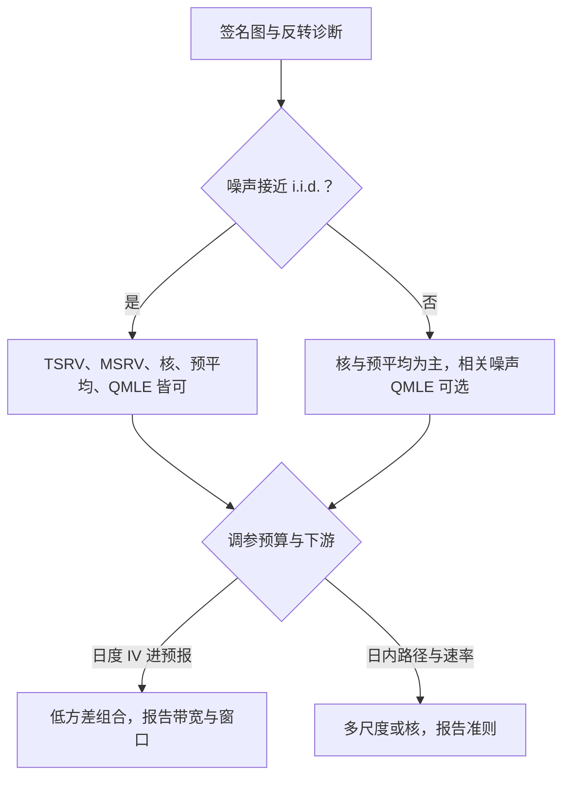

# 噪声修正估计量

噪声修正不是把坏数据变好，而是把 $2n\sigma_\varepsilon^2$ 这一项从估计量里精确地减掉；减法的代价写在收敛率、带宽与噪声假设里。

<footer>—— 据 Zhang, Mykland and Aït-Sahalia, JASA 2005；Aït-Sahalia, Mykland and Zhang, Review of Financial Studies 2005 整理</footer>

[上一课](/quant/hfs-realized-variance-family)把族谱立成两根轴，并留下噪声修正这条支路：噪声在场时如何恢复积分波动。[两尺度估计](/quant/tsrv)、[预平均](/quant/pre-averaging)与[已实现核](/quant/realized-kernel)各写过单点，[噪声方差估计](/quant/noise-variance-estimate)写过诊断输入；本课把这条支路收成一页对照：四家共用的机制是什么，调参落在哪，噪声假设被违反时谁先坏、怎么选。

## 问题

观测是 $Y=X+\varepsilon$：有效价格 $X$ 是半鞅，噪声方差 $\sigma_\varepsilon^2$。朴素 RV 的期望被 $2n\sigma_\varepsilon^2$ 量级的加项带偏——平方把噪声的二次变差按采样次数加了进来。修正估计量的共同目标是把这个加项去掉，去掉的方式决定三件事：收敛率掉多少、要调几个参数、对「噪声 i.i.d. 且与价格独立」这条假设的依赖多深。缺口不是再发明第五种估计量，而是**选择判据**：给一个标的、一段数据，用哪家、怎么调、何时换。

### 四个代表，一个机制

**两尺度（TSRV）**：全网格 RV 识别 $2n\sigma_\varepsilon^2$，多个错开的稀疏网格平均出受污染较小的 RV，联立两式解出 $IV$（Zhang、Mykland 与 Aït-Sahalia，JASA 2005），收敛率 $n^{1/4}$，稀疏子格条数是主要调参。**多尺度（MSRV）**：把两尺度推广成多尺度加权组合，速率推到任意接近 $n^{1/2}$（Zhang，Bernoulli 2006），代价是多一组权重。**已实现核**：把噪声诱发的负一阶自协方差加权加回（Barndorff-Nielsen、Hansen、Lunde 与 Shephard，Econometrica 2008），带宽是主要调参。**预平均**：先用局部线性窗滤掉噪声再平方加总（Jacod、Li、Mykland、Podolskij 与 Vetter，2009），窗口长度是主要调参。**拟极大似然**（Aït-Sahalia、Mykland 与 Zhang，RFS 2005 及其相关噪声扩展）把噪声写进似然：模型对则效率高，模型错则偏差有结构。

弹跳噪声让相邻收益出现约 $-\sigma_\varepsilon^2$ 的负一阶自协方差——核估计量加回的正是这一项。该加多少不靠信仰，靠[Roll 弹跳](/quant/microstructure-noise)在该标的当天的强度。

## 方法

选择按三问走。**第一问：噪声结构。**签名图上翘且反转明显，说明弹跳主导、噪声接近 i.i.d.，四家都能用；若噪声显示序列相关或与价格相关，优先选假设最弱的核与预平均家族，或用相关噪声下的 QMLE 扩展——两尺度在此会减过头或减不够。**第二问：调参预算。**带宽、窗口、子格数都要按数据定，且要有准则（最小化渐近方差、或跨错开格的稳定性），不许全年固定一个数。**第三问：下游要什么。**进 HAR 预报的日度 $IV$ 序列要低方差与稳定，核加预平均的组合常见；盘中定位与高频对冲要日内路径与速率，多尺度或核更合身。

## 机制

为什么减法可行：噪声与有效价格独立时，它对 RV 的贡献是加性的、可识别的——全网格上以 $2n\sigma_\varepsilon^2$ 的速度线性生长，而信号部分不随 $n$ 生长。两个尺度对同一个 $IV$ 给出两条方程，噪声项变成可解的未知数。核的机制等价：噪声的二阶结构全表现在短滞后自协方差里，用核函数吸收之后，加权和收敛到 $IV$。预平均把噪声方差在滤波里除以窗口，平方之后噪声项变成高阶小量。三家殊途同归：**噪声的二阶结构是它的软肋**。一旦噪声序列相关，「负一阶自协方差」不再讲完整个故事，减法开始失准——这正是先诊断后选择的机制理由，也是假设最弱者最耐用的原因。

## 边界

四家都不修隔夜、都不修跳：隔夜方差按口径单列，跳由下一课处理。修正估计量对清洗极其敏感：坏 tick 表现为巨大的假噪声，带宽与子格数全部失真——先清洗，后修正。速率是渐近量：一天的 $n$ 在几千到几万之间，速率差距要靠有限样本实验核实，不能拿渐近速率当实测精度。噪声方差本身随日变动（下一单元实证），今天的带宽不是明天的带宽。

## 小结

- 共同机制：噪声的二阶结构可识别、可减除——两尺度解联立，核加权自协方差，预平均先滤波。
- 速率排序：TSRV 在 $n^{1/4}$，MSRV 推到任意接近 $n^{1/2}$；核与预平均以调参在同一方向竞争。
- 假设最弱者最耐用：相关或内生噪声下优先核与预平均，i.i.d. 减法会失准。
- 调参须有准则并随日更新；全年固定带宽是把渐近公式当常数用。
- 修正不修隔夜与跳，对清洗敏感；次序是先清洗、再修正、后检验。
- 出处：Zhang, Mykland and Aït-Sahalia, *JASA*, 2005；Zhang, *Bernoulli*, 2006；Aït-Sahalia, Mykland and Zhang, *RFS*, 2005；Barndorff-Nielsen, Hansen, Lunde and Shephard, *Econometrica*, 2008；Jacod, Li, Mykland, Podolskij and Vetter, 2009。
