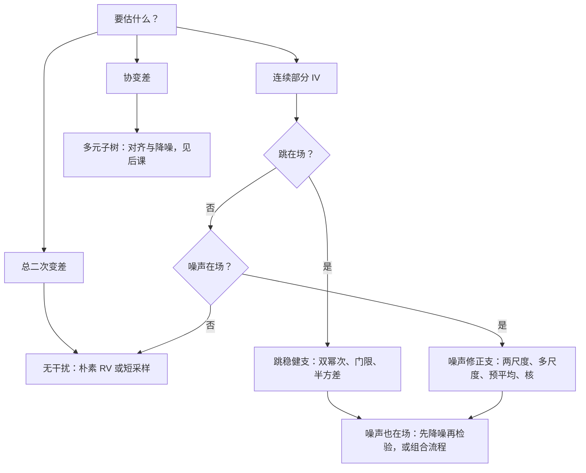
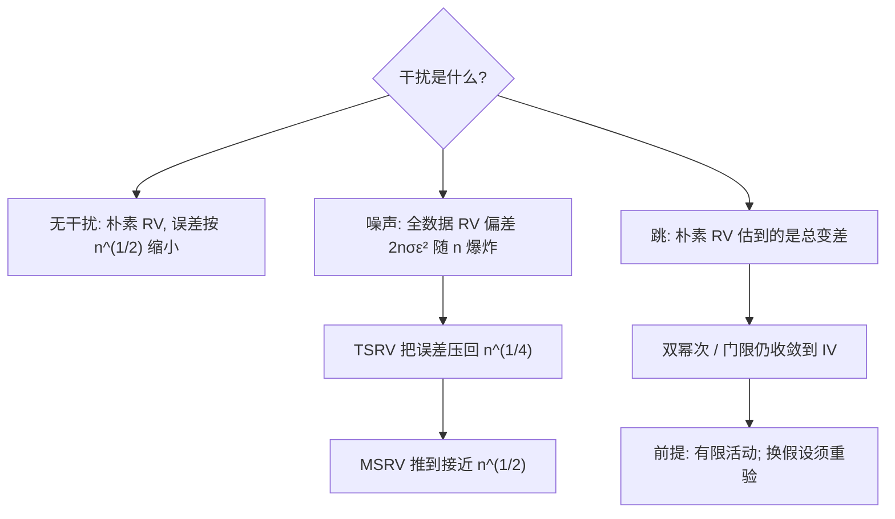

# 已实现方差的族谱

估计量的族谱不按发表年份排，按两件事排：你在估哪个对象，以及允许谁在场——噪声、跳、不同步，各划出一条支路。

<footer>—— 据 Barndorff-Nielsen and Shephard, Econometrica 2004；Zhang, Mykland and Aït-Sahalia, JASA 2005 整理</footer>

[上一课](/quant/slm-map)把统计学习收在信噪比上：样本外只有千分位，协议高于模型——一个含义成立的千分位胜过一万个含义不明的拟合——并把高频统计的估计量谱系指给本课程。本课起转到最便宜也最易用错的一份——逐笔行情——的统计读数。主干已写过[微观结构噪声](/quant/microstructure-noise)的机制、[已实现波动与噪声修正](/quant/rv-noise)的概览与[Barndorff-Nielsen 跳跃检验](/quant/bn-jump-test)的单点；本课程第一课做的是立族谱：把已实现方差一族的估计量按「对象 × 容许的干扰」排成树，后面的课各走进一条支路。后课默认已经读完本课。

## 问题

二次变差是价格过程波动的自然对象：$[X]_t=\int_0^t\sigma_u^2\,du+\sum_{s\le t}(\Delta X_s)^2$，连续部分是积分波动 $IV$，跳跃部分是瞬间贡献。把日内收益平方加总的 $\mathrm{RV}_n=\sum_i r_i^2$，在无噪声、跳跃有限时收敛到整个 $[X]_t$（Barndorff-Nielsen 与 Shephard，Econometrica 2004；Andersen、Bollerslev、Diebold 与 Labys，Econometrica 2003）。缺口在于三个「在场者」会把这句话拆开：微观结构噪声让偏差以采样次数 $n$ 增长；跳让 RV 估到的不再是 $IV$；不同步让协变差的分子塌向零。一族估计量由此长出来；没有地图的人用习惯选——五分钟格走天下——或按文献名气选，都会错对象。

术语翻译：「二次变差」就是把每一小段价格平方变化累加起来的总账。连续波动像匀速磨刀磨出的粉末，一小份一小份累积；跳像一刀砍掉的缺口，一次记一大笔。总账两种都收，「估哪个对象」就是在问你要不要把缺口算进去。

### 族谱的两根轴

第一根轴是**对象**：估总二次变差，还是只要连续部分 $IV$，还是要协变差。第二根轴是**容许的干扰**：噪声、跳、不同步，各自把哪些估计量排除掉。两根轴一起出几条主支：朴素 RV 或短采样，只活在没有噪声与跳的世界；跳稳健支——双幂次变差、门限法、半方差——在跳在场时估连续部分；噪声修正支——两尺度、多尺度、预平均、已实现核、拟极大似然——在噪声在场时恢复 $IV$；两根轴同时需要时，先降噪再检验跳，或用对两者稳健的组合流程。

同一个 6.5 小时交易日：1 秒格 $n\approx 23400$，5 分钟格 $n=78$。噪声在场时，这两个 $n$ 算出的 RV 差得没有公共单位——先用签名图判断谁在场，再谈加总。

## 方法

族谱的用法是**先诊断，后选支**。横轴采样间隔、纵轴 RV 的签名图是分岔判据：高频端上翘是噪声主导，走噪声修正支；大致平坦则朴素 RV 尚可，转而先问跳。选支之后才轮到支内选择：核形与带宽、预平均窗口、双幂次还是门限，是后课的事。声明对象时把口径写死：日方差还是年化波动、含不含隔夜、中点价还是成交价——[已实现波动与噪声修正](/quant/rv-noise)里「隔夜单列」的约定在这里直接沿用。

不这么做会错在哪：跳在场时用朴素 RV 估「波动率」，估到的是含跳的总变差，HAR 类预报把瞬时的跳当持续的波动，持续性被系统性夸大；噪声在场时把 1 秒数据直接平方加总，读数随采样密度变，同一天两个系统给出两个「波动率」，风控与对冲用哪个都是掷硬币。

常见误区：「五分钟格走天下」。五分钟只是在许多标的上绕开噪声的经验折中，不是定理——跳在场的日子，五分钟 RV 估到的仍是含跳总变差，拿去预报照样把持续性夸大。选支要靠签名图诊断，不靠习惯。

## 机制

支路的划分由**收敛率**背书，这是族谱不是清单的原因。无干扰时 RV 的估计误差以 $n^{1/2}$ 缩小；噪声在场时全数据 RV 的偏差项 $2n\sigma_\varepsilon^2$ 随 $n$ 爆炸，两尺度估计把它压回 $n^{1/4}$，多尺度设计把速率推到任意接近 $n^{1/2}$，核与预平均以调参换同一方向的改善。干扰假设是速率的前提：把相关噪声当 i.i.d.，减法减过头或减不够，$IV$ 被错估；把有限活动的跳假设换成无穷活动，双幂次的极限不再是连续部分。族谱的每条边上都写着「在此假设下才成立」，换边必须重验假设。

为什么速率要紧：日度 $IV$ 序列最终要喂给风险预算，估计误差就是仓位噪声。朴素 RV 在噪声下的读数随采样密度变——换个数据商、「波动率」就翻倍；选对支路后误差才与采样密度脱钩，下游结果才可复现。

## 边界

族谱只排单标的的方差估计；协变差的时钟对齐与正定性是另一棵子树，总图见[多元已实现协方差](/quant/realized-covariance)，对齐见[Hayashi–Yoshida 相关](/quant/hayashi-yoshida)，本课程后面单开。族谱也不回答「数据怎么洗」：坏 tick 冒充噪声会把诊断带进错误的支路，清洗先于一切估计量。树不裁决同支内谁更好：核形、带宽、窗口的选择靠准则与有限样本实验，不靠发表年份。

## 小结

- 族谱两根轴：估计对象（总变差、连续 $IV$、协变差）× 容许干扰（噪声、跳、不同步），支路按这两件事分，不按年份分。
- 签名图是分岔判据：高频上翘走噪声修正支，平坦先问跳。
- 收敛率背书分岔：朴素 RV 在噪声下偏差 $2n\sigma_\varepsilon^2$ 爆炸；两尺度压回 $n^{1/4}$，多尺度接近 $n^{1/2}$。
- 干扰假设是每条边的前提：相关噪声、无穷活动跳都会让支路失效，换边重验。
- 对象口径先于估计量：日或年化、含不含隔夜、中点或成交价，写死再动手。
- 出处：Barndorff-Nielsen and Shephard, *Econometrica*, 2004 与 *Journal of Financial Econometrics*, 2004；Andersen, Bollerslev, Diebold and Labys, *Econometrica*, 2003；Zhang, Mykland and Aït-Sahalia, *JASA*, 2005。
