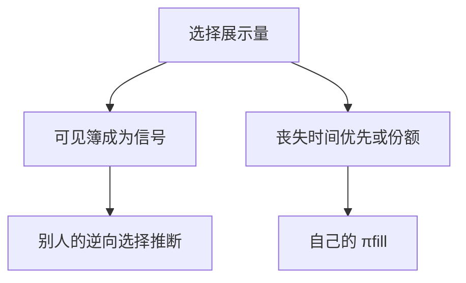

# 隐藏流动性理论

把量藏起来，是为了不让对手按你的意向去推断 $V$ 或去抢队。代价是时间优先或 pro-rata 份额，以及别人对可见簿的误读。

<footer>—— Bessembinder, Panayides and Venkataraman, Hidden liquidity: An analysis of order exposure decisions in automated markets, Journal of Financial Economics, 2009</footer>

[价格–时间与 pro-rata](/quant/price-time-pro-rata)决定可见队列如何分配成交。缺口是展示本身成为选择：冰山、完全隐藏、暗池。主干[订单类型](/quant/order-types)已说明隐藏会丧失时间优先；本课补博弈：谁选择暴露、可见深度如何被当成信号、均衡里隐藏比例由什么决定。Buti 与 Rindi（2013）提供限价簿上隐藏的理论机制。

## 问题

完全可见时，大限价单同时泄露规模与方向，招来抢先、被捡与前置。隐藏降低事前透明，保护策略噪声与知情者。但 FIFO 下补量块排到队尾，执行变差；别人看见的簿变薄，可能误判深度、用市价打穿可见部分、意外碰到隐藏量。问题是暴露决策的均衡：若所有人都藏，发现变慢、价差可能变宽；若只有大单藏，可见流变毒（小单更像噪声或更像被筛选后的知情），Glosten 曲线开口改变。

这是透明度课在订单级的落地，不是再讨论监管该不该强制显示。

### 冰山 vs 完全隐藏 vs 暗处

冰山：同价位反复展示小块，每次补量丧失优先。完全隐藏：该价位在 L2 上不出现，成交时才暴露，优先规则因交易所而异。暗池：连价位都可以不在公开网格上。三者降低的透明维度不同，对 $\pi_{\mathrm{fill}}$ 与信号的影响不同。不要用一个「暗」字互相替换。

Harris 区分事前与事后透明。隐藏伤害事前；事后打印仍可能立刻暴露你的量。若打印太快，隐藏只保护毫秒级的抢先，保护不了中期意向。

## 方法

Buti–Rindi 一类模型让交易者选价格、数量与展示量。可见量进入别人的信息集与队列计算；隐藏量只在匹配时存在。均衡时，知情者更倾向藏（保护信息），非知情大单也藏（保护执行），于是可见簿的逆向选择不必下降——筛选效应。Bessembinder 等人用巴黎或美股数据估计暴露决策：尺寸、波动、价差、队深进入 Probit。经验规律：更可能被捡的环境里隐藏升，靠近 BBO 的隐藏更谨慎，因为丧失优先的成本高。

对 Glosten 曲线：可见供给是真实供给的下界。市价单的期望冲击应大于「沿 L2 走」的会计冲击。把 L2 深度当 $Q$ 会低估 $\lambda$ 式成本，高估自己的排队价值。

### 隐藏与优先规则配对

FIFO + 隐藏：主要代价是队尾。pro-rata + 隐藏：代价是份额，隐藏更贵，可见堆量更极端。暗池中点匹配则完全离开优先规则，代价是执行不确定与毒性。设计不能单独「允许冰山」而不声明匹配算法。

## 机制

隐藏是把透明策略化。它保护大单的同时，把信息从价格表挪到成交过程：突然的「打穿可见却成交很多」成为事件，Hasbrouck 信息含量在这些成交上更高。可见挂单者面对更高的被捡——他们是在为看不见的量提供免费探测。于是近端可见供给可能撤退，只剩愿意被探测的做市商，价差更像期权金。

策略噪声若大量使用隐藏，热闹期的可见量峰被压住，Admati–Pfleiderer 的协调更难通过 L2 完成，改用时钟（开收盘）协调。

## 边界

数据里完全隐藏事前不可见，研究常用交易所科研库或成交标记。公开 L2 回测会系统性高估冲击、低估隐藏填充。监管对最小展示、冰山补量规则的修改会改均衡，事件研究要同时看可见深度与实现价差。暗池路由是另一场所，不是同一张簿上的隐藏字段。

「冰山被识破」是常见算法：固定补量块、固定间隔。理论里的隐藏一旦可预测，就回到可见。真正的隐蔽需要随机化展示，代价是更差的优先。

## 小结

- 隐藏降低事前透明，代价是 FIFO 队尾或 pro-rata 份额；筛选后可见流的毒性不必下降。
- 可见深度是真实供给下界，沿 L2 算冲击会偏乐观。
- 暴露决策随尺寸、被捡环境与优先规则变化。
- 出处：Bessembinder, Panayides and Venkataraman, *Journal of Financial Economics*, 2009；Buti and Rindi, *Journal of Financial Economics*, 2013；订单接口见 Harris。
