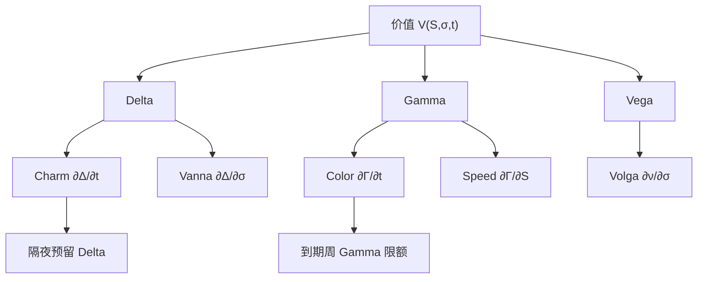

# Charm / Color 高阶希腊

    
Delta 与 Gamma 都随日历流逝而变，即使现货与隐含波动静止；把这些时间导数写出来，隔夜限额与到期周对冲才有「现货不动也会走」的项。

    <footer>—— 高阶希腊字母的教学整理见 Hull, Options, Futures, and Other Derivatives；时间导数与混合偏导为 Black–Scholes 公式的直接推论</footer>

[Delta / Gamma / Vega 对冲](/quant/greeks-hedge) 覆盖价值对 $S$ 的一阶、二阶与对 $\sigma$ 的一阶。交易日结束时若只把瞬时 $\Delta$ 对冲到零，开盘时 $\Delta$ 已经变了：时间过了，$\tau$ 减少，平值附近的密度形状变了。**Charm**（delta decay）是 $\partial\Delta/\partial t$，**Color**（gamma decay）是 $\partial\Gamma/\partial t$。再往上，Speed 是 $\partial\Gamma/\partial S$，Zomma 是 $\partial\Gamma/\partial\sigma$。它们不是新的市场因子，而是同一 Black（或模型）价格函数的混合偏导。本篇写这些导数在隔夜、到期周与微笑下的用途，衔接 [对冲频率](/quant/delta-hedge-freq)、[Pin risk](/quant/pin-risk)、[隔夜跳空](/quant/overnight-gap-hedge) 与 [Vanna / Volga](/quant/vanna-volga)，而不把 Heston 特征函数的参数导数重写一遍。

## 问题

价值 $V(S,\sigma,t)$。日常限额盯 $\partial V/\partial S$、$\partial^2 V/\partial S^2$、$\partial V/\partial\sigma$。持有区间 $\Delta t$ 内即使 $\mathrm{d}S=\mathrm{d}\sigma=0$，仍有

$$
\Delta(\Delta)\approx\mathrm{Charm}\,\Delta t,\qquad \Delta(\Gamma)\approx\mathrm{Color}\,\Delta t.
$$

隔夜 $\Delta t$ 不是无穷小，平值短到期的 Charm 可以大到相当于几个 Delta 百分点，开盘时「昨夜已对冲」不再成立。到期日 $\tau\to 0$，Charm 与 Color 在 $K$ 附近变尖，与 Gamma 爆炸同源。问题是：哪些台子必须把这些项纳入收盘检查，哪些用更宽的 Gamma 限额当缓冲就够；以及在微笑下，时间导数是对日历 $t$ 还是对总方差 $w$ 的切片移动。

名称来自交易俚语，不是定理名。不同券商对 Color、Speed 的符号惯例（是否含折现、是否对 $\tau$ 而不是对 $t$）不一致。报告必须写偏导定义。它们全部可以由 Black 公式对 $d_1,d_2$ 微分得到，没有新的市场假设；有新假设的是：用哪一个 $\sigma(K,T)$、微笑是否随 $t$ 的流逝而 sticky。

### 一览：从一阶到混合偏导

Delta、Theta、Vega、Rho 是一阶。Gamma、Vanna、Volga 是二阶。Charm 是 $\partial^2 V/\partial S\partial t$，Color 是 $\partial^3 V/\partial S^2\partial t$，Speed 是 $\partial^3 V/\partial S^3$。Vanna 已在 Castagna–Mercurio 方法里被当成对冲坐标；Charm / Color 很少被三张香草直接对冲，因为没有「纯时间」可交易工具——时间只会流逝。能做的是：用 Charm 预测下一时段的 Delta 漂移，预先把 $\Delta$ 留在带的另一侧，或减少该区域的净 Gamma。

有人把 Charm 叫做 DdeltaDtime。不要和 pin 的「钉住」或 PIN 的知情概率混淆。Charm 在现货远离执行价时很小，在到期近平值时很大——空间上局部，时间上临近到期。

## 方法

**Black–Scholes 下的形状。** 欧式看涨的 Charm 在利率股息为零时正比于 $n(d_1)$ 的一项再乘时间衰减因子，符号在价内价外会变：随着时间流逝，价内看涨的 Delta 趋向 1，价外趋向 0，平值附近最陡。Color 描述 Gamma 峰是变高变窄（临近到期）还是被时间抹平。直观：剩余方差 $w=\sigma^2\tau$ 减少，密度更集中，Gamma 峰升高——这是空头平值在到期周最痛的数学来源，与 pin risk 同一峰。

**收盘预留。** 计算到次日开盘（或到下一可对冲时刻）的 $\mathrm{Charm}\,\Delta t$，把目标 Delta 设为 $-\Delta_{\mathrm{now}}-\mathrm{Charm}\,\Delta t$ 的一半或全部，视对隔夜现货是否有观点。这不是预测跳空，只是预测时钟。Color 用于 Gamma 限额：若 Color 使隔夜后 Gamma 升高，收盘限额应更紧。事件夜另加跳空情景，Charm 只覆盖 $\mathrm{d}S=0$ 的时钟项。

**微笑下的时间导数。** 若每个到期的 $\sigma_{\mathrm{imp}}(K,T)$ 随日历流逝而整条切片的 $T$ 变短，ATM 波动的期限结构会使「静止」的隐含波动对一个固定 $K$ 上升或下降。此时 Charm 应在 sticky strike 或在总方差切片上算，结果不同。用 SVI 的 $w(k,T)$ 对 $T$ 求导，再传入 Black 希腊，比把每档 $\sigma$ 当常数更接近做市坐标，见 [SVI / SSVI](/quant/svi-ssvi)。[Heston](/quant/heston) 的 Charm 还含方差状态的漂移；[SABR](/quant/sabr) 单到期参数不自动给出跨日切片如何缩期限。

### 与 Vanna、隔夜跳空联立

完整的隔夜一阶是

$$
\Delta V \approx \Delta\,\Delta S+\Theta\Delta t+\nu\Delta\sigma+\tfrac12\Gamma(\Delta S)^2+\mathrm{Vanna}\,\Delta S\Delta\sigma+\mathrm{Charm}\,\Delta t\cdot(\text{已含在 }\Delta\text{ 的变化})+\cdots.
$$

记账时不要把 Charm 与 Theta 加重复：Theta 是价值的时间导数，Charm 是 Delta 的时间导数，进入的是对冲误差而不是同一行的价值 Theta。实现上：Theta 进 P&L 解释；Charm 进隔夜 Delta 预留。Vanna 进「跌且 vol 升」情景。Color 进 Gamma 限额随夜变严的幅度。

## 机制

时间进入 Black 公式的通道主要是 $\sigma\sqrt{\tau}$ 与折现。$\tau$ 减少，有效波动尺度变小，执行价相对现货的标准化距离 $|d_2|$ 变大（若现货不跟着动），概率质量从中间被推到「更实或更虚」。于是 Delta 被推离 0.5，Gamma 峰变窄变高。Charm 与 Color 就是这一几何的导数。随机波动下还有方差均值回复：Heston 的 $v_t$ 向 $\theta$ 走，即使 $S$ 不动，微笑的短端水平也会变，Charm 多一项状态漂移。局部波动下 $\sigma(S,t)$ 显含 $t$，时间导数含曲面日历。这些是模型项，Black Charm 是其中的基准。

为何日常可以忽略、到期周不能。$1/\sqrt{\tau}$ 使导数在最后几天爆炸，与 Gamma 同阶变坏。对冲频率若按平常 Gamma 设带宽，Charm 会在一小时内把 Delta 带出带宽而不需要现货移动——看起来像「无缘无故触发再平衡」。到期周应把 Charm 预测的漂移计入带宽中心的移动，或直接减仓。

### Speed 与 Zomma：现货与波动对 Gamma 的倾斜

Speed 告诉 Gamma 对 $S$ 的斜率：现货若朝平值走，Gamma 升得有多快，用于「还没到 $K$ 但在靠近」的预警。Zomma 告诉 vol 升时 Gamma 如何变：通常 vol 升则 Gamma 峰变矮变宽，空头短 Gamma 略松，但 Vega 与 Volga 变重。它们用于情景，很少单独对冲。Castagna–Mercurio 的三点系统不匹配 Speed / Color；不要期待 RR/BF 能对冲到期周的时间爆炸。

高阶希腊对有限差分步长极度敏感。应对解析公式（Black）或对模型用自动微分 / 伴随，而不是在已经嘈杂的市价网格上对 $t$ 再差分一次。插值层的噪声会被 Color 放大成假限额突破。

## 边界与工程取舍

解析高阶希腊假设模型正确、参数瞬时冻结。跳空一发生，Taylor 在 $(S,\sigma,t)$ 上的局部展开失败，应改用情景重定价，而不是把 Color 乘一个巨大的 $\Delta t$。美式、障碍的 Charm 含行权与触碰边界移动，符号可以与欧式相反。离散股息使除息日 Delta 跳，那是已知的 $S$ 跳，不是 Charm。

Hull 把主要希腊字母教到 Vega / Theta / Rho；Charm、Color 是同一套偏导的延伸，用于运营，不是新的定价理论。Heston 与 SABR 各自给出另一组参数希腊（对 $\rho$、对 $\nu$、对 $v_0$），与 Black Charm 不可加总除非转换到同一坐标。生产报告应固定一套：市场桶 Vega / Vanna / Volga，加上 Black 或模型 Charm 作为隔夜备忘，避免两套时间导数并列。

把 Charm 写成可交易 alpha——「每天靠 Delta 漂移赚钱」——忽略了 Theta 与 Gamma 的对冲关系。时钟项已经在 Black–Scholes 方程里与凸性对消；单独抽出 Charm 当策略，通常是漏记了另一条腿。

## 小结

- Charm 是 Delta 的时间导数，Color 是 Gamma 的时间导数；现货静止时它们仍推动隔夜头寸。
- 到期近平值处二者与 Gamma 一同爆炸，是 pin risk 与到期周政策的定量输入。
- 隔夜：Theta 解释价值，Charm 预留 Delta，Color 收紧 Gamma 限额，Vanna 覆盖跌–vol 情景。
- 微笑下应对切片的 $T$ 缩短求导，而不是把 $\sigma(K)$ 当常数；Heston / SABR 另有状态漂移。
- 高阶希腊应用解析或自动微分，忌在嘈杂插值上有限差分。
- 出处：Hull, *Options, Futures, and Other Derivatives*；Vanna–Volga 对冲见 Castagna and Mercurio, *Risk*, 2007；曲面时间骨架见 Gatheral and Jacquier, 2014；离散与隔夜见 Boyle–Emanuel，1980 与 French，1980。
