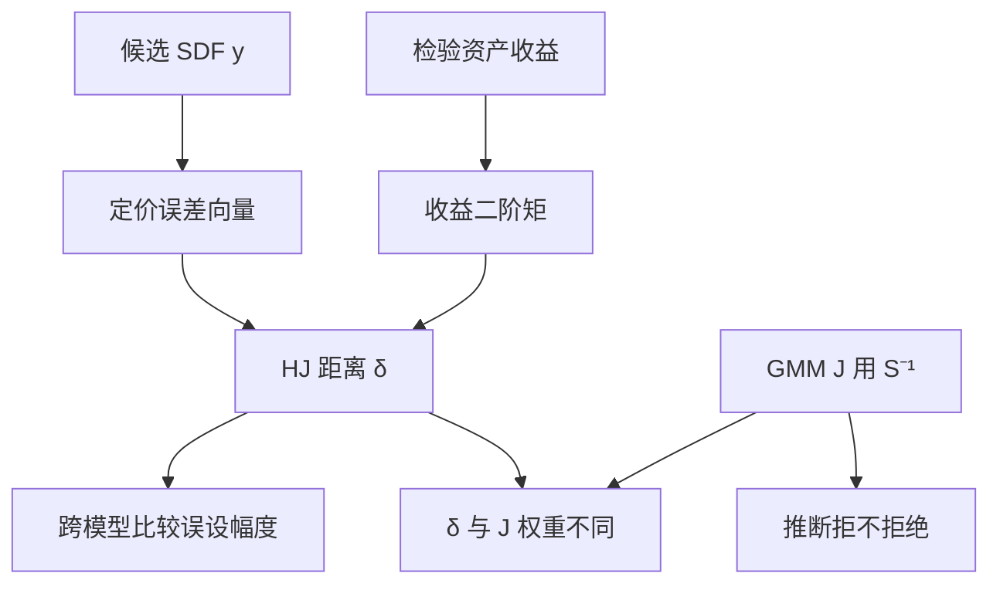

# HJ 距离检验

随机折现因子的误设，可以量成它到能定价所有资产的那一族 SDF 的最小二乘距离；这个距离既是最大定价误差，也是一个可估计的范数。

<footer>—— Hansen and Jagannathan, Assessing Specification Errors in Stochastic Discount Factor Models, Journal of Finance, 1997</footer>

[GMM](/quant/gmm-asset-pricing) 的 $J$ 依赖权重 $W$，换资产或换 $S$ 估计，$p$ 值不可比。Hansen 与 Jagannathan（1997）给定价误差一个与二阶矩有关的标准度量：HJ 距离 $\delta$ 是候选 SDF $y$ 到可接受集合（能定价给定收益）的 $L^2$ 距离。它等于最大平方定价误差（在二阶矩约束下），从而可以跨模型比较「错了多少」，而不只是「$J$ 拒不拒绝」。本课缺口：在过度识别检验之后，**用同一套收益把误设换成可比较的范数**。贝叶斯因子比较留给下一课，对象从经典距离换成后验概率。

## 问题

给定超额收益 $R^e$，可接受 SDF 满足 $E[mR^e]=0$。候选 $y$（例如线性 $1-b^\top f$）一般不在该集合。HJ 距离

$$
\delta=\min_{m\in\mathcal{M}}\sqrt{E[(y-m)^2]}=\sqrt{E[yR^e]^\top E[R^eR^{e\top}]^{-1}E[yR^e]},
$$

第二式在 $y$ 已给定时成立：定价误差向量用收益二阶矩加权。问题是估计 $\delta$、给出标准误（Jagannathan–Wang 等后续）、以及比较两个候选 $y_1,y_2$ 的 $\delta$ 是否真差一截。

$J$ 检验用 $S^{-1}$ 加权，有效但不便比较；HJ 用 $E[RR^\top]^{-1}$，与有效 GMM 不同，但跨模型时分母是同一收益表，距离可比。对象是**误设大小**，不是渐近有效估计。

### 与 Hansen–Jagannathan 下界的关系

1991 年的 HJ 界是：能定价的 SDF 波动至少是均值–方差前沿的函数。1997 年的距离是：你的 $y$ 离可定价集合有多远。一个给可行性，一个给误设幅度。线性因子模型里 $\delta=0$ 等价于定价误差为零（在无套利线性 SDF 表示下）。$\delta>0$ 时，最大定价误差的经济读法是：对最不利的单位二阶矩组合，错误有多大。

$\delta$ 不是夏普，也不是 $R^2$。高 $\delta$ 可以来自几个难定价的组合，也可以来自整体平行的 $\alpha$。应看贡献分解，不要只报一个标量。

## 方法

**估计。** 用样本均值与样本二阶矩代入。$y$ 若含参数，可先 GMM 估 $b$ 再算 $\delta$，或直接最小化 $\delta$（对线性模型常等价于某种截面）。Kan 与 Robotti 讨论有限样本与比较两个 $\delta$ 的检验。

**标准误。** $\delta$ 在真模型为零时落在边界，普通 $\delta$ 的 $t$ 不规则；真模型假时 $\delta>0$，渐近正态较干净。报告应分清：检验 $\delta=0$ 用 $J$ 或专门的边界渐近；比较两个误设模型用 $\delta_1-\delta_2$ 的联合分布。

**检验资产。** 与 GMM 相同：不要只用因子排序组合。加入动量、低波、行业，距离才会暴露漏因子。$E[RR^\top]$ 在 $N$ 大时病态，应组合化或收缩，否则 $\delta$ 被最小特征值主导——那是噪声，不是误设。

### 与 GRS、截面 $R^2$

GRS 在可交易因子、正态下检验 $\alpha=0$，有限样本精确。HJ 不需要因子可交易，适用于宏观 SDF。截面 $R^2$ 可以很高而 $\delta$ 仍大（$\alpha$ 小但 $E[RR^\top]$ 把某些方向放大）。三套数字一起看：统计拒绝、经济距离、解释方差。

## 机制

几何上，可接受 $m$ 是仿射空间；$y$ 向其做 $L^2$ 投影，剩余范数是 $\delta$。对偶上，这是在 $\mathrm{Var}(p^\top R^e)=1$ 一类约束下最大化平方定价误差。机制把「模型错」翻译成「存在一个（二阶矩）单位组合，其 $\alpha$ 特别大」。这就是跨模型可比的原因：组合的度量尺固定在同一 $R^e$ 上。

$W=S^{-1}$ 的 GMM 用的是定价误差的抽样方差，不是收益的二阶矩。所以最小 $J$ 的模型不必是最小 $\delta$ 的模型。选哪个取决于问题：推断用 $J$，比较误设幅度用 $\delta$。

样本 $\hat\delta$ 总是非负。零模型下它向上偏。比较「谁更小」时，两个都偏，差的偏未必抵消，需要 Kan–Robotti 一类修正或自助。

### 贝叶斯比较的预告

HJ 仍是样本范数，不惩罚参数个数的方式与边缘似然不同。因子很多时 $\delta$ 可以降，只因过拟合样本二阶矩。下一课用后验概率比较因子模型，把「额外因子值不值得」写进先验与边缘似然，而不是只看 $\delta$ 下降。

## 边界与工程取舍

$N$ 接近 $T$ 时不要算 HJ。生存偏差、退市回补会改 $E[RR^\top]$。条件 SDF、时变 $\beta$ 下无条件 $\delta$ 只是平均误设。用已实现矩代替 $E[RR^\top]$ 会引入 [RV 噪声](/quant/rv-noise)，对象变成高频，本课不覆盖。

工程：固定一张检验资产表，报 $\delta$、GRS、$J$；比较模型时保持表不变。不要用 $\delta$ 排序去挑因子再在同表上报 $\delta$——那是训练误差。不要把 HJ 距离解释成交易成本或可提取夏普，除非明确走对偶组合并扣成本。

## 小结

- HJ 距离是候选 SDF 到可定价集合的 $L^2$ 距离，等于二阶矩约束下的最大定价误差。
- 它便于跨模型比较误设大小；GMM $J$ 便于推断，两者权重不同，排序可以不一致。
- 检验资产与 $E[RR^\top]$ 的病态会主导 $\delta$，须组合化并预登记资产表。
- $\delta=0$ 的检验在边界上不规则；比较两个错误模型要用专门渐近或自助。
- 出处：Hansen and Jagannathan, *Journal of Finance*, 1997；1991 年下界见同作者 *Journal of Political Economy*；比较检验见 Kan and Robotti 后续工作。
