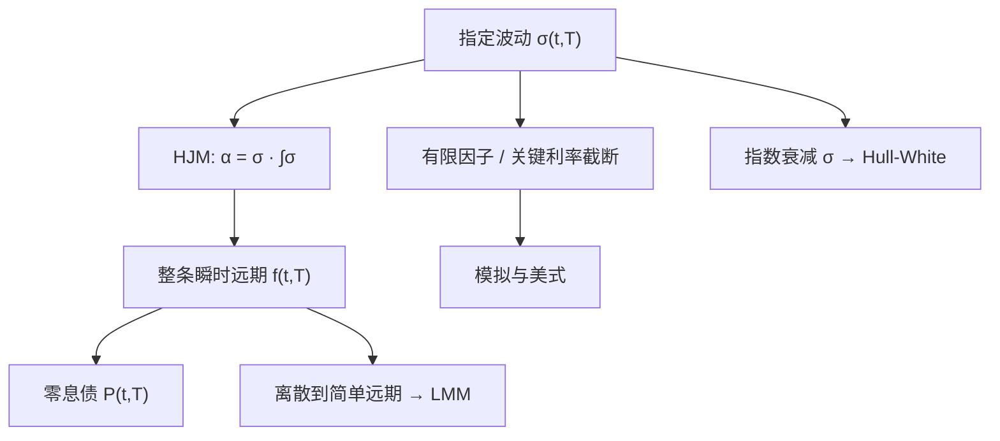

# HJM

直接写瞬时远期曲线的扩散，无套利会把漂移钉成波动的积分；期限结构模型不必再从短期利率出发。

<footer>—— Heath, Jarrow & Morton, Bond Pricing and the Term Structure of Interest Rates: A New Methodology, Econometrica, 1992</footer>

Heath、Jarrow 与 Morton（1992）把状态从短期利率换成整条瞬时远期曲线 $f(t,T)$。一旦指定波动结构 $\sigma(t,T)$，风险中性漂移不再自由：它必须等于波动沿到期轴的积分，否则折现债券会出现套利。短端模型——[Vasicek / CIR](/quant/vasicek-cir)、[Hull-White](/quant/hull-white)——成为特定波动下的马尔可夫特例。HJM 是框架，不是某一个校准好的三参数公式。本篇写漂移条件从哪来、为何实现往往要落到有限因子、以及它与 [LMM](/quant/lmm) 在状态变量上的分工：一个写瞬时远期，一个写简单复利的市场利率。

## 问题

无套利定价要求可交易的零息债在折现后是鞅。若你只规定短端 $r_t$ 的漂移与波动，整条曲线由短端的条件期望生成，形态被马尔可夫状态绑死。若你反过来让每个 $T$ 的 $f(t,T)$ 自由扩散，参数过多，任意漂移会产生与债券交易矛盾的关系。HJM 要回答：在曲线本身作为无限维状态时，哪些波动是允许的，漂移必须满足什么函数方程，才能让 $P(t,T)=\exp\big(-\int_t^T f(t,u)\,du\big)$ 在风险中性测度下表现正常。

这个问题的实践版本是：交易台已经看到整条曲线，不想用短端模型再拟合一次初值；他们想规定的是**曲线如何动**（主成分、关键利率波动），而不是短端均值回复速度。HJM 把「如何动」写成 $\sigma(t,T)$，把无套利写成对漂移的约束。剩下的工程问题是无限维状态如何模拟、如何避免负利率、如何接到可观测的 cap 与 swaption。

### 瞬时远期不是报价

$f(t,T)$ 是模型对象，市场给的是 LIBOR、SOFR 期货、互换与债券。从报价到 $f$ 要经过曲线构建与平滑，微分会放大噪声。HJM 的漂移条件对 $f$ 的光滑性敏感：波动若在 $T$ 上不连续，漂移积分仍可定义，但实现时要把曲线与波动投到同一套关键点上。不要把 HJM 写成「直接对市场报价做扩散」——那是 LMM 的动机。HJM 先抽象到瞬时远期，再谈离散实现。

HJM 的「无套利」是相对已经纳入模型的零息债族而言。若贴现曲线与预测曲线分离，或存在便利收益与回购特殊，单一 $f(t,T)$ 不够。框架可以推广到多曲线，但 1992 年论文是单曲线的。

## 方法

在 $d$ 维布朗运动下，

$$
df(t,T)=\alpha(t,T)\,dt+\sigma(t,T)^\top dW_t,
$$

短端 $r_t=f(t,t)$。债券 $P(t,T)$ 的扩散由 $\sigma$ 沿 $[t,T]$ 积分得到。要求折现债券为鞅，必须

$$
\alpha(t,T)=\sigma(t,T)^\top\int_t^T \sigma(t,u)\,du
$$

（风险中性；远期测度下还有计价物调整）。这就是 HJM 漂移条件：波动自由，漂移被波动决定。一因子高斯且 $\sigma(t,T)=\sigma e^{-a(T-t)}$ 时，短端正是 Hull–White；$\sigma$ 常数且无衰减时接近 Ho–Lee。波动若依赖曲线本身，可得到类似 CIR 的正利率结构，但一般失去有限维马尔可夫。

实现上必须截断。常用：取 $d=2$ 或 $3$ 个因子，让 $\sigma_i(t,T)$ 对应平行、斜率、曲率；或把曲线降到有限个关键利率，对关键点做 HJM。模拟用预测器–校正器处理漂移里的积分。欧式权可用远期测度把被定价资产写成鞅再做 Black 型积分；美式与路径依赖仍要在曲线状态上做树或回归 Monte Carlo，维数诅咒立刻出现——这是短端马尔可夫模型仍然活着的原因。

### 测度与计价物

同一 $\sigma$ 在即期风险中性、到期 $T$ 的远期测度、年金测度下漂移不同。HJM 条件通常先在风险中性下写出，再换测度给 caplet 或 swaption 减方差。Jamshidian 对一因子短端的分解在高维 HJM 里不再免费。工程上应先固定计价物，再写离散漂移，不要在风险中性下模拟折现因子路径却用远期测度的 Black 公式混在同一条书里。

## 机制

漂移条件的机制是伊藤乘积：债券是远期的指数积分，债券的波动是 $\sigma$ 的积分，无套利要求债券的超额收益等于波动乘以风险的市场价格；风险中性下市场价格为零，于是远期的漂移只能由这段波动积分产生。直观上，波动越大、到期越长，凸性调整越大，远期的风险中性漂移越正——与「长端利率含凸性」同一件事，只是现在对每个 $T$ 都写清楚了。

因子结构决定曲线能做哪些独立运动。一个因子：所有 $T$ 的冲击完全相关，形状由 $\sigma(\cdot,T)$ 的衰减描述。两个因子：可以分开水平和斜率。经验主成分告诉你三个因子已解释大部分日度变动，但期权要的是在风险中性下的波动，不是历史 PCA；把历史特征向量直接当 $\sigma$ 会把 $\mathbb{P}$ 的相关当成 $\mathbb{Q}$ 的波动，smile 与风险溢价被丢掉。

HJM 不自动保证正的简单利率。高斯 HJM 与高斯短端一样会负。要正利率，需对 $\sigma$ 加结构（比例于 $f$ 或位移），这往往破坏有限马尔可夫，把你推向 LMM 那种对市场利率直接建模的离散框架。

### 与短端模型的包含关系

凡马尔可夫短端扩散，都对应某种 HJM 波动：由债券公式对 $T$ 求导得到 $f$，再读出 $\sigma(t,T)$。反过来，任意 $\sigma(t,T)$ 一般不能写成有限个短端状态的函数。因此「用 HJM」在实践中几乎总是「选一个能落到低维马尔可夫的 $\sigma$」或「接受高维模拟」。宣称实现了一般 HJM 却只用一棵短端树，只是在做 Hull–White。

## 边界与工程取舍

不要在未平滑的 bootstrap 曲线上对 $T$ 做数值微分来驱动 HJM 漂移，尖刺会变成虚假的凸性交易。不要用三因子历史 PCA 校准后，就认为 Bermudan swaption 的行权溢价已经被解释——美式溢价还依赖波动的期限结构和均值回复（衰减）。不要把 HJM 与「无模型」混淆：$\sigma$ 的函数形式就是模型。

LIBOR 停用之后，瞬时远期更应建在 OIS / SOFR 贴现曲线上；期限利率期货有凸性与合成基差，不能当作 $f(t,T)$ 的直接观察。高维 HJM 的计算成本通常高于 LMM 对标准 cap/swaption 账簿，因为 LMM 的状态就是那些被报价的远期。HJM 的优势在需要连续到期、债券期权、或把短端模型嵌进统一漂移语言的时候。选择框架先于选择因子个数。

漂移条件是局部的、逐日的无套利，不是「模型能预测收益率曲线」。HJM 对预期假说保持沉默：$\mathbb{P}$ 下的漂移还要加风险溢价，那是资产定价，不是衍生品记账。

## 小结

- HJM（1992）对瞬时远期曲线建模；无套利把漂移写成波动沿到期的积分。
- 波动结构是自由输入；短端高斯模型是特定 $\sigma(t,T)$ 下的马尔可夫特例。
- 一般 HJM 是无限维的，实现必须有限因子化或关键利率化，否则美式无法算。
- 高斯 HJM 不保证正利率；正利率与市场报价对齐往往导向 LMM。
- 历史主成分可以提示因子形状，但不能替代风险中性波动校准。
- 出处：Heath, Jarrow & Morton, *Econometrica*, 1992；与短端关系见 Björk 的讲义传统及 Hull–White 作为指数波动特例。
