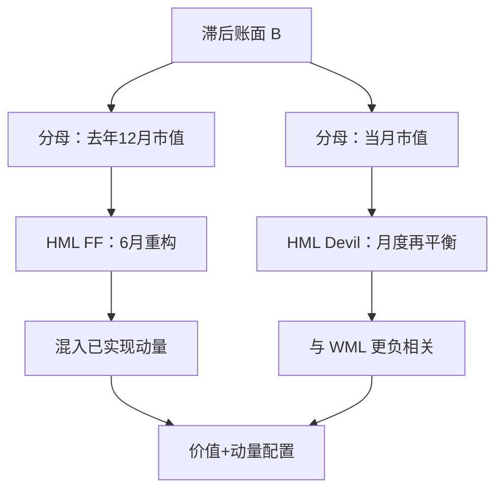

# HML Devil

账面仍用滞后财报，价格改成每月最新市值；只改这一处细节，价值与动量的负相关会尖锐得多，组合的时效也完全不像每年 6 月才重构的 HML。

<footer>—— Asness & Frazzini, The Devil in HML's Details, Journal of Portfolio Management, 2013</footer>

[价值：BM / EP / CF](/quant/value-factors) 写过三种会计映射，并点到 HML Devil 是「价格改成月度更新」。本篇只写这一处细节：Fama–French 的 HML 用上一年 12 月底市值当 B/M 的分母，次年 6 月才换仓，价格最多陈旧一年半；Asness–Frazzini 保持账面滞后以避免前视，但分母用**当期价格**。魔鬼不在新的基本面，而在价值因子里混进了多少已经实现的动量。

## 问题

标准 HML 的 B/M 分子是财政年度 $t-1$ 的账面股权，分母是 $t-1$ 年 12 月市值，组合在 $t$ 年 6 月形成。到了 $t$ 年 5 月，分母已经是五到十七个月前的价格。这段窗口里跌深的股票，真实当期 B/M 已经更高，却仍按旧价格待在成长组或中间组；涨多的股票真实已经变贵，却仍待在价值组。于是「价值」里掺进了**反动量**：HML 会被动做多最近的输家、做空最近的赢家，与 [WML](/quant/momentum-wml) 的负相关被钝化，有时甚至看起来像轻微正相关。

若研究问题是「便宜相对于贵是否有溢价」，陈旧价格把「曾经便宜」和「现在便宜」混在一起。若研究问题是「价值与动量能否做成互补的两条腿」，陈旧价格会让你低估负相关、高估单独持有 HML 的分散化。Devil 要测量的就是：把分母换成最近市值之后，价值溢价还在不在，以及它与动量的关系变成什么样。

### 陈旧价格不是「更稳健」，是另一种策略

有人把 6 月重构当成保守：财务滞后、避免前视。财务滞后是必要的，价格滞后不是。账面必须等年报；价格每天可观测。把可观测的价格故意冻结在 12 月，等于在价值信号上叠了一段已实现收益。这可以降低换手，也可以让 HML 在动量崩溃时看起来更稳——因为它已经不像在做空赢家。稳健来自风格混杂，不是来自更好的价值定义。

Devil 仍用滞后账面。用未公布年报的账面、再配上最新价格，是前视，不是 Devil。AQR 的公开序列与 Ken French 的 HML 对不上，首先应查价格日期，而不是先怀疑自己的市值口径。

## 方法

每年更新账面 $B_{i,t}$，每月用当时市值 $M_{i,t}$ 算

$$
\mathrm{B/M}^{\mathrm{Devil}}_{i,t}=\frac{B_{i,\mathrm{lag}}}{M_{i,t}}.
$$

排序、NYSE 分位、规模 2×3、价值加权多空，与 [HML](/quant/ff3) 相同，只换排序键的时效。记标准因子为 $\mathrm{HML}^{\mathrm{FF}}$，月度价格版为 $\mathrm{HML}^{\mathrm{Devil}}$。两者相关高但不是 1；后者与 12−1 动量的相关显著更负。实务上还可以对行业中性，或改用 E/P、CF/P 的当期价格版——原则相同：流量或存量滞后，价格不滞后。

诊断应同时报告：与 $\mathrm{HML}^{\mathrm{FF}}$ 的相关、与 WML 的相关、换手、以及把两者一起放进回归时各自的 α。若 $\mathrm{HML}^{\mathrm{Devil}}$ 的三因子 α 来自它更及时地加仓暴跌股，那要检查是否可交易：暴跌后的流动性、借券与反转。

### 价值-动量组合在细节上才成立

Asness 等人后来在[跨资产价值与动量](/quant/value-momentum-everywhere)里强调两条腿负相关、合成夏普更高。负相关的强度取决于价值是否用当期价格。用 French 的 HML 去做「价值加动量」，分散化会被高估或低估，取决于样本段里陈旧价格帮了谁。正确的做法是：价值腿与动量腿在**同一时效哲学**下构造——要么都用月度信号，要么明确承认 HML 里含反转/反动量。

## 机制

价格更新之后，价值变成对「当前倍数」下注。行为上，这更接近对过度外推的纠正：刚被打下来的高倍数会更快进入多头。风险上，当期高 B/M 更接近困境与杠杆的实时度量，对信贷条件更敏感。两种叙事都预测 Devil 的换手更高、左尾与动量更对冲、与动量同时去杠杆时尾部更齐。

陈旧 HML 在动量行情里会「躺赢」一段时间：赢家继续涨，而它还拿着旧的便宜标签做空成长——其实空的是已经涨起来、账面仍显示成长的名字，逻辑混乱。Devil 强迫你在涨价的同时把名字从价值组拿掉，溢价若还在，才更像倍数本身被定价。

### 与 E/P、CF/P 的时效要对齐

E/P、CF/P 若用 TTM 与当期价格，本来就比年度 HML 快。用 Devil 的 B/M 去和「快 E/P」比，比的是会计映射；用 FF 的 B/M 去和快 E/P 比，比的是时效加映射。行业中性、企业价值口径等取舍见价值专文。这里只要求：同一张表里的价值度量，价格日期必须写明。

月度价格会让价值在崩盘当月大幅加仓银行与周期股。这是特征，不是 bug。回测若再叠加「当月最低价成交」，会把流动性幻觉写进 Devil。应用次月开盘或成交量加权价格，并扣掉涨跌停。

## 边界与工程取舍

换手明显高于 6 月 HML，容量受大盘约束仍好于动量，但已不是「几乎免费」。税务与冲击成本在月度再平衡下必须进净值。国际样本上，财报滞后规则不同，Devil 的账面日期要按当地披露日历，而不是统一 6 月。A 股壳与 ST 的市值跳跃会让当期 B/M 爆炸，需缩尾。

不要把 Devil 叫做新的风险因子。不要把它与 [HML](/quant/ff3) 同时放进回归还解释两个价值 α——共线。不要声称「价值已死」，若你检验的是 FF 的陈旧 HML 在 2010 年代对成长泡沫的滞后；反之，也不要用 Devil 在某几年的强势证明价值永远有效。时效选择是研究设计，应写进说明书。

出处：Asness & Frazzini, *The Devil in HML's Details*, Journal of Portfolio Management, 2013。标准 HML 见 Fama & French, 1993。跨资产的价值-动量负相关见 Asness, Moskowitz & Pedersen, 2013。不要给 Devil 伪造一个 French 数据库代码。

## 小结

- HML Devil 保持滞后账面，把 B/M 分母换成月度最新市值。
- 标准 HML 因价格陈旧而混入反动量，与 WML 的负相关被钝化。
- 时效对齐之后，价值与动量才是可配置的互补腿。
- 换手、崩盘加仓与成交假设属于策略定义，不是附录。
- 出处：Asness & Frazzini, Journal of Portfolio Management, 2013。
