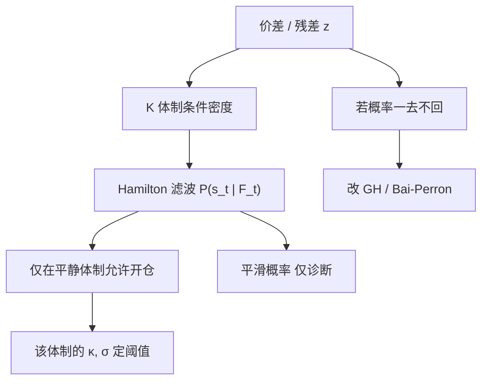

# HMM 隐马尔可夫体制

把观测写成由一条不可见的有限状态马尔可夫链切换参数的条件分布，滤波给出「现在处于哪一体制」的概率；状态会按转移矩阵回来，这与一次性结构断裂不是同一类过程。

<footer>—— Hamilton, A New Approach to the Economic Analysis of Nonstationary Time Series and the Business Cycle, Econometrica, 1989</footer>

[体制切换](/quant/regime-switching-premia) 把 Hamilton 装置接到溢价与配置：风险价格随离散状态变。本篇把同一套隐马尔可夫模型（HMM）接到**价差动力学**：均值、回复速度与扩散可以分体制，滤波概率进入是否开仓、开多大。它补的是 [OU 残差](/quant/ou-spread) 的常参数假设，以及 [Gregory–Hansen](/quant/gregory-hansen) / [Bai–Perron](/quant/bai-perron) 的「换了就不自动回来」。Hamilton（1989）的产出模型是均值切换；配对里更常是方差切换或「回复/随机游走」两体制。本篇写 Hamilton 滤波与 Kim 平滑、识别来自持续性，以及平滑概率为何不能进回测。

## 问题

常参数 OU 假定 $\kappa,\mu,\sigma$ 不变。真实价差常在「快回归的平静段」与「几乎不回归的动荡段」之间切换：危机里相关向 1 塌缩，残差波动变大，$\hat\kappa$ 被估短或估乱。若用全样本 OU 定阈值，平静期交易过密，动荡期阈值又不够。HMM 把观测密度写成

$$
z_t\mid s_t \sim p(\,\cdot\mid \theta_{s_t}),\qquad P(s_t=j\mid s_{t-1}=i)=p_{ij},
$$

$s_t\in\{1,\ldots,K\}$ 不可观测。要估的是各体制的 $\theta_k$、转移矩阵，以及 $P(s_t\mid \mathcal{F}_t)$。问题是：$K$ 无法从理论唯一钉死，且部分参数在「某体制概率为零」的原假设下不可识别，似然比不规则。

一次性协整破裂是另一 DGP：新 $\beta$ 可能永久有效，转移矩阵里 $p_{21}\gt 0$ 会错误地承诺回到旧均衡。选 HMM 还是 GH/BP，是经济判断：指数权重、会计口径更像台阶；波动的牛熊更像来回链。不能只看样本内似然。

### 体制个数与标签

$K=2$ 常被标成低波动/高波动或回复/单位根。$K=3$ 有时分出崩溃。信息准则在 HMM 里不可靠。Hamilton 强调体制是描述装置，不等于 NBER 标签，更不等于买卖信号。约束应来自：各体制期望持续期是否像「一段时期」而不是「一个跳」；滤波概率是否与危机日期大致对齐；把两体制均值（或 $\kappa$）设成相等后似然掉多少。单凭某日暴跌被标成体制 2，不能说明价差进入了新的可交易状态。

平滑概率 $P(s_t\mid\mathcal{F}_T)$ 用了未来观测，适合写经济史。交易、仓位与回测只能用滤波 $P(s_t\mid\mathcal{F}_t)$ 或一步预测 $P(s_{t+1}\mid\mathcal{F}_t)$。用平滑阴影去证明「只在体制 1 开仓夏普很高」，是全样本标签。

## 方法

**Hamilton 滤波。** 由上一期体制概率经转移矩阵得预测概率，再用当期条件密度更新。高斯切换均值–方差下，这是有限混合的贝叶斯更新。估计用极大似然；EM（Baum–Welch）在独立混合时标准，含马尔可夫依赖时用 Hamilton 的迭代。波动持续很高时，可让各体制带自己的 AR 或把 $\kappa$ 写成体制依赖：体制 1 为 OU，体制 2 为 $\kappa\approx 0$ 的局部鞅。后者直接对应「协整暂时失效」的来回版，与 GH 的永久台阶对照。

**Kim 平滑与 Viterbi。** 平滑给出事后状态，用于诊断与论文配图，不用于下单。Viterbi 给出最可能的整条状态路径，同样是 $\mathcal{F}_T$ 对象。工程上若需要「当前最可能体制」的点估计，应对滤波概率取阈值（例如 $P(s_t=1\mid\mathcal{F}_t)\gt 0.8$ 才允许按平静 OU 开仓），并承认阈值是又一个设定。

**与可观测协变量。** 转移概率可写成 logistic 于已实现波动、价差绝对值、宏观利差（Filardo 型）。状态仍是潜变量，协变量只调持续期。这比把「VIX 高就停配对」更结构化，但也多了一层过拟合：协变量若含同期价差，等于用要交易的对象去定义能不能交易。

### 诊断：持续性、残差、与断裂检验对照

报告 $1/(1-p_{ii})$ 作为期望持续期。若高波动体制平均只持续一两天，模型多半在拟合跳跃，应改跳扩散或把跳跃从残差里分开，而不是用体制溢价去讲商业周期。滤波新息应接近条件白噪声；若仍有单位根，状态维数不够（缺了 $\beta$ 漂移，应变 Kalman，或承认协整已破）。把 HMM 的 $K=2$ 与 GH 同样本对照：若滤波在某个日期附近把概率从 1 推到 2 且之后长期不回来，DGP 更像台阶，应改 BP/GH，而不是提高 $p_{22}$ 硬撑。

## 机制

统计层：混合分布同时产生肥尾与波动聚集——在高 $\sigma$ 体制多待几天，样本峰度上升，无需单独 $t$ 分布。对 OU，体制依赖的 $\kappa$ 意味着半衰期是随机的：无条件「平均半衰期」不是任何一种可实现持有期。交易若按无条件 $\kappa$ 定时间止损，会在慢体制里系统性抱太久。

经济层：共同因子主导时，残差的短期相关结构变，看起来像 $\kappa$ 下降；流动性枯竭时 $\sigma$ 上升。HMM 并不识别是因子还是流动性，只是把观测分段。定价含义与溢价一文相同：若你用滤波概率调仓，交易的是收益自身反推的状态，内生性强，换手会跟着波动走。把 $P(s_t=1)$ 当 alpha 信号，需要额外证据表明该概率在价差之外仍有预测内容，否则只是波动追随。

两个体制的无条件均值是稳态概率加权，不是样本日数加权。用「滤波概率小于 0.5 的日子」去算体制 1 的夏普，既不是 $\mu_1$，也不是可实现规则。对象必须写清：模型参数、滤波规则下的实现，还是平滑叙事。

### 与门限、CUSUM 的差别

[门限协整](/quant/threshold-cointegration) 用可观测的价差穿越阈值来切换调整速度，状态不是潜的。HMM 允许宏观「看起来还好」时，收益自身把概率推向危机体制。CUSUM 不估计回来的概率，只检测偏离恒定参数。[最优停时](/quant/ou-optimal-stopping) 通常在单一 OU 下解障碍；体制切换时，最优规则应依赖滤波概率，障碍在高 $\sigma$ 体制更宽或干脆不开。把常参数障碍套在 HMM 残差上，等于忽略了状态。

## 边界与工程取舍

似然多峰、对初值敏感。应多组初值，并约束 $p_{ii}$ 不要估到 1（退化成一次断裂却没有断裂检验的理论）。$K$ 不要用交易期 PnL 去选。不要在滤波概率上再套一层机器学习来「提高夏普」而不把该层纳入多重检验。

不要用平滑状态画「当时该开仓」。不要把 HMM 的体制 2 自动解释成可做空波动或可做多危机 alpha——价差模型没有给这些资产定价。A 股停牌造成的零收益序列会被当成低波动体制，必须把停牌标成缺失观测。

Hamilton（1989）的渐近是正确设定、平稳遍历链、足够的体制内样本。日频金融很难同时满足。把滤波概率当「做市许可」是把描述装置当成了策略评价。

## 小结

- HMM 用隐马尔可夫链切换价差的均值、$\kappa$ 或 $\sigma$；Hamilton 滤波给出时点 $t$ 可用的体制概率，状态按转移矩阵有正概率回来。
- 这与 Gregory–Hansen / Bai–Perron 的台阶型断裂不同；用错会给出虚假回归概率或切碎样本。
- 回测只能用滤波或一步预测概率，不能用 Kim 平滑或 Viterbi 路径。
- 持续性过短说明模型在拟合跳跃；无条件半衰期在切换 $\kappa$ 下没有交易含义。
- 门限模型用可观测阈值切换；HMM 的状态不可观测，换手易变成波动追随。
- 出处：Hamilton, *Econometrica*, 1989；平滑见 Kim, *Journal of Econometrics*, 1994；体制切换溢价的配置含义见 Ang and Bekaert 及 Guidolin and Timmermann。
