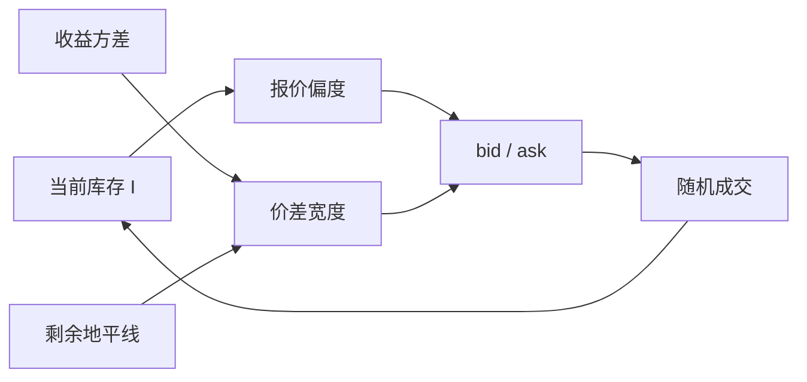

# Ho–Stoll 库存做市

即使对手并不比你知情，双向报价仍要补偿你暂时持有的不愿持有的头寸。价差是经销商风险分担的价格，中点随库存偏移。

<footer>—— Ho and Stoll, Optimal dealer pricing under transactions and return uncertainty, Journal of Financial Economics, 1981</footer>

[上一课](/quant/easley-ohara-event)在好坏消息之外加入「有无信息事件」，学习对象是体制后验；无交易可以是无事件的证据，价差在事件未决时最宽。从 Kyle 到 Easley–O'Hara，价格移动的原因都是别人可能知情。缺口是对称的另一条范式：对手与你一样无知，你却已经持有一堆股票。Ho–Stoll（1981）在有限地平线上写出经销商的最优买卖报价。本课写这一最优控制，不重写 PIN 似然，也不把 Avellaneda–Stoikov 的强度模型再推一遍。主干里的[库存偏度](/quant/inventory-skew)已经把中点随库存平移当作交易台对象。

## 问题

信息范式回答「被选中的损失」。库存范式回答：成交会留下头寸，头寸在中间价波动上有风险，风险厌恶的经销商要求即时补偿。若只有处理成本，竞争会把价差压到成本；若还有库存风险，价差必须覆盖持有期间的方差，并且报价要**偏**向把库存送回去的那一侧。问题是：在交易到达不确定、收益不确定的联合下，最优的宽度与偏度如何依赖剩余时间、风险厌恶与存货。

这与[多期 Kyle](/quant/kyle-multiperiod) 的状态完全不同。Kyle 的状态是对 $V$ 的信念；Ho–Stoll 的状态是库存 $I$ 与剩余地平线。把库存引起的中点移动当成「信息揭示」，会把做市商自己的风险转移错读成价格发现。

### 竞争做市还是垄断专家

1981 年文章写的是单个经销商的优化。Ho 与 Stoll（1983）把多个经销商的库存放进竞争：谁的库存更极端，谁更急于成交，市场报价由最急的那一侧决定。本课以 1981 年的最优报价为机制，1983 年只作为边界：竞争改变的是谁的库存被看见，不是库存成本这一项消失。

Amihud 与 Mendelson（1980）同样走库存路线，强调合意库存与报价的动态规划。Ho–Stoll 把交易与收益的不确定写进连续时间色彩的优化。资产定价含义留给[下一课之后的价差溢价](/quant/amihud-mendelson)。

## 方法

经销商最大化指数型或均值–方差型终端财富。库存 $I$ 使财富对证券收益 $r$ 暴露 $I\cdot r$。交易到达是随机的：更高的买价（对客户）降低被卖给的概率，更低的卖价降低被买走的概率。控制变量是双向报价相对公允中点的宽度与偏度。最优时，宽度随 $\sigma^2$、风险厌恶、剩余时间增加；偏度与 $I$ 同号——多头则整体下移报价，鼓励客户买走。

到达若被写成强度对报价的函数，一阶条件把「成交一笔的价差收入」与「库存方差的边际成本」对齐。这与后来 Avellaneda–Stoikov 的强度做市同族，但 1981 年还没有限价簿排队，对象是专家报价，不是挂在哪一档。

### 价差可以对称，中点不必是价值

库存模型允许报价价差对称而中点 $\neq E[V]$。中点是库存管理的工具，不是有效价格。经验上若只用中点收益做价格发现，会把库存偏度算进「信息」。Hasbrouck 后来用成交与报价的 VAR 把暂时成分分开，正是因为库存与处理成本都会制造暂时成分。

## 机制

每一笔成交有两本账。现金账：赚到半个价差（或报价改善）。库存账：头寸离合意水平更近或更远，终端方差变。做市商愿意在库存危险时**牺牲价差收入**去换减仓——表现为一侧报价更有攻击性，甚至短时间看起来像「主动吃单」。这不是知情交易，是风险转移。Grossman–Miller 将把这种转移写成跨期风险分担；本课先把它写成单个经销商的一阶条件。

与信息范式叠加时，同一笔买既可能是知情买，也可能帮你减了空头库存。报价更新必须同时改信念与改 $I$。O'Hara 强调两条线在数据里纠缠，分解是后文 Stoll / Hasbrouck 的任务。

## 边界

单一经销商、外生到达、没有知情者，是 1981 年的边界。真实专家同时面对逆向选择，纯库存模型会低估价差、高估「中点偏离即库存」。限价簿上「做市」分散在许多挂单者，没有一个 $I$ 是市场的状态；市场库存是加总，个体可以内部对冲。电子盘的义务做市与撤退，要到高频单元再写。

不要用 Ho–Stoll 去解释公告后价差跳升：那首先是事件不确定与逆向选择。库存解释更适合无公告时段、存货集中、对冲工具暂时失效。

## 小结

- Ho–Stoll（1981）在交易与收益不确定下给出经销商最优双向报价：宽度补偿库存风险，偏度把头寸送回合意水平。
- 中点可以离开公允价值而不代表信息；那是库存状态价格。
- 1983 年竞争做市让最极端库存的经销商决定市场报价。
- 与 Kyle / Easley–O'Hara 的状态变量不同：这里是 $I$，那里是信念。
- 出处：Ho and Stoll, *Journal of Financial Economics*, 1981；竞争见 Ho and Stoll, *Journal of Finance*, 1983；合意库存见 Amihud and Mendelson, *Journal of Financial Economics*, 1980。
