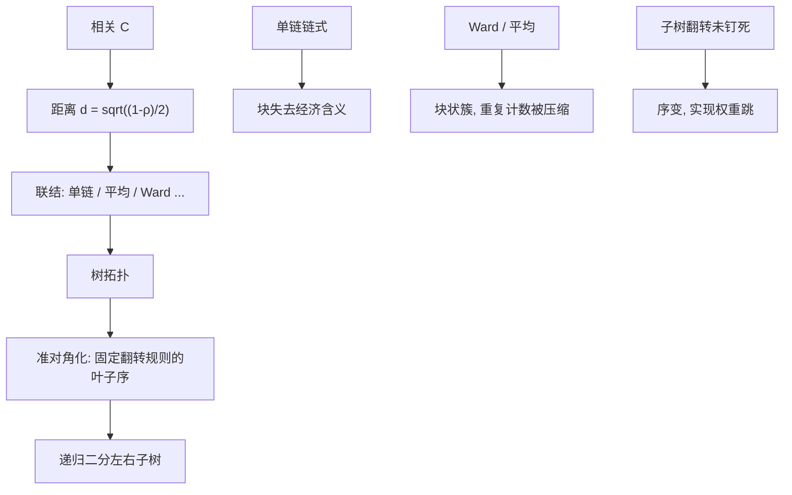

# HRP 联结与准对角化

    
树由联结准则长成，叶子序由子树翻转决定；准对角化只是按这个序重排协方差，不改变特征值，也不等于可以把满矩阵当对角矩阵来逆。

    <footer>—— López de Prado, Building Diversified Portfolios that Outperform Out of Sample, JPM, 2016；层次聚类的联结为经典多元统计</footer>

[HRP](/quant/hrp) 一文写三步配置：距离、树、递归逆方差二分，以及它与 [ERC](/quant/erc) 的差别。本篇只写**树怎么长出来、序怎么固定**：单链 / 完全 / 平均 / Ward 联结如何改变簇的形状，准对角化（矩阵序化）做什么、不做什么，以及子树翻转为何让同一相关矩阵对应两套合法权重。算法复制失败，多半不是递归二分写错，是联动与遍历没有钉死。它补的是图的离散选择，不是再讲一遍「不要逆满 $\Sigma$」。

## 问题

层次聚类在每一步合并两个当前簇。合并谁，由联结（linkage）定义的簇间距离决定。单链取两簇间最近的一对叶子，完全链取最远的一对，平均链取所有跨对的平均，Ward 取合并后簇内方差的增量。相关距离 $d_{ij}=\sqrt{(1-\rho_{ij})/2}$ 只规定叶子之间的度量（在相关系数意义下）；不规定簇之间的度量。HRP 的树因此不是「相关」的唯一函数，而是（相关、联结、可能还有预先收缩）的函数。2016 年文与 AFML 示例常用单链，股票上单链容易链式连接：一只桥梁股票把两个行业串成一长条，递归二分会在错误的深度切开。

准对角化把叶子按树的深度优先序排成一条线，使大相关靠近对角线，矩阵看起来呈块对角。这一步不改变任何特征量，只为「左孩子 / 右孩子是连续下标区间」服务。若把重排后的 $\Sigma$ 送进 Markowitz，病态原样。问题是把联结、序、翻转当成模型定义的一部分写进文档，否则「HRP 权重」不可复现，也无法与 [ERC 边际贡献](/quant/erc-mrc) 对照。

### 单链的链式与 Ward 的球状

单链（最近邻）满足度量的某些直觉，但对噪声边敏感：一次偶然的高相关就把两簇焊上，之后只通过「朋友的朋友」无限延长，树呈梳状。梳状树上递归二分接近按叶子顺序切一半，块方差失去行业含义，HRP 退化为打乱顺序的逆波动。完全链倾向紧凑簇，但可能把真的层次切碎。平均链（UPGMA）常作为股票相关的默认折中。Ward 最小化合并带来的方差增量，偏好尺寸较均的簇，对「行业块」友好，但对距离矩阵的欧氏假设更严——输入若只是相关转换，严格说不是 Ward 的原假设，实务仍常用。

选择联结是在偏误与方差之间选树的先验：单链承认细长结构（期限链条、信用曲线），Ward 承认块状因子。全球股票若先国家后行业，Ward 往往先切国家；单链可能沿全球银行股拉一条跨国链，树在讲因子而不是地理。这必须与 [行业/国家中性](/quant/industry-country-neutral) 的约束一致，否则树的预算与中性约束互殴。

距离 $d=\sqrt{(1-\rho)/2}$ 对 $\rho=-1$ 最大、$\rho=1$ 为零。先对市场因子残差再算 $\rho$，树从 beta 簇变成行业簇，联结仍会再改形状。残差化与联结是两个旋钮，不要只调一个还声称「HRP 稳健」。

## 方法

固定管道：（1）估计 $C$，是否收缩、是否残差；（2）$d_{ij}$；（3）一种联结，禁止实现库的默认值悄悄改；（4）把树转成叶子序。López de Prado 的准对角化是递归：对当前簇按两个子簇分成两段连续区间，可再对每个子簇翻转左右。深度优先且「每次把较大 / 较小子簇放左边」一类打破翻转对称的规则必须写死，否则同一棵树每天因参数顺序得到镜像序，块方差在边界上微调，$\alpha$ 跟着跳。

递归二分用的块方差，依赖这个序是否让「左 = 一个子树、右 = 兄弟子树」。序若只按代码排序而不是按树，HRP 就不是 HRP。实现检查：重排后的相关热图应呈准对角块；若仍花，要么树是梳状（联结问题），要么序不是树序。不要用谱序化（Fiedler 向量）替换树序还沿用 HRP 名字：那是另一种矩阵序化，递归规则未定义在谱割上。

### 翻转、共识树与稳定性

每个内部节点左右可互换，有 $2^{N-1}$ 种叶子序与同一拓扑相容。准对角化挑选其中一种。权重对翻转理论上在「块方差用子树自身 $\Sigma$」时应不变，因为左右只是标签；实现若用下标切片的数值捷径（假设连续区间且未随翻转更新），会变。单测应对一棵固定树做左右翻转，权重必须相同。不稳定来自树拓扑本身：今日合并顺序因一只股票的 $\rho$ 微调而变，成员换簇，权重大跳。缓解：对 $C$ 做平滑或 Ledoit–Wolf；bootstrap 多棵树再对共现矩阵聚类（共识）；或把本期 HRP 与上期做换手混合。联结越敏感（单链），越需要共识。

评价联结：滚动样本外方差、换手、簇稳定指数（调整兰德指数对相邻两期树）。样本内选让回测波动最低的联结，是在拟合树噪声。预先按经济叙事选（股票块用 Ward，曲线用单链），再在样本外确认，比网格搜索联结更诚实。

## 机制

联结决定「谁先被当成一个风险单位」。早合并的叶子此后只分享一份预算，这是 HRP 修正 ERC 重复计数的几何来源。单链让桥梁叶子很早把远方行业焊在一起，预算过早共享，假分散换成假对冲。Ward 让同行业更可能先成团，科技十只股票共享科技预算，再与金融对分——这才是相对平坦 ERC 的增量。准对角化不创造这种共享，只是把已经决定的共享写成连续块，供递归读取。把准对角化当成降维或正则，是看热图产生的错觉：条件数不变。

递归二分的 $\alpha=1-V_L/(V_L+V_R)$ 在块方差用对角逆方差时，对块内相关不敏感；若改用块内满 $\Sigma$ 的最小方差或 ERC 当块代表，联结仍决定块的成员，但块的 $V$ 变了，这是 HERC 一类变体。无论哪种，成员错了，$V$ 再精确也是错块的精确。

相关矩阵的序化（seriation）是一个独立的 NP 难问题家族。HRP 用树给出一个可计算的启发式序，不是最优序。用最优序化去重排再做全局 Markowitz，仍要逆满矩阵，与 HRP 的正则无关。

### 输入相关的经济含义先于联结

全市场相关：高 beta 名字距离近，树先切 beta，HRP 接近按 beta 分层的逆波动。行业残差相关：树切行业。国家+行业双重残差：树切特异，叶子预算更像特异风险平价，此时联结差异变小，因为块本身变弱。商品与债券混在同一张 $C$ 里，尺度与交易时段不同，距离被波动和异步相关污染，联结会先按资产类切开——这可能正好是想要的嵌套，也可能是数据伪影。应分资产类建树再在根上对类代表做一次二分，而不是一张全球 $C$ 喂单一联结。

## 边界与工程取舍

不要把 AFML 代码里的单链当成定理要求；原文示例不是产品规格。不要日频重估树而不平滑。不要对期权、可转债用收益相关联结：非线性下「相关」不是簇的正确对象。不要在多空账本上用无符号相关树还期望空头腿去对冲——树没有读 $w^\top\Sigma w$ 的交叉项符号。子树遍历序、联结名、scipy/sklearn 的 linkage 参数字符串，都应进模型哈希。

$N$ 很大时 Ward 的 $O(N^2)$ 可接受，单链更快但链式风险更大。预先用行业树当约束层次、只用 HRP 在残差上分配，是把经济联结与样本联结分工：上层不估计，下层才估计。这比在错误的全相关上精选 linkage 更有效。

「准对角」不是「近似对角」。块内相关可以仍是 0.8。HRP 不爆炸是因为不逆这块满矩阵，只在块上做逆方差或小规模运算。看到热图干净就直接求逆，会把正则扔掉。

## 小结

- HRP 的树由联结准则定义，相关距离只决定叶子；单链易链式，Ward / 平均更易得到行业块。
- 准对角化按树序重排 $\Sigma$，服务连续子树切片，不改变特征值，不是可逆性改善。
- 子树翻转必须用固定规则打破对称，并单测权重对翻转不变。
- 残差化决定树讲 beta 还是讲行业，与联结同为模型选择。
- 对照平坦 ERC：只有树把重复名字早早收成一块，HRP 的修正才存在。
- 出处：López de Prado, *JPM*, 2016 与 *AFML* 中的实现；联结准则为层次聚类的标准定义（Sokal、Ward 等）；矩阵序化是独立的组合优化问题，HRP 只用其树启发式。
