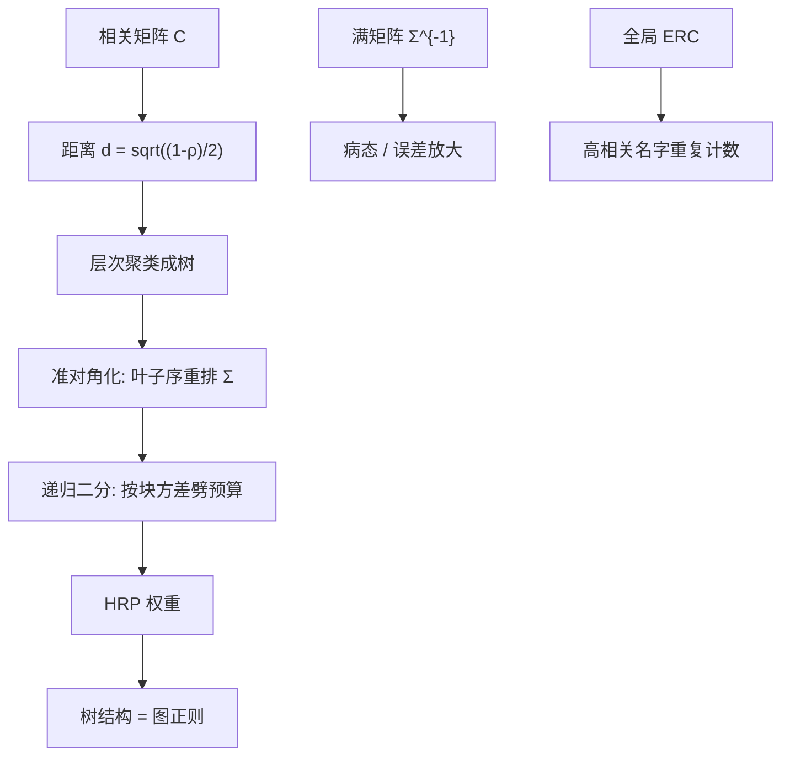

# 层次风险平价 HRP

    
先按相关把资产收成树，再在树上做逆方差分配，就不必去逆整张病态的协方差——层次结构本身就是正则。

    <footer>—— López de Prado, Building Diversified Portfolios that Outperform Out of Sample, Journal of Portfolio Management, 2016</footer>

[上一课](/quant/dcc-portfolio)把 Engle 的 $H_t$ 接入 ERC 或最小方差，对角与相关拆开用；未正则的 $H_t^{-1}$ 仍会误差最大化。缺口是配置图：Markowitz 与 ERC 都在满 $\Sigma$ 上把每对资产当成完全图节点，$N/T$ 小时噪声特征向量被当成可配置风险源，块状行业结构被忽略。本课钉层次风险平价：相关距离聚类、准对角化、沿树递归劈预算。不重讲 DCC 两步准似然。后课 ERC 默认 HRP 的分配是逆方差二分，不是嵌套再解一遍等贡献。

## 问题

DCC 给出时变 $H_t$，配置若仍在完全图上求逆，噪声特征向照样进权重。样本协方差的逆放大最小特征值，最小方差权重稀疏且换手大；ERC 用满相关，高相关的重复名字会被当成两个贡献者而重复给预算，树状行业结构被忽略。需要一种规则：承认股票相关是块状的（行业、国家、因子），块内先压缩成一个风险单位，块间再分配，从而（1）避免逆满矩阵，（2）避免在同一簇里重复计数。层次聚类把「谁和谁是重复的」写成可审计的树，递归二分把「平价」定义在兄弟节点上，而不是定义在 $N$ 个叶子的完全约束上。

HRP 的规范性主张是：样本外方差往往低于未收缩的最小方差与朴素 ERC，因为算法不能把质量堆到噪声方向上——那些方向通常不会形成稳定的簇。这不是定理保证的有效前沿，是一种对 $\Sigma$ 的图正则。若真相关不是层次的（所有两两相关几乎相等，或存在一个主导市场因子把树压扁），HRP 退化为接近逆波动的东西，增量消失。

### 完全图假设在组合里过强

Markowitz 与 ERC 的一阶条件让每一对资产的协方差都直接进入每一个权重。一对估计得很吵的远距离相关（巴西股票与德国公用事业）也会微调两者的最优持仓。HRP 只让「树上的祖先」把预算传下来，远距离叶子之间没有直接的逆矩阵耦合。这是偏误：真的跨块对冲会被忽略；也是方差：噪声相关进不了权重。López de Prado 把这解释为机器学习式的正则——限制模型的比较集合，而不是再估一个更巧的 $\Sigma^{-1}$。

HRP 不是「在 ERC 外面套一层聚类」的口头禅。若先聚类再在簇间做 ERC、簇内再 ERC，那是嵌套风险平价，仍要在每一层解等贡献，见 [ERC](/quant/erc)。HRP 的分配规则是逆方差的递归二分，簇的方差用簇内逆方差组合来度量，数学对象不同。

## 方法

三步，输入是相关矩阵 $C$ 与方差向量（或完整 $\Sigma$）。

**聚类。** 距离 $d_{ij}=\sqrt{(1-\rho_{ij})/2}$（对相关的度量，满足同一性与对称；单链或 Ward 是否严格度量空间，实现里常直接用）。层次聚类得到树：叶子是资产，内部节点是簇。单链容易产生长条链，Ward 或平均链在股票上更常见；必须固定联动准则，否则树不可复现。

**准对角化。** 按树的叶子序重排 $\Sigma$，使大相关靠近对角线。这一步不改变任何特征值，只是为递归二分提供「左孩子 / 右孩子」的连续区间。序不唯一（每个子树可翻转），实现上要固定一种深度优先遍历，以免同一棵树对应两套权重。

**递归二分。** 对当前簇，按树分成左右两块 $L,R$。先在块内用逆方差得到块的权重 $\tilde w$，块方差 $V= \tilde w^\top \Sigma_{\mathrm{block}}\tilde w$。再把本层预算按

$$
\alpha=1-\frac{V_L}{V_L+V_R}
$$

分给左块（右块 $1-\alpha$），即方差大的一侧少拿预算。递归直到叶子。全市场权重是各层 $\alpha$ 的乘积。没有一次 $N\times N$ 的求逆；每次求逆只发生在块内对角（逆方差）或小块 $\Sigma$ 上。

### 与逆波动、ERC、最小方差的对照

若树退化成「每个资产单独一类」，递归二分就是逆方差（对角 $\Sigma$）。若相关全相等，聚类没有信息，HRP 接近逆波动。相关呈两块清晰结构时，HRP 先在块间按块方差分配，再在块内分配：高相关科技簇作为一个单位面对金融簇，不会让十只科技股各拿 $1/N$ 的 ERC 预算。最小方差会在块内稀疏到一两只代表；HRP 默认在块内仍按逆方差铺开，更像「强制分散的因子风险平价」，不像 GMV 的角点解。

数值上 HRP 是 $O(N^2)$ 的聚类加线性递归，稳定、无求解器失败。这是它在 $N$ 数百时相对 ERC 牛顿法的工程优势。评价必须样本外：滚动估计 $C_t$，形成 HRP 权重，看下一期实现方差、换手、集中度。样本内把树拟合到同一段数据再报「HRP 波动更低」，没有内容。

## 机制

机制是**预算沿树向下、块内只看局部方差**。两只高度相关的股票会很早并成一簇，此后它们只分享该簇分到的那一份风险预算，不能各自再向全局要一份——这正是 ERC 在重复资产上的缺陷。跨块的对冲需求若存在（例如多股票空指数期货），树若把期货放在很远的叶子，HRP 不会主动去做这个对冲，因为它从未在全局二次型里看到 $w^\top\Sigma w$ 的交叉项可以被做空利用。多头单纯形上这通常可接受；多空组合上 HRP 的树要在有符号的相关或用因子残差上重建，否则空头腿会被当成又一个正波动叶子。

树的估计误差表现为「今天和明天簇的成员换人」。一只股票从科技划到消费，权重可以跳一截，即使 $\Sigma$ 的数值几乎没变。这是离散结构正则的通病：连续收缩（Ledoit–Wolf）权重连续，聚类权重分段常数。缓解：对 $C$ 做平滑或收缩再聚类、对树做自助法共识（bootstrap aggregation of trees）、或把 HRP 权重与上期做 [换手惩罚](/quant/turnover-penalty) 混合。

准对角化容易让人以为「矩阵已经接近对角、可以当对角处理」。重排不改变条件数。HRP 之所以不爆炸，是因为根本没有用那张满矩阵的逆，不是因为重排让它变好了。把准对角化后的 $\Sigma$ 拿去直接 Markowitz，病态原样在。

### 距离与联动不是细节

$\rho$ 用多长窗口、是否先对市场因子残差再算相关，决定树在讲行业还是在讲 beta。全市场相关下，高 beta 股票会聚成一簇，HRP 变成某种 beta 分层；对市场中性残差聚类，树更接近行业 / 风格。全球股票再叠国家，树可能先按国家切开，[行业/国家中性](/quant/industry-country-neutral) 的约束与 HRP 的树会打架：约束要求跨国家行业净零，树却可能把「日本银行」与「美国银行」放在不同国家簇里分开预算。应先声明树的输入是谁的相关：原始、对市场残差、还是对国家+行业残差。残差上的 HRP 才接近「特异风险平价」。

## 边界与工程取舍

不要把 2016 年 JPM 文中的样本外胜出写成「HRP 优于均值方差」的普遍定理：对照若是未收缩的 GMV，任何正则都能赢。对照应包括 Ledoit–Wolf 最小方差、ERC、逆波动。不要在树未稳定时做日频 HRP 再平衡。不要对含衍生品、期权、非线性工具的账本直接用收益相关聚类。不要把 HRP 的叶子权重解释成「模型喜欢这只股票」——那只是它波动低且所在簇分到了预算。

HRP 不用 $\mu$，不能表达观点；要观点应在树的某一层把 $\alpha$ 改成 BL 式倾斜，或把 HRP 当参考组合再跑 [Black-Litterman 观点](/quant/bl-views)。卖空约束下树的距离若仍用相关，做空高相关资产这一 Markowitz 操作不存在。López de Prado 后续还有 HERC 等变体，把递归分配改成簇间 ERC；那是把本篇的逆方差二分换成等贡献二分，树还在，一阶条件变了，不要混名。

AFML 书里的实现细节（单链、递归代码）被大量复制。复制前应固定：相关的样本期、是否收缩、联动准则、子树遍历序、块方差用对角逆方差还是块 $\Sigma$。这些不定，HRP 不是一个算法而是一个家族。

## 小结

- HRP（López de Prado, 2016）用聚类树 + 准对角化 + 逆方差递归二分配置，避免逆满 $\Sigma$，也不用 $\mu$。
- 高相关资产先共享一簇的预算，修正 ERC 对重复名字的重复计数；代价是忽略远距离叶子之间的直接对冲。
- 树不稳定会造成权重跳跃，需平滑相关、共识聚类或换手惩罚。
- 对照应包括收缩最小方差与 ERC；击败未正则 GMV 不能当定理。
- 输入相关是否先残差化，决定树在讲 beta 还是讲行业，须与中性约束一致。
- 出处：López de Prado, *Journal of Portfolio Management*, 2016；算法展开见 *Advances in Financial Machine Learning*；相关距离与层次聚类为经典多元统计工具。
