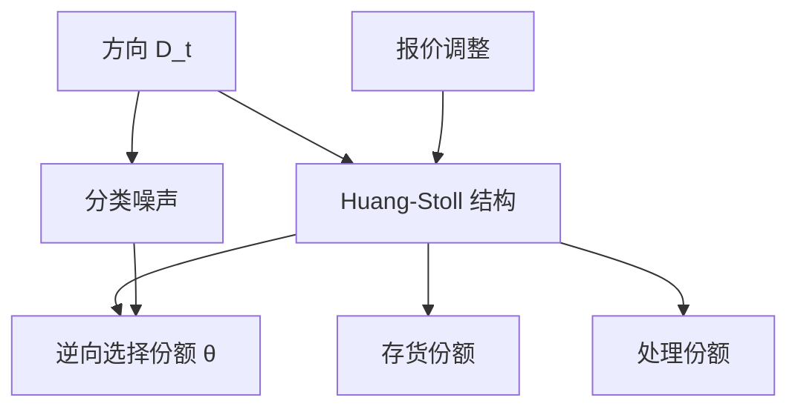

# Huang-Stoll 价差分解估计

把价差拆成逆向选择、存货与订单处理，需要成交方向的序列，而不仅仅是一个平均宽度。方向如何分类，分解出的份额就会跟着走。

<footer>—— Huang and Stoll, The Components of the Bid-Ask Spread: A General Approach, Journal of Financial Economics, 1997</footer>

[Tick / Quote 规则](/quant/tick-quote-rule)给出方向 $D_t$。本课的缺口是：有了方向，如何把先修课序里概念上的三项——逆向选择、存货、订单处理——写成可估计的回归，而不是停留在有效减实现的约化会计。[有效价差与实现价差](/quant/effective-realized-spread)已经能把冲击从实现收入里分开，但它不分离存货与处理。Huang 与 Stoll（1997）用成交方向的自相关与报价调整，给出两路和三路分解。本课不重写 [Roll](/quant/roll-model) 的协方差开方，也不重写 [Kyle](/quant/kyle-model) 的 $\lambda$；那些是另一套识别。后课 MRR、Corwin–Schultz 是并列估计器，本课只把 Huang–Stoll 的设定读清楚。

## 问题

概念分解 $s=s_{\mathrm{as}}+s_{\mathrm{inv}}+s_{\mathrm{proc}}$ 三项都不可直接观测。有效减实现把永久中点移动当成冲击，冲击里仍混合逆向选择与未衰减的存货压力。要分开存货与处理，需要额外的矩：方向是否自相关、报价中点是否随累积方向偏移、价差是否随方向状态改变。Huang–Stoll 的一般方法是：把观察到的成交价变化写成方向的函数，约束来自做市商报价行为。缺口是这套约束依赖 $D_t$ 测得准——上一课刚说明中点附近 tick 规则与报价规则会分叉。分解份额对分类噪声敏感，不是对「理论三项」敏感。

两路分解把存货并入暂时成分，只估逆向选择对价差的比例 $\theta$ 与暂时成分 $1-\theta$。三路再试图把暂时成分拆成存货与处理。识别更强，失败也更常见：方向负自相关既可来自买卖回跳（处理），也可来自存货诱导的反向成交。没有头寸数据时，三路经常不稳定。问题是先报告两路，三路当敏感性，而不是一上来输出三色饼图。

### 方向方程与价差方程是一套，不是两个独立回归

Huang–Stoll 把成交方向的条件期望与报价调整联立。方向的一阶自相关进入存货项：若做市商用报价诱导反向成交，观测到的 $D_t$ 应对 $-D_{t-1}$ 有反应。若只有处理成本、买卖随机，方向近似白噪声，成交价出现 Roll 式回跳。若只有逆向选择，成交后报价永久移动，回跳消失。把这三种极端写进同一个线性结构，系数才被解释成份额。单独把 $D_t$ 对 $D_{t-1}$ 回归，或单独把 $\Delta p$ 对 $D$ 回归，都不是原文的分解。

$D_t$ 必须与报价同步。用本所成交对本所 BBO 分类，再拿去和 NBBO 中点变分回归，系数没有定义。碎片化样本里先锁报价源，再跑 Huang–Stoll。

## 方法

输入：清洗后的成交价、同期买卖报价、方向序列。方向用报价规则优先、平价用 tick，或用交易所主动标志当对照。估计两路：允许逆向选择比例 $\theta$，暂时成分吸收处理加存货。再估计三路：加入方向自相关结构以分离存货。报告 $\theta$、存货份额、处理份额，以及方向自相关、平均报价价差。Huang–Stoll（1997）原文用的是当时纽约与纳斯达克样本；你的复制必须换现代小数报价、多场所数据，数字不会也不应等于 1997 年表格。

对照约化统计量：同一 $\tau$ 上的实现价差份额应与两路里的暂时成分同方向变化，但不必数值相等——窗口 $\tau$ 与模型里的「下一笔」不是同一地平线。这正是后课[实现价差期限](/quant/realized-spread-horizon)要展开的。不要用 PIN 的知情概率去「验证」$\theta$：PIN 是混合分布的参数，Huang–Stoll 是价差份额，量纲不同。

### 分类错误把逆向选择往下压

随机分错方向，相当于 $D$ 乘了一个小于 1 的信度。与 $D$ 相关的报价调整被缩小，$\theta$ 偏低，处理项偏高。中点成交占比高的股票（一 tick 价差、大量内部化）误差最大。Ellis–Michaely–O'Hara 的分层精度应作为分解的质量警告：在中点层单独估一套，不要只报全样本。用官方主动标志的子样本做 bound，比调模型阶数更有用。

## 机制

逆向选择项对应成交后信念更新：买成交之后公允价格上移，卖则下移，做市商的事后收入小于报价价差。存货项对应头寸目标：连续被买之后，做市商提高两边报价以诱导卖盘，方向出现负相关，中点出现与累积流量相反的均值回复。处理项对应每笔固定成本，产生不随方向状态改变的回跳。Huang–Stoll 的贡献是把这三种行为写成同一组可估计约束，而不是三个故事各讲一遍。

与 Glosten–Harris 一类线性模型的差别：后者更贴近把价格变化投影到带符号流量，接近经验 lambda；Huang–Stoll 盯的是价差的构成比例。与 Roll 的差别：Roll 只用成交价协方差，分不出 $\theta$。本课需要报价和方向，数据更苛刻，解释更细。

三路里存货与逆向选择都移动中点。差别靠方向的条件结构，不靠「中点动了就是信息」。先修课已经警告过这一点；估计时若存货项为负或超过 100%，应退回两路，而不是改符号限制硬挤出饼图。

### 没有头寸时不要强上三路

三路存货项靠方向自相关识别。限价市场没有专家库存，该项为负或超过百分之百时，应退回两路并写明。强加非负约束只是把识别失败藏进饼图。

## 边界

没有买卖报价时不要做 Huang–Stoll，改 Roll 或 Corwin–Schultz。集合竞价成交没有连续方向结构，应剔除开收盘拍卖。涨跌停一侧报价缺失，中点与方向同时坏。A 股主订单驱动、没有单一专家存货，存货项应解释为限价群体的集体头寸压力，而不是专家库存；份额仍可估，故事不能照抄 1990 年代纽约。

开收盘拍卖、涨跌停、中点 ATS 打印，都应在估计前剔除或单独成组。把它们丢进方向自相关，处理项会被制度结构污染。

下一课序里的 MRR 用另一组报价更新方程。本课只要你带着「方向序列是分解的输入，分类误差进入份额」进入后面的估计器。实现价差的 $\tau$ 还没被模型化，那是价格形成课序末尾的课。

## 小结

- Huang–Stoll 用方向与报价调整估价差份额；两路稳，三路识别弱。
- 不要重跑 Roll 开方或 Kyle lambda 来「代替」该分解。
- 方向分类噪声系统性压低逆向选择份额。
- 冲击的约化度量（有效减实现）与 $\theta$ 同方向，但地平线不同。
- 存货项在限价市场里是集体头寸，不是单一专家。
- 出处：Huang and Stoll, *Journal of Financial Economics*, 1997；方向精度见 Ellis, Michaely and O'Hara, *JFQA*, 2000；概念三项见 O'Hara, *Market Microstructure Theory*。
