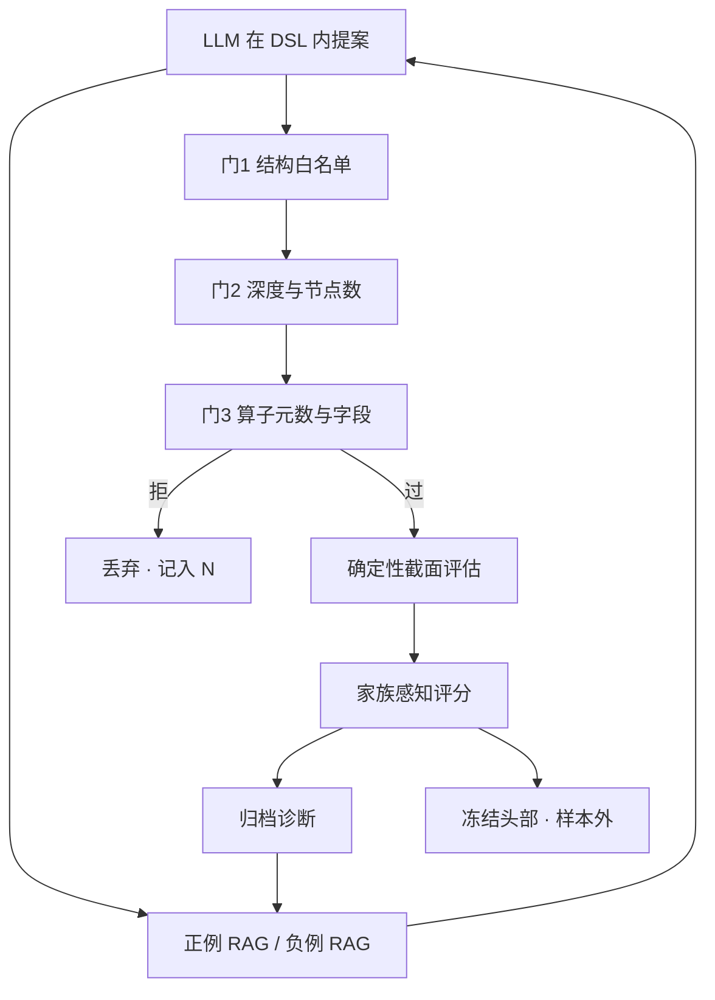

# Hubble：AST 沙箱与三重门

    
不要把大模型当成无约束的代码生成器：候选必须落在可解释的算子树上，每一条都经过确定性的截面评估，并把头部公式与家族诊断回写到下一轮。

    <footer>—— Shi, Yan, Cai and Lv, Hubble: An LLM-Driven Agentic Framework for Safe, Diverse, and Reproducible Alpha Factor Discovery, arXiv:2604.09601</footer>

Alpha-GPT 用人把想法编译成种子，再交给搜索。[Hubble](https://arxiv.org/abs/2604.09601)（Shi 等人，Celestial Quant Lab / UBC，2026）把重点换成三件工程约束：生成必须安全、搜索必须多样、评估必须可复现。LLM 只在注册过的领域特定语言（DSL）里写公式；解析后的抽象语法树经过三重门——结构安全、复杂度、语义合法——才允许进入确定性回测。双通道 RAG 同时提供正例与负例，家族感知评分惩罚拥挤模板。这是沙箱化的研究代理，不是市场操纵代理：它没有订单出口，没有对手方模型，没有「把别人挤出去」的目标函数。公开实验在约 500 只美股、三轮 104 个合法候选上报告零运行崩溃；样本外窗口里部分振幅与波动家族仍正，最弱的趋势因子明显衰减——与 McLean–Pontiff 的样本外下降同向，应用 Hou–Xue–Zhang 的加权眼光去读，而不是只读论文的头部 IC。

## 问题

公式化因子的搜索空间组合爆炸，日频截面信噪比低，无约束程序生成在作业上不安全：任意 `exec`、任意导入、任意负向移位，都能在研究集群上造成泄漏或事故。遗传规划能搜，但表达式脆、难运维；手写库可解释，但扩起来慢。LLM 能按文档与反馈提案，失败模式也成套出现：不安全执行、语义非法、反复重发现拥挤模板、收敛到高覆盖低新颖的成交量母题。Hubble 要同时优化的不是单一 IC，而是合法、多样、可解释、家族可泛化。

与 Alpha-GPT 的差别在闸门位置。Alpha-GPT 信任人评述与后端表达式语言；Hubble 假定生成器会越界，把越界挡在 AST 层，并且用负例检索主动避开拥挤。人可以少介入每一条公式，但必须事先规定 DSL、白名单与评分权重——闸门从对话挪到配置。

### 三重门是 exec-free 的最小完备

候选写成注册算子与原始面板字段上的表达式。原语为日频 OPEN、HIGH、LOW、CLOSE、VOLUME、VWAP；算子含算术、时序（`TS_SMA`、`TS_STD` 等）、截面（`CS_RANK`、`CS_ZSCORE`）、逻辑 `IF`。字符串解析为 Python AST 之后：

1. **结构安全。** 只允许白名单节点类型，禁止属性访问、生成器、导入、函数定义里夹带任意调用。这是防止任意代码执行。
2. **复杂度控制。** 深度与节点数超过阈值则拒。这是防止过深嵌套把噪声拟合漂亮，也防止评估器被巨型树拖死。
3. **语义合法。** 算子名、元数、变量名必须属于注册 DSL，字段对齐。这是防止「跑得起来但不是因子」的调用。

三道都过，才进入确定性评估；整栈自称 exec-free。三重门不检查经济意义，也不检查未来函数的动态形态——静态负移位可以挡，数据依赖的泄漏仍要靠评估器的时点对齐。XAlpha 后来把静态 AST 与动态扰动测试拆开，见[假设到代码](/quant/xalpha-hypothesis-code)；Hubble 把静态三层做硬。

白名单过宽，三重门变成摆设；过窄，模型只能写均线差。DSL 的设计是经济选择：注册哪些截面算子，就决定了能不能表达行业中性，也就决定了会不会系统性偏向某些家族。

## 方法

闭环五块：DSL 约束生成器、双通道 RAG、AST 沙箱、确定性评估、带归档的加权评分。

生成器每轮收到静态算子前缀 + 动态后缀：生成指令、多样性要求、上一轮反馈、可选 RAG。提示显式要求覆盖趋势、反转、波动、振幅、流动性-成交量、价量交互等家族，避免全部塌进成交量归一化。

RAG 分正负两通道。正通道从语料里取代表性机制，鼓励探索覆盖不足的主题；负通道取拥挤或过度开采的模板，作为「不要再参数化一遍」的反例。这与普通事实检索不同：检索成为探索的控制信号。对公开因子动物园，负通道应包括 Kakushadze 式价量短公式与高换手摩擦变量——Hou–Xue–Zhang 里复制失败最狠的那一类。

评估对每个合法 $\alpha$ 算前瞻收益上的截面 RankIC 与 Pearson IC、各自的 ICIR、换手、分层收益、多空、覆盖率。评分把预测力、稳定、换手、家族多样性加权，并加公式相似度惩罚。头部公式与家族诊断写回下一轮。存储层保留检查点与诊断，使同一轮可复现，而不是「当时模型采样如此」。

### 家族感知选择对抗拥挤衰减

若评分只认 IC，生成器会卡住高 IC 的拥挤母题，McLean–Pontiff 意义上的发表知情交易会在你的库里提前发生——不是市场先交易，是你的搜索先与市场同构。家族惩罚与负例 RAG 把目标改成：在合法树集合上覆盖多个机制族，而不是把成交量因子的夏普刷到最高。论文主实验的头部转向振幅、波动、趋势，而不再被成交量母题主导，作者将其读作搜索行为被改变，而不只是语法更合法。样本外（文中 2025-06-01 至 2026-03-13）振幅与波动多数仍正，最弱趋势因子衰减，说明多样性不自动等于稳健；冻结头部再做持有期外检验，仍是最低要求。

104 个合法候选、三轮、约 500 只股票，对「可复现工作流」是证据，对「发现了新的风险溢价」不是。宇宙小、轮次少，多重检验的 $N$ 要把被拒的非法树也算进尝试，否则 PBO 好看是因为非法样本没进分母。

## 机制

LLM 提供有条件的提案：给定算子文档、正负例与上轮诊断，下一步公式的分布被提示塑形。AST 门把该分布投影到 DSL 的合法子集。评估器给出与模型无关的奖励。评分与 RAG 把奖励翻译成下一轮提示。闭环改变的是提案分布，不是单次生成质量。双通道 RAG 的负例相当于在提示里实现 Stein 意义上的「不要与已有精明投资者同构」——当然只在公式空间里，不是在持仓空间里。真拥挤仍要靠实盘相关与容量曲线。

确定性评估是可复现的关键。同一公式、同一面板、同一清洗规则，IC 必须逐位可重复。模型温度只影响提案，不影响打分。这与聊天式「再生成一次看看夏普」相反：夏普不是采样出来的。

### 安全与研究就绪是同一套归档

每次评估写出 RankIC、Pearson IC、分层、多空、换手、覆盖、复杂度，供事后审计。没有这些工件，代理循环无法与[研究隔离](/quant/research-sim-prod)对接：你无法证明模拟里的因子就是沙箱放过的那一棵树。哈希表达式、冻结 DSL 版本、冻结面板版本，应与三重门的通过记录绑在同一行。

## 边界与工程取舍

论文实验规模有限，持有期外窗口不长，HAC 显著的 Pearson IC 与多空证据只覆盖部分头部。不要把「零崩溃」读成「零泄漏」：静态门挡不住所有动态未来函数。DSL 不含基本面与订单簿，机制空间被日频 OHLCV 截断；这是安全与表达力的交换。不同 LLM 后端的稳定性是工程结论，不是 alpha 的跨模型不变性。

不要在三重门之后接无沙箱的「增强脚本」去改公式。不要把负例 RAG 当成已发表因子的黑名单就足够——内部已部署因子必须进负通道，否则会与自己拥挤。评分权重是超参，必须在训练段冻结，不能看样本外哪一族好看再调。经济显著性仍要市值加权与成本 MC；DSL 因子天然偏短公式、偏换手，Novy-Marx–Velikov 的高换手警告适用。

出处：Shi et al., *Hubble*, arXiv:2604.09601。相关：Wang et al., *Alpha-GPT*, arXiv:2308.00016。拥挤与复制：McLean–Pontiff, *JF*, 2016；Hou–Xue–Zhang, *RFS*, 2020。公式库对照 Kakushadze, 2016。AST 门的后续扩展见 XAlpha 的静态门与动态扰动。

## 小结

- Hubble 把 LLM 限制在 DSL 算子树上，用 AST 三重门（结构、复杂度、语义）实现 exec-free 生成。
- 双通道 RAG 与家族评分改变搜索行为，抑制拥挤成交量母题，但不自动给出稳健溢价。
- 确定性评估与诊断归档是可复现的条件；模型温度只影响提案。
- 尝试次数应计入被拒树；样本外衰减与加权复制仍要单独做。
- 系统没有交易出口；安全门是研究作业安全，不是市场微观结构安全。
- 出处：Shi et al., arXiv:2604.09601；对照 Alpha-GPT；评价见 McLean–Pontiff 与 Hou–Xue–Zhang。
