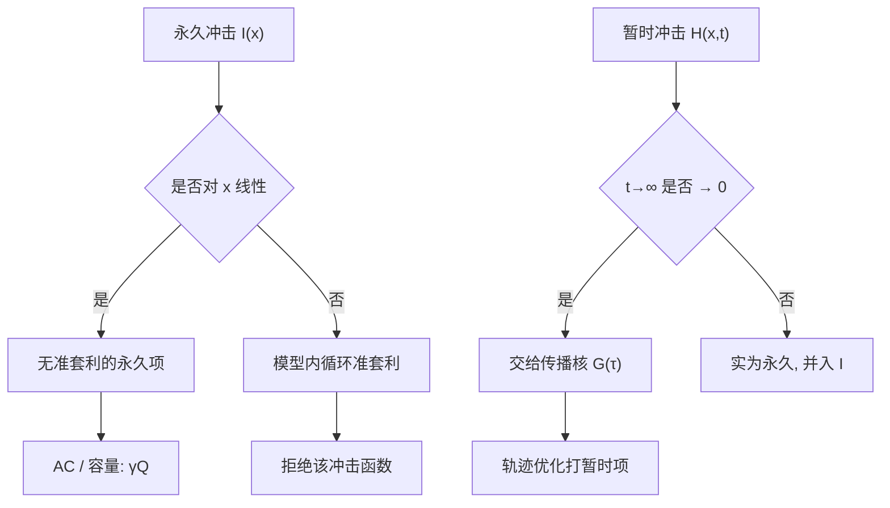

# Huberman–Stanzl 无套利冲击

    
若永久价格影响对数量非线性，交易者就可以用一来一回的循环操纵价格并抽取准套利；无操纵要求永久冲击是线性的，暂时冲击则必须衰减。

    <footer>—— Huberman and Stanzl, Price Manipulation and Quasi-Arbitrage, Econometrica, 2004</footer>

执行与容量模型几乎总要把「我买了多少」映射成「价格走了多少」。经验上这条映射常被写成平方根：母单越大，平均冲击上升，但边际冲击下降。Gur Huberman 与 Werner Stanzl（2004）问的不是拟合优度，而是：若所有人把同一条冲击函数当成价格形成规则，这条规则会不会自己变成一台印钞机。他们的答案是约束，不是估计：永久冲击必须对数量线性，暂时冲击必须随时间衰减到零，否则存在价格操纵与准套利。本篇把这条无套利条件写成对 [瞬时与永久冲击](/quant/temp-perm-impact) 函数形式的硬边界，并说明它如何与经验平方根、[Almgren–Chriss](/quant/almgren-chriss) 线性设定以及 [Gatheral 传播核](/quant/transient-impact-kernel) 衔接。它限制的是模型，不是市场保证没有人亏钱。

## 问题

把冲击写成确定性函数 $I(x)$：交易 $x$ 股使公允价格永久移动 $I(x)$，另有一项暂时偏离在交易结束后衰减。交易者可以选择任意可积的交易路径，包括买完再卖、把一笔大单拆成许多小单、或把许多小单合成一笔。若某条来回路径的期望利润严格为正、风险可以压到任意小，模型就允许准套利（quasi-arbitrage）；若一条有限回合的来回在期望上赚钱，就是价格操纵（price manipulation）。问题是：哪些 $I$ 与衰减规则排除这类路径。

非线性看起来无害。凹的永久冲击意味着「大单的平均冲击低于小单」，这与「潜在流动性被大单一次挖出」的叙事相近；凸则相反。Huberman–Stanzl 指出：一旦 $I$ 不是线性，交易者就可以用拆与合的不对称，在模型内部锁定价差。市场若真按这条 $I$ 出清，循环交易的期望利润不会被噪声抹掉——那不是 alpha，是模型会计漏洞。

### 操纵与准套利不是同一强度的禁止

操纵是一条有限回合、期望利润为正的来回：买 $Q$ 再卖 $Q$，或先卖后买。准套利更强：一列来回的期望利润无界增长，而每单位利润的风险趋于零。无准套利是比「无期望正利润来回」更紧的约束，因为它允许有风险的操纵被大数定律洗成近似无风险。论文的主定理用无准套利推出线性永久冲击；无操纵则要求暂时项不能被用来反复锁定尚未衰减的偏离。工程上两者应同时满足：优化器既不应建议洗盘式来回，也不应在重复执行同一非线性规则时积累模型利润。

「无套利冲击」不是说真实市场冲击已被证明线性。它说：若你把非线性永久项写进所有人共用的价格方程，该方程在模型里不是均衡。交易台可以在错误模型上算出「最优执行利润」；那是目标函数的漏洞，应视为模型错误。

## 方法

记永久位移为 $I(x)$，暂时项为 $H(x,t)$，成交后 $t\to\infty$ 时 $H\to 0$。无准套利要求存在常数 $\lambda$，使 $I(x)=\lambda x$（买卖对称时；不对称可写成左右导数在零处相接的线性）。证明的核心是齐次性：若 $I$ 严格凹，把数量 $Q$ 一次买进的永久位移小于把 $Q$ 拆成 $n$ 笔小单再合成时的位移之和（或反过来，取决于凹凸方向），于是存在先聚合、后拆分或先拆后合的来回，使卖出均价系统性地高于买入均价。线性是使「怎么拆都不改变永久位移」的唯一（在正则条件下）加性规则。

暂时项必须衰减。若「暂时」并不暂时，它就是另一截永久，应并入 $I$ 并重新接受线性检验。衰减可以是指数、幂律或其他可积形状，但极限必须回到只由 $I$ 决定的价格。Huberman–Stanzl 不指定衰减速度，只禁止不衰减；速度由 [传播核](/quant/transient-impact-kernel) 与微观结构恢复来填。

### 经验平方根应落在暂时项，而不是永久项

母单短fall 对 $Q$ 呈平方根，是执行文献的稳健事实，见 [线性与平方根冲击](/quant/sqrt-impact)。把它整段叫做永久冲击，直接违反线性。相容的写法是：永久 $\gamma Q$（线性），暂时对速率或对未衰减库存呈凹函数（平方根或幂次），母单窗口内观测到的总短fall 是两者之和。窗口越短，平方根越像「永久」；窗口拉长并减去市场因子后，留下的方向性位移更接近线性。校准应先固定窗口与对照，再估计 $\gamma$，而不是先把 $\sqrt{Q}$ 拟合到 $M_\infty-M_0$ 再讨论无套利。

Almgren–Chriss 的基准设定已经满足 Huberman–Stanzl：永久 $\gamma Q$、临时 $\eta v$。把临时改成 $|v|^\delta$ 而保持永久线性，仍可通过无准套利的永久部分；是否还有动态套利，要看衰减核，那是 Gatheral（2010）的问题。把 AC 的 $\gamma$ 改成 $\sqrt{Q}$ 的系数，则连静态来回都可能在模型里赚钱，优化器会建议自成交。

## 机制

线性永久冲击的机制含义是：追加一股对公允价格的写入与已经交易的数量无关。信息叙事里，这接近 Kyle 单期均衡：出清价对数量线性，斜率由噪声规模决定。存货叙事里，线性意味着风险转移的边际补偿不随已转移规模递减——否则先大后小与先小后大能锁定价差。真实市场当然可以有凹的**暂时**深度：可见簿是薄的，潜在流动性随后到来。凹发生在尚未恢复的那一层，恢复之后不应留下可被循环交易兑现的非线性。

准套利被排除的机制是会计恒等式，不是监管。模型若允许 $I(Q_1+Q_2)\neq I(Q_1)+I(Q_2)$，则拆与合改变的是标记价格，而不是外生信息。交易者在模型里不需要私有信号，只需要能下双向单。这与「用冰山隐藏意向」或「在拍卖里提供流动性」不是一类行为：后者消耗真实风险与价差；前者在错误的 $I$ 下消耗的是纸面。把优化器的来回建议当成可执行 alpha，会在真实市场里付两边价差，并可能触发自成交与洗盘规则。

### 与容量、轨迹优化的分工

永久线性项 $\tfrac12\gamma Q^2$（成本对数量的积分）在给定母单总量时与路径无关：你改变 [TWAP / VWAP / POV](/quant/twap-vwap-pov) 或 AC 轨迹，省不下这一项。容量由它主导：AUM 放大时 $Q$ 放大，$\gamma Q$ 改写公允价，[净边缘](/quant/net-edge) 被永久项压过零。轨迹优化主要打暂时项与方差。因此「无套利要求永久线性」并不否定平方根执行成本，它只禁止把平方根写进 $M_\infty$。报告容量时若只用暂时平方根，会显得还能靠拆单扩规模；把线性永久补上，最优 AUM 通常立刻变紧。

买卖不对称的线性——买的 $\lambda_+$ 大于卖的 $\lambda_-$——在样本期内很常见，往往是漂移或 alpha 被算进冲击。无套利约束要求的是对**数量**线性，不是要求买卖斜率相等。斜率差应先用对照股票或市场因子去掉，再解释为结构性不对称。

## 边界与工程取舍

定理依赖：交易者可以双向交易任意小的切片、暂时项最终衰减、没有买卖价差截距与自成交禁止、价格方程对所有人相同。真实市场有价差、最小变动价位、涨跌停、禁止洗盘，非线性 $I$ 未必能被兑现为准套利。不能反过来推断「所以可以用非线性永久」：优化器仍然会在无摩擦的连续近似里钻漏洞，路径会变得不可审计。正确做法是在连续模型里保持线性永久，把凹性留给暂时核与离散约束。

不要用「我们观测到平方根永久」来否定 Huberman–Stanzl。先问 $M_\infty$ 的 $\infty$ 有多长：十分钟的中点几乎总含未衰减暂时项；一日后的中点含宏观噪声。对照、买卖对称、子样本稳定性缺一则不能声称拒绝线性。不要在宣传材料里把 $\sqrt{Q}$ 叫做市场冲击定律、在风险系统里又用线性 Kyle $\lambda$——两套 $I$ 对同一母单给出不同的容量与不同的操纵空间。

A 股涨跌停使连续 $I$ 在锁定板上未定义：数量继续堆积，价格不再移动，表面是无限凹，其实是配给。此时无套利约束应改写到下一可成交拍卖，而不是在停板上拟合 $I(x)$。暗池与中银的成交没有公开中点，永久项的识别更弱，更不应把非线性写进生产模型。

自成交与对倒在交易所规则里通常被禁止或忽略。模型若靠自成交来实现准套利路径，该路径在生产里不可用；若靠与他人成交来实现，则你面对的已不是自己的 $I$，而是含他人流量的价格。Huberman–Stanzl 约束的是「冲击函数作为定价核」这一用法，不是教人设计来回单。

## 小结

- Huberman–Stanzl（2004）从无准套利推出：永久冲击必须对数量线性，暂时冲击必须衰减。
- 非线性永久项允许拆与合不对称的来回在模型内锁定价差；那是会计漏洞，不是可交易 alpha。
- 经验平方根应写在暂时项或未充分衰减的窗口里，不宜整段当作 $M_\infty-M_0$。
- Almgren–Chriss 的线性永久加临时速率项满足该永久约束；把 $\gamma Q$ 改成 $\sqrt{Q}$ 会破坏它。
- 给定总量，线性永久成本与路径无关，主导容量；轨迹优化主要减少暂时项与方差。
- 价差、涨跌停与禁止自成交使真实市场未必兑现模型准套利，但不能作为生产模型使用非线性永久的理由。
- 出处：Huberman and Stanzl, *Price Manipulation and Quasi-Arbitrage*, Econometrica, 2004；对照 Gatheral, *Quantitative Finance*, 2010；Almgren and Chriss, *Journal of Risk*, 2000/2001。
