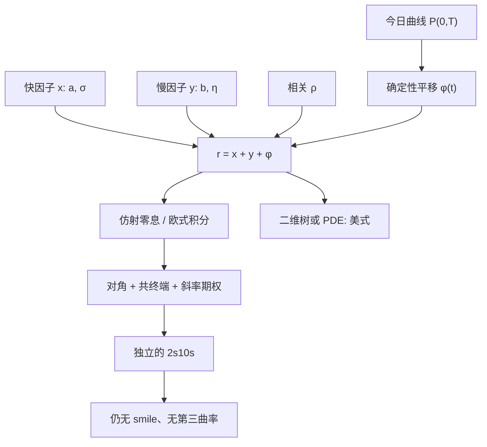

# Hull-White 两因子

给短端再加一个均值回复因子，曲线就不再只能沿一条久期权重变形；欧式债券仍仿射，斜率与部分共终端 swaption 才进得了同一棵格子。

<footer>—— Hull & White, Numerical Procedures for Implementing Term Structure Models II: Two-Factor Models, Journal of Derivatives, 1994</footer>

[一因子 Hull-White](/quant/hull-white) 用 $\theta(t)$ 锁住今日整条曲线，状态却只有瞬时短端 $r_t$。对贴现类香草这往往够用；对 2s10s、CMS 陡峭化和许多共终端 Bermudan，一维马尔可夫把斜率风险错写成平行风险。[LMM](/quant/lmm) 能把每个远期写成自己的坐标，但美式要回归，计算比低维树贵一个数量级。Hull 与 White（1994）把第二个 Ornstein–Uhlenbeck 因子加进短端，使瞬时曲线获得独立的斜率模态，同时保留高斯仿射：零息债仍是状态的指数线性函数。实务里更常见的等价写法是 Brigo–Mercurio 的 G2++——两个高斯因子加确定性平移拟合曲线。本篇写两因子相对一因子究竟多了什么、欧式公式如何改、二维树在哪里失效，而不再推导一因子的 $\theta(t)$。

## 问题

交易台要同时满足三件事：今日互换与期货重新定价到市场；短端与长端可以相对运动；美式取消仍能在格子或低维 PDE 上做动态规划。一因子只交出前一件。主成分里第二模态是斜率，第三才是曲率；一因子 Hull–White 的冲击在到期轴上按 $B(t,T)=(1-e^{-a(T-t)})/a$ 衰减，形状被 $a$ 钉死，2s10s 的模型对冲比几乎是两个平行久期之比，和市场报价对不上。

问题因此不是「再加一个 $\sigma$」，而是选一个仍马尔可夫、仍能拟合 $P(0,T)$ 的二维状态。两个均值回复速度 $a\neq b$ 时，冲击在短端与长端的衰减不同，瞬时远期的协方差就能产生斜率。相关 $\rho$ 决定两个因子是同向抬曲线还是一上一下拧斜率。若把 $\rho$ 设成 1 且 $a=b$，模型退化回一因子。选两因子，等于承认一因子树给 Bermudan 的数可以用，给 CMS 斜率的数不能用——这正是一因子文已经划开、这里要落地的那条界。

### 一维状态如何把 2s10s 绑死

对一因子，$P(t,T)=\exp\bigl(A(t,T)-B(t,T)r_t\bigr)$。任意两个到期的收益率是 $r_t$ 的仿射函数，相关系数在模型内为 1（忽略凸性的确定性差）。于是 10Y 互换利率与 2Y 互换利率几乎完全相关，CMS 10s2s 的波动被压成两个凸性调整之差，而不是真正的斜率波动。校准若只看对角 ATM swaption，残差会被 $a$ 吃掉，$a$ 每天跳，对冲出现虚假的回复速度风险。两因子把「短因子」和「长因子」分开，相关可以小于 1，2s10s 才有独立的 vega。

两因子仍然是高斯短端。它解决的是曲线模态个数，不是 smile，也不是负利率。把 $\rho$ 调到能拟合历史 2s10s 相关，并不自动拟合 swaption 立方的翼部；翼部仍要位移、局部波动或直接换 [LMM](/quant/lmm)。

## 方法

G2++ 把瞬时短端写成

$$
r_t = x_t + y_t + \varphi(t),
$$

其中

$$
\mathrm{d}x_t = -a x_t\,\mathrm{d}t + \sigma\,\mathrm{d}W_t^{(1)},\qquad
\mathrm{d}y_t = -b y_t\,\mathrm{d}t + \eta\,\mathrm{d}W_t^{(2)},
$$

$\mathrm{d}W^{(1)}\mathrm{d}W^{(2)}=\rho\,\mathrm{d}t$，$\varphi(t)$ 由今日 $P(0,T)$ 唯一确定，作用与一因子的 $\theta(t)$ 相同：吸收曲线与高斯凸性。Hull–White 原文的两因子常写成短端加随机长期均值，或对 $r$ 与其均衡水平耦合；在仿射高斯族里与 G2++ 可互译，工程上按哪套状态做树或 Monte Carlo 即可，不要把「HW2F」和「G2++」当成两个不能对账的模型。

零息债对 $(x,y)$ 仍仿射：

$$
P(t,T)=\exp\bigl(A(t,T)-B_x(t,T)x_t-B_y(t,T)y_t\bigr),
$$

$B_x=(1-e^{-a(T-t)})/a$、$B_y$ 类似。欧式零债期权有二维正态积分；Jamshidian 在一因子下把 coupon 债期权拆成零债期权，两因子一般不再成立，欧式 swaption 用二维积分或冻结近似。美式：二维三叉或有限差分，状态是 $(x,y)$，曲线拟合仍由 $\varphi$ 在每层保证。

### 校准对象：对角、共终端与斜率

参数 $(a,b,\sigma,\eta,\rho)$ 加上可能的分段 $\sigma(t),\eta(t)$。典型分层：$\varphi$ 完全服务曲线；回复速度先按期限结构经验值或 swaption 衰减锁住，再在小范围内微调；波动与相关用一批欧式 swaption。若只用对角 ATM，两因子的额外自由度会被 $\rho$ 与 $\eta$ 的权衡耗掉，斜率产品仍然不准。应明确加入 2s10s、10s30s 一类曲线期权，或至少加入不同到期的共终端 swaption，让第二因子有可识别的价格。Bermudan 的共终端校准与 [百慕大互换期权](/quant/bermudan-swaption) 同一纪律：先钉住欧式边界，再谈早行权溢价。

分段波动能贴更密的立方切片，但二维树上 $\sigma(t)$ 剧烈跳动会让节点概率和 $\varphi$ 振荡。Monte Carlo 对分段更宽容，早行权则要 [Longstaff-Schwartz](/quant/longstaff-schwartz) 回归，与一因子树的误差结构不同，对账必须分项：曲线、欧式、早行权、斜率。

## 机制

机制是协方差期限结构。因子 $x$ 回复快，主要打短端远期；$y$ 回复慢，打长端。瞬时远期 $f(t,T)$ 对两个布朗的载荷是 $e^{-a(T-t)}\sigma$ 与 $e^{-b(T-t)}\eta$。于是

$$
\mathrm{cov}\bigl(\mathrm{d}f(t,T_1),\mathrm{d}f(t,T_2)\bigr)
$$

不再是单一指数核，短–长相关可以低于短–短相关。这与 [曲线 PCA](/quant/curve-pca) 的前两主成分同构：第一模态仍偏平行（$\rho$ 接近 1 且两载荷同号时），第二模态是斜率。$\rho\lt 0$ 时两因子对冲，平行波动下降、斜率波动相对上升——标定 2s10s 时常用这一区域，但瞬时短端方差 $\sigma^2+\eta^2+2\rho\sigma\eta$ 必须保持为正，且与短端 caplet 不冲突。

高斯使折现因子的积分仍高斯，这是欧式可算的原因，也是负利率与过薄尾的来源。两因子只是让「哪一段曲线动」更真实，并不让极端路径的折现分布变成市场隐含的微笑。对冲上，模型内希腊值是对 $x,y$ 的偏导，报告仍应映到关键利率：扰动 $P(0,T)$ 的输入点、重算 $\varphi$、重定价。两因子下关键利率不再共线，2s10s 对冲比才有模型内意义；曲率（飞）仍然不足，需要第三因子或直接用 HJM/LMM。

$\varphi(t)$ 与一因子的 $\theta(t)$ 一样不是货币政策路径，里面含两因子的凸性。把 $\varphi$ 画成「隐含短端加斜率预期」再讲宏观，会把 Jensen 项讲成曲线交易观点。

### 二维树何时不如模拟

状态二维时，三叉的节点数按时间层二次增长，重组仍可能，但均值回复方向与相关会使概率掉出 $[0,1]$，需要改中心或改步长。障碍、取消日与 CMS 定盘若再叠加路径依赖票息，树的状态还要加路径变量，三维以上通常放弃。实务分工：可取消互换、债券式取消、中等维度的 Bermudan 用二维 HW/G2++ 格子或 PDE；CMS 陡峭化、需微笑的翼部、多曲线基差，用 LMM 或复制，见 [CMS 凸性](/quant/cms-convexity)。不要因为「已经两因子」就认为 CMS 10s30s 的模型价格可执行。

## 边界与工程取舍

不要用两因子去解释 caplet smile：高斯没有执行价方向的波动差异。不要把历史 PCA 的因子载荷直接当成 $(\sigma,\eta,\rho)$——测度不同，且 PCA 第三因子的曲率在两因子里不存在。不要在贴现 OIS 与预测 LIBOR/SOFR 上共用一对 $(x,y)$ 却不声明基差冻结；多曲线下至少贴现曲线用 G2++，预测曲线另套或加确定性基差。负利率政策期高斯是优点；合同禁止负值时要位移或换 CIR++ 类，后者失去部分欧式封闭式。

校准过度参数化（逐日自由的 $\sigma(t),\eta(t),\rho(t)$）会把立方残差吸进因子波动，Bermudan 的早行权对冲第二天就失效。应约束回复速度缓慢变动，把残差记成模型风险。与一因子相同：输入远期必须光滑，否则 $\varphi$ 的尖刺通过二维节点放大到取消权价格。

Hull–White 两因子与高斯两因子 HJM 在适当波动结构下连续等价：短端马尔可夫是 HJM 核取两个指数衰减时的特例。报告应写清实现是二维短端格，还是远期曲线模拟；离散后并不自动等价。

## 小结

- 两因子 Hull–White / G2++ 在锁住今日曲线的前提下增加独立斜率模态，短端仍是高斯仿射。
- 欧式零债期权可二维积分；Jamshidian 分解一般不再成立；美式用二维格或回归模拟。
- 校准必须给第二因子可识别的价格，通常是共终端 swaption 与 2s10s，而不是再拟合一条对角 ATM。
- 它补的是一因子「关键利率共线」的缺陷，不是微笑、负利率禁令或曲率飞。
- CMS 斜率、翼部与多曲线基差仍常要 LMM 或复制；两因子树的正当用途是贴现类取消权与中等维度 Bermudan。
- 出处：Hull & White, *Journal of Derivatives*, 1994；G2++ 写法见 Brigo & Mercurio, *Interest Rate Models*, 以及一因子原文 Hull & White, *Review of Financial Studies*, 1990。
