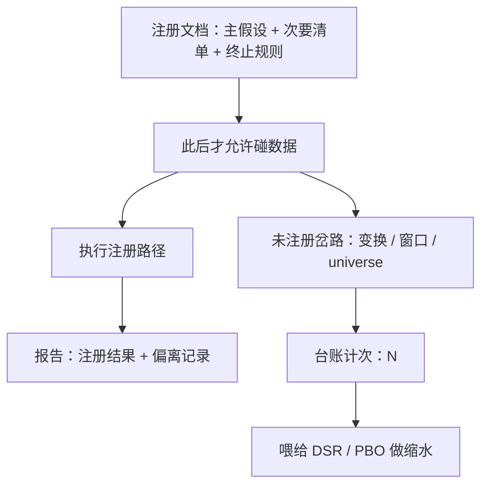
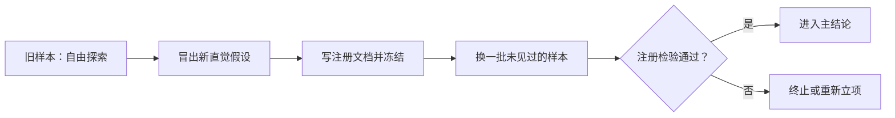

# 假设与预注册

第一原则是不要欺骗自己——而你自己恰恰是最容易被骗的人。

<footer>—— Feynman, "Cargo Cult Science", 加州理工学院毕业典礼演讲, 1974</footer>

[上一课](/quant/research-question-origination)把观察收成带拒绝条件的可检验问题，并用经济逻辑、可证伪、成本可行三道闸立项。本课把立项变成合同：主假设、次要假设、终止规则，全部写在碰数据之前。立场是[过拟合次数与试错](/quant/backtest-overfitting)的推论——错误不在试错，而在试错不计次；预注册就是计次装置。

## 问题

从「问题成立」到「写出回测」之间隔着几十个自由度：universe 怎么划、样本从哪年起、持有期取二十天还是六十天、SUE 的预期盈利用哪种模型、要不要中性化、成本假设取宽取紧。每个选择都是一个试验位。Gelman 与 Loken 的「分岔小径」说得更狠：即便你没有恶意挖参，只要选择是看完数据后做出的，整棵决策树就都参与了检验，而报告里只写了走通的那条枝。[多重检验与 p-hacking](/quant/multiple-testing-factors) 解释这为何抬高假阳性，[Probability of Backtest Overfitting](/quant/pbo) 解释它如何精确毁掉「选最优变体」这件事。缺口不是「更小心」，而是把选择搬到数据之前并留痕。

「自由度」在统计里本指能独立变动的量的个数，这里借指研究者能自由拍板的每一个设置。初学者容易以为只有「换个参数重跑」才算多次试验，实际上换一个样本起点、换一种中性化方式，同样等价于多检验了一次——每个选择都在消耗同一份运气的额度。

## 方法

注册文档在碰数据前冻结，最少四个字段。**主假设**：方向、检验统计量、显著性门槛（按家族口径定，不是每次单独 0.05）、样本期、universe 与排除规则、再平衡频率与成本假设。**次要假设清单**：允许探索，但逐条标注「探索性」，不得进入主结论。**终止规则**：主假设在样本外不成立即终止，不许「换一个变换再试一次」——这是研究者自己的止损线，量化研究的沉没成本错觉比交易里更凶。**偏离记录**：任何与注册文档不符之处写入台账，不悄悄改。

「按家族口径定门槛」是什么意思：把一族相关检验捆在一起控制误报率。数字实例：若族里有 10 次近似独立的检验，想让「至少一次误报」的概率仍压在 5%，单次门槛就得用 Bonferroni 收紧到 0.05 ÷ 10 = 0.005，对应 t 临界值约 2.8——这正是逐次用 0.05（t=2）看似显著、实则大半是噪声的原因。

对 PEAD 案例，主假设一次写完：SUE 十分组多空（多最高组、空最低组），行业与市值中性，公告后六十个交易日持有，月度滚动，成本按[买卖价差成本](/quant/spread-cost)的历史中位数加冲击，门槛取家族校正后的 t。

### 注册文档喂给下游什么

预注册不是道德姿态，它产出下游统计的输入：**试验次数 N**。[Deflated Sharpe](/quant/deflated-sharpe) 要拿 N 与各次试验 Sharpe 的方差做缩水；[CSCV 组合对称交叉验证](/quant/cscv)与 PBO 要回答「选中的变体是不是运气最好的那个」。N 从注册文档与偏离记录里来。没有预注册，N 就是「不记得试了多少次」，一切修正量失效——这是预注册与多重检验纪律的接口。

Harvey、Liu 与 Zhu 数过顶刊与工作论文里被当作异象提出的因子：三百多个。他们建议新异象的 t 门槛至少 3.0——t=2 的名义门槛属于「一篇文献只检验一个假设」的旧世界。

## 机制

机制上，预注册改变的是**选择与信息的时间顺序**。数据之后的选择以数据为条件，独立性破产，报告的 p 值不再指向假设本身；数据之前的选择与噪声无关，检验才有效力。终止规则把「再试一次」的成本显式化：每次偏离记账为 N 加一，而 N 加一直接抬高下一轮修正的门槛。注册文档因此是可审计的——偏离必须留痕，审计者或半年后的你能重建整棵决策树。

## 边界

预注册不担保假设正确，只担保检验诚实；坏问题注册一万次也是坏问题。探索性研究合法且必要——新直觉大多来自看数据——但探索与确认必须分开：探索的出口是下一个**新样本上的注册**，不是同一个样本上的更好故事。机构里执行靠两件东西：模板（空字段比忘字段更容易被发现）与代码冻结（[XAlpha：假设到代码](/quant/xalpha-hypothesis-code)那种把假设句直接映射成实现的口径）。也别把注册当圣旨：发现实现错误就修，修了就记——纪律针对的是隐瞒，不是迭代。

「代码冻结」指注册文档定稿的同时，实现代码也锁定版本，之后只许修 bug、不许改策略。为什么重要：若文档冻结而代码还能随手改，研究者的自由度只是从参数搬进了代码里，计次装置等于被整个绕过——台账里记的 N 就不再覆盖真实发生过的试验。

探索的出口是新样本上的再注册，而不是旧数据上的更好故事——上图正是这条合法循环。

## 小结

- 预注册把研究自由度搬到碰数据之前并留痕，本质是给试错计次。
- 四件套：主假设（含门槛与成本假设）、次要探索清单、终止规则、偏离记录。
- 注册文档的产出 N 是 DSR / PBO 的输入；没有 N，修正全部作废。
- 探索合法，但出口是新样本上的再注册，不是同一数据的更好故事。
- 出处：Feynman (1974)；Gelman and Loken (2013)；Nosek et al. (2018) 对预注册运动的综述；Harvey, Liu and Zhu (2016)。
