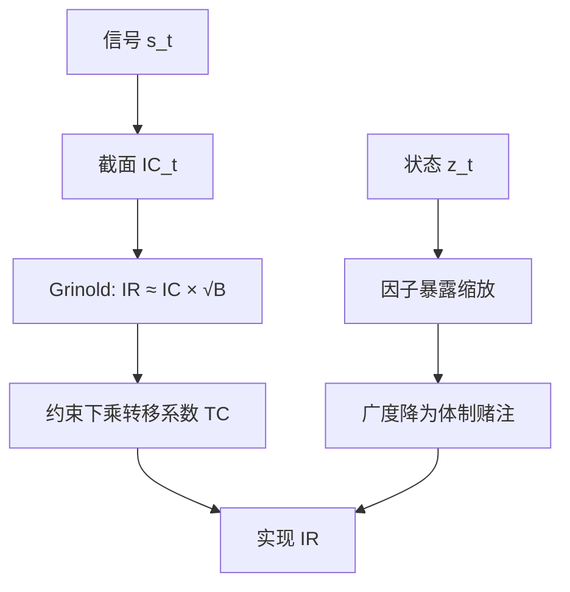

# IC / IR 与因子择时

主动管理的信息比率约等于信息系数乘以广度的平方根；你能同时下多少个独立赌注，比把单一预测做得多准更常决定结果。

<footer>—— Grinold, The Fundamental Law of Active Management, Journal of Portfolio Management 1989</footer>

截面因子研究习惯报告一个全样本多空夏普，或一个平均信息系数（information coefficient, IC）。Grinold（1989）把主动管理的信息比率（information ratio, IR）收成一条可检验的分解：预测力乘以独立赌注的数量。这条公式后来被 Grinold 与 Kahn 写成教科书，并被 Clarke、de Silva 与 Thorley 补上转移系数，以容纳约束。因子择时问的是另一件事：当 IC 或因子溢价随时间变号时，要不要把暴露做成状态的函数。择时看起来像提高 IC，实质是在消耗广度——用一次体制赌注替换许多证券赌注。本篇写 IC/IR 的对象、测量，以及择时如何改写基本定律。

## 问题

记 $t$ 期可交易信号为 $s_{i,t}$，随后收益为 $r_{i,t+1}$。截面 IC 是二者的相关，常用 Spearman 秩相关以免被极端值绑架。Grinold 的基本定律在理想条件下给出

$$
\mathrm{IR}\approx\mathrm{IC}\times\sqrt{B},
$$

其中广度 $B$ 是独立预测的个数。股票选择的 $B$ 可以接近有效股票数（再扣掉行业、市场等共同因子后的残差维数）；择时市场或择时单一风格时，$B$ 往往接近 1。同样的 $\mathrm{IC}=0.05$，在 $B=200$ 时 IR 可观，在 $B=1$ 时只是噪声。问题因此不是「IC 高不高」，而是：**这份预测力对应多少独立赌注，以及你是否用择时把赌注并成一笔。**

IR 本身是主动收益对主动风险之比，对应残差、相对基准或多空组合，须事先写清。用总波动当除数，会把市场暴露算进「信息」，和 Grinold 说的主动管理不是同一对象。IC 必须相对信号可获得之后的收益，同期相关是泄漏，见 [因子衰减与换手](/quant/factor-decay-turnover)。

### 截面 IC 与时间序列 IC 不是同一个数

截面 IC 在每个日期上对股票求相关，再对日期取均值，度量的是「今天谁该比谁涨」。时间序列 IC 对单只资产把信号与未来收益求相关，度量的是「这只股票该不该买」。因子溢价的择时常用后者：预测价值因子下月的多空收益。两者可以同时为正、一正一负，或一个稳定一个剧烈波动。把截面平均 IC 当成择时信号的精度，会高估你对因子收益路径的把握。

Grinold 的 IC 是预测与实现的相关，不是回归系数。回归斜率还含信号与收益的波动比。把原始描述子直接当 IC，等于把量纲不同的价值、动量混在同一张表里。应先横截面标准化，或明确报告的是秩相关。

## 方法

**测量 IC。** 每日（或调仓日）计算 $s_{t}$ 与 $r_{t+1}$ 的截面相关，得到序列 $\mathrm{IC}_t$。报告均值、标准差、t 统计量（Newey–West，因 IC 有序列相关）、以及 $\mathrm{IC}(h)$ 期限结构。行业、市值中性后的 IC 才对应你真正交易的残差信号。样本切开发表前后，以免把 [多重检验](/quant/multiple-testing-factors) 做出的均值当成可重复的 IR。

**从 IC 到 IR。** 无约束、且残差近似不相关时，基本定律够用。有权重上限、多空限制、换手惩罚时，实现 IR 会打折。Clarke、de Silva 与 Thorley（2002）引入转移系数 $\mathrm{TC}$：

$$
\mathrm{IR}\approx\mathrm{TC}\times\mathrm{IC}\times\sqrt{B},
$$

$\mathrm{TC}$ 是最优化权重与理想主动权重的相关，介于 0 与 1。约束越紧、成本越高，$\mathrm{TC}$ 越低。工程上不要用全样本夏普去除以 $\sqrt{B}$ 去反推 IC，那会把约束、成本与运气一齐折进「预测力」。

**因子择时。** 用状态变量 $z_t$ 缩放因子暴露：$w_t=\bar w\cdot f(z_t)$，其中 $z_t$ 可以是估值离散度、信用利差、已实现波动，或过去一段时间的 $\mathrm{IC}_t$。这是 [条件 CAPM](/quant/conditional-capm) 与 [宏观状态变量](/quant/macro-state-variables) 在主动组合上的操作版：不是改定价模型，而是改风险预算。检验必须是真实前视：只用 $t$ 时刻可得的 $z_t$ 决定 $t+1$ 的权重，并报告相对恒定暴露的增量 IR，而不是只报告「择时开启」时的全样本夏普。

### 广度先被共同因子吃掉

名义股票数不是 $B$。市场、行业、市值会让残差相关，有效广度远小于 $N$。统计风险模型或基本面风险模型把共同因子抽走之后，残差 IC 对应的 $B$ 才接近定律里的那个。择时若加在因子组合一层（对整个价值多空加杠杆），消耗的是因子维的广度，与底下几百只股票的残差广度不是同一账户。两层可以同时做，但 IR 不可简单相加：择时误差会通过杠杆放大因子本身的拥挤与回撤，见 [因子拥挤](/quant/factor-crowding)。

## 机制

基本定律来自主动权重与 alpha 的最优配置。若预测误差横截面不相关、风险齐次，最优主动权重正比于 IC 乘以标准化分数；组合 IR 于是随 $\sqrt{B}$ 升。IC 进入的是相关而不是均值：同样的排序，收益波动大时 alpha 的绝对量更大，但主动风险也更大，IR 仍由相关锁定。这就是为什么横截面标准化分数加 IC 比「原始因子值」更接近 Grinold 的对象。

择时改变的是 $B$ 与 IC 的时间结构。若真 IC 随体制在 $0.08$ 与 $-0.02$ 之间跳，恒定暴露等于把正负预测平均掉，全样本 IC 被压低；完美择时等于只在正 IC 体制下注，有效 IC 上升，但赌注次数下降。现实里体制识别有误差。Hamilton 型概率若噪声很大，你是在用一个低 IC 的择时信号去乘原来的因子——乘积的期望 IC 可以低于恒定暴露。机制上，择时是**用估计出来的时变替代广度**，不是免费的第二层 alpha。

Qian 与 Hua（2004）强调：基本定律把 IC 当常数。IC 的波动会进入主动风险，使实现 IR 低于 $\mathrm{IC}\sqrt{B}$。因子择时若用短窗 IC 当信号，等于把 IC 波动本身当成可交易对象，通常会把这条缺口拉得更大。

### 衰减、换手与择时叠在同一条 IR 上

[衰减](/quant/factor-decay-turnover) 决定持有期，换手决定成本，择时决定暴露路径。三者同时优化等于对频率、阈值、状态变量做三重搜索，t 值不可按单次回归读。预指定一条规则：例如月频再平衡、只用期初估值分位缩放暴露、带宽预先写死，然后报告相对恒定暴露的样本外增量。否则「择时提高了 IR」只是样本内对 $f(z)$ 的拟合。

## 边界与工程取舍

基本定律假定预测误差不相关、IC 稳定、无成本。A 股涨跌停、停牌、行业集中会进一步降低有效 $B$ 与 $\mathrm{TC}$。用日频截面 IC 的 t 值去替月频产品做容量承诺，频率不匹配。因子择时对状态变量的选择极度敏感：同一价值因子，用离散度择时与用信用利差择时，路径可以反号。Asness（2016）把因子择时称作海妖歌声：长期溢价主要来自持续暴露，择时的样本外纪录远弱于故事。

不要把滚动夏普当择时信号而不做成本与延迟。不要在因子已经拥挤、IC 均值接近零时，指望用波动目标或 IC 滤波把它救活——那往往是在择时噪声。IR 的分母若改用下行偏差或最大回撤，排序会变，须在产品约束里预先声明，而不是事后换一种「更好看」的比率。

报告 IC 应同时给均值与波动。只有均值的 IC 表无法判断定律是否被 IC 时变破坏，也无法判断择时有没有对象。一个均值 0.03、标准差 0.15 的日 IC，和均值 0.03、标准差 0.04 的月 IC，对 IR 与择时含义完全不同。

## 小结

- Grinold（1989）的基本定律把 IR 写成 IC 与广度平方根的乘积；择时用一次体制赌注替换许多证券赌注，先改 $B$ 再改 IC。
- 截面 IC 与时间序列 IC、因子溢价路径不是同一对象；用前者的均值去证明后者可择时，会高估精度。
- Clarke–de Silva–Thorley 的转移系数把约束与成本折进定律；无约束反推的 IC 不是可交易预测力。
- IC 时变会抬高主动风险，使实现 IR 低于常数 IC 公式；短窗 IC 滤波往往加重这一点。
- 择时规则必须前视、预指定，并报告相对恒定暴露的增量；长期因子溢价主要来自持续暴露。
- 出处：Grinold, *The Fundamental Law of Active Management*, Journal of Portfolio Management, 1989；Grinold and Kahn, *Active Portfolio Management*；Clarke, de Silva and Thorley, *Portfolio Constraints and the Fundamental Law of Active Management*, Journal of Portfolio Management, 2002。
