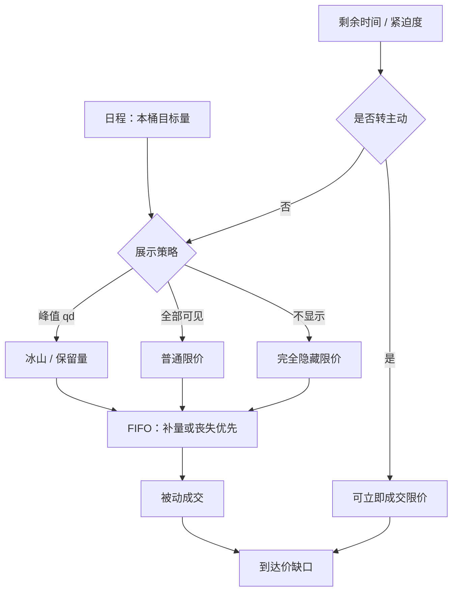

# 冰山与隐藏单

    
展示数量是策略的一维：把母单的可见峰值缩小，换的是更少的深度泄露，以及补量时常常丧失的时间优先；隐藏不是把冲击定律关掉，更不是伪造深度。

    <footer>—— 据 Harris, Trading and Exchanges 对展示、保留量与隐藏指令的论述；对照交易所冰山 / 保留量的公开规则</footer>

[上一课](/quant/auction-execution)把开收盘竞价写成一次性出清，执行变量是配额与限价，不是连续速率 $v_t$。缺口回到连续限价：母单在明簿上如何选择显示量、如何补量。冰山把总量切成峰值，可见深度保持约 $q_{\mathrm{d}}$，其余隐藏——减少展示、承担队列惩罚、接受填成率下降。[订单类型](/quant/order-types) 已写接口；本课写作为执行算法的冰山。不重写竞价可撤/不可撤分段。展示是权衡：可见深度便于被发现并成交，也便于被推断意向。

## 问题

连续限价把 $Q$ 一次挂在某价，簿上出现一块可见深度，他人的 OFI、深度图与抢跑激励随之改变；自己也获得该价位的时间优先（若排在队尾则优先有限）。把 $Q$ 切成峰值 $q_{\mathrm{d}}$ 的冰山，可见深度保持约 $q_{\mathrm{d}}$，其余隐藏。问题是选 $q_{\mathrm{d}}$、限价与改价规则，使到达价缺口可接受。$q_{\mathrm{d}}$ 过大，泄露接近普通大单；$q_{\mathrm{d}}$ 过小，每次补量重新排队，[成交概率](/quant/fill-probability)下降，完成时间拉长，时机风险上升。完全隐藏单更极端：该价位显示量不包含你，对他人的不平衡信号是一种污染，对自己则几乎没有被「看见而被动成交」的广告效应。

制度细节决定代价函数。许多市场规定：峰值耗尽后从隐藏余量补出的新显示块视为新到达，排到同价队尾。有的市场允许随机化峰值，避免固定台阶成为公开签名。有的市场隐藏量是否参与集合竞价、是否计入某些统计，答案不同。名称相同，状态机不同；参数不能跨交易所复制。

### 冰山不是暗池，也不是探测对象的镜像

暗池是场所，事前不展示报价，匹配常钉中点。冰山仍在明簿的价格–时间队列里，价格是你的限价，优先规则仍适用，只是显示字段小于总量。探测文章从公开成交路径推断隐藏；执行文章决定自己如何使用隐藏字段。两者共用微观结构，决策方向相反：一个是测量误差，一个是自身订单类型。把探测算法「反过来」写成执行，既不是冰山的定义，也超出合法展示策略的范围。本篇只讨论自己申报冰山 / 隐藏限价时的填成、冲击与队列，不讨论如何识别并抢他人隐藏余量。

保留量（reserve）与完全隐藏（hidden）在部分规则里费用、优先、是否显示于深度档位均不同。TCA 必须用交易所实际类型，不能都叫「冰山」。

## 方法

把冰山嵌进日程：TWAP / VWAP / 到达价决定**何时**在某价附近需要被动量，冰山决定**该价上展示多少**。每片目标量 $q_i$ 仍受[参与率封顶](/quant/participation-cap)约束；冰山不提高 $p_{\max}$，它只改变可见深度路径。峰值 $q_{\mathrm{d}}$ 可取固定股数、固定相对 ADV 的比例、或与该档已有显示量成比例以免自己成为该档的全部可见供给。随机化峰值（在区间内抽）降低固定台阶的可预测性，是展示策略，仍须符合交易所对随机化的允许范围。

填成模型要把「峰值耗尽 → 重新排队」写进状态：自己在该档的位置 $x$ 在每次补量后跳回队尾（若规则如此）。成交强度于是低于同等限价、全部显示、且保持队头附近的单。Lo–MacKinlay–Zhang 一类执行时间模型应加协变量「是否冰山 / 峰值大小」。评价被动腿用：相对到达中点的价差收益、填成率、补量次数、以及成交后短窗漂移（是否仍被逆向选择）。不要只用「看不见所以冲击为零」——主动吃你峰值的人仍然在成交打印里看到流量。

$$
q_{\mathrm{disp}}(t)= \min\bigl(q_{\mathrm{d}},\,Q_{\mathrm{remain}}(t)\bigr),\qquad
\text{补量后 } x\leftarrow x_{\mathrm{tail}}\ \text{（若规则规定新到达）}.
$$

改价：价格离开你的限价时，整段隐藏余量失效或需改单。改单在许多市场等于撤加挂，冰山的隐藏部分一并失去优先。高频改价会把冰山变成短寿命报价，填成更差，且提高撤单速率；这是存货管理，应有改价带宽，而不是逐 tick 追随。

### 与普通限价、市价切片如何组合

典型合法组合：日程给出本桶数量；能在价差内被动完成的部分用冰山或普通限价；剩余时间紧张或深度不足时，用可立即成交限价吃对手方，见订单类型一文的 make / take。冰山不替代市价：它不保证在 $T$ 前完成。到达价算法若把未完成惩罚写进目标，临近 $T$ 应降低隐藏比例、提高可立即成交份额，与 OW 期末不再等待弹性同构。开收盘竞价是否允许冰山、隐藏量如何参与出清，必须查品种规则；不能假设连续时段的冰山逻辑自动进入集合竞价。

多账户、多券商同时在同价位挂相似峰值，会在公开簿上制造可统计的台阶，提高被推断的概率。这是拥挤下展示策略的外部性，不是鼓励去读他人台阶。自家风控应限制同价可见峰值的账户合计，以免内部互抢队尾补量。

## 机制

展示机制：可见深度是广告，也是意向泄露。冰山切断「量」这一维的大部分广告，留下「这个价位还有一点供给」。补量机制把时间优先反复卖掉：你为了藏量，把 FIFO 名次重置。逆向选择机制并不消失——更优的限价仍然更容易被知情者捡走；藏的是规模不是方向。对他人而言，隐藏供给使 L2 不平衡与深度冲击模型产生测量误差，市场质量文献把它当作透明度的代价；对自己而言，误差是你选择的。

冲击机制：被动成交仍可能留下永久项，因为成交打印与存货被写入价格。临时冲击通常低于同等数量的市价扫描，因为没有主动打穿多层；但若补量节奏与他人主动单同步，看起来仍像持续的单向流。把母单几乎全部改成极小峰值的冰山，完成时间拉到 $T$ 之外，缺口从冲击项挪到机会成本项，总 IS 不必改善。

### 峰值、队列与撤单速率

峰值小则补量频繁，消息率上升，订单寿命呈一串短片段。这会进入[撤单速率](/quant/cancel-rate)的市场级统计，但动机是展示管理，与闪烁诱单不同：冰山的总量意向在指令内存续，峰值耗尽后系统补量，而不是报出不可成交的深度再立刻全撤。监管与学术讨论 quote-to-trade 时，应把保留量的系统补量与人为闪烁分开——数据上需要订单编号与类型字段；没有字段时不应把高取消比一律称为滥用。执行上仍应避免无存货理由的高频改价，以免自己的消息费与队列位置同时恶化。

完全隐藏单对盘口不平衡的「污染」是机制事实，不是策略建议去污染他人信号。自己的信号研究若用 L2 不平衡，应意识到市场上存在合法隐藏量，探测与调整见冰山探测一文。

## 边界与工程取舍

涨跌停、价格笼子、最小显示量要求会限制 $q_{\mathrm{d}}$ 的可行集。部分市场对过小显示量有规则。A 股、港股、美股、期货的隐藏与冰山可用性差异大，有的品种根本没有该订单类型，只能用人工切片模拟展示——人工切片的时间优先与系统冰山不同，TCA 不能混名。暗池路由与冰山可同时存在：暗处找中点，明簿用冰山做被动；失败路径要写清，避免两处超量承诺。

不要用全样本搜峰值使短fall 最低：峰值与流动性、紧迫度交互，应分层并样本外。不要把探测文献里的签名当作应当对齐的「最优峰值」。核对：相对普通限价的填成率差、补量后等待时间、到达价缺口分解（价差收益 vs 延误）、以及完成率。合规只使用交易所提供的冰山 / 隐藏 / 保留量类型，按展示规则申报真实意向。

冰山算法的产出是：峰值策略、限价带宽、补量后的队列假设、以及临近 $T$ 转为可立即成交的规则。缺队列假设，填成模型只是在假装自己永远排在队头。

## 小结

- 冰山把总量与显示峰值分开，降低深度泄露，通常以补量后丧失时间优先、填成率下降为代价。
- 它是明簿订单类型，与暗池场所、与冰山探测（推断他人隐藏）不是同一决策。
- 应嵌进 TWAP / 到达价等日程，并受参与率与临近截止转主动的规则约束。
- 评价用填成、队列等待与总 IS，不能假设隐藏使冲击为零。
- 跨市场规则差异大；只使用合法保留量 / 隐藏指令，不涉及伪造深度或干扰撮合。
- 出处：Harris, *Trading and Exchanges* 对展示与隐藏的论述；交易所冰山 / 保留量公开规则；市场质量方面对照 Bessembinder, Panayides and Venkataraman 等对隐藏流动性的研究；探测与测量误差见本站[冰山探测](/quant/iceberg-detection)。
