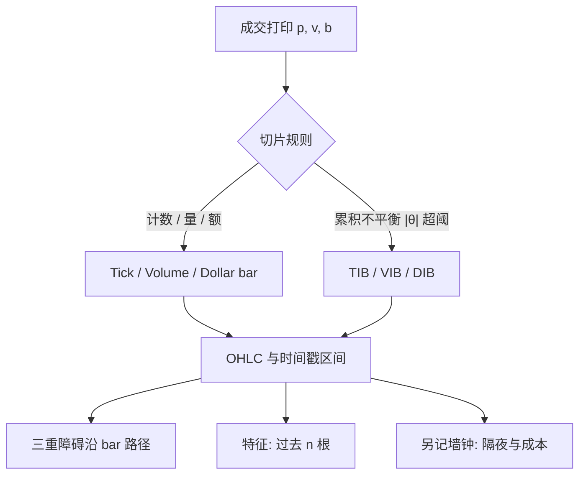

# 信息驱动 Bar

按挂钟等间隔切片，是把交易活跃与死寂的时段等权；按成交笔数、成交量或成交额累积再切片，是让每一根 K 线携带更接近等量的信息到达。

<footer>—— López de Prado, Advances in Financial Machine Learning, Chapter 2, 2018</footer>

大多数回测仍在时间 bar 上运行：一分钟一根、一天一根。时钟均匀，信息到达不均匀。开盘、公告、流动性爆发时一根 bar 里塞进大量价格发现；午休或隔夜可能几乎没有成交，却仍占一根。Easley、López de Prado 与 O'Hara 在成交时钟上讨论毒性；López de Prado 在 AFML 第 2 章把数据结构化写成一套 bar：tick、volume、dollar，以及在累积不平衡达到阈值时才封口的信息驱动 bar。目的不是画更好看的图，而是让样本更接近「一次信息到达、一个观测」，以便后续的三重障碍、特征与交叉验证少被时钟扭曲。本篇写这些 bar 怎么封口、与 [OFI](/quant/ofi-cont) 或盘口存量不平衡不是同一对象。

## 问题

时间 bar 的统计病是异方差与异频采样被伪装成规则面板。收益的峰度、自相关、成交量的日季节性，很大一块来自「有时一根里有一千笔、有时只有两笔」。模型在时间网格上会把开盘的信息密集写成「这一分钟特有的可预测性」，把空窗写成噪声。问题是换一个采样测度：让每根 bar 的成交笔数、股数或美元金额大致相等，使观测在信息到达上更齐。

Tick bar：每 $N$ 笔成交封一根。Volume bar：累计成交量达到 $V$ 封一根。Dollar bar：累计 $|p\times q|$ 达到 $D$ 封一根。价格水平变化时，volume bar 与 dollar bar 分道：拆股或趋势行情里，同样股数代表的美元信息不同，López de Prado 更偏 dollar bar。它们仍是同步于交易活动的规则切片，还不是「信息驱动」：即使买卖完全平衡，累积到阈值也会封口。

### 不平衡 bar：阈值在期望符号上

Tick imbalance bar（TIB）监视累积符号不平衡 $\theta_t=\sum_{i=1}^t b_i$，其中 $b_i=\pm 1$ 为成交方向（tick 规则或报价规则）。当 $|\theta_t|$ 超过对 $E[T]$ 与 $E[b]$ 的阈值（用指数加权的历史期望更新），认为买方或卖方主导已经足够「意外」，封口。Volume / dollar imbalance bar 把 $b_i$ 换成 $b_i v_i$ 或 $b_i p_i v_i$。与规则 tick/volume/dollar bar 的差别是：封口时间由不平衡的路径决定，平衡的随机流会更晚封口，知情或单边流会更早封口。于是 bar 的墙钟长度是随机的，信息内容更齐。

方向 $b_i$ 的分类错误会直接改写不平衡。用 Lee–Ready 在延迟报价上打标签，会把一整段趋势的方向标反，TIB 变成噪声。应声明方向规则，并在敏感集上对照。

## 方法

先在成交打印上生成序列 $(p_i,v_i,b_i)$。规则 bar 只累积计数、量或额。不平衡 bar 还要维护 $E[T]$（期望 bar 长度）与 $2P[b=1]-1$ 一类的期望不平衡，用已完成的 bar 更新，**不能用正在形成的 bar 的未来打印**。阈值常用 $| \theta_t | \ge E[T]\,|2P-1|$ 的变体；细节以实现冻结为准，禁止看完下游夏普再改阈值公式。

封口之后，对每根 bar 计算 OHLC、成交量、VWAP、以及形成时长。后续的三重障碍应在同一套 bar 的价格路径上扫描，而不是把不平衡 bar 的收盘再插回分钟网格——混用两种时钟会在插值上制造前视。特征若含「过去 $n$ 根」，$n$ 根在墙上可短可长；这是特性：你在用信息时间而不是午盘的十分钟。报告里应同时给出 bar 时长的分布，以免读者以为样本是等间隔的。

### 与存量不平衡、OFI 的边界

[盘口不平衡](/quant/order-imbalance) 是限价簿快照的状态；OFI 是 BBO 事件的流量；本篇的 imbalance bar 是**成交打印的累积切片规则**。三者可以同时用：在 dollar bar 的时钟上计算 OFI 或存量 $I_1$，往往比在墙钟一分钟上更齐。不要把 TIB 的 $\theta$ 当成 OFI：前者通常没有撤单与挂单，只有成交符号。VPIN 一类毒性度量也建立在成交量时钟上，见 [VPIN](/quant/vpin)；它回答的是知情交易概率，不是怎么切 bar。切 bar 是数据结构化，VPIN 是在已经切好的桶上再算的统计量。

Dollar bar 的阈值 $D$ 若按全样本平均成交额来定，早期与晚期的实际信息含量仍会漂。应用滚动的已实现成交额设定 $D_t$，并只在训练折内估计，避免未来活跃度决定过去切了多少根。

## 机制

机制是采样测度的变换。Wall 时钟对应 Lebesgue 时间测度；成交时钟对应随交易活动递增的随机时间。在活动均匀时两者等价；在爆发时，成交时钟把爆发拉成许多根，墙钟把爆发压进一根。收益在成交时钟上更接近同方差、更少的日季节性，这是描述统计上的改善，不是预测力的保证。模型若依赖「开盘效应」这种墙钟季节性，换到 dollar bar 后必须显式加入墙钟特征，否则季节性被切碎，看起来像 alpha 消失。

不平衡封口的机制是：单边成交使 $|\theta|$ 快触阈值，bar 变短，样本在信息到达快的时候变密——这正是你希望监督学习去看的时候。平衡噪声下 bar 变长，避免在无信息时段制造大量近似重复的样本。代价是：标签的墙钟持有期变成随机，成本与隔夜风险必须按墙钟另记。一根本身可能跨过隔夜，把不可交易缺口藏进一根 OHLC，这是错误；封口规则应在拍卖、停牌与隔夜处强制断开。

### 对 IID 假设的有限补偿

AFML 声称这些 bar 让观测「更 IID」。更准确的说法是：某些由采样造成的异方差与串行相关会减弱，价格本身的波动集群与事件相关仍在。不能因为用了 dollar bar 就改回随机 $K$ 折。Purge 与 embargo 仍然按每条样本的标签区间来做，只是区间现在以 bar 索引计，换算墙钟时要用每根的起止时间戳。

## 边界与工程取舍

不要在分钟 K 线上「模拟」tick bar——那已经丢失打印。不要把 bar 时长的随机性当成可以忽略的执行细节：同一「持有 10 根」，在开盘可能是 30 秒，在午休可能是 40 分钟，冲击函数不同。A 股集合竞价与涨跌停会使成交时钟在板上停滞，不平衡阈值触达变慢，bar 变长，这是流动性状态，不是信号。阈值、方向规则、是否强制隔夜断开，全部是超参，计入 $N$。

事件驱动回测的时钟应由原始事件推进，bar 只是研究层的聚合，见[事件驱动回测](/quant/event-driven-backtest)。用 bar 收盘当成交价，仍是向量化近似。晋级模拟时应回到打印或订单日志。

拆股与分红若未在打印层处理，volume bar 与 dollar bar 会在除权日附近错误封口。公司行为必须在累积器之前对齐。

## 小结

- Tick / volume / dollar bar 按活动量切片，减轻墙钟等权造成的异方差；dollar bar 在价格水平变化时更稳定。
- 不平衡 bar 在成交符号累积超出期望时封口，使单边信息到达时样本变密、平衡噪声时变疏。
- 它们是数据结构化，不是 OFI、存量不平衡或 VPIN；下游标签与 CV 仍须 purge，并处理随机的墙钟时长。
- 阈值只能用过去 bar 更新；隔夜、停牌应强制断开，避免一根跨过不可交易缺口。
- 出处：López de Prado, *AFML*, 第 2 章；成交时钟与毒性见 Easley, López de Prado and O'Hara 的相关工作；方向分类见 Lee and Ready, *Journal of Finance*, 1991。
