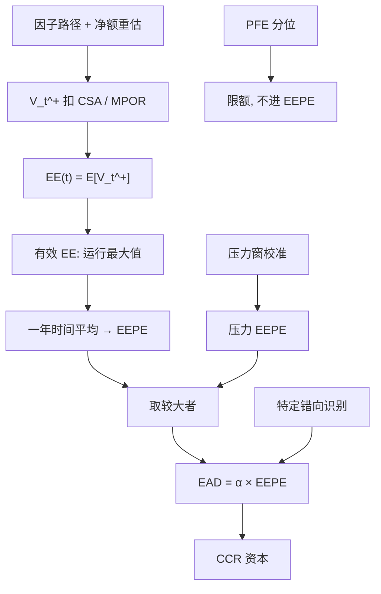

# IMM 与 EEPE

    
内部模型把暴露模拟成一条期望正暴露曲线，再收成有效 EE 在一年内的平均：资本要的不是某一分位的 PFE，而是把展期与再交易已经写进运行最大值之后的 EEPE。

    <footer>—— Basel Committee, Internal Models Method for counterparty credit risk；EEPE 定义见 CRE53 / 既有 IMM 条款</footer>

[SA-CCR](/quant/sa-ccr-ead) 用监管表给出 EAD；获准的内部模型方法（IMM）用模拟引擎给出有效期望正暴露 EEPE，再

$$
\mathrm{EAD}=\alpha\times\mathrm{EEPE}.
$$

α 监管下限通常为 1.2，未自估时用 1.4，含义仍是补偿模拟未抓住的错向、集中与一般错误。本篇写 EE 与有效 EE 的差别、一年平均为何叫「有效」、压力校准与当期校准取大、以及 IMM 相对标准化法真正多出来的自由度在哪里。它补的是资本用的暴露过程，不是 [CVA](/quant/cva-lite) 的风险中性价格，也不是限额台账上的 PFE。

## 问题

对手方组合的市值 $V_t$ 可正可负。违约损失只吃正侧，故定价与资本都对 $V_t^+$ 取期望或分位。若直接用 $\mathrm{EE}(t)=\mathbb{E}[V_t^+]$ 的路径平均当资本名义，会低估「短期交易不断展期、净额集永远存在」的银行：EE 在短到期交易上自然衰减，资本跟着消失，但客户会再做一笔。监管因此要求有效 EE：在资本地平线上令暴露过程不减，再对第一年取平均，得到 EEPE。问题是这个运行最大值改变的是哪一种风险叙事——它惩罚的是展期假设，不是把 PFE 的 99% 偷偷写进均值。

第二个问题是测度与校准窗。CVA 要风险中性（或至少与 CDS 一致的测度）下的 EE；IMM 资本更接近真实测度或历史校准的真实世界动态，并强制一个压力窗上的 EEPE。两套引擎若共用一条利率路径生成器，必须能切换校准，否则资本 EEPE 与 CVA EE 会对不上却说不清是测度还是抵押假设在作差。[错向风险](/quant/wrong-way-risk) 若存在，无条件 EE 系统性低于 $\mathbb{E}[V_\tau^+]$，IMM 条款要求识别特定错向并保守处理，不能靠把 α 拧大来假装已经建模。

### 有效 EE 是运行最大值，不是平滑

记离散保证金日或模拟时点 $t_k$。有效期望暴露

$$
\mathrm{EE}^\ast(t_0)=\mathrm{EE}(t_0),\qquad
\mathrm{EE}^\ast(t_k)=\max\bigl(\mathrm{EE}^\ast(t_{k-1}),\mathrm{EE}(t_k)\bigr).
$$

EEPE 是 $\mathrm{EE}^\ast$ 在一年（或净额集剩余期限若更短）上的时间平均。短到期的 EE 下跌会被「钉住」在已经达到的高点：资本假设你把那一部分正暴露再做回去。这与会计上的到期消亡相反，是审慎假设。若净额集真的在六个月后合同上不可续做（终止净额、客户已清盘），运行最大值会高估；若销售台的惯性就是续做，它只是把商业模式写进资本。文档必须声明展期假设与法律到期，二者不一致时应以法律与作业手册为准，而不是以降低 EEPE 为准。

PFE$(t)$ 是 $V_t^+$ 的高分位，服务限额；EE$(t)$ 是均值，服务 CVA 与 EEPE。用 PFE 曲线做时间平均再乘 α，会把限额工具当成资本名义，通常显著更严且不可比。IMM 审批看的是 EE 引擎，不是 PFE 引擎是否「看起来像」。

## 方法

模拟与 [对手方](/quant/counterparty-credit) 一文相同的骨架：市场因子路径、按净额集重估、扣 CSA（延迟、门槛、合格抵押与估值折扣）、得 $V_t^+$。IMM 额外要求：模型覆盖主要风险因子；抵押与净额的法律可执行性与模拟一致；保证金期不少于监管 MPOR；特定错向交易剔出或单独资本；定期回测 EE 与暴露分布；α 的自估若使用，须有明确的损失给定违约（LGD）与组合粒度数据。α 自估的直觉是 $\mathbb{E}[\mathrm{loss}\mid \mathrm{default}]/(\mathrm{LGD}\times\mathrm{EEPE})$ 一类，把违约时暴露的条件期望相对无条件 EEPE 的比估出来；样本极缺，多数银行不用自估，吃 1.4。

压力 EEPE：用压力期校准的因子动态（波动、相关、均值回复若有）重跑 EE 曲线，再算有效平均。资本 EAD 取当期 EEPE 与压力 EEPE 的较大者（再乘 α）。危机后这一条防止「平静窗里 EE 很瘦、资本跟着瘦」。压力窗的选择与 [压力 VaR](/quant/stressed-var-frtb) 精神相近，但是暴露引擎的校准而不是损益向量的窗口。利率处于历史低位时，接收固定的互换压力 EEPE 可能远高于当期——这是机制，不是引擎 bug。

### 抵押、MPOR 与净额集粒度

有每日变动保证金时，当前 $V^+$ 被压到阈值附近，EE 曲线的质量来自 MPOR 内的市值跳。IMM 若把 MPOR 设得比作业现实短（忽略争议、时区、非现金抵押变现），EEPE 假瘦，这是审批最常打回的点。独立保证金（IM）进入模拟后 RC 与短期 EE 下降，但 MPOR 内跳价仍在；与 SA-CCR 一样，IM 不是把暴露收到零。净额集必须按可执行净额切开，不能全球一张网。同一法律实体多个 CSA、跨分支、托管与自营混在一个模拟净额集，是把法律风险藏进 IMM。

校准频率：因子模型按日或按周重估参数，EEPE 对波动水平敏感，会顺周期。缓解是压力腿托底，以及 α 不随市场日频改。不要把 EEPE 的日频跳动直接当交易限额——限额应用 PFE 或名义，资本占用用较慢的 EEPE 流程，否则交易台会在波动上升日被资本引擎鞭打出仓，与清算保证金的时间差叠成流动性事件。

## 机制

EE 把路径上的正暴露在截面上平均，分散化与非线性已经进了估值函数。有效 EE 再施加单调性，等于在资本地平线上禁止「靠到期自然去暴露」。EEPE 对短业务（外汇远期、隔夜指数掉期的短端）特别苛刻，对三十年互换则接近普通 EE 的一年平均，因为曲线本身不衰减。α 把「违约不是在平均路径上发生」的那一截补成常数；特定错向必须在模拟之外识别，因为无条件期望在错误方向上没有探针——除非hazard 与 $V$ 相关已写进联合动态。

与 SA-CCR 的差：IMM 允许跨风险因子的真实对冲进入 $V_t$（同一净额集里利率与外汇可以在重估时抵消），也允许抵押的路径依赖；SA-CCR 类间不抵、δ 是监管表。因此对冲良好的跨资产净额集，IMM EAD 可以显著低于 SA-CCR；对冲不被估值模型承认时（错误的净额、缺失的基差因子），IMM 也会假瘦，这时标准化下限或并列披露才是安全网。审批机构关心的正是「瘦」得是否来自真对冲而非漏因子。

CVA 的 EE 与 IMM 的 EE 即使用同一估值器，贴现、测度、错向与边界条件也可以不同。对账应拆成：市值 $V_0$、无抵押 EE、有抵押 EE、有效化之后的 EEPE 四段，分别比，不要只比最终 EAD。

### 回测对象是暴露，不是违约

IMM 回测比较的是模拟的暴露分布与事后实现的 $V_t^+$（或保证金期损失），不是违约次数——名字违约样本不够。常用：EE 曲线是否无偏、分位暴露是否覆盖实现、MPOR 窗口上的价值变化是否被保证金期假设包住。失败时先查估值（曲线、担保品资格），再查动态（波动过低），最后才动 α。用违约样本去「校准 α」在组合层面几乎必过拟合。特定错向名单应独立审计：对对手方自身股票的期权、以高相关应收为抵押、与主权风险同向的本地货币债，漏一名比 α 差 0.1 更严重。

## 边界与工程取舍

不要把获准 IMM 写成「可以不用理解 SA-CCR」：未覆盖产品、新净额集、披露与杠杆仍可能走标准化。不要在 EE 引擎里用风险中性漂移做资本、又用历史漂移做 CVA，却共用一套报告名称。不要为降低 EEPE 而把法律上可续做的交易改成模拟里不可展期。α 自估需要违约时暴露的条件数据，多数组合没有，硬估会把噪声写成 1.15 再被监管打回 1.4。

非线性、美式与可赎回结构需要嵌套估值或回归，否则 EE 在行权密集区偏差大，有效化会把偏差钉死一年。初始保证金模型（如 [SIMM](/quant/simm-delta-vega)）与 IMM 的 MPOR 必须同向：IM 按 10 日校准、EE 按 5 日模拟，资本会重复或漏计。多币种抵押的 FX 错向是一般错向的常见源，应在因子相关里出现，而不是只在脚注。

EEPE 对「一年」的定义（日历、营业日、加权）要与监管原文一致。实现里用 250 个等权模拟步还是用实际保证金日，会改运行最大值的形状，属于模型定义，应进模型文档哈希，而不是进谁方便谁改的配置。

## 小结

- IMM 用模拟的期望正暴露构造有效 EE（运行最大值），再对一年平均得 EEPE；EAD = α × EEPE。
- 有效化写入展期假设，短到期业务的资本不会随合同到期自然消失。
- 资本取当期与压力 EEPE 的较大者；α 补偿未建模的一般错向与粒度，不能替代特定错向名单。
- EE / EEPE 服务资本，PFE 服务限额，CVA 的 EE 另有测度；三套不可混名。
- 相对 SA-CCR，IMM 的好处是估值里的真对冲能进入暴露；代价是漏因子会系统性假瘦。
- 出处：BCBS 对手方信用风险内部模型方法与 EEPE 定义（CRE53 及沿革文件）；实施与 α 见同一套巴塞尔文本；暴露统计背景见 Canabarro–Duffie 与 Pykhtin–Zhu 的 CCR 综述。
