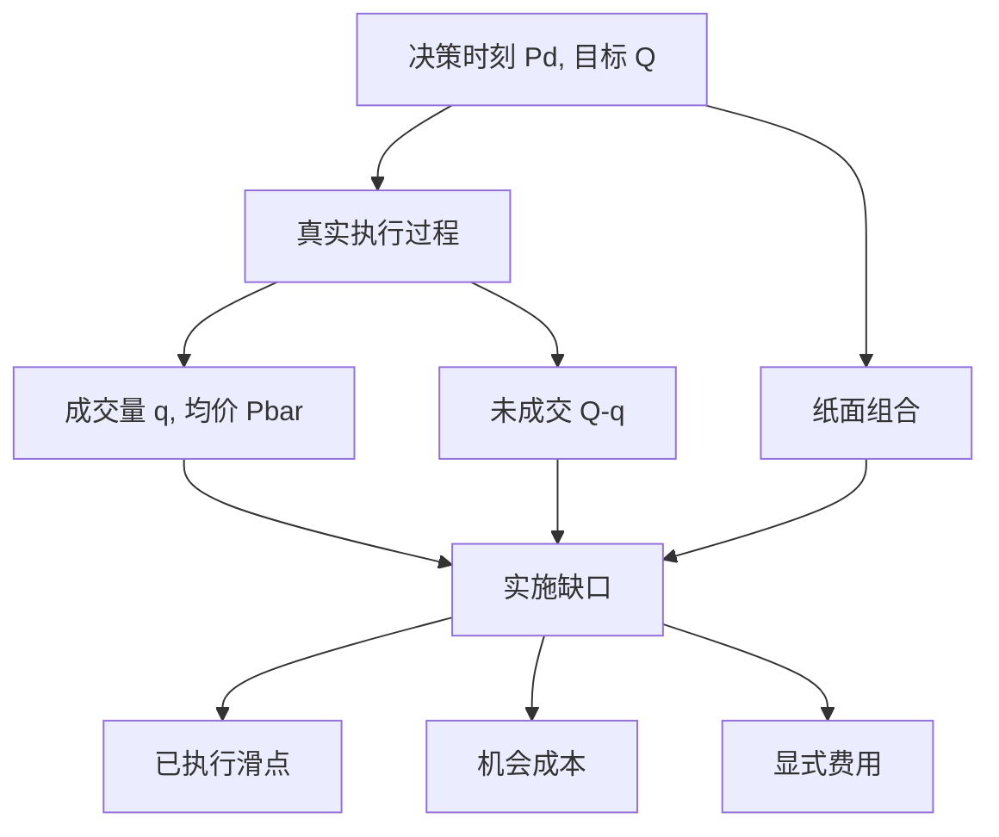

# 实施缺口 Implementation Shortfall

纸面组合假定决策瞬间按当时价格全部成交；真实组合要穿过价差、冲击、延误与未完成。两者的价值差就是实施缺口，它度量的是投资过程输掉的那一截，而不是行情本身。

<footer>—— Perold, The Implementation Shortfall: Paper versus Reality, Journal of Portfolio Management, 1988</footer>

André Perold 1988 年把交易成本从「佣金加价差」推进到一个组合层面的会计恒等式。经理做出决策时，纸面上已经持有目标组合；市场只在此后逐渐把纸面变成真实持仓。其间价格在走，部分数量可能永远完不成。实施缺口（implementation shortfall, IS）等于纸面组合的收益减去实际组合的收益，把延误、冲击、费用与机会成本收进同一个数字。它与事后才知道的 [VWAP](/quant/twap-vwap-pov) 基准不同：VWAP 问你是否贴近市场均价，IS 问你是否贴近**决策时**那张可标记却不可交易的纸面。Almgren–Chriss 的最优执行把缺口的冲击与时机风险写成目标函数；Kissell 等人把缺口拆成可操作的若干项，便于交易台归因。本篇写定义、分解与误用，不把某一种拆单算法说成缺口的最小化定理。

## 问题

组合决策产生一份目标持仓 $h^\star$ 与决策时刻 $t_d$ 的价格向量 $P(t_d)$。若市场是无限深的、没有价差、指令瞬间完成，实现持仓立刻等于 $h^\star$，其后损益完全来自价格。真实市场里，执行是一个过程：从 $t_d$ 到最后一笔（或放弃）的 $t_e$，成交均价 $\bar P$ 偏离 $P(t_d)$，且最终持仓 $h$ 可能小于目标。投资人看到的账户收益，混合了「决策是否正确」与「决策有没有被执行」。Perold 要分开这两件事：把决策质量留给纸面组合，把实施质量留给缺口。

若不做这种分开，交易台会用对自己有利的尺子。用全日 VWAP，慢执行在单边市里可能「跑赢基准」却相对决策价亏损巨大；用收盘价，会激励把冲击堆到尾盘。缺口的参照点锁在 $t_d$ 的可观察价格（通常是当时中间价或上一次成交），从而使延误与未完成都有代价。问题是写出一个可加总的分解，使佣金、价差、冲击、时机与放弃各占一块，并且在多日、部分成交、公司行动下仍可计算。

### 纸面组合与真实组合

纸面组合从 $t_d$ 起按 $h^\star$ 持有，盯市用市场中间价或指数规则指定的标记价，不计费用。真实组合从 $t_d$ 的原持仓出发，只在成交发生时改变持仓，并扣除显式费用。两者在 $t_e$ 的价值差（对买入为正的成本、对卖出符号相反）即 IS。Perold 强调：纸面不是「假如用 TWAP 会怎样」，而是「假如没有市场摩擦会怎样」。任何把参照价改成本窗口 VWAP 或收盘价的做法，都已经不是原文的实施缺口。

决策价必须事先规定：是信号触发时的中间价、还是指令送达交易所的到达价（arrival price）。两者之差是内部延误，应单独归因，不要吞进「市场冲击」。到达价基准是 IS 在交易台最常见的操作化，参照点从投资经理的 $t_d$ 改到了执行台的 $t_0$。

## 方法

对单一买入、目标量 $Q$、决策价 $P_d$，设实际成交量 $q\le Q$，成交均价 $\bar P$，窗口结束时价格 $P_e$，显式费用 $F$。一个标准分解是

$$
\mathrm{IS}= q(\bar P-P_d) + (Q-q)(P_e-P_d) + F.
$$

第一项是已执行部分相对决策价的滑点（含价差、临时与永久冲击、片内时机）；第二项是未执行部分的机会成本：价格已经走到 $P_e$，纸面以为买到了，真实没有；第三项是佣金、税费、结算。卖出时价格差取反号。多资产时按决策价值加权或按份额加总，注意汇率与公司行动要对齐两条组合的调整规则。

Kissell 的扩展实施缺口把第一项再拆：决策到下单的延误、下单到首次成交、成交过程中的市场运动（可以用同期不交易的对照价格或到达后的公平价值代理）、以及相对当时报价的即时成本。即时成本靠近有效价差，见 [价差分解](/quant/spread-decomposition)；过程中的运动靠近冲击与 alpha 衰减。拆得越细，越依赖「假如我没交易价格会怎样」这一反事实，识别也越弱。

### 与 TWAP / VWAP 基准的代数关系

设窗口市场 VWAP 为 $P_{\mathrm{VWAP}}$。相对 VWAP 的表现是 $q(\bar P-P_{\mathrm{VWAP}})$，它不包含未执行项，也不包含 $P_{\mathrm{VWAP}}-P_d$ 这一段市场运动。于是

$$
q(\bar P-P_d)= q(\bar P-P_{\mathrm{VWAP}}) + q(P_{\mathrm{VWAP}}-P_d).
$$

IS 的已执行项等于「相对 VWAP」加上「VWAP 相对决策价」。单边市里第二块可以主导。TWAP 基准同理，只是均价定义不同。因此跑赢 VWAP 既不充分也不必要于缩小 IS：你可以在价格已经大涨之后贴着 VWAP 买完，缺口仍然很大。Almgren–Chriss 最小化的是期望成本加风险，成本正是 IS 中与交易速率有关的那部分，风险是未完成或未卖出库存对价格扩散的暴露；启发式 [TWAP / VWAP / POV](/quant/twap-vwap-pov) 只是该问题的特殊路径。

## 机制

缺口能成为交易质量的度量，是因为它把摩擦写成对纸面财富的扣减。价差与佣金是即时、相对确定的扣减；冲击是自身流量的函数，部分永久、部分回弹；时机是价格在执行窗口内的扩散与漂移，对缓慢日程方差更大；机会成本是约束（时间、价格上限、流动性枯竭）导致的数量缺口。Perold 的贡献不是给出冲击函数，而是坚持：**没有一张事后才公布的均价可以替代决策时刻的纸面**。

机制上的第二句话是激励相容。若评价用 IS，交易台的动机是尽快、尽可能完成、并控制冲击，这与投资经理「想要的头寸」对齐，却可能与「让均价好看」冲突。若同时用 VWAP 与 IS，两个 KPI 在单边市里打架。治理应指定主尺子，并把未完成率单独披露，以免交易台用放弃来避免实现滑点——放弃只是把成本从第一项搬到第二项，IS 总额仍在。

机会成本项用 $P_e$ 标记未成交量，隐含「结束时仍想要这些量」。若信号已失效、目标已撤，应用撤销时刻的价格关闭第二项，否则会把事后 alpha 算进执行质量。

### 永久冲击会进入决策质量还是实施质量

自身交易若造成永久价格移动，纸面组合在 $t_d$ 之后也会享受（或遭受）这一移动——但纸面假定的是无摩擦成交，通常仍用未受自身冲击污染的标记价路径，或用到达价加一个外生市场因子。实践中很难把「市场自己走的」与「自己造成的永久冲击」分开，这正是执行文献与微观结构文献的接缝：Kyle 的 $\lambda$ 是流对价格的永久写入；Almgren–Chriss 把永久冲击放进成本，不放进「决策 alpha」。归因时若把永久冲击算给经理的 alpha，执行看起来过好；若全部算给执行，选股看起来过差。需要事先约定：标记价是否剔除自身成交、窗口多长。

## 边界与工程取舍

IS 要求有一个清晰的 $t_d$ 与 $h^\star$。系统生成的连续再平衡、条件单、算法母单在盘中改量，会使决策点模糊。多日执行要把隔夜跳空算进哪一项：通常算时机或单独的隔夜项，而不是冲击。开盘拍卖前的决策价可能根本不可成交，用上一日收盘当 $P_d$ 会把隔夜信息写进缺口。外汇、期货的点差与展期、股票的涨跌停，都会让 $P_e$ 不是可执行价。

统计上，单笔缺口噪声极大，必须在大量母单上比较算法。条件化很重要：按紧急程度、参与率、波动体制分层，否则「哪条算法 IS 更低」只是在比较它接了什么单。Jorion 讨论市场风险时指出纸面 VaR 忽略变现；IS 正是变现已经发生后的实现成本。它不是事前风险度量，也不能替代 [VaR](/quant/var-methods) 或 [Expected Shortfall](/quant/expected-shortfall)。反过来，风险系统若用未扣 IS 的纸面持仓，会高估可实现净值。

不要用「平均 IS 为负」证明交易台创造了流动性利润。样本若含大量被动成交与价格改善，负的即时滑点很常见，但未计入的 alpha 衰减与逆向选择会在更长窗口里出现在机会成本或后续损益里。

## 小结

- Perold（1988）定义实施缺口为纸面组合与真实组合的价值差，参照点是决策时的价格，不是事后市场均价。
- 标准分解：已成交相对决策价的滑点、未成交的机会成本、显式费用。
- 跑赢 VWAP 既不充分也不必要于缩小 IS；两者差一项「均价相对决策价」的市场运动。
- 未完成不是零成本：放弃把滑点换成机会成本，总额仍进入缺口。
- 决策价与到达价之差应单列内部延误；永久冲击的归属要事先约定。
- IS 是事后交易成本会计，不是事前市场风险；纸面风险系统应意识到变现缺口。
- 出处：Perold, *Journal of Portfolio Management*, 1988；Almgren and Chriss, *Journal of Risk*, 2000/2001；Kissell 对扩展实施缺口的分解；执行日程见 TWAP / VWAP / POV；冲击的微观结构语言见 Kyle（1985）与 Harris, *Trading and Exchanges*。
