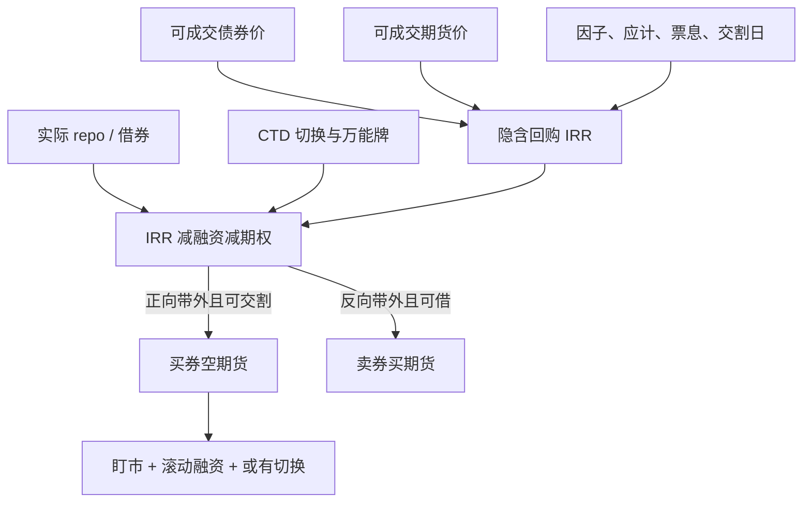

# 隐含回购利率

把债券持有到期货交割、用发票金额回收本金，中间的内部收益率就是隐含回购；它高于实际融资则买券空期货，低于则反向，前提是你交的真是 CTD。

<footer>—— Burghardt, Belton, Lane & McVey, The Treasury Bond Basis；对照 Hull 的期现持有成本</footer>

隐含回购利率（implied repo rate, IRR）是债券期货基差交易的报价语言：给定现货净价、应计、转换因子、期货价格、交割日与期间票息，解出「若用该券交割，这笔期现的融资利率是多少」。它把[最便宜可交割](/quant/ctd-cheapest)的排序从「净基差谁最小」改写成「谁给出最高的隐含回购」——对空头期货、多头现券的正向期现，IRR 最高的券通常就是 CTD。Burghardt 的体系把 IRR 与实际回购（term repo 或隔夜滚动）比较，差是扣掉交割期权之后还能否执行的边缘。Hull 的商品持有成本是同一会计在物理仓储上的版本；债券把仓储换成回购市场。没有真实可借的券与可成交的期货，IRR 只是屏幕上的内部收益率。

## 问题

忽略一些惯例细节，从 $t$ 持有到交割 $T$、期间收到票息 $C$ 的 IRR 满足把流出（买券）与流入（发票金额加票息再投资假设）配平。实务公式在各交易所通告里写死，日计数与应计不能用错。问题不在求解，而在：IRR 用的是当前 CTD 的发票公式，若交割时 CTD 已切换，你实现的融资利率不是开仓时算的那个 IRR。Hemler 的交割期权、Kane–Marcus 的万能牌，都会使期货比「纯 CTD 远期」便宜，从而把屏幕 IRR 抬高——看起来正向期现很美，其实你在卖期权。比较 IRR 与实际 repo 时，必须从差里减去这些期权的公允，剩下的才是可讨论的错误定价。

第二层是 repo 本身的期限与特殊性。屏幕 IRR 常按到交割日的期限算；实际融资可能是隔夜滚动，路径上 specialness 与一般抵押品（GC）利差会变。开仓时 IRR 高于 GC 十个基点，持有期内券变 special，滚动融资变贵，实现利润消失。反向交易（卖券买期货）需要能借到券，借券费直接进入实际融资。商品上没有 IRR 这个名字，但租借率与便利收益扮演同类角色，见 Working 与[期现套利](/quant/cash-and-carry)。

### IRR 不是债券到期收益率

到期收益率把债券的全部票息与本金折到无穷或到期；IRR 只把现金流计算到期货交割，本金回收来自发票，不是来自发行人。把 IRR 与 YTM 比高低没有意义。IRR 与 GC repo 比才有意义，且要对齐担保品、期限、是否可提前召回。失败交割会打断「发票一定在 $T$ 到账」的假设，IRR 的分母还在、分子变成不确定。这是结算制度风险，不是利率观点。

用结算价算 IRR、用买卖价成交，会把一整段价差算进「隐含回购优势」。应在可执行的债券买价（或卖价）与期货卖价（或买价）上算两条 IRR，只有带外的那一侧才允许开仓。

## 方法

对篮子逐券：取可成交现货与期货，代入该市场的发票公式，解 IRR。排序得到最高 IRR 的券，检查其可借性、发行量、是否接近交割月持仓限制。将最高 IRR 与该券 term repo 报价比较，扣掉估计的交割期权（用篮内离散度与波动，或用净基差的期权部分）。仅当正向期现的净边缘覆盖债券有效价差、期货价差、清算费用与[保证金](/quant/futures-margin)占用后仍为正，才开买券空期货。反向同理，边缘要对着借券费。

风险情景：平行加扭转使 CTD 切换，重算实现 IRR；repo 利差扩大；交割失败；期货停板而债券仍在交易。对冲比用 DV01 而不是 CF，切换后重平衡。容量取 CTD 可获得量、repo 市场深度与期货交割限额的最小者。拥挤的基差账会把 IRR–repo 差压到刚好覆盖最优执行者的成本，次优者的净期望为负——与指数套利同一逻辑。

### 从 IRR 回到商品语言

商品的「隐含仓储」可以把期货升水拆成融资加仓储加便利收益残差。IRR 是债券版的隐含融资：升水（或基差）里属于资金的那一块被显式解出，残差留给期权与错误定价。Erb–Harvey 在商品上强调展期不是票息；这里对称：IRR 高于 GC 不是「无风险多赚一截利息」，除非期权与执行都已扣除。Working 的仓储理论提醒残差可以持久（便利收益）；债券上对应的持久残差是交割期权与 specialness，不是免费 alpha。

## 机制

无套利机制：IRR 显著高于实际融资且期权价值不够解释时，买券空期货，交割或提前平仓，把差变成持有期收益。资本进入压低期货或抬高现券，IRR 回落。反向则卖券买期货。收敛日是交割结算，盯市路径上期货腿每日兑付，债券腿的盈亏在市值与融资里，现金错配见保证金一文。切换机制：市场利率变动改变因子残差排序，你的券不再给出最高 IRR，期货开始跟踪新 CTD，基差头寸出现方向性。这是债券日历里最常见的「模型还对、账已经亏」的来源。

Repo 机制：CTD 需求使该券 special，多头持券的融资变便宜，IRR 与实际融资的差在持有端改善、在建立端恶化——后来者更难做。这是容量的内生收窄。清算与保证金使杠杆在波动上升时下降，同样的 IRR 差在危机里不可按原名义执行。

### 破裂：切换、special、fails、日历

CTD 切换使开仓 IRR 作废。券突然 special 或变为 general，滚动融资跳。大规模 fails 使发票到账日不再确定。交割日历、假期与券息日让日计数与再投资假设出错，几个基点的「优势」可以只是惯例。篮子调整（新发债进入合格清单）在公告日重估所有 IRR。非美合约的发票公式若含不同的应计或交割选择，照搬美债 IRR 会得到错误的 CTD。

把历史平均「IRR 减 GC」当成策略的期望，忽略了期权价值随篮内离散度变化。低波动、CTD 遥遥领先时，差更接近真的期现；高波动、两只券打平时，差大部分是 Hemler 期权。无条件均值把两种状态混在一起。

## 边界与工程取舍

不要用中间价 IRR 下单。不要用 YTM 或政策利率替代实际 repo。不要在交割月临近仍按非交割月保证金去加杠杆。成本含券与期货的有效价差、repo 买卖、失败惩罚、切换后的再套保冲击。容量不是期货 OI，是 CTD 的可融量。与商品[展期收益](/quant/roll-yield)不要类比成「收息」：IRR 是内部收益率报价，实现仍依赖交割与融资路径。

报告应并排：可执行 IRR、term repo、期权调整后边缘、当前与次 CTD、DV01 对冲比、保证金情景。Burghardt 提供会计；Hemler 与 Kane–Marcus 提供期权；Hull 提供与商品持有成本的对照。缺期权调整的 IRR 策略，是在无补偿地卖空交割选择权。

反向期现（IRR 过低）在券不可借时只是一句空话。屏幕上出现「惊人的低 IRR」，往往是 bid 已消失或只能卖出很小规模。可执行 IRR 必须用真实的债券卖价与可借确认。

## 小结

- 隐含回购是债券持有至期货交割的内部收益率，用于 CTD 排序并与实际回购比较；它不是 YTM。
- 屏幕 IRR 含交割期权溢价；须用 Burghardt 会计加 Hemler / Kane–Marcus 期权调整后才谈错误定价。
- 执行依赖可借券、可成交期货与交割路径；切换与 specialness 使开仓 IRR 不必等于实现融资。
- 容量由 CTD 可融量决定；保证金与 fails 是路径破裂。
- 出处：Burghardt, Belton, Lane and McVey, *The Treasury Bond Basis*；Hemler, *Journal of Finance*, 1990；Kane and Marcus, *Journal of Finance*, 1986；Hull, *Options, Futures, and Other Derivatives*；持有成本对照 Working, *AER*, 1949。
