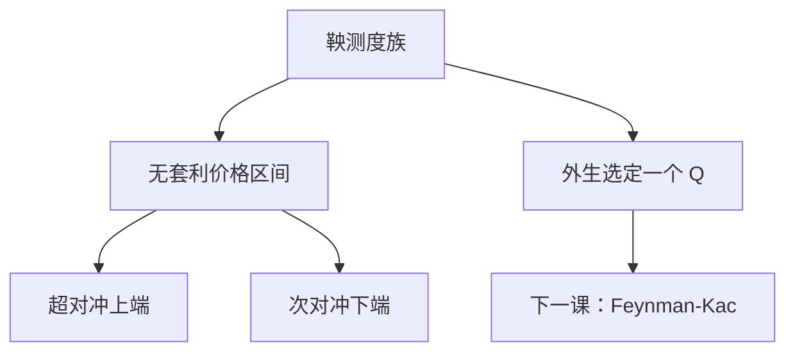

# 不全市场

不完备时等价鞅测度是一整族。无套利只把价格钉在区间上；点价格需要额外选择，例如平方对冲或效用无差别。

<footer>—— 据 Harrison and Pliska, 1983；Föllmer and Schweizer, Hedging of Contingent Claims, 1991；Shreve, Stochastic Calculus for Finance II, 第 5 章整理</footer>

上一课[完备市场与唯一测度](/quant/complete-unique-measure)给出「$Q$ 唯一则每个 $H$ 可复制」。缺口是反过来：随机波动、跳、不可交易因子，都会留下无法对冲的余项。本课只说明价格变成区间、对冲变成投影，不把某种选取准则写成「正确价格」。主干后面的 BSM PDE 仍走完备；本课是对照，防止把唯一公式误用到不完备模型。

## 问题

设 $\mathcal M$ 为等价鞅测度族，多于一点。对未定权益 $H$，每个 $Q\in\mathcal M$ 给出一个无套利候选 $\mathrm e^{-rT}\mathbb E_Q[H]$。无套利价格的全体是这些期望的区间（在凸、闭的技术条件下）。报区间之外的价，可被可容许策略套利；报区间之内，无法用可交易资产复制来锁定。缺口不是再找一个 Girsanov $\theta$，而是承认 $\theta$ 的不可对冲分量自由。

常见来源：Heston 的方差过程不可交易；Merton 跳的跳幅测度不能被连续交易完全对冲；多因子利率只交易部分债券。本课程不展开这些模型的闭式，只留「多个 $Q$」的接口。

### 不全不是「没有风险中性测度」

第一基本定理仍然要存在至少一个 $Q$，否则有套利。不全是存在但不唯一。把「随机波动」说成「不能风险中性定价」，漏掉了：可以定价，只是要额外选 $Q$，或接受区间。

最小鞅测度、方差最优对冲，是在 $\mathcal M$ 里挑一个投影。它们是选择，不是市场给出的唯一价。

## 方法

超对冲价格 $\inf\{V_0:$ 存在策略终值 $\ge H\}$ 等于 $\sup_{Q\in\mathcal M}\mathrm e^{-rT}\mathbb E_Q[H]$；次对冲是对偶的 $\inf$。可复制的 $H$ 使两端重合。对一般 $H$，复制误差 $H-V_T^{\Delta}$ 正交于可交易增益子空间（Föllmer–Schweizer 的意义下），剩余风险不能靠加交易消掉。区间内部的报价可以成交，但不能被复制锁定；做市商报点价时，其实是在区间里选了一点并自己承担残差。

实践接口：若把不可交易因子的市场价格外生给定（例如方差风险溢价写成参数），就从 $\mathcal M$ 里挑出一点，公式看起来又像完备。那是额外经济假设，必须写明；不能假装第二基本定理仍然成立。

## 机制

不可对冲的噪声在 Girsanov 里对应自由的 $\theta$ 分量：它改 $H$ 的分布，但不改可交易贴现资产的鞅性质。因此 $\mathbb E_Q[H]$ 随 $Q$ 动，而可交易资产的当前价不动。区间宽度衡量剩余风险有多大。完备市场宽度为零。把随机波动的市场价格写成常数参数，等于人为把宽度压成一点——公式能算，但第二基本定理并未恢复。

效用无差别价格把挑选 $Q$ 写成优化：不同效用给出不同点。这不是本课程主干。主干在 BSM 里回到唯一 $Q$，以便 PDE 与 delta 有单一对象。

## 边界

本课不推导 Heston 的特征函数，不写跳扩散的 Esscher 选取，不进入不完全市场的均衡定价。美式、跳、MC 只在后面给接口。后课默认：写 Black–Scholes 公式时市场被当作完备；遇到随机波动或跳，先问 $Q$ 是否被额外假设钉死。主干定价数学不靠把不全市场「校准成」唯一公式来回避区间。下一课[Feynman–Kac](/quant/feynman-kac)在扩散设定下把期望变回 PDE，默认已有一个用来取期望的测度。区间问题到此暂停，不带进 PDE。

## 小结

- 不完备 $\Leftrightarrow$ 多个等价鞅测度。
- 无套利给出价格区间，不是一个点。
- 点价格需要外生选择，不是第二基本定理。
- 存在 $Q$ 仍必要；不全不是没有 $Q$。
- 效用无差别与最小鞅测度都是选点，不是市场唯一价。
- 出处：Harrison–Pliska 1983；Föllmer–Schweizer 1991。
