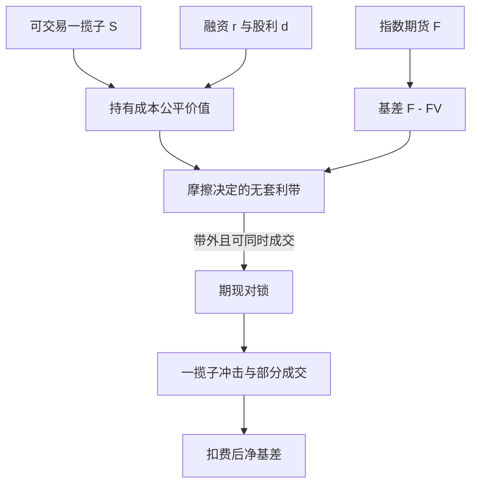

# 指数套利

    
指数期货与现货一揽子之间的基差，受持有成本、提前行权式的随机股利与交易摩擦约束；偏离在足够大时触发期现对锁，但程序化买卖本身会在现货端留下冲击与日内波动。

    <footer>—— MacKinlay & Ramaswamy, Index-Futures Arbitrage and the Behavior of Stock Index Futures Prices, Review of Financial Studies, 1988</footer>

[上一课](/quant/residual-momentum)用因子回归残差的 12−1 累计排序，试图保留特异相对强度；残差不可直接买卖，中性是否成立取决于窗口与因子选择。那是统计溢价，没有到期强制收敛。缺口是制度上最近似「有收敛日期的相对价值」：期货以指数结算，现货一揽子可以复制指数，基差写成持有成本加减一条由摩擦决定的无套利带。带内偏离不是免费午餐；带外面对一揽子同时成交、涨跌停、股利预测与保证金。本课写这条指数套利。不重讲残差动量的换手。

## 问题

持有成本理论给出期货公允价格

$$
F_{t,T}=S_t e^{(r-d)(T-t)}
$$

（连续近似），$S$ 为现货指数，$d$ 为红利率。真实市场有买卖价差、股票无法同时成交、指数是报价而非可买的资产、股利路径不确定、期货有保证金与基差风险（对提前平仓）。于是无套利不是一条线，而是一条带。问题是：观测到的 $F-S$ 有多少是带内噪声（Miller、Muthuswamy、Whaley 讨论过基差变化的均值回归可能来自非同步报价），有多少是可执行的错误定价。

现货指数包含滞后交易的股票，期货几乎连续。期货相对「陈旧」的指数升水或贴水，很大一块是伪基差。用这个伪基差去下程序化单，等于在交易非同步，而不是交易收敛。MacKinlay–Ramaswamy 强调把可交易一揽子与指数本身分开，并允许套利资本有限，从而基差可以在带内随机游走一段。

### 无套利带与提早平仓

Brennan–Schwartz 允许套利者在到期前平仓，于是策略像一个有界过程的最优进出，而不是持有到 $T$。这改变了「偏离多大才开仓」：太大的偏离可能很快回来，但回来的路径依赖其他人的程序化单。带的宽度由一揽子的有效价差、冲击、借券与期货手续费共同决定。宽度随市场压力变：1987、2010 闪电崩盘、以及涨跌停制度下，带可以突然变宽，旧阈值会在不可成交的价格上触发。

指数本身通常不能买。套利的现货腿是一揽子股票或 ETF。用指数点位算「套利利润」却用一揽子成交，会把跟踪误差当成 alpha。规格必须写清复制误差的预算。

## 方法

可复制的检查单。第一，定义可交易现货：全市场一揽子、分层抽样、或指数 ETF。第二，把期货与现货对齐到同一时钟，处理到期滚动。第三，估计持有成本：$r$ 用融资利率而非无风险国债，$d$ 用预测股利而非事后实现股利——事后 $d$ 会制造前视。第四，把往返成本加进带的半宽：股票有效价差之和（按权重）、期货有效价差、冲击（Kyle 型或 Almgren–Chriss 轨迹）、以及失败成交的惩罚。第五，只有当 $|F-S_{\mathrm{basket}}e^{(r-d)\tau}|$ 超出半宽才允许下单，并假设部分成交。

Sofianos 用实际套利账户的数据说明：许多表面上的偏离在可执行价格下并不盈利；盈利集中在波动高、带被打穿的短窗口。Stoll 与 Whaley 从指数与期货收益的领先滞后描述信息传递：期货往往领先，套利是把这一领先翻译成现货成交。工程上这要求现货腿能在秒到分钟级完成，否则你锁的是已经收敛了一半的基差。

### 程序化交易、涨跌停与结算

到期日与开盘、收盘集合竞价是基差与操纵风险的集中地。结算价若用特定窗口的现货，期货空头与现货多头的对锁要在那一窗口对齐，否则留下方向性残差。涨跌停使一揽子缺腿：缺的往往是最该成交的名字，复制误差在你最需要收敛时最大。A 股与部分亚洲市场的期现制度、保证金、套保额度，会把理论上的带变成监管约束下的更宽带。没有额度时，「套利」退化成单边期货或单边 ETF，那是方向性交易。

Harris–Sofianos–Shapiro（1994）讨论程序化交易与日内波动的关联。波动升高既可能是套利把信息写入价格，也可能是一揽子冲击。把「指数套利降低效率」或「提高效率」写成单一符号，忽略了窗口与冲击的尺度。

## 机制

收敛机制是合约结算与可复制性，不是协整检验给出的统计回归。只要到期用现货结算且一揽子可买，基差在 $T$ 被强制对齐（指数定义与可买一揽子仍有差别）。此前的回归来自套利资本的进入。资本有限或融资紧张时，基差可以长时间停在带外，看起来像 OU，其实是约束下的缺口。这与股票配对的关键差别：配对没有到期强制对齐。

领先滞后：信息先到期货，套利买（卖）现货、卖（买）期货，现货被「追上」。若现货因涨跌停追不上，期货基差扩大，套利者面临追保与无法对锁。此时继续按旧带去加仓，是在交易流动性枯竭，不是在交易持有成本。Miller 等人提醒：用非同步的指数水平算基差均值回归，会把陈旧报价的更新误写成套利机会。

### 容量、拥挤与「人人都是套利者」

指数套利的容量表面上由指数成分的 ADV 决定，实际上由同时想锁同一偏离的资本决定。偏离一旦被彭博或交易终端的「公平价值」栏目标出，竞争使可执行边缘降到带的边界。大账户必须拆单，执行时间拉长，基差在执行中收敛，实现利润小于信号利润——这是 Perold 实施缺口在期现上的版本。期货流动性通常好于一揽子里最差的成分股，瓶颈永远在现货腿。

## 边界与工程取舍

股利预测、融券与公司行为会在除权日附近制造假偏离。指数调整日现货一揽子与期货标的短暂不一致。用 ETF 代替一揽子会把问题变成[ETF 与成分股](/quant/etf-arb)：申赎机制不同、追踪误差不同。成本必须用有效价差与部分成交，不能用指数点差的一半。

不要把基差的样本内 OU 半衰期写成保证利润：半衰期估的是包含伪基差与拥挤交易的混合物。策略应报告：带内交易的负期望（你在付价差）、带外交易的条件期望、执行成功率、以及现货跟踪误差。若跟踪误差的波动大于基差本身，所谓套利是带杠杆的指数增强，风险预算应按方向性仓位计。

持有成本模型里的 $r$ 在压力期应换成实际融资与保证金利率。用国债利率算「巨大贴水」，常常只是在描述信贷与期货保证金，而不是可锁的套利。

## 小结

- 指数套利依赖结算与可复制一揽子，无套利是一条由摩擦决定的带，不是持有成本等式上的一个点。
- 伪基差来自非同步报价；MacKinlay–Ramaswamy、Miller–Muthuswamy–Whaley 要求把可交易现货与指数点位分开。
- 可执行利润远小于报价偏离；Sofianos 与程序化交易文献强调冲击、部分成交与日内波动。
- 容量瓶颈在现货腿与拥挤执行；融资与涨跌停会突然加宽带宽。
- 出处：MacKinlay and Ramaswamy, *Review of Financial Studies*, 1988；Modest and Sundaresan, *Journal of Futures Markets*, 1983；Brennan and Schwartz, *Journal of Business*, 1990；Stoll and Whaley, *JFQA*, 1990；Sofianos, *Journal of Derivatives*, 1993；Harris, Sofianos and Shapiro, *RFS*, 1994。
