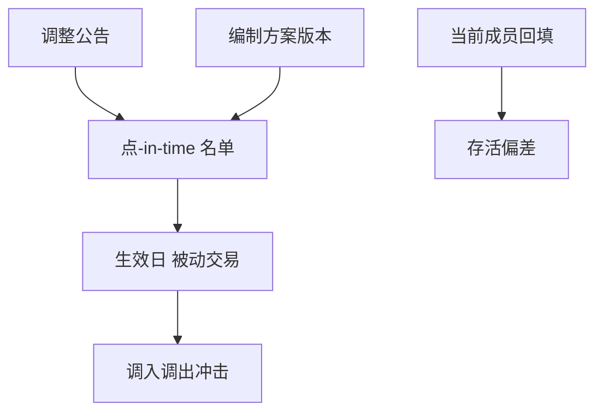

# 指数成分历史

指数是一条时变的可投资名单。用今天的成分表回填十年，存活下来的公司会看起来永远可买，调入调出那天的冲击却从样本里消失。

<footer>—— Shumway, The Delisting Bias in CRSP Data, Journal of Finance, 1997；对照 S&amp;P Dow Jones、MSCI、中证指数的公开编制方案；指数基金与 ETF 调仓的实证传统</footer>

[上一课](/quant/analyst-consensus)把信息集停在分析师。[CRSP](/quant/crsp-compustat)已处理退市。本课的缺口是**基准与宇宙的历史名单**：谁在指数里、何时调入调出、公告日与生效日之差。用当前沪深 300 或 S&P 500 成员做二十年回测，是经典存活偏差。后课复权处理价格尺度；本课处理集合的成员关系。

## 问题

因子研究的宇宙常写「指数成分」。指数编制有规则：市值、流动性、上市时间、财务、缓冲区。成分在定期调整日与临时替换日变化。供应商给的「历史成分」若只提供最新规则下的回算，而不是当时官方名单，则 2005 年的组合可能含当时尚未上市或尚未入选的公司。问题是区分三种表：（1）当时官方点-in-time 成分；（2）今日规则对历史的回测指数；（3）当前成员的历史价格。只有（1）能模拟当时可交易的指数策略；（2）是指数公司的研究产品；（3）非法。

调仓有公告日与生效日。公告后、生效前，被动资金必须交易，冲击与提前调仓是公开的市场微观结构现象。用生效日收盘价「自动调入」且零冲击，会高估指数增强与套利的可实现性。ETF 一级市场与期货展期把同一事件放大到多个场所。

### 缓冲区与快速入选改变换手

编制方案里的缓冲区降低换手，使「刚过线」不一定入选。快速入选规则让新上市公司提前进入。回测若用简单市值排序模拟成分，换手与名单都会错，跟踪误差归因会把编制规则当成 alpha。必须订阅官方历史或高质量点-in-time 成分库，并保存方案版本。

中证、上证、深证指数的编制方案与调整日历是公开的。A 股还要叠 ST、退市整理、注册制新股。用今天的 300 成分跑 2013 年，会纳入当时不存在的科创板代码。

## 方法

主数据：`(index_id, date, member_id, start, end, announce_ts, effective_ts, weight)`。权重方法（流通市值、自由流通、分级靠档）按当时方案。回测决策日 $t$ 只用 `announce_ts ≤ t` 且 `effective_ts` 规则明确的信息：若策略不能提前调仓，则生效日前仍用旧名单。冲击：在生效窗口对调入调出腿施加参与率约束，见[容量](/quant/capacity-participation)。

与 CRSP/A 股主数据对齐时检查：调出是否因并购或退市，收益是否已按退市处理。指数本身的收益应用官方指数水平验证，与成分加权复制之间的差来自费用、停牌、现金拖累与编制细节。差过大说明成分或权重错。

### 基准是产品，不是自然物

同一「价值因子」相对不同指数，行业与市值暴露不同。论文必须锁定基准历史，而不是锁定基准名字。指数增强的跟踪误差定义在特定指数的点-in-time 成分与权重上；换指数等于换问题。后课中国公募指增会用到本课对象。

## 机制

存活偏差：当前成员是条件于存活与入选的样本，历史收益偏高、左尾被砍。调仓冲击：被动需求在窗口内缺乏弹性，价格暂时偏离，然后部分回复——这是实施缺口，也可能是可交易的拥挤。两者都要求历史名单，而不是当前名单。

自由流通与外资持股限制改变权重，从而改变「市场组合」代理。用总市值权重去复制自由流通指数，beta 会错。方案文本是数据契约的一部分。

## 边界

指数公司对历史数据有许可。本课不提供未授权的成分库。自定义宇宙（全 A、可融券子集）须另存，不要冒充官方指数。债券指数、商品指数的滚动规则不同，本课以股票指数为主。

## 小结

- 只用当时官方成分与权重；当前成员回填是存活偏差。
- 公告日与生效日分开；调仓窗口有冲击，不能零成本换仓。
- 基准锁定的是历史方案，不是指数商品名。
- 出处：Shumway, *JF*, 1997；各指数公司公开编制方案。
