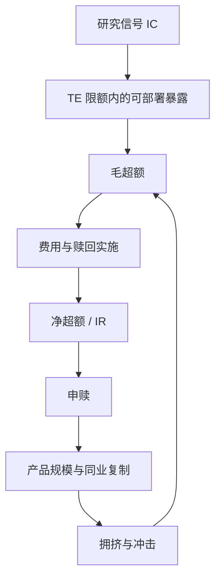

# 指增产品超额衰减

异常在发表之后样本外显著变弱；可预测性被套利、被成本、也被多重检验高估。产品化把同一过程从论文表格搬到申赎与排名。

<footer>—— McLean and Pontiff, Does Academic Research Destroy Stock Return Predictability?, Journal of Finance, 2016</footer>

指数增强（指增）承诺在跟踪某一基准——沪深 300、中证 500、中证 1000 等——的同时交出正的超额。纸面来源通常是截面因子、机器学习排序或行业配置，基准负责 beta，增强负责残差。McLean 与 Pontiff 记录学术异常在发表后衰减；指增把「发表」换成「产品规模与同业复制」。超额的半衰期因此不只由信号的 IC 期限结构决定，见[因子衰减与换手](/quant/factor-decay-turnover)，还由容量、拥挤与投资者申赎共同决定。本篇写超额如何从回测走进产品、又如何被产品自己消耗，衔接[容量](/quant/capacity-participation)与[过拟合作为风险](/quant/overfit-as-risk)，不把某一阶段的正超额写成永续工艺。

## 问题

记组合相对基准的超额为 $\alpha_t=R_t-R_{b,t}$。跟踪误差 $\mathrm{TE}=\mathrm{sd}(\alpha)$ 被合同或内部限额钉住；信息比率 $\mathrm{IR}=\mathbb{E}[\alpha]/\mathrm{TE}$ 是销售常用的数。问题是 $\mathbb{E}[\alpha]$ 在三个时钟上都会变：信号自身的 IC 衰减、同策略资金进入后的拥挤衰减、以及费用与冲击把毛 $\alpha$ 变成净 $\alpha$。Grinold 的 $\mathrm{IR}\approx\mathrm{IC}\times\sqrt{B}$ 在无摩擦世界里鼓励加广度；在指增里，广度往往来自基准里更小、更贵的名字，广度与成本负相关。

第二句话是基准选择。中证 500 / 1000 增强在一段样本里可以同时受益于小市值与特定因子；当小市值拥挤反转，超额与基准本身的风格暴露缠在一起。投资者赎回的是「没跑赢」，管理人归因的是「风格不在座位上」。若不把超额拆成风格、残差与成本，衰减叙事会在三个层次之间滑来滑去。

### 跟踪误差限额把衰减写成被迫的换手

TE 上限迫使组合贴近基准。信号若仍按全宇宙排序，会被限额剪掉最偏离基准的那些赌注——往往也是 IC 最高的那些。于是产品化之后，可部署的广度小于研究里的广度。信号衰减时，若仍为了维持旧的 IR 预期而加码残差，TE 先超限，然后在超限后的减仓里实现冲击。衰减因此不是平滑的 IR 下降，而是「限额内缓慢变差 → 超限或赎回 → 一次性成本」。Novy-Marx 与 Velikov 对高换手异常的成本分类，在指增里变成：为了维持暴露，换手在拥挤期上升，净超额先于毛 IC 归零。

相对基准的日超额序列自相关很低时，IR 的估计误差很大。用一年窗口宣称「IR 掉了」可能只是采样。衰减应报告滚动 IR 的置信带，以及相对风格中性基准的超额，而不是只贴一条累计超额曲线。

## 方法

把超额分解成可加的三块，滚动估计，避免一次全样本回归讲完故事。

$$
\alpha_t=\alpha^{\mathrm{style}}_t+\alpha^{\mathrm{idio}}_t-c_t.
$$

风格块用基准成分上可投资的风格因子（市值、价值、动量、低波、行业）做[行业中性](/quant/industry-neutral)与[市值中性](/quant/size-neutral)之后的残留暴露；残差块是限额内真正的选股；$c_t$ 是价差、冲击与费用，见[费用敏感性](/quant/cost-sensitivity)。McLean–Pontiff 的发表后衰减对应这里的残差块在同业复制后变弱；风格块的变弱是风险溢价或拥挤定价，不是同一检验。

容量实验：固定 TE 限额与参与率上限，把 AUM 从研究规模扫到产品规模，看净 IR 曲线，方法同容量篇。指增的 $A$ 不是抽象数字，而是已发行份额；赎回使 $A$ 在最难交易的日子下降，但下降本身要求卖出超额腿。应单独报告「赎回日的实施缺口」：这一项不会出现在没有申赎的回测里。

过拟合：产品立项往往已经过一轮因子搜索。White 的 Reality Check 与 Bailey 等人的过拟合次数，要求把搜索过的配置写进原假设，见[过拟合次数](/quant/backtest-overfitting)。用立项后样本做真正的样本外，立项前样本只报告一次，不再调参。机器学习指增还要把 [GBDT](/quant/gbdt-alpha) 与 [Gu–Kelly–Xiu](/quant/gkx-nn3) 的样本外 $R^2$ 翻译成限额内可交易 IR，而不是把论文表格当产品说明书。

### 拥挤代理：同业相关与因子载荷离散度

同类指增收益的截面相关上升、对同一组小市值或反转因子的载荷同步，是拥挤状态。2007 年量化熔断与 2024 年微盘压力在机制上同属「规则同步」，见[拥挤螺旋](/quant/crowding-spiral)与 [DMA 与微盘](/quant/dma-microcap-crisis)。代理还可以用因子组合的换手与短端借款需求（若可观测）。拥挤高时，应下调残差风险预算，而不是加码「均值回复」去抄同业的抛盘——后者把产品变成拥挤的另一侧，仍是同步规则。

## 机制

衰减的微观机制有三条，常常叠在一起。其一，信号被学习：分析师、风险模型与竞争对手把同一列特征写进模板，Cohen–Frazzini 式的滞后缩短，见供应链相关篇；截面 IC 的半衰期变短。其二，价格冲击：Korajczyk–Sadka 表明动量一类策略的可交易利润随规模假设而变；指增把规模变成了共同的 AUM。其三，投资者行为：超额好时申购涌入，被迫在昂贵的时候加仓；超额坏时赎回，被迫在浅市场减仓。Berk–Green 对主动管理规模的讨论在这里是产品层的：技能被规模稀释，直到净超额让边际资金无感。

A 股还有制度项。T+1、涨跌停与融券约束使空头腿与论文里的多空不可比，见[做空约束](/quant/cn-short-constraint)。多头增强在下跌的拥挤因子上只能减仓、不能对称做空，超额的负端更肥。把美股多空异常的衰减速度套到国内指增，会低估产品在压力周的跟踪误差实现。

「超额衰减」有时只是基准风格切换：500 增强在小盘因子上的正暴露，在小盘拥挤反转时变成负超额，残差选股可能仍在。归因若不算风格，会把风险溢价的实现误写成模型失效，或把模型失效误写成风格。

### 机器学习指增并不自动免疫衰减

Gu–Kelly–Xiu 的样本外 $R^2$ 是统计对象；Avramov、Cheng 与 Metzker 加上经济约束与可交易性后，增益下降。指增若把神经网络分数直接映射到 TE 限额内的权重，换手与拥挤仍按分数自相关收费。衰减诊断应画 IC$(h)$ 与净 IR 对 AUM 的曲线，而不是用训练 $R^2$ 证明「这一代模型不会拥挤」——拥挤发生在持仓空间，不发生在损失函数里。

## 边界与工程取舍

不要用费前、冲击前、无限借空的回测去对标费后产品。不要在赎回周过后用同一周数据重估因子再宣称「模型已修复」。不要把跟踪误差用满当成勤勉：限额是风险预算，不是业绩目标。可做的是：预先规定风格中性程度、容量曲线、拥挤降杠杆规则，以及立项后样本的锁定。

出处：McLean and Pontiff, *JF*, 2016；Novy-Marx and Velikov, *RFS*, 2016；Korajczyk and Sadka, *JFE*, 2004 / 相关成本与动量可交易性文献；Grinold 的 IR 分解；Berk and Green, *JPE*, 2004；Avramov, Cheng and Metzker, *Management Science*, 2023。

## 小结

- 指增超额同时受信号衰减、拥挤容量与申赎冲击三条时钟驱动；产品化本身是衰减机制的一部分。
- 分解风格、残差与成本，避免把基准风格切换写成选股失效。
- TE 限额削减可部署广度；净 IR 必须在限额与参与率约束下估计。
- 同类产品相关是拥挤代理；压力周的赎回实施缺口不会出现在无申赎回测里。
- 出处：McLean–Pontiff, *JF*, 2016；Novy-Marx–Velikov, *RFS*, 2016；Berk–Green, *JPE*, 2004；Avramov–Cheng–Metzker, 2023。
