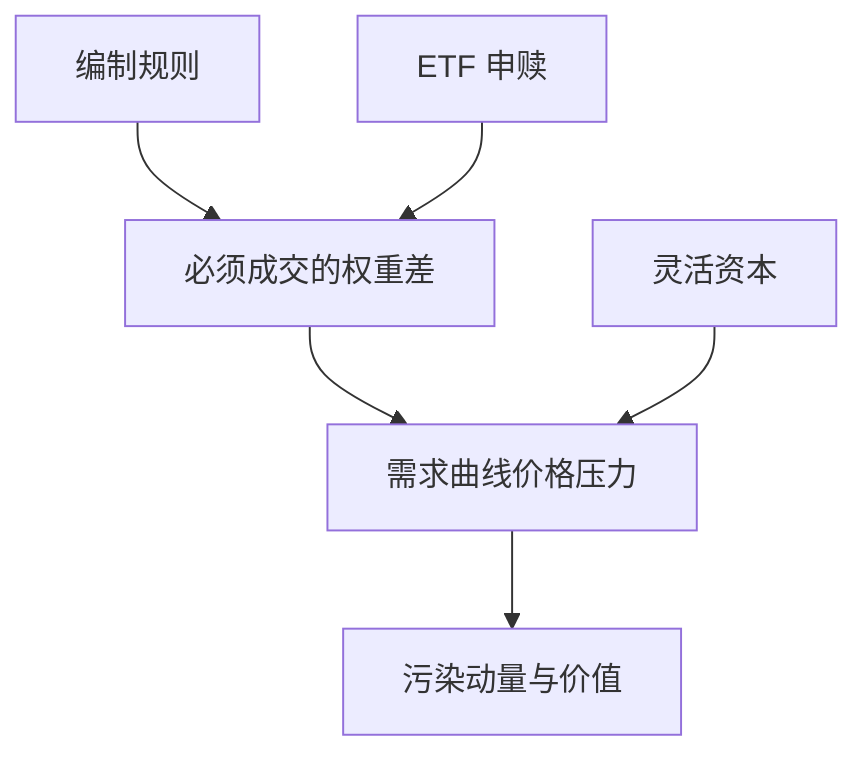

# 指数纳入与被动流

被动资金必须在规则指定的时点买进新成分、卖出旧成分；价格压力来自向下倾斜的需求曲线，不是来自对新基本面的发现。

<footer>—— Shleifer, Do Demand Curves for Stocks Slope Down?, Journal of Finance, 1986；调仓执行见 Chen, Noronha and Singal 与指数调仓课</footer>

[上一课](/quant/earnings-season-strategies)的催化剂是公司公告。指数纳入的缺口是**机械、预先公告的被动需求**。主干 [指数调仓套利](/quant/index-rebalance-arb) 已写宣布日–生效日的冲击与跟踪误差权衡。本课放策略地图：纳入溢价、删出折价、ETF 申赎流，以及它们如何污染动量与价值因子——不要把需求冲击写成新的风险溢价再对 [CAPM](/quant/capm) 回归一遍。

## 问题

Shleifer、Harris–Gurel 用标普纳入当作需求曲线实验：消息几乎无信息，价格仍动。其后 ETF 把被动流变成每日创造赎回，Ben-David、Franzoni、Moussawi 等讨论波动与非基本面交易。问题是策略定义：吃纳入的人在和指数产品抢流动性，容量随被动份额上升先变好后变差（更多流量，也更多同类套利）。与事件驱动：完成风险低（规则几乎确定），但生效日拍卖的缺口风险高。

因子污染：调入名单偏大盘、偏动量、偏流动性。静态价值/动量若在调仓周异常，先减掉被动流再谈 alpha。

### 永久需求与临时冲击

若指数基金会长期持有，纳入后价格不必完全回吐。若杠杆账户只在窗口内做市，生效日后会回吐。产品宣传常把历史「纳入溢价」当永续 alpha；被动份额与抢跑程度已经改写了这笔租金。

跟踪误差约束迫使指数基金在生效日集中成交。套利者若更早完成，赚的是 TE 预算换来的流动性补偿，见后课基准与跟踪误差。

## 方法

事件：纳入、删出、权重再平衡、ETF 篮子申赎。信号只用公开规则与预告名单。执行：相对拍卖、相对 VWAP 的实施缺口单独记账。风险：在篮子里做多调入、做空调出时的残差行业与动量。容量：与 ETF 资产管理规模同期估计，不用 1990 年代纳入溢价外推。

## 机制

编制规则把市值与流动性映射成必须成交的 $\Delta w$。灵活资本提供流动性，收取冲击补偿。被动份额越高，机械流越大，因子与 ARP 的再平衡也越同步——拥挤与被动流是同一管道的两端。

## 边界

本课不写刺探未公开审核名单。自定义指数与智能 beta 的规则若可复制，同样适用，并更快拥挤。中国指数与 T+1 约束见中国课，不要照搬标普拍卖。

## 小结

- 纳入与被动流是机械需求，不是基本面发现。
- 租金随被动份额与抢跑改变，不可用早期样本当产品。
- 先从因子收益里减掉调仓周，再谈溢价。
- 出处：Shleifer, *JF*, 1986；Chen, Noronha and Singal, *JF*, 2004；执行细节见指数调仓课。
