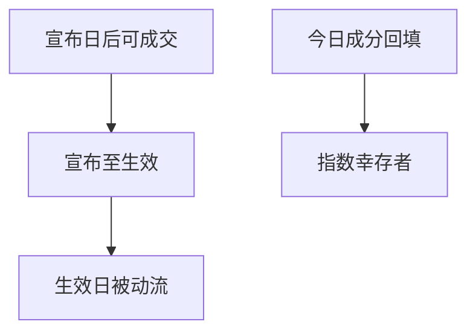

# 指数调入调出

调入日的被动买盘是可预期的订单，不是意外基本面；用生效后的成分回填历史因子宇宙，会把后来才进指数的公司当成一直可交易的大盘。

<footer>—— 据 Shleifer, Journal of Finance, 1986；Wurgler and Zhuravskaya, Journal of Business, 2002 整理</footer>

上一课[并购套利](/quant/merger-arb-event)交易的是公司控制权事件。指数调入调出交易的是**机械资金流**：被动产品必须在生效日附近买调入、卖调出。本课补两件事：事件策略如何避免前视，以及因子宇宙不得用今日成分回填。不写指数编制手册全文。

## 问题

Shleifer 记录标普调入伴随价格上涨，把需求曲线倾斜写进经验。Wurgler–Zhuravskaya 强调替代弹性有限时，指数买盘造成持续或半持续的价格压力。回测偏差有两条。事件策略：用最终生效名单在宣布前建仓，或假设能在生效日收盘按收盘价与全体被动资金同时成交——你没有那么多队首位置，这点留给 LOB，但本课至少不能用生效日 VWAP 当自己的成交且零冲击。因子宇宙：用当前指数成员往回切历史样本，丢掉调出与退市，又是幸存者，且偏向后来变大的公司。

财务课的行业分类与指数行业配额互动：调入常为了维持行业权重，分类键必须 PIT。

### 调入不是盈利惊喜

价格上涨可以来自机械买盘，不必来自基本面改善。把调入后的回报当成质量或盈利因子的验证，会把被动流记进基本面 alpha。本课把指数事件从因子信息集里分开：宇宙可以用指数成员，但那是可投资定义，不是基本面信号。

宣布日与生效日之间常有数日到数周。纸面策略若两头都按收盘完美成交，等于既吃了宣布跳空又当自己是生效日的全部被动流。

## 方法

事件：在宣布后第一可成交价按预期被动流的方向布局，或只交易宣布到生效之间的价差，预先声明。成交量受容量约束，用参与率上限，而不是全额指数权重。生效日附近冲击留给执行模型；本课要求至少扣一个惩罚或降低规模。因子：每个形成日用**当时**指数成分或当时全市场宇宙，调出公司在调出后离开指数宇宙，但仍按退市/上市规则留在全市场宇宙直到真正离开市场。

不要用后来才存在的指数（某主题指数 2020 年才发布）去切 2010 年样本还称为「当时可投资」。

被动份额越大，生效日越不好当流动性提供者还假设自己吃满价差。回测用参与率上限（例如不超过当日成交的一个很小比例）截断规模，剩余信号视为无法实施。因子层面，形成日成分是可投资定义；调出股票若仍上市，可留在全市场宇宙，只是离开指数子集。不要把两条宇宙混称为同一个 HML。

## 机制

被动份额上升时，调入的价格压力变大，套利者需要更多资本去提供流动性。资金课的占用在这里是库存风险：你买调出、卖调入，等待生效日对手盘，期间有 beta 与借券。失败模式不是并购破裂，而是生效日流动性不足、停牌或涨跌停让被动流挤在可成交边上，价差不收敛。纸面收敛假设没有这条制度摩擦。

后课涨跌停会让「生效日必须成交」的被动账户把订单堆在涨停板上。套利回测若假设自己也在板上完全成交，是在与被动抢一个不可得的队列。

因子宇宙用形成日成分或当时全市场，不用今日成员回填。事件策略在宣布后开仓，生效日规模受参与率上限，不得按指数全额权重、零冲击、收盘完美成交。主题指数在发布日之前不存在，不能回切十年当「当时可投资」。调入回报与基本面因子分列，避免把被动流验证成盈利或质量。

## 边界

不估计指数编制的全部规则，不写 ETF 申赎机制全文。下一课系统处理停牌与涨跌停。后课默认：指数宇宙按形成日成分；事件开仓在宣布后；生效日全额零冲击成交不合法。

后课涨跌停会让生效日被动单堆在板上。本课至少禁止全额零冲击。宇宙按形成日成分。调入回报不验证基本面因子。主题指数发布前不可回切。宣布日至生效日的价差策略，占用与借券按库存风险计，而不是按隔夜事件计。

后课默认指数宇宙按形成日成分，事件开仓在宣布后；生效日全额零冲击成交不合法。

宣布到生效之间若遇到停牌或涨跌停，被动流与套利单都堆在可成交边上。回测不得假设自己在板上与被动同时全额成交；规模按参与率截断后，剩余视为无法实施。

## 小结

- 调入调出是机械资金流，不是盈余意外。
- 今日成分回填历史 = 指数版幸存者。
- 宣布日与生效日是两个事件，不能两边都按完美收盘成交。
- 容量与借券约束使纸面收敛偏乐观。
- 因子可用当时成分当宇宙，但不可把调入回报记进基本面 alpha。
- 出处：Shleifer (1986)；Wurgler and Zhuravskaya (2002)。
