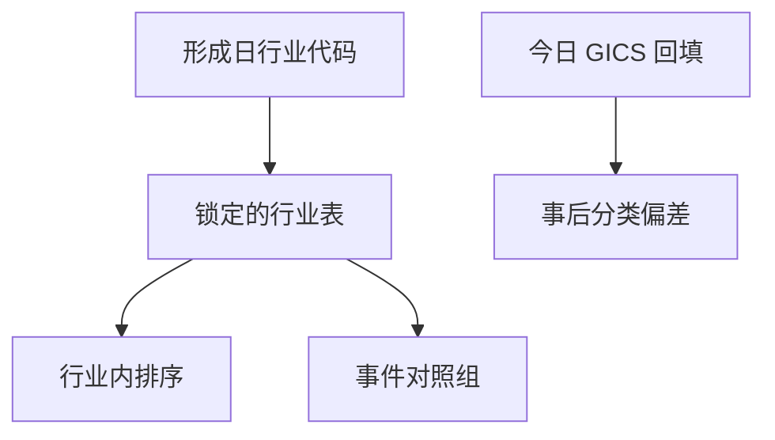

# 行业分类与可比公司

截面排序若跨过会计规则与商业模式完全不同的公司，价值与质量比较的是标签，不是可比净资产；行业是当时的分类，不是今天回填的 GICS。

<footer>—— 据 Fama and French, Journal of Financial Economics, 1997 行业组合；GICS / SIC 构造说明整理</footer>

上一课[财报公告窗口](/quant/earnings-announcement-window)用行业调整减轻财报季的共同冲击。更一般地，账面、应计、有效税率都在行业内更可比。本课把「行业」写成因子管道里的分组键，并强调分类本身也要 PIT。下一课才把各因子指回具体报表字段。

## 问题

[账面价值与无形资产](/quant/book-intangibles)已经说明费用化规则随行业而变。把银行与软件公司排在同一个账面市值截面，便宜与贵混进了杠杆与会计选择。Fama–French 用 SIC 映射出 48 个行业组合，既做行业调整，也做基准。缺口是：分组键必须是**形成日有效的行业代码**。公司会迁行业、GICS 会修订、vendor 会用最新代码回填历史，于是历史「科技」里出现后来才被改分类的公司，或反过来。

可比公司还用于估值倍数。倍数研究若用今天的同业名单回看十年，名单本身是幸存者加事后分类。

### 行业中性不是消除风险

行业中性去掉的是行业均值，留下的是行业内相对便宜或相对高质量。行业动量、行业景气仍可以是风险或 alpha，只是不在本课的基本面截面里。把行业中性理解成「没有行业暴露」，会在后课组合构建时漏掉对冲不足。

金融与公用事业在 Fama–French 股票因子里常被剔除或单独处理，因为杠杆与账面对它们含义不同。这是分类决策，不是数据缺失。

## 方法

在形成日 $t$ 取当时有效的 SIC/GICS/申万代码，映射到你锁定的行业表（FF48、GICS 四级等）。代码变更从公告或 vendor 的 PIT 行业文件生效，不回溯改写 $t$ 之前的分组。行业内排序：对每个行业把账面市值、应计、盈利标准化或做分位数。事件研究的对照组用同行业、近市值，且对照公司在事件日仍在当时宇宙。

不要用未来才存在的行业分类体系去切历史样本——那是另一种 restatement。若体系在样本中途更换，要声明断点，而不是静默映射到「最接近的新标签」。

映射表版本冻结，GICS 修订按生效日切换。组内过小则升一级分类。金融与公用事业剔除规则与价值说明书绑定，禁止因子之间各改一套。

## 机制

行业键的作用是让会计尺度相近的公司比较相对位置，从而使价值、质量、有效税率的截面更像「同一套报表规则下的差异」。它也会吸收行业共同新闻，使公告窗口的残差更干净。代价是：行业定义越细，组内样本越少，分位数不稳定；越粗，不可比性回来。后课分部数据会指出：多元化公司的总部行业代码只是一个标签，真实可比可能在分部层。

指数调入调出常按行业配额。后课指数事件会用到同一套分类，必须与因子管道用同一 PIT 代码，否则两边的「同业」不是同一群公司。

形成日取当时代码，映射表版本也要冻结：GICS 2016 与 2018 的结构不同，静默用新表切旧样本会把公司「迁」到它们当时还不在的桶。金融、公用事业、房地产是否剔除，与 Fama–French 说明书保持一致并整段样本执行。行业内分位在组内样本过少时退化，应设最小组内个数，否则细分类等于噪声排序。

## 边界

不讲产业组织，不估计投入产出表。分部与地域下一课之后才展开。Fama–French 因子构造是否行业中性，以你锁定的说明书为准（经典 HML 不是行业中性的）。后课默认：凡行业调整，键为形成日分类；今日代码不得回填。

后课因子来源、指数调入、事件对照都要共用形成日行业键。GICS 修订按生效日切换映射表，不回溯。金融与公用事业的剔除规则与价值因子说明书绑定，禁止在盈利因子里悄悄改一套。组内过小则合并到上一级分类，而不是让三五只股票决定一个行业分位。

后课默认凡行业调整，键为形成日分类；今日 GICS 不得回填，对照组与指数事件共用同一键。

公司迁行业按当时公告或 vendor PIT 行业文件生效，不把后来的科技标签贴回它还在传统制造桶里的那些形成日。指数配额与因子行业中性必须用同一把键，否则「同业」两边不是同一群。

## 小结

- 跨行业比较账面与应计，尺度不同。
- 行业代码必须 PIT，GICS 修订不得回溯。
- 行业中性留下组内相对位置，不是零行业风险。
- 金融与公用事业常常单独规则。
- 对照组与指数事件要共用同一分类键。
- 出处：Fama and French (1997) 行业组合；GICS/SIC；Fama–French 因子构造说明。
