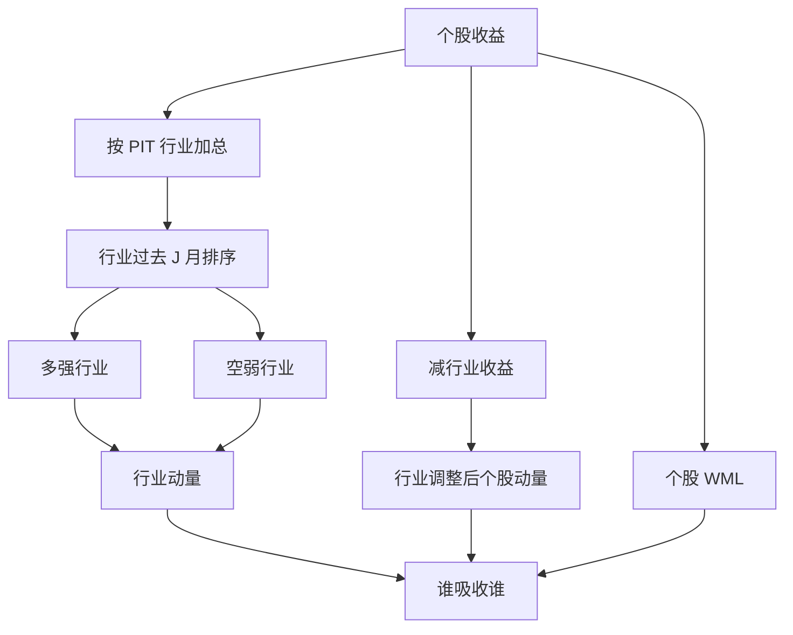

# 行业动量

买入过去表现强的行业、卖出弱的行业，所得利润至少与个股赢家减输家相当；把行业动量拿掉之后，个股动量剩下的部分显著变薄。

<footer>—— Moskowitz & Grinblatt, Do Industries Explain Momentum?, Journal of Finance, 1999</footer>

[截面动量 WML](/quant/momentum-wml) 按个股过去收益排序。Moskowitz 与 Grinblatt 问的是另一层：相对强度是不是主要活在**行业**上。他们用美股行业组合的过去收益做多空，发现行业动量本身就强；控制行业之后，个股动量的很大一块被吸收。这不是把 WML 换成行业 ETF 那么简单：排序对象、中性化与换手都变了。A 股的申万或中信一级行业是公开分类，复制必须写清分类版本与调入调出日，不能把「行业中性后的个股动量」叫做本篇的对象。

## 问题

Jegadeesh–Titman 的中间 horizon 延续，可以来自公司特异信息缓慢扩散，也可以来自行业共同冲击。若投资者按行业配置、分析师按行业覆盖、资金按行业轮动，则价格发现会先发生在行业均值上，个股只是被带着走。此时用个股 12−1 排序，等于把行业趋势重复计了 N 次，看起来像很强的个股动量，其实是同一条行业腿的放大。

反过来，若动量是公司层面的反应不足，行业等权之后还应剩下显著的残差动量。Moskowitz–Grinblatt 要分辨的正是这两条。问题不是「要不要做行业配置」，而是：形成期收益里有多少是行业共同部分，交易时是买行业组合还是买行业内赢家。

### 行业动量不是行业中性

[行业中性](/quant/industry-neutral) 是在每个行业内部做多空，把行业暴露从个股因子里挖掉。行业动量相反：它**要**行业暴露，多强行业、空弱行业，行业内可以等权或按市值加权。把「申万一级中性后的 WML」的 t 值写成 Moskowitz–Grinblatt 的复制，符号都可能对不上——中性化之后行业动量被设计成接近零。

行业分类是时点对象。申万、中信会修订成份与层级；用今天的分类回填十年前的成份，等于让当时还不存在的行业标签去解释当时的收益。分类须按调入调出公告做 point-in-time，见[时点基本面](/quant/point-in-time)。

## 方法

原文口径：把股票按行业归入组合，行业收益用成份等权（也可价值加权作稳健）。在 $t$ 月末按过去 $J$ 个月行业收益排序，买入最强的一组行业、卖出最弱的一组，持有 $K$ 个月；重叠持有时对 vintage 等权。Moskowitz–Grinblatt 的主结果显示，短形成期（约 1–12 个月，尤其 6 个月附近）的行业动量已经能解释相当一部分个股动量利润。

诊断应并行三列，而不是只报告最好的一列：

1. 个股 WML（12−1 或 J/K）；
2. 行业动量（行业组合排序）；
3. 行业调整后的个股动量（个股收益减所属行业收益后再排序，或对行业虚拟回归取残差）。

若 (2) 强而 (3) 弱，行业是动量的主要载体；若 (3) 仍强，才谈公司特异动量。A 股还要加第四列：在可投资宇宙里做行业动量——剔除[ST / 退市](/quant/cn-st-delist)、停牌、以及空头不可得的名字，见[融券约束](/quant/cn-short-constraint)。行业空头若只能低配而不能融券，组合变成「超配强行业」，净市场暴露不再为零。

### 分类粒度与加权

一级行业（约三十个）换手低、容量大，信号钝；二级、三级更接近个股，噪声与停牌缺腿上升。粒度是超参，必须预指定，不能在一级与三级之间挑 t 最大的。等权行业让小盘成份主导行业收益，价值加权则接近行业指数。A 股小盘与[壳](/quant/cn-shell-premium)会污染等权行业收益，价值加权或先剔除最小市值组是默认，不是美化。

行业动量的换手低于个股十分位 WML：行业标签月度变动少，再平衡主要来自排序换组。成本应按行业组合的调仓量估，不要套个股动量的双边价差。持有期一个月与重叠六个月要分开报；重叠降低换手，也让形成期与持有期在时间上纠缠，标准误需按 Hansen–Hodrick 或 Newey–West 处理重叠。

## 机制

行业共同信息（需求、监管、商品价格、信用条件）先进入行业指数，再扩散到覆盖不足的成份。Hong、Lim 与 Stein 的缓慢扩散在行业层同样适用：分析师与资金按行业组织，强行业继续吸引配置，弱行业继续被低配。这解释为何行业动量可以强于经过行业调整的个股动量——个股排序在重复计行业。

行为上，主题投资与行业轮动是同一条注意力：媒体与卖方报告以行业为标题，散户订单流在行业内高度相关。风险上，行业动量暴露的是时变的行业风险溢价，不是一个正交于市场的「纯 alpha」。强周期行业在扩张期进赢家组，本身带宏观 β。报告行业动量应同时给相对市场、相对[三因子](/quant/ff3)的 α，以及行业集中度，而不是只给多空均值。

### 与时间序列动量、跨资产动量的边界

行业动量仍是**截面**：每个日期强制多相对强的行业、空相对弱的。所有行业都在涨时，它不会变成全员做多——那是[时间序列动量](/quant/tsmom)的逻辑。[价值与动量无处不在](/quant/value-momentum-everywhere)里的动量，对象是国家、商品、外汇等资产类，行业只是股票内部的一层分组。不要把 CTA 的趋势夏普、个股 12−1 与申万一级动量画在同一张图上当互相复制。

A 股涨跌停使行业收益在成份集体封板时被截断，次日开盘集合竞价承担补记，见[涨跌停与集合竞价](/quant/cn-limit-auction)。行业动量的持有期收益里含有「板」的配给，回测须用可成交价，不能假设行业指数点位可按任意量成交。

Moskowitz–Grinblatt 的结论是「行业解释了相当一部分个股动量」，不是「个股动量不存在」。残差动量在部分样本仍显著。复制的诚实做法是报告吸收比例，而不是用行业动量替换 WML 后宣称动量消失。

## 边界与工程取舍

不要用今天的申万 2021 版分类回测 2005 年。不要在一级、二级、概念板块之间搜完再只贴最好的 t；概念板块尤其接近数据挖掘，且成份由供应商定义，不是交易所分类。不要把行业动量的空头腿写成可融券的对称空头而不加可行集。

容量：一级行业指数与行业 ETF 提供可交易代理，但 ETF 有溢价折价与申赎约束；用成份股复制则受停牌、涨跌停缺腿影响。风险模型里行业因子已经解释协方差的大头，交易行业动量会与风险预算打架——超配的强行业往往也是风险模型里要限制的集中度。

出处：Moskowitz & Grinblatt, *Journal of Finance*, 1999。个股动量见 Jegadeesh & Titman, 1993。A 股复制须声明行业分类供应商与版本、加权、以及是否剔除最小市值与风险警示股。

## 小结

- 行业动量按行业组合的过去收益截面排序，多强空弱；它要行业暴露，不是行业中性。
- Moskowitz–Grinblatt（1999）表明行业动量本身强，且能吸收相当一部分个股 WML。
- 复制须并行报告个股动量、行业动量与行业调整后动量，并预指定分类粒度。
- A 股须用时点行业分类，处理涨跌停、停牌与空头可行集；等权行业易被小盘与壳污染。
- 行业动量带周期与宏观 β，不应只报多空均值。
- 出处：Moskowitz & Grinblatt, *Do Industries Explain Momentum?*, Journal of Finance, 1999。
