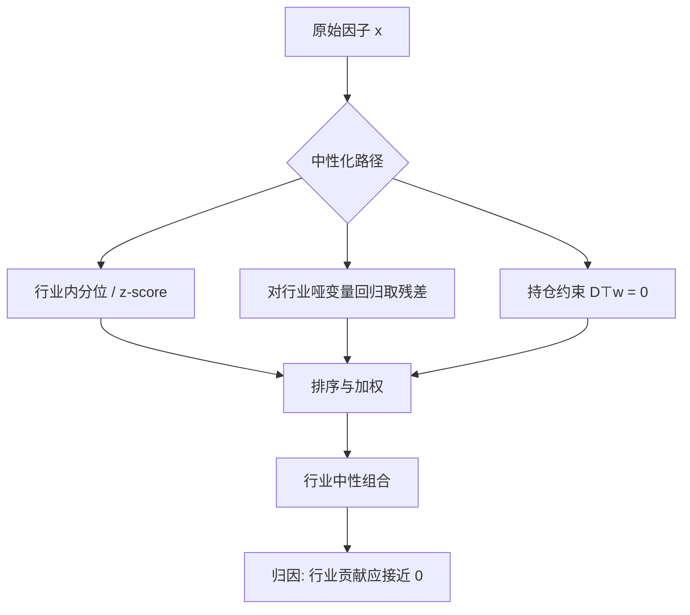

# 行业中性

许多所谓的风格超额，其实是行业配置的别名；把行业暴露从截面里拿掉，才谈得上在测因子，而不是在测板块轮动。

<footer>—— 因子中性化的工程常识，对照 MSCI Barra 行业因子与 Moskowitz–Grinblatt 行业动量</footer>

[上一课](/quant/long-short-sort)用滞后特征、NYSE 断点、组内加权把截面预测收成可持有多空，并强调空头可实现性属于定义。缺口是组合在不知不觉中买进了整个行业：高 B/M 组里银行、周期扎堆，动量组里同一主题龙头彼此相关。不做行业中性，回测里的多空可能只是「当时那个行业涨了」。本课问：行业权重被钉住或残差化之后，信号还有没有截面预测力。不重写十分位与 2×3 的排序手续。

## 问题

单因子排序已经能收成可持有多空；留下的是多空腿里的行业配置。股票收益的协方差矩阵有一块很大、很稳定的块对角结构：同行业个股同涨同跌。Chen、Roll 与 Ross 把宏观冲击写进定价，Barra 把行业写成显式因子，都是在承认这件事。因子研究若只按全市场分位排序，行业均值会直接进入多空腿。价值因子在成长股泡沫期看起来极强，往往是因为它空了科技、多了金融；动量在主题行情里看起来极强，往往是因为它在行业内部并没有真正选股。

Moskowitz 与 Grinblatt（1999）表明，美国股票动量有很大一部分可以被行业动量解释：买入过去强势行业、卖出弱势行业，已经能复制相当比例的 Jegadeesh–Titman 收益。反过来，行业内动量仍然存在，但强度和换手都变了。这件事对 A 股同样尖锐。申万一级里银行、非银、周期、成长的市值权重极不均匀，市值加权的「全市场价值」几乎就是金融相对成长的赌注。

### 行业暴露如何混进因子

设截面上股票 $i$ 属于行业 $g(i)$，原始因子载荷为 $x_i$。若 $x$ 在行业间均值不同，则多空组合权重 $w$ 满足

$$
\sum_{i:g(i)=g} w_i \neq 0
$$

对某些 $g$。行业因子收益 $f_g$ 就会进入组合：$w^\top r = w^\top(\sum_g 1_{g} f_g + u)$。中性化的目标不是消灭行业，而是让 $w$ 在每个行业（或每个行业相对基准）上净暴露为零，使 $w^\top r$ 主要来自行业内残差 $u$。

「中性」永远相对于某个分类与某个基准。对等权截面中性，和对沪深 300 的行业权重中性，是两个不同的组合。回测里不写清楚分类与基准，中性化数字无法复现。

## 方法

实务上有三条路，由松到紧。

第一，行业内排序。每个行业内把 $x_i$ 转成分位或 z-score，再在全市场按中性化后的分数排序。这是最常见的「相对行业的选股」。行业内样本太少时分位不稳定，通常要设最低只数或并入相近行业。

第二，截面回归残差。用行业哑变量（可再加对数市值）回归因子，取残差 $\tilde{x}$ 作为纯化信号：

$$
x_i = \alpha + \sum_g \delta_g D_{ig} + \varepsilon_i, \qquad \tilde{x}_i = \varepsilon_i.
$$

加权最小二乘里权用市值或流动性，残差对应的是「相对市值加权行业均值」的偏离。Barra 风格因子的描述子，很多就是在行业与市值上做过这种纯化。

第三，组合约束。优化或解析加权时直接加 $D^\top w = 0$（或等于基准行业权重）。排序中性保证的是信号中性，不保证组合中性：若头部股票集中在某行业，按分数加权仍会漏出行业暴露。约束是把中性从信号层推到持仓层。

### 分类方案不是细节

美国研究常用 GICS；A 股常用申万、中信、中证。同一只股票在不同方案里可以跨一级行业。综合企业、平台公司、业务转型期的标的会让哑变量失真。更细的三级分类让行业内样本变少，中性化变成噪声放大；过粗的一级分类又把「医药里的 CXO 对中药」这种结构性差异留在因子里。分类还要随时间点调整：用未来的行业归属回填历史，是一种前视偏差。

行业中性不是把行业动量扔掉。若策略要交易行业，应显式做行业配置，而不是让它寄生在选股因子里。混在一起时，衰减速度、容量和回撤形态都无法归因。

## 机制

行业中性改变的是因子的经济含义。原始价值可能在赚「便宜行业」的钱；行业中性价值在赚「同业里更便宜的公司」的钱。两者的风险源不同：前者接近板块轮动与宏观 beta，后者更接近公司质量、杠杆与盈利预期差。Asness、Frazzini 与 Pedersen 在全球价值与动量中强调行业中性版本，正是为了把风格premia从国家、行业配置里剥离出来。

统计上，行业哑变量回归是把信号投影到行业空间的正交补。若行业空间已经解释了 $x$ 的大部分截面方差，中性化后的 $\tilde{x}$ 会变弱、换手上升，IC 的衰减也可能加快——因为行业均值通常比个股残差更持久。这不是中性化「损害了因子」，而是它拆掉了你本来不该算进选股的那截慢变量。

### 中性化之后仍可能残留

哑变量只吸收行业均值。行业内若还有风格聚集——小市值集中在某些制造子行业、高波动集中在题材股——市值、波动、流动性暴露仍在。更完整的做法是在同一截面回归里同时放入行业哑变量与对数市值、或直接对接基本面风险模型的行业加风格因子。另一侧，行业中性组合对行业分类误差敏感：错分一只超级权重股，约束 $D^\top w=0$ 会被它撬动。

风险模型里的行业因子与选股时的行业中性应对齐。用申万做中性、用 Barra/CNE 模型做风险，行业定义不一致时，优化器会看到「残留行业」并反复交易。这是中性化在生产环境里最常见的口径冲突。

## 边界与工程取舍

行业中性降低了与基准的跟踪误差中来自板块的那一部分，但通常提高换手：行业内名次比行业均值跳得更快。容量方面，中性化迫使你在行业内部找对手盘；若某行业可空头券稀缺，空头腿会失真，多头相对行业超配也无法被对冲。A 股融券约束下，「行业中性」经常退化成「行业内多头超低配」，净暴露并不为零。

不要把中性化当成提高夏普的开关。有些因子的溢价本来就主要来自行业（部分动量、部分主题拥挤）；中性化后统计显著消失，应解释为该因子不是选股因子，而不是回测程序写错。反过来，若中性化后收益几乎不变，说明原始因子本来就没有行业偏斜，再叠一层约束只是在付换手。

检查中性是否成功，不要只看「行业权重和为零」。应报告组合在风险模型行业因子上的暴露、行业贡献分解，以及去掉最大行业之后的多空收益。数字对得上，中性才算做完。

## 小结

- 行业中性把板块配置从选股信号里剥离，避免把行业轮动误报成因子溢价。
- 常用手段是行业内排序、对行业哑变量（及市值）回归取残差，以及组合层行业暴露约束；信号中性不等于持仓中性。
- 分类方案、时点、加权方式决定「中性」的基准；GICS、申万、中信不可混用，也不可用未来分类回填。
- Moskowitz–Grinblatt（1999）显示动量中有大量行业成分；Asness–Frazzini–Pedersen 的全球价值/动量研究把行业中性当作风格premia的标准呈现。
- 中性化后因子往往更纯、换手更高、容量更受行业内对手盘限制；融券不足时空头中性会失效。
- 应与风险模型的行业定义对齐，并用因子暴露与贡献分解验收，而不是只看权重加总。
- 出处：Moskowitz and Grinblatt, *Do Industries Explain Momentum?*, Journal of Finance, 1999；MSCI Barra 行业因子结构；Asness, Frazzini, Pedersen, *Value and Momentum Everywhere*, Journal of Finance, 2013。
