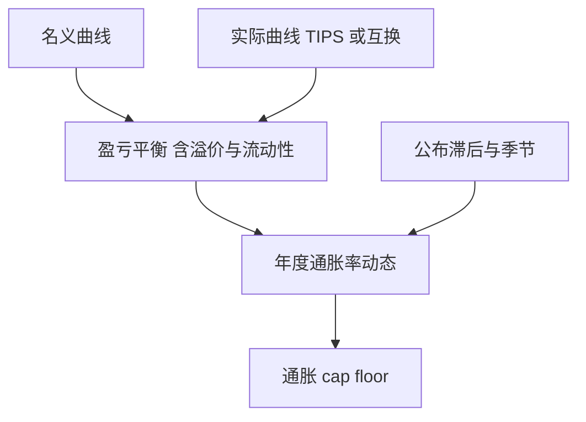

# 通胀挂钩

TIPS 与通胀互换交换的是 CPI 的约定滞后；零息通胀互换的价格定义实际贴现曲线，而不是「预期通胀」四个字。

<footer>—— Jarrow and Yildirim, Pricing Treasury Inflation Protected Securities and Related Derivatives, Journal of Financial and Quantitative Analysis, 2003</footer>

[上一课](/quant/weather-power-derivatives)的指数不可交易。通胀挂钩把 CPI 推进利率市场：TIPS、零息与年度通胀互换、通胀 cap/floor。缺口是**实际利率与名义利率的联合建模**，以及公布滞后、季节调整。主干曲线课已有名义 [Bootstrap](/quant/curve-bootstrap)。本课不重写名义曲线，只把实际曲线与 BEI（盈亏平衡通胀）接上，后课 caps 再用名义 vol。

## 问题

零息通胀互换：到期按 $\mathrm{CPI}_T/\mathrm{CPI}_0-1$ 对固定 $K$ 结算（有滞后）。其公平 $K$ 定义一条实际折现与名义折现的比。BEI 是名义与 TIPS 收益率之差，含流动性与通胀风险溢价，**不是**调查预期。问题是衍生品：yoY cap 写在年度通胀率上，需要 CPI 的动态，不是一个 BEI 点。Jarrow–Yildirim 用外汇类比：实际利率当「外国利率」，CPI 当汇率，名义当本币——于是 GK 式的三曲线加上实际与名义的相关。

滞后与季节：CPI 公布滞后若干月，互换用约定的参考指数。季节调整与未季调指数会让短端 yoY 噪声极大，校准短端 cap 要用指数惯例而不是光滑扩散。

### CPI 不是 GBM 现货

CPI 水平近似积分的通胀率，短期不可交易（除了互换）。库存套利不存在。JY 模型借用 FX 的完整市场叙述，是为了得到闭式，不是因为你可以 Delta 到「CPI 现货」。对冲工具是 TIPS、通胀互换与名义互换，基差（TIPS vs 互换）是一等风险。

欧洲 HICP 与美国 CPI-U、英国 RPI/CPIH 的定义不同，季节与住房权重不同。曲面不能跨指数拼接。

## 方法

校准：名义 OIS/政府曲线、TIPS 或通胀互换曲线、可选的通胀 vol（cap/floor 或期权）。JY 或市值模型（例如带微笑的 yoY 市场模型）生成 yoY 率。Cap/floor 用类似名义 cap 的 Black 或移位 Black，后课与负利率衔接——欧元区已出现负通胀与负实际利率。对冲：实际 DV01、名义 DV01、BEI 桶、滞后公布的缺口风险。

## 机制

名义零息债 = 实际零息债 × CPI 因子（理想化）。通胀互换把 CPI 因子做成可交易。期权再把 CPI 因子的波动卖掉。相关：名义利率升、通胀升时，实际利率的残差才是 TIPS 的独特风险。JY 把这写成三因子 Vasicek 型；生产更常用市场模型直接对 yoY 率建模，以便校准 cap。

## 边界

TIPS 流动性溢价使 BEI 低于互换隐含通胀，拆解必须分开。通缩地板（TIPS 本金地板）是嵌入期权，低通胀时有价值。LDI 与养老金的需求会把实际利率压到与「预期」无关的水平。本课不写宏观预测 CPI；对象是曲线与期权。

## 小结

- 通胀互换定义实际/名义的相对曲线；BEI 不是纯预期。
- yoY cap 需要 CPI 动态；JY 是 FX 类比闭式，对冲仍用 TIPS 与互换。
- 滞后、季节、指数定义是合约状态。
- 出处：Jarrow and Yildirim, *JFQA*, 2003。
