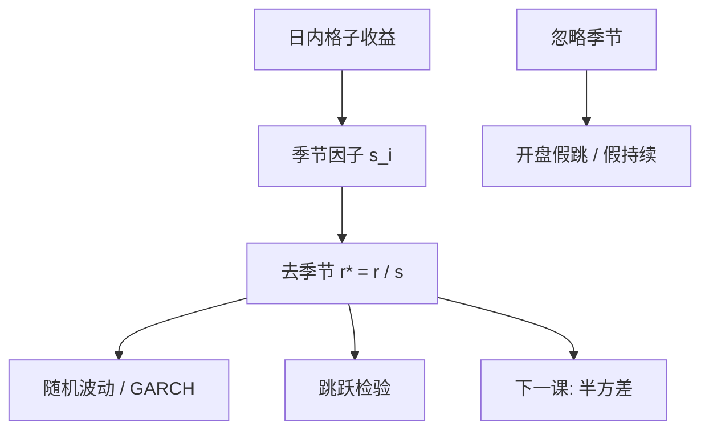

# 日内季节性

开盘与收盘附近的波动可以是午间的数倍；若不先除掉这条确定性的钟内形状，所有「随机」GARCH 与跳跃检验都会把闹钟当成新闻。

<footer>—— Andersen and Bollerslev, Intraday Periodicity and Volatility Persistence in Financial Markets, Journal of Empirical Finance, 1997；以及同作者对高频波动的后续计量</footer>

[波动因子](/quant/vol-factor-model) 给出日频共同方差。把一天切成五分钟，会看到 U 形或 J 形的确定性模式：开盘发现、收盘拍卖、午休。Andersen 与 Bollerslev 把这种**日内周期**从随机波动里拆出来，再用滤波后的序列看 ARCH 持续与宏观公告。本课缺口：日 GARCH/HAR 的信息集不含钟内形状；高频估计若忽略季节性，[跳跃检验](/quant/jump-tests) 会在开盘标假跳。下一课已实现半方差把正负收益分开，仍应在除季节之后做。

## 问题

记第 $t$ 日第 $i$ 格收益 $r_{t,i}$。$E[r_{t,i}^2]$ 随 $i$ 强变。把所有格当作同质去估 GARCH 或算 RV 签名图，开盘格主导平方和。问题是估计季节因子 $s_i$（或平滑函数 $s(t)$），使 $r_{t,i}/s_i$ 的二阶更齐次，再对去季节序列建模。

Taylor、Xu 以及后续用傅里叶、样条、或对每个格取中位数平方。对象是**确定性周期**，不是随机的 U 形每天变形——每天变形属于状态，应进滤波或局部估计。公告日的季节会抬高，Andersen–Bollerslev 用灵活傅里叶再加公告哑元。

### 与日历、隔夜

隔夜是另一格，常单独一项，见 [日历效应与隔夜](/quant/calendar-overnight)。午休（A 股、港股、东京）要把两段会话分开估 $s_i$，否则午间空洞被当成超长格。夏令时、提前收盘须用交易时钟而不是墙钟。期货与股票的 U 形可以不同步（股指期货在现货开盘前已忙）。

用全样本平均 $|r_{t,i}|$ 当 $s_i$，会被危机年绑死形状。应用滚动季节或对 log 平方做稳健位置。这与稳健回归课同一离群逻辑。

## 方法

**估计 $s$。** （1）对每个格 $i$ 用多年中位数 $|r_{\cdot,i}|$ 或 trimmed 均值；（2）Andersen–Bollerslev 灵活傅里叶：$\log s$ 对日内正弦余弦；（3）核平滑。标准化 $r_{t,i}^*=r_{t,i}/s_i$，使 $\sum_i s_i^2$ 与日 IV 的尺度约定一致（否则 RV 单位漂）。

**之后做什么。** 去季节后再：GARCH 持续、BN–S 跳跃、已实现核带宽、Hawkes 强度。不去季节就做 Lee–Mykland，开盘会一片「跳」。

**宏观公告。** 在已知时刻（非农、CPI）加瞬时抬高，或把该格从季节样本里分开。把公告效应写进 $s$ 会污染普通日的形状。

### 与 RV、HAR

日 RV 已经把季节积分进去，HAR 对日 RV 不必再除季节。对象一旦下到格内预测（下一刻波动），必须除季节，否则模型只是在预报几点钟。工程上：日频用 HAR；盘中用去季节的强度或 HAR 的日内版。

## 机制

季节来自交易时间表：开盘累积信息、做市重建报价、收盘指数与拍卖、午间人少。它是日历函数，不是鞅差。随机波动乘在季节上：$\sigma_{t,i}\approx s_i \tilde\sigma_{t,i}$。不拆开时，估计的「持续」一部分是 $s_i$ 的确定性相关（相邻格都在开盘高）。去季节后 $\tilde\sigma$ 的持续通常下降——这才是随机部分的记忆。

签名图：高频端上翘是噪声；开盘格的高 RV 是季节。两者在密采样里叠加。先季节、再噪声修正，顺序不能反：对未除季节的序列估噪声方差，会把开盘的真波动当成噪声。

成交量、点差也有 U 形。用成交量时钟（后课 business time）是另一种去季节：忙的时候时间走得快。日历季节与业务时间是两条路，不要同时乱叠而不声明。

### 到半方差的交接

去季节后，正负格收益的平方仍可非对称（杠杆）。已实现半方差把 $r^2$ 按符号拆开。若先拆符号再估季节，正负季节可能不同（跌时开盘更凶）。下一课默认：先共同季节，再拆半方差；若诊断显示不对称季节，再分性别 $s_i^\pm$。

## 边界与工程取舍

短样本、新上市， $s_i$ 估不稳。ETF、个股、指数期货的季节不可混用。熔断日形状崩坏，应剔除或单独。时区：ADR 对美国季节、对本土季节要对齐交易会话。

工程：预估 $s_i$ 用稳健位置；标准化后再做跳检验与盘中 GARCH。不要用墙钟五分钟线跨午休。不要把季节哑变量塞进日 HAR。本课结束日频「多元与长记忆」里与钟内交界的部分；下一课半方差仍常用日频加总，但定义来自格内符号。

## 小结

- 钟内波动有稳定的确定性形状，须先估计 $s_i$ 再对随机部分建模。
- Andersen–Bollerslev 用灵活傅里叶或格点平均；稳健位置避免危机绑架形状。
- 日 RV/HAR 已积分季节，不必再除；格内预测与跳检验必须除。
- 公告、午休、夏令时应从普通季节样本分离。
- 出处：Andersen and Bollerslev, *Journal of Empirical Finance*, 1997；高频波动综述见 Andersen, Bollerslev, Diebold 后续工作。
