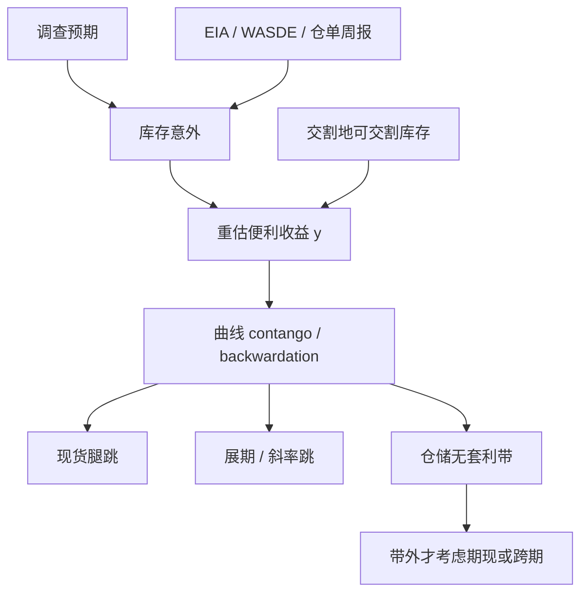

# 库存报告与曲线

基差是库存的函数：报告打乱的是对库存的信念，曲线随之重估便利收益；把周报的意外当成可无限放大的方向性 alpha，会忽略仓储带、交割地与已经定价的季节。

<footer>—— Working, The Theory of the Price of Storage, AER, 1949；Fama & French；Gorton, Hayashi & Rouwenhorst</footer>

商品曲线的状态变量里，最接近充分统计量的是库存——更准确是交割地可观察库存与市场对它的条件期望。Working 把持有费写成仓储供给；库存高，远期相对近月的升水接近全额融资加仓储；库存低，便利收益把曲线压成贴水。Fama 与 French（1987, 1988）用基差与金属的周期行为检验这一逻辑。Gorton、Hayashi 与 Rouwenhorst（2013）把库存、基差与期货期望收益放在同一套基本面上。EIA 的石油周报、API 的先行调查、美国农业部 WASDE 与库存报告、金属交易所仓单周报，是把这一状态变量定期公开的制度。报告移动的是信念，不是当场把原油造出来；曲线的跳跃是 $y$ 的重估。Erb 与 Harvey 的展期与战术价值，条件都应写在库存分位上，而不是写在无条件平均 contango 上。

## 问题

设 $I_t$ 为相关库存，$F(T)$ 为曲线。仓储理论给出 $\partial y/\partial I\lt 0$，因而库存意外上升倾向于使曲线更 contango（升水扩大或贴水收窄），库存意外下降倾向于更 backwardation。问题是「相关库存」的定义。EIA 原油库存含商业库存，战略储备另列；库欣（Cushing）作为 WTI 交割地，其库存对 WTI 曲线的权重大于全国沿海库存。农产品分新旧作、分地点。金属分交易所注册仓单与场外隐性库存。用错误的 $I$ 去解释正确的合约，符号都会反。第二层是预期：市场在报告前有调查中位数，成交的是意外，不是水平。把库存的季节性水平当成信号，等于把每年冬天取暖油的正常累积当成利空。

第三层是报告与[仓单](/quant/futures-delivery)的差别。周报总库存可以升，注册仓单可以降（注销去交割或出口）。曲线近端跟仓单与交割地，远端跟宏观供需。用一份全国周报去交易近月挤仓，对象错了。Fama–French 已经强调基差含未来现货信息；报告日的任务是更新基差里那一块尚未被价格吸收的信息，而不是发明一种独立于 Working 的第三种溢价。

### 意外、调查与伪精确

石油市场有 API 周二、EIA 周三一类节奏，调查机构提供预测。意外 $= $ 公布 $-$ 调查中位数。调查本身有偏差与离散度；离散度高时，同样数量的意外对曲线的冲击更大，因为先验更平。把「库存降 200 万桶」在所有日期当成同样的信号，忽略了预测差与战略储备、进口、炼厂开工等同期科目。WASDE 是联立系统：产量、消费、库存、进出口一起公布，单看库存一行会与产量行矛盾。必须按报告的身份处理，不能把所有表格都压成一个 $I$。

Gorton–Hayashi–Rouwenhorst 用的库存与基差是较低频、跨商品的基本面关系。不能把他们的回归系数直接当成 EIA 公布后五分钟的交易弹性。频率、噪声与可交割性都不同。

## 方法

先把曲线换成可交易斜率：近月相对次近月、以及近月相对远月季约，避免用非流动远月。状态用库存分位（相对季节调整后的历史）而不是绝对桶数。事件研究：意外对斜率、对现货腿、对[展期](/quant/roll-yield)成分分别回归。现货往往对库存意外更敏感，远端期货次之，于是意外下降时曲线更易进入贴水，多头展期改善、但现货已经跳涨——战术上你在报告后「买贴水」可能买在现货高点。这是 Erb–Harvey 要把现货与展期分开记账的报告日版本。

执行：报告瞬间价差走阔、停板风险上升，市价单的冲击可以超过信号。应以可成交报价定义意外交易的带，并假设部分成交。容量在报告窗口下降，与[展期成交量](/quant/roll-volume-oi)类似，只是触发器是信息而不是日历规则。若滚仓窗口与 EIA 重叠，订单流与信息同时到达，归因失败，应将该日从战术样本剔除或单独标记。

### 从报告到仓单再到 CTD 地点

WTI 看库欣，汽油看地区库存，天然气看地下库与天气。金属看 LME 取消仓单（cancelled warrants）比看总仓单更能预示出库。农产品看交割地注册仓单与升贴水。这些才是近月的 $I$。国债没有周报库存，但有 CTD 可获得量与 repo specialness，功能类似「可交割供给」，见[最便宜可交割](/quant/ctd-cheapest)。跨市场复制「库存意外做多贴水」而不改状态变量，是把石油周报的方法论误植到铜和玉米。

## 机制

信念更新：报告意外改变 $\mathbb{E}[I]$，便利收益 $y(I)$ 重估，持有成本 $r+u-y$ 变，曲线形状变。现货与近月因弹性低而跳得更多，这是 Ng–Pirrong 在金属上描述的低库存–高波动通道。套利机制：若价格跳过仓储带，[期现](/quant/cash-and-carry) 与[跨期](/quant/calendar-spread-arb)资本进入；若跳的是交割地局部库存而全国周报未动，只有能操作仓单的人能套利，金融账户看到的「错误定价」可以持久。Working 的理论在这里是约束而不是交易信号：带内的曲线变动是仓储，带外才谈错价。

风险溢价机制：Gorton–Hayashi–Rouwenhorst 认为低库存（贴水）时期货期望收益更高，因为存货持有者要求补偿，或因为风险集中在近端。这与 Keynes 正常贴水相关但不是同一句：它是条件于库存的溢价，不是无条件的多头保险费。Erb–Harvey 的战术可以读成：用曲线与库存当状态去调整商品暴露，而不是永远做多商品 beta。报告日是状态的离散观测，不是溢价的离散发放。

### 破裂：修订、停报、局部与宏观脱节

统计机构修订历史库存，使你回测里的「意外」在当时并不存在——必须用初次公布的 vintage。政府停摆、调查失败、定义变更让报告中断或不可比。管道、罢工、封关使交割地库存与全国周报脱节，曲线跟局部，模型跟宏观，基差爆炸。战略储备释放是政策库存，不是商业仓储供给，Working 的商业库存函数不能直接套。挤仓时近月脱离任何周报，见仓单一文。

把「库存降则做多近月」写成无条件规则，会在需求崩溃的年份里买下跌的现货：库存降可能是因为出口或炼厂，也可能因为没人愿意持有。必须同时看曲线是升水扩大还是贴水扩大，以及现货是涨是跌。Working 要的是联合观察，不是单行库存。

## 边界与工程取舍

不要用季节未调整的库存水平。不要用总库存替换可交割库存。不要在报告秒级用收盘斜率当已实现 alpha。成本是跳价价差、停板与错方向时的追保，见[保证金与盯市](/quant/futures-margin)。容量在信息窗口接近零：你加名义，成交在更差的价格上，等于把 EIA 的公开信息当成私有信息。与指数滚仓重叠时，先减名义。Hull 的持有成本提供报告后重新计算 $r+u-y$ 的会计；它不提供意外的预测。Fama–French 与 GHR 提供低频基本面；高频交易必须另建执行模型。

报告研究应给出：vintage 意外、调查离散度、对斜率与现货的分开冲击、交割地库存与全国库存的差、以及重叠滚仓日的子样本。缺 vintage 的回测会高估可交易性。Erb–Harvey（2006）与 Gorton–Rouwenhorst（2006）的长期组合事实，不能从「每周猜 EIA」里推导出来；频率与经济机制都不同。

便利收益 $y$ 在公式里像一个率。报告日它的变动是离散跳。连续时间仓储模型在周报制度下只是两段报告之间的插值。不要用跳日的数据去估连续 $y$ 的扩散，再把扩散当成下周的交易波动。

## 小结

- 库存（尤其是可交割、交割地库存）是曲线形状的核心状态；Working 把持有费写成仓储供给，报告更新的是对库存的信念。
- Fama–French 检验基差的预测力与金属周期；Gorton–Hayashi–Rouwenhorst 把库存、基差与期望收益连在一起。
- 交易的是意外而非水平；总库存、仓单、战略储备不是同一 $I$。现货腿与展期腿必须分开记。
- 破裂包括 vintage 修订、局部与宏观脱节、政策库存与挤仓；与滚仓窗口重叠时归因与容量同时恶化。
- 出处：Working, *AER*, 1949；Fama and French, *Journal of Business*, 1987 与 *Journal of Finance*, 1988；Gorton, Hayashi and Rouwenhorst, *Review of Finance*, 2013；Ng and Pirrong, *Journal of Business*, 1994；Erb and Harvey, *FAJ*, 2006；Gorton and Rouwenhorst, *FAJ*, 2006；Hull, *Options, Futures, and Other Derivatives*。
