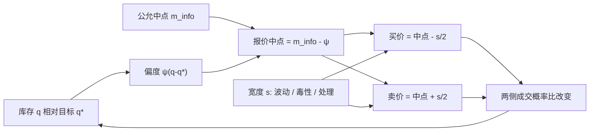

# 库存风险与偏度报价

做市商不愿持有偏离合意水平的存货：多头时把买卖报价一起下移以鼓励别人买走，空头时上移以鼓励别人卖给自己。价差可以仍对称，中点却已经不是公允中间价。

<footer>—— 据 Ho and Stoll, Optimal dealer pricing under transactions and return uncertainty, Journal of Financial Economics, 1981；Amihud and Mendelson, Dealership market, Journal of Financial Economics, 1980</footer>

存货模型回答：即使没有知情交易者，买卖报价为什么随做市商已经持有的头寸而动。Stoll（1978）把经销商服务写成存货与风险承担的供给；Amihud 与 Mendelson（1980）给出合意库存与报价的动态；Ho 与 Stoll（1981）在有限地平线上写出最优双向报价。后来的 [Avellaneda-Stoikov](/quant/avellaneda-stoikov) 把同一偏度嵌进限价强度与指数效用。经验上，Madhavan 与 Smidt 发现专家存货对报价的影响是缓慢、带目标回归的，而不是每一笔都完全出清。本篇把库存风险、偏度（skew）与价差宽度分成三个可分开调节的对象，并说明为什么「中点跟着库存走」会被误读成信息或被误读成操纵——在存货理论里，它首先是风险分担的价格。

## 问题

做市商的合意库存记为 $q^\star$（常常是零，或对冲之后的残余为零）。当前库存 $q$ 使终端财富对中间价 $S$ 的暴露约为 $(q-q^\star)\Delta S$。风险厌恶下，这笔暴露有确定性等价成本，与 $\sigma^2$、剩余时间、风险厌恶系数成正比。降低成本的办法不是预测 $\Delta S$，而是改变下一笔成交的方向概率：让减库存的那一侧更容易成交，加库存的那一侧更难成交。报价偏度就是这一控制。

若只加宽价差、保持中点不动，两边成交概率同比例下降，库存的漂移不变，只是交易更少、风险下降更慢。若只平移中点、价差不变，期望成交方向朝减库存偏，但每笔仍赚大约半个价差。完整问题是二维的：宽度管理总风险与成交强度，偏度管理库存的条件期望路径。O'Hara 把这条线叫做存货范式，以区别于信息不对称范式；两条线在数据里纠缠，因为成交既改变库存也更新信念。

### 合意库存不是会计零

$q^\star$ 可以不是零。做市商若在期货上对冲现货，现货库存的目标是对冲比率给出的持仓；若有客户单向流的统计预测，目标可以是预留容量。偏度相对的是 $q-q^\star$，不是账户上的毛头寸。把「我们有多头所以必须低报价」说成政策，却忘了对冲腿，会把已经中性的簿再 skew 一遍。风险单位也应标准化：同一股数在高 $\sigma$ 标的上的库存风险远大于低 $\sigma$；Avellaneda–Stoikov 的平移项明确含 $\sigma^2$。

偏度改变的是报价中点相对公允中间价（或相对市场 BBO 中点）的偏移，不是把买卖价差拆成不对称的两半那么简单。可以价差对称而中点已偏，也可以中点不动而只加宽。经验识别必须同时看 $m$ 与 $s$，只看 $s$ 会把存货效应漏掉。

## 方法

一阶近似把买、卖报价写成

$$
b = m_{\mathrm{fair}} - \tfrac{s}{2} - \psi(q-q^\star),\qquad
a = m_{\mathrm{fair}} + \tfrac{s}{2} - \psi(q-q^\star),
$$

其中 $\psi>0$ 为偏度系数，$q$ 以买入库存为正。$q>q^\star$ 时 $b,a$ 一起下降：更愿意被买、更不愿意再买。这正是无差异价格 $r=m_{\mathrm{fair}}-\psi(q-q^\star)$ 两侧再加对称半价差。$\psi$ 在 Ho–Stoll / Avellaneda–Stoikov 中对应 $\gamma\sigma^2(T-t)$ 一类量；实务上常取与库存限额、波动和剩余会话时间有关的分段线性：接近库存上限时 $\psi$ 陡增，直到一侧撤出市场。

宽度 $s$ 可以独立于 $\psi$ 设定：随 $\sigma$、成交强度、以及 [毒性](/quant/toxic-flow) 上升而加宽。存货模型给出 $s$ 的下限来自库存方差，信息模型给出另一条下限来自逆向选择；观察到的价差是两者与处理成本的和，见 [价差分解](/quant/spread-decomposition)。估计 $\psi$ 可用做市商自己的报价中点对 $q$ 回归，或用专家数据（旧 NYSE）做 Madhavan–Smidt 式的部分调整：存货向目标回归，报价是存货与信息的函数。

### 库存限额、停报价与偏度的非线性

线性 $\psi$ 只在 $|q-q^\star|$ 不大时像最优控制的局部解。接近硬限额时，继续加库存的那一侧应把距离推到强度近零，等价于停该侧报价；减库存一侧可以收到市场里，甚至变成 taker 主动减仓。这已经离开「做市」进入库存清理。Brunnermeier 与 Pedersen 讨论的融资约束会把限额本身变成价格的函数：亏损使保证金收紧，$q^\star$ 的可行集缩小，偏度被迫加大。杠杆与强平是同一逻辑在账户层的版本，见 [杠杆、保证金与强平](/quant/leverage-liquidation)。

## 机制

偏度的机制是改变两侧 [成交概率](/quant/fill-probability) 的比。设未偏时两侧强度均为 $\lambda$，买侧距离增加 $\psi$、卖侧减少 $\psi$ 后，强度比约为 $e^{-2\kappa\psi}$。期望库存变化带一个朝向 $q^\star$ 的漂移。与此同时，市场中间价若有效，做市商的中点偏离公允，减库存的成交更可能发生在对自己不利的价格上——这是存货模型自愿付出的保险费：用更差的成交价换更低的库存方差。信息范式里看起来同类的「成交后中点朝成交方向跳」，来源却是信念更新，不是自愿买保险。

报价中点相对市场中点的偏离，会显示在盘口上：持续的单边偏度等于向市场提供一个方向性的限价墙。其他参与者可以交易这面墙，于是做市商的库存风险部分被转移出去。若许多做市商库存同号（例如共同接到客户卖盘），他们会同时下移报价，中点的移动在总量上像信息，其实是存货的总供给曲线在移动。这是存货模型对「没有新闻的价格变化」的解释，与 Roll 的买卖弹跳、与 Kyle 的信息冲击并列，需要用后续价格是否回转来协助识别。

存货引起的中点移动事后往往会部分回转（库存被消化后报价回到公允附近）；信息引起的移动更持久。用实现价差与后续收益做分解时，回转部分常被记到存货或处理成本，永久部分记到逆向选择。识别不是完美的：永久冲击也可以来自存货若对冲渠道堵塞。

### 与信息模型如何叠加

完整报价可以想成：公允价值信念 $m_{\mathrm{info}}$（Glosten–Milgrom 更新后的期望）减去存货平移 $\psi(q-q^\star)$，再加减半价差，价差本身含处理、存货风险溢价与逆向选择溢价。一笔卖单到来，既使 $q$ 上升（存货：下一刻更想把货卖掉，报价下移），也使信念在有知情者时下降（信息：报价下移）。同向叠加会让人高估其中任一条。分离靠：看成交后中点移动是否超出存货规则所预测的 $\psi\Delta q$，以及看不引起库存变化的公开信息是否单独移动报价。O'Hara 强调两条主线都必要；Harris 从交易桌的角度说，做市商同时在「管货」与「防被知情者选中」。

## 边界与工程取舍

线性偏度在多标的、期权对冲残差、隔夜跳空下不够。隔夜 $\sigma^2(T-t)$ 突然变大，收盘前偏度应加强或强制平残仓，这与会话结构有关。多做市商竞争时，谁先 skew 谁先把流量让给仍挂在旧中点的对手，于是出现「谁先认存货谁吃亏」的博弈，稳态偏度可能小于垄断经销商模型。限价簿的离散 tick 让小于一档的 $\psi$ 无法显示，只能通过队列意愿或一侧撤单来表现。

把偏度规则写进生产时，必须与公允中间价的定义绑定。若 $m_{\mathrm{fair}}$ 用自身 BBO 的中点，平移会自我循环；通常要用独立的微观价格、期货基差或外部来源。也不要把库存偏度当成对短期 alpha 的替代：预测到即将到来的卖流时，应在存货之外再规避，否则会在毒性里把 $q$ 接到限额上。理论模型给出的是分解与符号，不是「每单位库存偏几个 tick」的普适常数。

从公开 L2 推断他人库存几乎不可识别：你看见的是聚合深度，不是谁的 $q$。本篇的对象是做市架构里如何管理自己的库存，而不是从盘口还原对手持仓或设计抢跑。

## 小结

- 库存风险使做市商对 $q-q^\star$ 收费：用报价中点平移（偏度）改变下一笔成交方向的概率。
- 宽度与偏度是两个控制量；只加宽不改变库存漂移，只平移则在价差收入大致不变时减风险。
- Ho–Stoll、Amihud–Mendelson 与 Avellaneda–Stoikov 给出偏度随风险厌恶、波动与剩余时间增加。
- 存货移动的中点倾向事后回转；信息移动更持久。两者在数据里同向，需要分解而不是单因素故事。
- 接近限额时偏度非线性，一侧停报价或主动减仓，做市退化为库存清理。
- 公允中点必须独立于自身 BBO，否则偏度自我循环。
- 出处：Ho and Stoll, *JFE*, 1981；Amihud and Mendelson, *JFE*, 1980；Stoll, *Journal of Finance*, 1978；Madhavan and Smidt 对专家存货的经验研究；连续时间版本见 Avellaneda and Stoikov, *Quantitative Finance*, 2008；范式划分见 O'Hara, *Market Microstructure Theory*。
