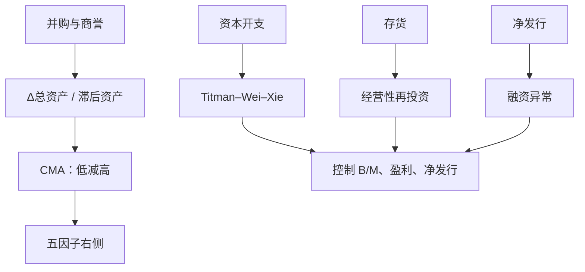

# 投资与资产增长

总资产增长高的公司，随后的股票收益显著偏低；这一模式在资本开支、并购与存货扩张上都会出现，并不能被市场 β 单独解释。

<footer>—— Cooper, Gulen & Schill, Asset Growth and the Cross-Section of Stock Returns, Journal of Finance, 2008</footer>

公司加总资产之后，股东事后平均拿得更少。Titman、Wei、Xie 2004 年写过资本开支异常；Cooper、Gulen、Schill 把度量扩成总资产增长率，效应更强、更宽。Fama–French 把低投资减高投资做成 [CMA](/quant/ff5)。q 理论把高投资读成低贴现率的结果；过度投资与帝国建造把它读成代理问题。本篇写资产增长的会计分解、CMA 与单变量投资因子的差别，以及它和[价值](/quant/value-factors)、[盈利](/quant/quality-profitability)的共线。

## 问题

给定当前市值，股利贴现说：未来再投资越多、留给股东的自由现金流越晚，内部收益率越低。于是**预期投资高应对应预期收益低**。投资可以观测为资本开支、固定资产增长、存货增长、并购带来的总资产跳跃，或一揽子 $\Delta A_t/A_{t-1}$。若市场对贴现率或对代理问题定价不全，高增长资产的公司会留下负 α。

三因子用 B/M 间接包含了一部分：高投资常压低未来 B/M、抬高当前估值。实证上资产增长在控制 B/M 后仍然预测负收益，所以不是纯价值。盈利侧则相反：高盈利公司有时多投资，有时把现金吐出；投资与盈利必须分开，否则 CMA 会偷偷带上 RMW 的反号。

### 总资产增长为什么比 capex 更「宽」

资本开支只覆盖内部购置的长期资产。总资产增长还包括收购、应收账款、现金堆积、商誉。Cooper 等发现总资产增长率对收益的单调性比单一 capex 更干净。代价是解释变杂：现金堆积不像帝国建造；并购的投资与被并方的估值效应缠在一起。CMA 用总资产增长，因此空头腿含收购机器，不只是建厂机器。

$$
\mathrm{Inv}_t=\frac{A_t-A_{t-1}}{A_{t-1}}
$$

是 FF 五因子的投资定义。另一些研究用 $(\Delta\mathrm{PPE}+\Delta\mathrm{Inventory})/A$，更接近经营性再投资，对现金与并购不敏感。两种排序的相关高但空头持仓不同，不能混着复制 CMA。

投资因子的符号是保守减激进：低 $\mathrm{Inv}$ 为多头。把它做成「成长股因子」会和 HML 的成长腿搞反——HML 空头是低 B/M，CMA 空头是高资产增长。低 B/M 与高投资经常重叠，但不是恒等。

## 方法

每年 6 月用已公布年报算 $\mathrm{Inv}$，NYSE 30%/70% 分位，与规模 2×3，价值加权，低减高得到 CMA 或单变量投资腿。金融公司的资产增长含义不同（资产负债表就是产品），通常剔除。负资产或近零资产分母要清洗。

分解：把 $\Delta A$ 拆成经营营运资本、长期经营资产、现金、债务与权益发行。发行股份高的公司收益低（净发行异常），与投资部分重叠——扩张常靠发股。报告投资溢价时应同时控制净发行，否则可能只是在写融资。存货增长对零售与制造更强；并购驱动的增长对估值倍数更敏感。

### 与 q 因子、五因子的对齐

Hou–Xue–Zhang 的投资因子同样用资产增长，组合定义是规模×投资的交叉。五因子再交叉盈利。若只下载 CMA、不重做检验组合，就看不到「高盈利高投资」格子里哪一条腿主导。标准诊断是 2×3 或 5×5 的规模×投资、盈利×投资表，看 α 是否集中在小盘高投资——若是，容量叙事要改写。

## 机制

q 理论：边际 q 高时投资高，而边际 q 高可以来自低风险溢价。高投资因此是低预期收益的**结果**，不是独立的错误定价。这条路预测投资与事后收益的负相关在宏观上也应存在（投资高的年份随后市场收益低），证据有正有负。公司金融路径：自由现金流充裕时经理过度投资，市场逐步认识到 NPV 为负的项目，价格下调。这条路径预测治理差、反收购强的公司上效应更大。

会计路径：投资伴随保守的折旧与随后的低 ROA，投资者对盈利水平反应不足，高投资像一个「未来盈利失望」的代理。它与应计异常相邻：增长公司应计高。用现金盈利控制后，投资溢价若仍在，就不只是应计。三条机制对对冲的含义不同：q 理论要对冲贴现率冲击，代理问题要对冲治理与周期，会计路径要对冲盈余公告。

### 资产增长与价值、动量的时间冲突

价值股在资本开支上往往更保守，CMA 与 HML 正相关。动量赢家里有一批刚完成扩张叙事的公司，CMA 空头与 WML 多头短期冲突。危机后资本开支冰冻，CMA 多头变拥挤，随后若出现 capex 周期重启，因子回撤。投资因子的换手低（年度财务），看起来便宜，但经济暴露集中在「扩张是否被证伪」的几年，夏普的时序并不平滑。

CMA 不是反转。一个月收益高的公司不必在投资上激进。把资产增长写成「长期反转的会计版」并不准确；长期反转更贴近价格路径，投资更贴近资产负债表扩张。控制过去三年收益后，资产增长仍常显著。

## 边界与工程取舍

财务滞后与 6 月重构同样适用。用未发布年报的资产会前视。季度资产能加快信号，噪声与季节性上升。跨国样本要处理并购会计与 IFRS 切换。A 股借壳、重组会制造一年内总资产翻数倍的观测，这些点会主导等权空头，必须用缩尾或单独分组。

不要在五因子回归里再塞一条 capex 多空并声称独立 α，除非已对 CMA 正交。不要把「高 capex 是好公司」的基本面故事直接翻成正的预期收益——截面符号是负的。容量上大盘价值加权 CMA 可交易；等权小盘高增长空头含大量不可借券名字。

真实出处：Cooper, Gulen & Schill, Journal of Finance, 2008；资本开支异常 Titman, Wei & Xie, Journal of Financial and Quantitative Analysis, 2004；CMA 见 Fama & French, 2015。q 因子见 Hou, Xue & Zhang, Review of Financial Studies, 2015。不要把 CMA 标成 2008 年论文里的组合定义。

## 小结

- 高资产增长预测低收益；CMA 是低投资减高投资的价值加权因子。
- 总资产增长宽于 capex，含并购与现金；复制时要对齐会计定义。
- 机制可以是 q 理论、过度投资或应计/盈利失望，对冲工具不同。
- 须控制价值、盈利与净发行，并检查小盘是否贡献全部 α。
- 出处：Cooper, Gulen & Schill, Journal of Finance, 2008；Fama & French, 2015。
