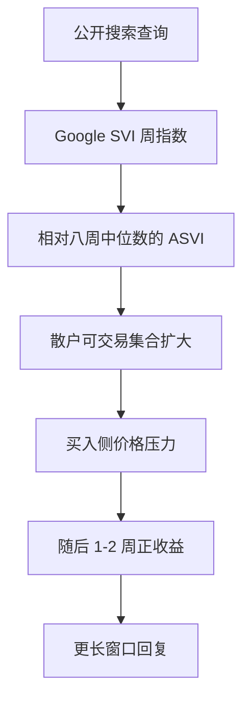

# Da–Engelberg–Gao 投资者关注度

我们用谷歌搜索量作为散户注意力的直接代理：异常搜索之后出现短暂的价格压力，随后均值回复；注意力是稀缺的，被搜到的股票才会进入可交易集合。

<footer>—— Da, Engelberg and Gao, In Search of Attention, Journal of Finance, 2011</footer>

价格要对信息做出反应，前提是有人注意到这条信息。经典资产定价把「公开即可纳入价格」当成默认；有限注意把这个默认拆开：同一条新闻，被搜到的股票与没被搜到的股票，进入散户可交易集合的速度不同。Da、Engelberg 与 Gao（2011）用 Google Search Volume Index（SVI）构造公司层面的异常搜索量（ASVI），把它当作**散户注意力**而不是媒体情绪或分析师覆盖。本篇写 SVI 测的是什么、ASVI 如何与随后收益和散户净买入对齐，以及为何它不能被 [Baker–Wurgler 情绪](/quant/baker-wurgler) 或 [舆情文本](/quant/news-nlp-alpha) 替代。对象是公开搜索指数的构造与回测时钟，不是去爬个人查询日志。

## 问题

注意力是容量约束：投资者同一时刻只能跟踪有限只股票。Barber 与 Odean（2008）已经指出，散户更可能买入「吸引注意」的名字，卖出则受已有持仓限制，于是注意力冲击在买入侧更强。问题是如何**事前**度量注意，而不是用收益或成交量事后倒推——后者会把结果写进原因。媒体报道、换手、极端收益都与注意相关，但也混入流动性、风险与基本面。Da 等的策略是：搜索行为发生在交易决策之前（或至少与之下游可对齐），且谷歌在当时是散户获取公司信息的主入口之一；机构有终端与销售覆盖，较少需要公开网页搜索。因此 SVI 更接近零售注意，而不是机构研究强度。

第二句话是识别。搜索「苹果」可能是手机评测，搜索股票代码才更像投资查询。样本要选搜索意图足够干净的代码，并处理代码歧义、公司更名、双上市。Google Trends 给出的是相对指数而非绝对查询次数，跨股票、跨时间的水平不可比，必须在每只股票自己的历史上做异常化。

### 异常搜索量，而不是搜索量水平

记股票 $i$ 在周 $t$ 的 SVI 为 $S_{i,t}$（Google 在该代码、该地区、该时间窗上的相对指数）。Da 等的异常搜索量为

$$
\mathrm{ASVI}_{i,t}=\log(S_{i,t})-\log\bigl(\mathrm{Med}(S_{i,t-1},\ldots,S_{i,t-8})\bigr),
$$

即本周对数搜索相对过去八周中位数的偏离。中位数比均值更能抵抗单周爆发；八周大约覆盖一个财报季节而不把更早的体制搜刮进来。水平 $S_{i,t}$ 本身被公司知名度、代码流行度与 Trends 抽样标尺钉死，不能直接做截面排序。ASVI 把「相对自己是否突然被搜」隔离出来，才对应注意力冲击。

Google Trends 的公开接口是抽样、按查询归一、且会不定期改基期。同一代码在不同下载日的历史路径可以整体平移。回测必须把 Trends 序列存成点-in-time 快照，见 [点-in-time](/quant/point-in-time)；事后一次性拉十年再算 ASVI，是把修订写进「当时的注意」。

## 方法

**样本与查询词。** 美股上优先用 ticker 而非公司全称；剔除与日常用语严重冲突的代码。地区选美国，时间粒度用周（Trends 日频对稀疏代码噪声极大）。中文市场若用百度指数做类比，那是另一套抽样与词表，不能把 Da 等的美股系数直接贴到 A 股代码上。

**收益检验。** 在 $t$ 周末（或 Trends 该周所属的最后一个交易日）排序 ASVI，看随后 1–2 周、1 个月、1 个季度的多空。Da 等的主结果是：高 ASVI 随后有正的短期收益，约两周内最强，之后反转。这与「注意 → 买入压力 → 过度 → 回复」一致，而不是永久的风险溢价。控制上日收益、换手、新闻条数、分析师覆盖之后，ASVI 仍有增量，说明它不是成交量或媒体的别名。

**谁在交易。** 把 ASVI 与散户订单不平衡、小单净买入对齐：注意上升的股票，散户更偏买入。机构持仓高、分析师覆盖密的名字上，ASVI 的收益预测更弱。这把机制钉在零售可交易集合，而不是「全市场信息到达」。

### 时钟：周频指数对日频交易

Trends 的周桶如何切到交易日，决定有没有前视。若用含周五收盘之后才完整的周指数去「解释」该周周一到周五的收益，部分搜索发生在收益之后。可复制的做法是：特征在周 $t$ 的指数发布之后锁定，预测周 $t+1$ 及以后。日频策略若把当周尚未结束的 SVI 当成已知，属于 [前视](/quant/look-ahead-bias)。财报、产品发布会把搜索与收益推到同一周，事件窗口应单独报告，否则 ASVI 因子只是 PEAD 的搜索版，见 [盈余漂移](/quant/pead-sue)。

## 机制

有限注意给出一条单向管道。卖出受持仓约束，买入受「想到这只股票」约束。搜索上升 → 更多散户把该股放进候选池 → 净需求为正 → 短期涨。随后若没有基本面支撑，价格在数周到数月内交还。这与 [MAX](/quant/max-effect)、[彩票需求](/quant/lottery-demand) 可以叠在同一组名字上：极端正收益本身会触发搜索，搜索再放大买入；但 ASVI 在控制 MAX 与上日收益后仍有空间，说明注意不完全是收益的滞后。

风险补偿叙事弱：被搜到的股票随后波动往往更高，若市场为注意风险要溢价，符号应是高 ASVI 长期更高收益，而不是先涨后回。Da 等的反转更符合暂时的价格压力。与 Baker–Wurgler 的差别是频率与截面对象：BW 是月与年的市场级投机需求，ASVI 是周频、公司级的「谁被想到」。与 Tetlock 文本的差别是极性：搜索量几乎不区分看多看空，测的是**显著**，不是正负情绪。[IVOL](/quant/ivol-anomaly) 高的名字更容易进入搜索，因子正交时要先对市值、残差波动与行业做 [截面 rank](/quant/cs-rank-features)。

### 搜索不是点击，也不是持仓

SVI 是查询强度，不是页面停留，更不是账户持仓。一次产品事故、一次迷因传播、一次指数纳入传闻，都可以抬高搜索而没有对应的可投资信息。把 ASVI 当 alpha 信号，必须接受很高的换手与主题拥挤：同一周被搜的股票高度相关，多空会变成一次零售主题的方向性赌注。容量落在这些名字的有效价差上，日频再平衡在扣费后经常消失，只留下周频、大盘可投宇宙上的一段短压力。

异常搜索与异常成交量高度同期。若用同一周的换手去「解释」ASVI 收益，会把机制回归做成同义反复。更干净的对照是：ASVI 对随后周的散户不平衡仍有预测，成交量则更多是同期。

## 边界与工程取舍

不要把百度、微博热搜、东方财富点击量直接叫做 Da–Engelberg–Gao 因子：抽样框、机器人流量与代码歧义都不同，最多是同构代理。不要用含未来窗口的滚动 z-score 替代八周中位数。不要在指数成份调整日把搜索爆发全部归因于散户——被动基金与媒体日历同样抬搜索。国际交叉上市要用当地可搜索的代码，并按当地收盘对齐。

Google 抽样修订、地区 VPN、代码被挪用为梗，都会把 SVI 污染成流行文化指数。稳健做法是：固定词表与地区、存快照、剔除迷因周或单独成组、并报告相对新闻条数与换手的增量。作为研究诊断，ASVI 极有价值——它把「谁被想到」从价格里拆出来。作为交易规则，它更接近零售流量的拥挤仪表，而不是可规模化的长期溢价。

出处：Da, Engelberg and Gao, *Journal of Finance*, 2011。注意力与买入见 Barber and Odean, 2008。不要用搜索量去替代 Baker–Wurgler 的月度情绪指数，也不要用它去替代 Tetlock 的文本极性。

## 小结

- Da–Engelberg–Gao 用 Google SVI 的异常值 ASVI 作为散户注意力代理，而不是情绪极性或机构覆盖。
- 高 ASVI 伴随随后约两周的买入压力与正收益，更长窗口倾向回复，符合有限注意而非风险溢价。
- 必须用相对自身历史的异常，而不能用搜索水平做截面；Trends 快照与周桶切分决定有没有前视。
- 机制落在散户可交易集合的扩大；机构覆盖高的名字上预测更弱。
- 与 BW 情绪、新闻文本、MAX/IVOL 相关但不可互相替代，正交时应先处理市值与波动。
- 出处：Da, Engelberg and Gao, *Journal of Finance*, 2011；Barber and Odean, 2008。
