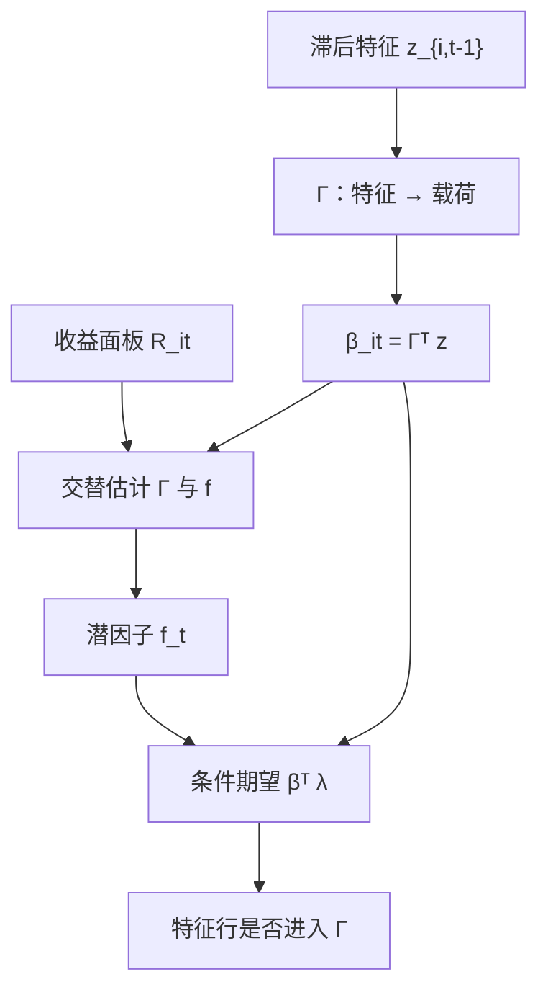

# IPCA 工具主成分

    
特征之所以预测收益，是因为它们预测了风险载荷；把载荷写成可观测特征的线性函数，再在这一约束下抽取潜因子，特征和协方差就变成同一套参数。

    <footer>—— Kelly, Pruitt & Su, Characteristics Are Covariances: A Unified Model of Risk and Return, Journal of Financial Economics, 2019</footer>

静态 PCA 假定载荷不随时间变，也不利用市值、估值、盈利这些公司特征。特征模型则常常只解释均值：每月截面把收益对特征回归，并不问这些特征是否进入协方差。Bryan Kelly、Seth Pruitt 与 Yinan Su 的工具主成分分析（Instrumented Principal Component Analysis, IPCA）把两句话焊在一起：$\beta_{it}$ 由预先可知的特征 $z_{i,t-1}$ 工具化，因子 $f_t$ 仍从收益面板里抽。本篇写约束如何识别时变载荷、与无约束 PCA 以及 Fama–French 风格因子如何对照，以及「特征是协方差」这句话不要理解成「特征不是错误定价」。

## 问题

个股的 β 噪声大、而且会变：公司变大、变贵、加杠杆之后，对市场与信用冲击的敏感度跟着变。滚动回归能追上一部分时变，却浪费特征里已经写明的信息——小盘、高估值、高投资在截面上系统性地对应不同的风险暴露。另一方面，纯特征回归（Fama–MacBeth 式的 $R_{it}=z_{i,t-1}^\top\gamma_t$）把溢价直接打在特征上，并不保证这些特征与共同因子载荷对齐；预测成功可以是风险，也可以是误定价，模型无法在协方差里被证伪。

IPCA 要的是一个可检验的折中：共同因子个数远小于资产数，但载荷被约束在特征张成的低维空间里。若约束为真，因子提取比无约束 PCA 更有效，时变 β 也有了参数结构。若约束为假——某个共同风险与所有可观测特征都无关——受限模型会把这块风险推进残差，定价与协方差拟合都会露馅。

### 载荷是特征的函数，因子仍是潜的

模型写为

$$
R_{it}=\beta_{it}^\top f_t+\varepsilon_{it}, \qquad \beta_{it}=\Gamma^\top z_{i,t-1}.
$$

$z_{i,t-1}$ 是 $L\times 1$ 的特征（可含常数项，以容纳「与特征无关的平均载荷」），$\Gamma$ 是 $L\times K$ 的映射，$f_t$ 是 $K\times 1$ 的潜因子。代入后

$$
R_{it}=z_{i,t-1}^\top\Gamma f_t+\varepsilon_{it}.
$$

共同时间变化被 $f_t$ 吸收，截面差异被 $z$ 吸收，$\Gamma$ 是二者之间的桥梁。识别仍需要正常化：例如对 $\Gamma$ 的某一块做正交约束，或把因子协方差钉住，避免 $\Gamma$ 与 $f$ 对偶旋转。这与 [Giglio–Xiu](/quant/giglio-xiu) 一样，旋转不唯一，但资产的条件期望 $z_{i,t-1}^\top\Gamma\lambda_t$ 在约束下是确定的。

「工具」在这里不是 IV 回归里那个与误差正交的工具变量俗称那么窄。特征被当作载荷的可观测驱动变量，须对 $t$ 可测，不能用当期收益或未来市值。用 $t$ 期末的账面市值比去解释 $t$ 期收益，是前视，不是 IPCA。

## 方法

估计可用交替最小二乘或对集中目标函数的迭代：给定 $\Gamma$，因子是特征加权收益的截面投影；给定 $f$，$\Gamma$ 来自把收益对 $z\otimes f$ 的回归。因子个数 $K$ 用样本外定价误差、信息准则或逐步加入后的边际解释力选择。无约束版本允许一个与特征无关的附加潜因子，用来捕捉「特征没覆盖的共同冲击」；比较受限与不受限的残差，就是在检验「特征是否足够作为协方差的工具」。

风险溢价可以放在因子均值 $E[f_t]=\lambda$ 上，也可以允许 $\lambda_t$ 随宏观状态变。因为 $\beta_{it}$ 已经时变，无条件 α 不再直接等于条件定价误差的平均：与[条件 CAPM](/quant/conditional-capm) 相同，β 与 λ 的协方差会进入无条件均值。报告时应同时给出条件定价误差 $E[R_{it}-\beta_{it}^\top f_t\mid z_{i,t-1}]$ 与无条件均值拟合。

$$
E[R_{it}\mid z_{i,t-1}]=\bigl(\Gamma^\top z_{i,t-1}\bigr)^\top\lambda.
$$

这把「特征预测收益」改写成「特征预测 β，β 再乘风险价格」。哪些特征真正进入 $\Gamma$，可以用对 $\Gamma$ 的行做约束检验：某行全零，则该特征不进入任何因子的载荷，即使它在纯均值回归里显著——那就是不能被这 $K$ 个因子吸收的可预测性。

### 与风格因子、静态 PCA 对照

Fama–French 的 SMB、HML、RMW、CMA 是用特征排序做成的**可交易因子**；IPCA 的 $f_t$ 是统计因子，不必等于那些多空组合。若特征恰好就是规模与估值，IPCA 抽出的因子往往与 SMB/HML 高度相关，这是成功的校准，不是循环论证。静态 PCA 相当于 $z$ 只有常数，β 不随公司状态变；在公司特征快速变化的样本里，静态 PCA 需要更多因子才能达到同样的残差水平。工程上可用 IPCA 的拟合因子去对冲特征策略的风险，而不是假设 HML 已经穷尽了价值暴露。

## 机制

为什么特征会是协方差？风险故事：小盘、高杠杆、高投资的公司对贴现率与融资冲击更敏感，特征是这些暴露的代理，不是独立的「α 工厂」。误定价故事仍然可能成立：特征预测的是残差均值，而不是 β。IPCA 的可证伪点在于，若把 $K$ 加到合理个数后，特征对残差均值仍有稳定预测，就不能再说「特征只是协方差」。Kelly 等人的经验主张是：在他们的美股个股样本里，相当一部分特征的预测力能被时变载荷吸收，纯 α 解释被压缩——这是一条样本结论，不是定理。

工具化还带来统计效率。无约束时变 β 的参数个数是 $NKT$，不可估；IPCA 把个数降到 $LK+KT$ 量级。特征必须有截面离散且对载荷有真相关，否则 $\Gamma$ 弱识别，因子退化成噪声。这与弱工具 IV 是亲戚：第一阶段（特征→β）要强。

### 时变溢价与可交易复制

$f_t$ 本身一般不可直接当期货交易，但可以用对 $\hat\beta_{it}$ 的多空去近似复制：按模型载荷排序、或解一个对冲组合使净暴露贴近单位因子。复制误差来自 $\varepsilon_{it}$、Γ 的估计误差与特征滞后。不要把 IPCA 因子的样本均值直接当可实现夏普。若目标是给宏观因子定价，应把宏观序列对 $f_t$ 投影，走 Giglio–Xiu 的第三步，而不是强迫 IPCA 的 $f$ 等于工业产出。

IPCA 不能自动解决数据挖掘。往 $z$ 里塞进几十个特征，Γ 会记住样本内的协方差。特征集应预指定，并做样本外：$t$ 之前估 Γ，在 $t$ 的截面上评定价误差。把 300 个异常都当工具，只是把多重检验挪到了 Γ 的行上。

## 边界与工程取舍

缺失特征、停牌、退市使 $z$ 与 $R$ 的样本不一致，需要同步筛选，避免用「还活着的公司」的特征去拟合已退市收益。特征尺度差几个数量级，应截面标准化，否则 Γ 被市值一类的水平量主导。非线性（特征的平方、交叉）可以扩 $z$，立刻增加弱识别与过拟合风险。

不要把 IPCA 与「用 PCA 做统计套利」混为一谈：后者常在残差上交易，前者首先是一个条件因子模型。也不要在五因子回归里再把 IPCA 的 $f$ 全部加进去当正交因子——它们在样本内几乎张成同一块共同收益，方差膨胀是数学，不是新发现。A 股上特征的会计滞后、壳与 ST 会破坏 $z$ 作为 β 工具的平稳性，须单独验证受限模型是否被无约束因子拒绝。

真实出处：Kelly, Pruitt & Su, *Characteristics Are Covariances: A Unified Model of Risk and Return*, Journal of Financial Economics, 2019；方法论文 *Instrumented Principal Component Analysis*。不要写成 Fama–French 五因子的统计附录，也不要把 IPCA 标成 2013 年毛利率论文的方法。

## 小结

- IPCA 把时变载荷约束为滞后特征的线性函数，再抽取潜因子，使「特征预测收益」服从风险载荷结构。
- 估计是 Γ 与 $f$ 的交替；受限 vs 不受限比较的是特征是否足够作为协方差工具。
- 特征进入 Γ 与特征在均值回归里显著不是同一检验；后者可以是 α。
- 因子旋转不唯一，可交易性要靠复制组合，不能把 $E[f]$ 直接当策略收益。
- 出处：Kelly, Pruitt & Su, Journal of Financial Economics, 2019。
