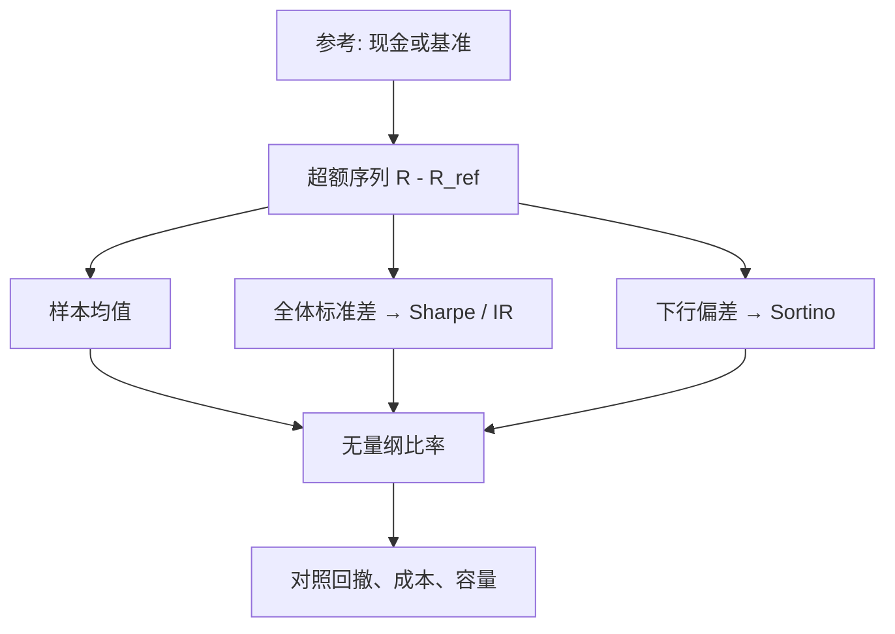

# IR / Sharpe / Sortino

把超额收益除以收益的变异，得到一个可以在基金之间比较的报酬–波动比；用哪一段超额、哪一种变异，决定了这个比在比较什么。

<footer>—— Sharpe, Mutual Fund Performance, Journal of Business, 1966；以及 Sharpe, The Sharpe Ratio, Journal of Portfolio Management, 1994</footer>

[上一课](/quant/factor-attribution)把主动收益写成主动暴露乘以模型因子收益，加上特异项；贡献是事后乘法，不是对因子溢价的检验。归因回答「钱从哪来」。缺口是把不同波动、不同基准、不同非对称的策略压成可比较的无量纲比：分子是相对现金还是相对基准，分母是全体波动、主动波动还是下行偏差。Sharpe（1966/1994）针对相对无风险的效率；Grinold 与 Kahn 的 IR 用到主动收益；Sortino 与 van der Meer（1991）把分母换成下行偏差。本课写三个比的对象、年化与抽样误差，不重写 Brinson 与持仓型归因。

## 问题

投资人要在不同波动、不同基准、不同非对称的策略之间做压缩比较。只看平均收益忽略风险；只看波动忽略补偿。线性比

$$
\frac{\mathbb{E}[R-R_{\mathrm{ref}}]}{\mathrm{Disp}(R-R_{\mathrm{ref}})}
$$

把问题收成：参考收益 $R_{\mathrm{ref}}$ 是什么，离散 $\mathrm{Disp}$ 用哪一种矩。选错参考，股票多头的「IR」其实是 Sharpe；选错离散，趋势策略的高夏普可以与深度回撤并存。问题不是哪个比率「正确」，而是**产品契约里承诺的是哪一种效率**，报告就必须用那一种。

事后样本均值与样本标准差都有误差，比率的抽样分布在短样本上很宽。Lo（2002）讨论夏普的统计量：序列相关时，朴素年化会夸大。IR 对主动收益再做一次差分，样本更噪。Sortino 的下行矩只用一半样本路径，估计更不稳。把三个比精确到小数点后两位去排基金，往往超过其可分辨精度。

### 三个分母对应三种厌恶

Sharpe 的分母是 $\sigma(R-R_f)$：上行与下行同等进入。对近似对称、以绝对财富为对象的组合，这与均值–方差一致，见 [Markowitz](/quant/markowitz)。IR 的分母是 $\sigma(R_p-R_b)$：相对基准的跟踪误差。指数增强、主动股票、多空相对现金的产品，契约对象是主动风险，用总波动当除数会把市场暴露算进「信息」。Sortino 的分母是下行偏差

$$
\mathrm{DD}=\sqrt{\mathbb{E}\big[\min(R-T,0)^2\big]},
$$

$T$ 是最低可接受收益（MAR），常取 $R_f$ 或 0。它不惩罚超过 $T$ 的波动，于是正偏策略看起来更好。这是特征不是漏洞——但 $T$ 必须预先声明，事后把 $T$ 调到刚好让比率最大，是另一种数据窥探。

Sharpe（1994）强调事前比与事后比不是同一个统计量。事前用预期差分与预测波动；事后用样本均值与样本标准差。回测表上的「夏普 1.8」几乎总是事后量，把它读成「期望效率」需要衰减、成本和样本外，见 [净边缘](/quant/net-edge)。

## 方法

**Sharpe。** 对频率为 $\Delta t$ 的收益（日、月），先算超额 $x_t=R_t-R_{f,t}$，再

$$
\widehat{\mathrm{SR}}=\frac{\bar x}{s_x}\sqrt{q},
$$

$q$ 是每年观察数。年化因子 $\sqrt{q}$ 在独立同分布下把标准差升到年；有序列相关时应先把 $s_x$ 改成长期方差的 Newey–West 或用 Lo 的调整，再年化。无风险利率必须与产品融资一致：用国债利率评估加杠杆的期货策略，会把融资成本藏进分子。

**IR。** 用 $x_t=R_{p,t}-R_{b,t}$ 替换，$s_x$ 是跟踪误差。基准必须可投资、与绩效计算相同。多空绝对收益若声称「对现金的 IR」，其实是 Sharpe；只有明确相对某指数或相对风险模型的残差时，才是 Grinold 意义的 IR。残差 IR 还要求先去掉市场与约束允许的风格暴露，否则风格溢价会被叫做信息。

**Sortino。** 分子常用 $\bar R-T$，分母只用 $R_t<T$ 的二次平均。样本里下行次数太少时，DD 接近零，比率爆炸——应报告下行观测数，并对 DD 设下限或用贝叶斯收缩。Sortino 与 Price（1994）把框架写进投资实务；它仍是描述统计，不是均衡定价。

### 年化、复利与可加性

算术均值乘 $q$ 再除以 $\sqrt{q}\sigma$ 得到的年化夏普，与用年复利收益除以年波动，一般不等。长地平、高波动时，复利拖累使后者更低。IR 同样。报告应声明用的是哪一种分子。三个比率都对杠杆敏感：无摩擦时 Sharpe 对杠杆不变（分子分母同乘），有融资与冲击时不再不变——加杠杆会改变有效 $\mu$ 与左尾，Sortino 通常掉得比 Sharpe 快。这与 [组合杠杆约束](/quant/portfolio-constraints) 是同一条工程事实。

信息比率常被拿去反推 Grinold 的 IC。无约束且残差不相关时 $\mathrm{IR}\approx\mathrm{IC}\sqrt{B}$；有约束时还要乘转移系数。用成本后夏普去除以 $\sqrt{N}$ 去「证明」截面 IC，会把约束、成本和运气一齐算进预测力。

## 机制

均值–方差里，切点组合最大化相对无风险的 Sharpe；相对基准的 IR 最大化则对应以基准为现金账户的切点，即残差前沿上的积极组合。机制上，IR 高可以来自：真预测力、未计入的风格、偶然的低跟踪误差样本、或卖出左尾（短波动）使分母变小。Sortino 对最后一种更敏感：若损失恰好集中在少数几天，DD 会跳，比率崩；若损失被平滑成经常性的小亏，Sortino 可能仍高而[最大回撤](/quant/drawdown-calmar)已经不可接受。三个比读的是不同的矩，没有一个读取路径依赖的回撤深度。

基本定律把 IR 连到广度：独立赌注多，IR 可升。但这是对期望 IR 的陈述。实现样本 IR 的 t 统计大约是 $\mathrm{IR}\sqrt{T}$（年），三年 IR=0.5 几乎不可区分于噪声。机制上不要用短窗滚动 Sharpe 当[择时](/quant/ic-ir-timing)信号：滚动比的噪声极大，交易它等于交易抽样误差，换手成本立刻超过任何表面增益。

### 非正态时排序会翻

偏度与峰度不进入 Sharpe 的分母。趋势跟随常有负偏、高峰；短波动策略有正的样本 Sharpe 与偶发的崩溃。Sortino 部分捕捉左尾二阶，仍忽略极端分位，[EVT](/quant/evt) 与回撤才管那些。跨策略比较时应同时给：Sharpe 或 IR、Sortino、最大回撤、以及成本后的同一套。只展示三个比里最大的那个，是选择偏差。

## 边界与工程取舍

比率不包含容量与交易成本。高换手策略的毛 Sharpe 可以很高，净 Sharpe 接近零，见 Novy-Marx–Velikov 的换手分类。A 股涨跌停与停牌使日收益不是自由采样，$\sqrt{252}$ 年化会错。基准选择能单独翻转 IR 的符号：相对沪深 300 与相对中证 500，同一组合的主动收益不是一回事。

不要把 Sortino 当「更科学的 Sharpe」。它多一个自由参数 $T$，并丢弃上行信息；在近对称产品上，它主要是增加估计噪声。不要在回测结束后改用下行偏差「因为更能反映风险体验」——风险体验应在产品设计时写成回撤限额或 CVaR，而不是事后换分母。IR 的基准若不可交易（或含未来成分），比率没有实施意义。

三个比都不是效用。CRRA 投资者关心终末财富分布与路径上的杠杆约束；Kelly 分数关心增长。用年化 Sharpe 最大去替代这些目标，会选出高杠杆、短样本好看的路径。评价应回到契约：绝对收益产品看 Sharpe 与回撤，增强产品看 IR 与跟踪误差，不对称产品加 Sortino 与压力情景，而不是三选一。

费用与杠杆应先扣进净值再算比率。用毛收益算 Sharpe、用净收益算 IR，两张表不可比。高水位业绩费还会让同一策略在不同年份的 Sortino 不可比，因为左尾对费后净值的影响是非线性的。

## 小结

- Sharpe（1966, 1994）用相对参考收益的均值除以全体波动；IR 把参考换成可投资基准或残差，对象是主动效率；Sortino 把分母换成相对 MAR 的下行偏差。
- 年化 $\sqrt{q}$ 依赖弱相关；序列相关、复利拖累与杠杆摩擦都会破坏无摩擦时的不变性。
- 短样本 IR 与 Sortino 的估计误差很大；滚动夏普不适合当择时信号。
- 三个比都不读取最大回撤路径，也不含成本与容量；排序可因分母选择而翻转。
- 报告必须预先锁定参考、MAR 与年化方法，并与产品契约一致。
- 出处：Sharpe, *Mutual Fund Performance*, Journal of Business, 1966；Sharpe, *The Sharpe Ratio*, Journal of Portfolio Management, 1994；Sortino and van der Meer, *Downside Risk*, Journal of Portfolio Management, 1991；Grinold and Kahn, *Active Portfolio Management*；Lo, *The Statistics of Sharpe Ratios*, Financial Analysts Journal, 2002。
