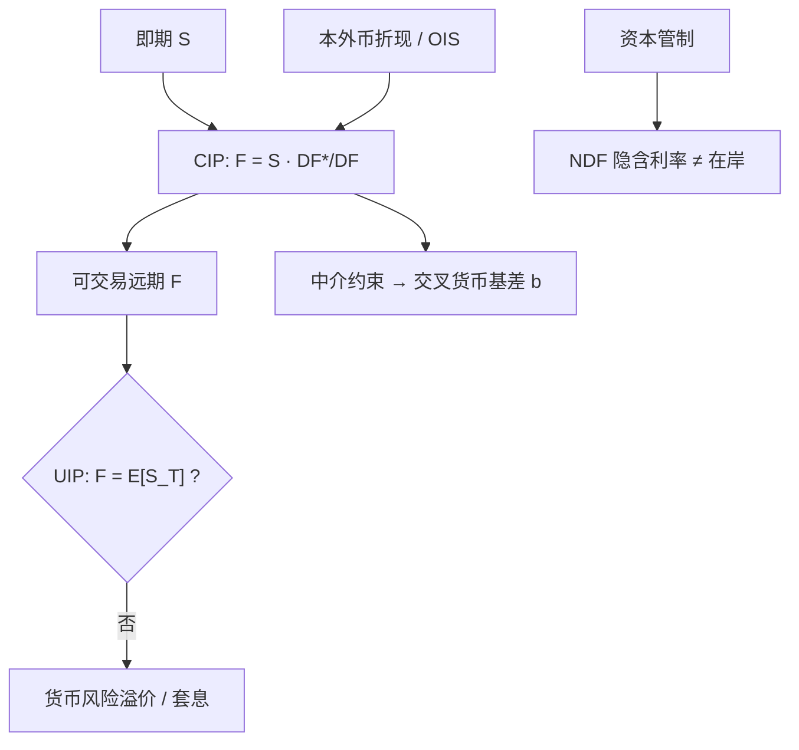

# 利率平价

远期汇率不是对未来即期的投票，而是两个货币市场与即期外汇之间的掉期报价；把抛补与未抛补写成同一句话，是后来许多谜题的源头。

<footer>—— Keynes, A Tract on Monetary Reform, 1923；未抛补的回归证据见 Fama, Journal of Monetary Economics, 1984</footer>

外汇里最硬的一句话是抛补利率平价（Covered Interest Parity, CIP）：在可兑换、可交易的存款与远期上，持有外币资产并卖出远期，应与持有本币资产得到同一无风险回报。凯恩斯 1923 年在《货币改革论》里已经把远期升贴水与利率差绑在一起。未抛补利率平价（Uncovered Interest Parity, UIP）把「卖出远期」换成「期望中的未来即期」，于是利率差应该等于预期贬值。Fama（1984）表明，用即期变化去回归远期溢价，斜率常常为负——高息货币并不按 UIP 贬值，反而平均升值，这就是远期溢价之谜，也是外汇套息的统计来源。2008 年之后，连 CIP 这一「恒等式」也出现了持久、有符号的偏离，Du、Tepper 与 Verdelhan（2018）把它写成交叉货币基差。本篇先把 CIP 与 UIP 的代数分开，再说明各自在什么市场结构下成立。

## 问题

记 $S$ 为本币/外币的即期（一单位外币的本币价格），$F$ 为同期远期，$i$、$i^*$ 为为本币与外币的同期限无风险利率。CIP 要求

$$
F=S\frac{1+i}{1+i^*},
$$

连续写法 $F=S\mathrm{e}^{(r-r^*)T}$ 与 [即期、远期与折现](/quant/spot-forward-df) 里股票远期同一形状，股息率换成外币利率。若不等式成立且你可以自由借贷、自由兑换、远期可交割，套利是借低息、买即期、存高息、卖远期。UIP 把 $F$ 换成 $\mathbb{E}[S_T]$，从而

$$
\mathbb{E}[S_T]/S=(1+i)/(1+i^*).
$$

CIP 是无套利（在理想工具集下）；UIP 是一个关于风险中性或风险溢价为零的期望假说。把银行报价屏幕上的远期当成「市场预测」，是把 CIP 的会计恒等式误读成 UIP。问题还有第三层：危机后 CIP 的输入不再是无风险的存款利率——LIBOR、OIS、国债、FX 掉期隐含利率彼此分开，你必须声明平价对的是哪一对利率，否则「偏离」只是曲线没对齐，见 [交叉货币基差](/quant/xccy-basis)。

### 远期溢价之谜不是计算错误

Fama（1984）把即期变化写成远期溢价的回归。UIP 下斜率为 1；估计值常落在负值附近。这不是因为交易员算错 CIP。远期由 CIP 钉死（或钉在带基差的 CIP 上），回归测的是风险溢价是否为零、是否时变。Fama 把远期溢价分解为预期贬值加上风险溢价，并指出风险溢价的波动可以大于预期贬值，从而把斜率打成负数。套息交易是这一回归的交易版本：持有高息、做空低息，不抛补。它赚的是 UIP 的失败，不是 CIP 的失败。

教科书用国债利率写 CIP，市场用 FX 掉期。掉期点直接报价 $F-S$，对应的是抵押或银行信用下的短端融资，不是财政曲线。用十年国债利差去解释一周远期点，是把 UIP 的长期叙事塞进 CIP 的短端会计。

## 方法

检验 CIP：在同一日计数、同一起息（通常 $T+2$）下，取即期、掉期点、两边存款或 OIS，计算交叉货币基差

$$
b=\frac{1}{T}\left[\ln(F/S)-(r-r^*)\right].
$$

$b=0$ 是 CIP。Akram、Rime 与 Sarno（2008）用高频数据说明，报价层面的 CIP 偏离往往短暂、且必须扣掉买卖价差与执行延迟；真正能吃到的套利窗口以秒与基点计。持久的、能在日度数据上看到的 $b$，是 2008 年后的新事实，应作为价格而不是误差，进入估值，见 Du 等人（2018）。

检验 UIP：在月度或季度频率上回归

$$
\Delta s_{t+k}=\alpha+\beta(f_t-s_t)+\varepsilon_{t+k},
$$

$s$、$f$ 为对数。报告 $\beta$ 与对 $\beta=1$ 的检验，并分样本（危机、高波动）。交易上，套息的权重是利率差或远期溢价本身，对冲与否决定你做的是 UIP 还是 CIP。对不可兑换货币，可交割远期不存在，CIP 的检验对象换成 [NDF](/quant/ndf) 隐含收益率与在岸利率之差，那是分割市场，不是平价失败。

### 从单期到曲线

CIP 对每个到期都可以写一条。短端由 FX 掉期主导，长端由交叉货币基差互换主导，中间要与 [OIS 多曲线](/quant/multi-curve-ois) 一致地折现。UIP 没有同样干净的曲线：长期 UIP 与短期 UIP 的实证表现不同，把三年套息与隔夜套息写成同一 beta，会混淆期限溢价与货币溢价。实践中应先建 CIP 曲线（作为无套利骨架），再把 UIP 残差当成风险溢价因子去交易或去对冲，而不是用 UIP 去「修正」远期报价。

## 机制

CIP 的机制是复制。一单位外币的远期买入，可由「借本币、买即期、存外币」合成，或由 FX 掉期一次性完成。当银行资产负债表有约束（杠杆率、G-SIB 附加、资金流出限制），复制的边际成本不再是两边 OIS 之差，而要加上配平美元（或配平日元）的影子价格，于是 $b\neq 0$。这不是外汇微观结构的噪声，而是银行中介的稀缺性被标了价。

UIP 的机制是风险。高息货币往往在全球风险偏好恶化时贬值，套息看起来像卖出看跌：Fama 的负斜率与「坏时候高息货币更弱」可以同时成立。凯恩斯—希克斯在商品里讲套保压力，外汇里对应的是国际投资者的货币对冲需求与美元作为融资货币的非对称。不要把这一溢价写成「市场非理性地违反 CIP」。CIP 可以近似成立（或只偏离几个基点），UIP 仍然系统地失败。

抛补套息（借低息、买高息资产、卖远期）在 CIP 成立时收益为零。若你看到「抛补套息还有 alpha」，先查是否用了不同信用的利率、是否忽略了基差、是否在 NDF 与在岸之间切了不可兑换溢价。

### 三角与平价的关系

三币种之间，CIP 必须与 [交叉汇率三角](/quant/fx-triangle) 同时成立：否则可以用即期三角加两条掉期合成第三条远期。实践中，流动性集中在美元作为媒介货币的掉期上，交叉货币的 CIP 由两条美元腿合成，残差进入交叉基差。三角套利约束的是报价一致性；利率平价约束的是外汇与货币市场的联立。两者一起，才决定可交易的远期曲面。

## 边界与工程取舍

CIP 对资本管制、不可兑换、交易对手额度与日内流动性失效。新兴市场的「CIP 偏离」常常是 NDF 对在岸的分割，应换文章讨论。税收、准备金、外汇头寸限额会在官方利率与可交易利率之间打进楔子。UIP 回归对区间极度敏感：加入 1980 年代或 2008、2020 会改变斜率；它适合作为风险溢价存在的证据，不适合作为下个月汇率点预测。购买力平价提供的是更慢的锚，见 [购买力平价作为锚](/quant/ppp-anchor)，不能用来给一周的 CIP 定价。

工程上，估值系统应把 FX 掉期隐含曲线与单币种 OIS 的差存成显式基差曲面，而不是每天用存款利率重算一个「理论远期」再把差额当模型残差。交易上，套息的风险管理是美元短缺与波动集群，不是利率差本身的点预测误差。

Fama 回归里的 $f-s$ 已由 CIP 钉住（加上基差）。把回归残差解释成「远期定错了」，是把风险溢价说成定价错误。只有在你可以无约束地做 CIP 套利却仍看到 $b$ 持久不为零时，才进入 Du–Tepper–Verdelhan 的中介约束叙事。

## 小结

- CIP 是即期、远期与两国利率之间的无套利会计；UIP 是「远期等于期望即期」的期望假说，二者不可混写。
- Fama（1984）的负斜率是风险溢价证据，也是套息的统计基础；它不否定 CIP。
- 高频下无摩擦的 CIP 偏离短暂（Akram, Rime and Sarno, 2008）；危机后日度、持久的偏离是基差价格（Du, Tepper and Verdelhan, 2018）。
- 必须声明平价所用的利率：存款、LIBOR、OIS 还是 FX 掉期隐含；声明错误会产生假偏离。
- 不可兑换货币应改用 NDF 平价，不要把分割市场写成 CIP 失败。
- 出处：Keynes, *A Tract on Monetary Reform*, 1923；Fama, *Journal of Monetary Economics*, 1984；Akram, Rime and Sarno, *Journal of International Economics*, 2008；Du, Tepper and Verdelhan, *Journal of Finance*, 2018。
