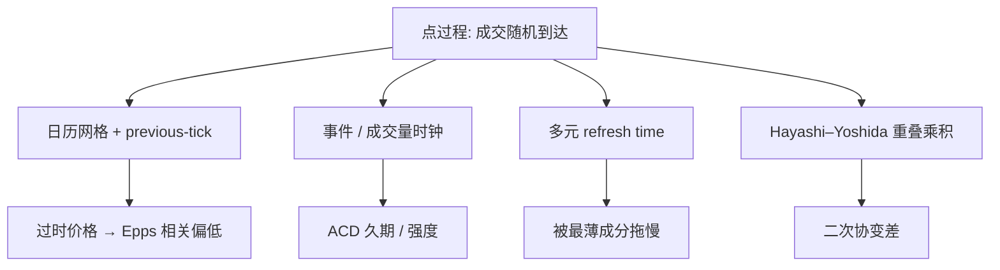

# 不等间隔采样

    
成交发生在随机时点上；若用上一笔价格填进日历网格，看起来得到了等间隔序列，却额外制造了零收益与滞后相关。

    <footer>—— 高频计量中 previous-tick 插值与 refresh time 的标准处理；久期一侧见 Engle and Russell, Autoregressive Conditional Duration, Econometrica 1998</footer>

教科书里的收益是等间隔：日、分钟、秒。交易所里的观测是点过程：成交与报价在随机时刻到达，密集与稀疏随会话、随事件变化。把点过程强行钉到日历网格，或假装每笔间隔相同，都会改变 [微观结构噪声](/quant/microstructure-noise) 的表观、改变已实现协方差的偏差。Engle 与 Russell 的 ACD 直接为久期建模；Hayashi–Yoshida 在不同步成交下估协方差而不做插值；Barndorff-Nielsen 等人用 refresh time 把多资产拉到共同的事件时钟。本篇写采样方案本身，它是估计量的一部分，不是数据读取的边角。

## 问题

单资产时，日历时间采样（每 $\Delta$ 取一个价格）与事件时间采样（每笔、每 $k$ 笔、每 $V$ 成交量）给出不同的序列。日历采样在开盘密集、午后稀疏：同样 $\Delta$，信息含量不同。事件采样在信息到达时自动加密，与 [VPIN](/quant/vpin) 的成交量时钟同类，但若每笔都用，噪声项 $2n\sigma_\varepsilon^2$ 里的 $n$ 变成随机且与波动相关——繁忙时噪声贡献更大。

多资产更严重。股票 A 与 B 很少在同一毫秒成交。要算 $\sum r^A r^B$，必须先定义同步价格。用 previous-tick：在网格点 $t_i$ 取各资产「不超过 $t_i$ 的最后一笔」。稀薄的一方会反复使用过时价格，制造零收益，压低已实现协方差，这就是 **Epps 效应** 的一个机械来源：采样越密，表观相关越低。问题不是「要不要高频」，而是高频下必须声明对时规则。

### 插值不是中性操作

线性插值在两个成交之间画直线，等于把未来成交价的信息提前写进当前网格——前视，回测非法，估计里制造虚假的平滑、$IV$ 偏低。Next-tick 同样前视。Previous-tick 因果，但引入交错误差（stale price）。没有无代价的同步。选择取决于对象：执行轨迹应用因果；事后估协方差可以考虑 Hayashi–Yoshida，它避免网格。

「一分钟线」通常已经是某种插值或最后一笔聚合的产品，不是原始点过程。用分钟线估噪声修正 RV，等于在数据商的采样规则之上再套一层理论。应尽量回到 tick，自己选网格；若只能用分钟线，把聚合规则当作模型的一部分写进报告。

## 方法

**日历网格 + previous-tick。** 实现简单，与五分钟 RV 兼容。应丢掉没有新成交的网格点（或标记为零收益但不把它们当独立新息），否则 $n$ 被空洞放大。开盘前若干分钟单独网格，因为久期结构不同。

**Refresh time（刷新时间）。** 多元已实现核常用：时钟只在**所有**成分都至少发生过一次新成交后前进一步。得到一条共同的不等间隔时间轴，每个时点上各资产都是「新鲜」的 previous-tick。代价是时钟被最不活跃的成分拖慢，活跃股的许多成交被扔掉。成分越多、越薄，refresh 越慢，接近低频。

**Hayashi–Yoshida 协方差。** 不造共同网格。对 A 的每一段收益，与所有与之时间重叠的 B 段收益相乘再求和。重叠的定义使异步不再系统性地压低协方差。它对噪声仍敏感，常与预平均结合。对象是二次协变差，不是相关矩阵本身——还要各自的 $IV$。

**久期模型。** Engle–Russell ACD：把成交间隔 $\Delta t_i$ 写成 $\psi_i\varepsilon_i$，$\psi_i$ 随过去久期自回归。它回答「下一笔何时来」，不是直接回答波动。把强度与价格变化联合（Engle ACD-GARCH 一类）才能把时间变形接到波动。成交量时钟、价格时钟是把点过程重参数化的另两条路。

### 时间变形与波动

若交易强度与 $\sigma_t$ 正相关，事件时间里的收益更接近同方差，日历时间里则有明显的日内季节性。这是为什么有人在事件时钟上算 RV 或做短时预测。但事件时钟的「一天」长度随机，跨日比较要再映回日历。隔夜没有成交，事件时钟无法跨越，必须在日历上单独处理隔夜项。采样方案与 [日历效应](/quant/calendar-overnight) 在日界处交接。

## 机制

Previous-tick 造成 Epps 效应的机制：B 的价格停着，A 动了，乘积 $r^A r^B$ 里 $r^B=0$，相关被摊薄。真实的共同跳若发生在两次成交之间，也会被拆到不同网格，共同变差流失。Refresh time 的机制是等到双方都更新，共同跳更可能落在同一增量里，但等待期间各自的特异变动被聚合，短时相关结构被平均。Hayashi–Yoshida 的机制是用重叠指示函数代替网格对齐，渐近上收回二次协变差。

ACD 的机制是把点过程的条件强度参数化，使久期的聚类（一笔之后很快又来一笔）可预测。它解释的是时间，不是价格；若把 ACD 强度当作「信息到达」，需要额外假定——PIN 类模型把到达写成泊松，是强度为常数的特例，ACD 允许强度时变。

成交量时钟把「间隔」从秒换成股。它不消除微观结构噪声，只改变噪声项里 $n$ 的含义。等体积桶在闪崩时变短，朴素 RV 在该时钟上仍会被噪声和错价主导。时钟换了，清洗与异常规则不能省。

### 与噪声修正的耦合

TSRV、核、预平均的渐近通常写在等间隔或近似规则网格上。随机采样、与波动相关的交易时间，会改变收敛速度和偏差公式。实务上有两条路：先 previous-tick 到细网格再套核（承认插值偏差），或用为不规则采样写的估计量。不要把为等间隔推导的最优带宽，原封不动套到 refresh time 序列上——后者的「$n$」是刷新次数，不是秒数。

## 边界与工程取舍

成分极多的组合（指数、组合风险）无法对全部成分做 refresh，否则时钟停住。应对流动性分层：核心成分 refresh，其余用回归或 beta 映射。暗池与延迟报告会让「最后一笔」并不是当时可成交的最后一笔，previous-tick 的因果性只相对于你的磁带，不是相对于市场。

不要用线性插值做回测填值。不要把 Tick 数据里同一毫秒的多笔当成等间隔的多次采样——应先按 [清洗规则](/quant/tick-cleaning) 合并事件。不要在涨跌停一侧没有成交时仍用过时价格填全日网格，那会制造长串零收益，核会把它们读成极强的噪声相关。期货与现货对时还要处理不同的会话与日历。

事件时间对预测下一口可能更齐整，对向监管或会计报告日波动则必须映回日历。两套时钟可以并存：盘中风控走成交量或成交笔数，日终风险走日历 RV 加隔夜。切换时钟时同步切换阈值，否则「三倍波动」的告警会在开盘脉冲里被事件时钟误触发。

## 小结

- 高频观测是不等间隔点过程；等间隔序列是采样方案的产物，会改变噪声与协方差。
- Previous-tick 因果但制造过时价格与 Epps 效应；线性插值前视。Refresh time 换共同新鲜时钟，被薄成分拖慢。
- Hayashi–Yoshida 用重叠乘积估协变差，避开网格；ACD 为久期建模，不自动给出波动。
- 时钟选择与噪声修正、隔夜处理耦合；带宽与 $n$ 必须按实际网格重定义。
- 回测禁止未来成交插值；停牌与涨跌停的空洞不能当普通零收益。
- 出处：Engle and Russell, *Autoregressive Conditional Duration*, Econometrica 1998；Hayashi and Yoshida 不同步协方差；refresh time 见 Barndorff-Nielsen, Hansen, Lunde, Shephard 多元已实现核实务。
