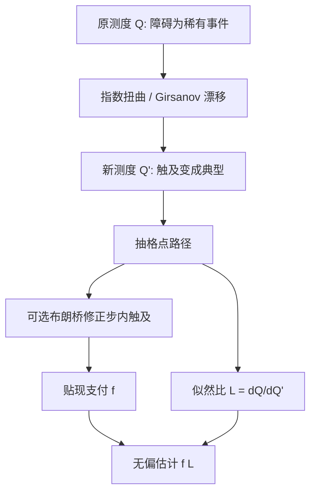

# 重要性采样对障碍

    
对路径依赖期权，把布朗运动的漂移扭向支付真正发生的区域，再乘上 Girsanov 似然比，可以得到渐近最优的无偏估计；障碍的稀有触及正是这一套方法的典型对象。

    <footer>—— Glasserman, Heidelberger and Shahabuddin, Asymptotically Optimal Importance Sampling and Stratification for Pricing Path-Dependent Options, Mathematical Finance, 1999</footer>

[上一课](/quant/cv-european)用路径级 $C$ 与精确 $\mathbb{E}[C]$ 降欧式方差，最优 $\beta$ 为回归系数；深虚值与障碍上线性相关被不连续切断，控制帮助有限。障碍支付接近稀有事件指示，朴素 MC 的相对误差在触及概率变小时恶化。缺口是重要性采样：把路径测度扭向触及区域并乘似然比，保持无偏。本课写障碍上的 IS，不重推控制变量的 $\beta$。布朗桥填的是步内连续触及，不替代对格点路径的变测度。

## 问题

记敲入支付为 $e^{-rT}(S_T-K)^+\mathbf{1}_{\{\tau_B\le T\}}$，其中 $\tau_B$ 是触及障碍 $B$ 的首时。朴素估计的相对误差在 $B$ 远离 $S_0$ 或期限短时并不随 $N$ 变好：均值以指数速度变小，方差却与均值同阶甚至更大，有效样本量被稀有事件吃掉。敲出把指示反过来，但「差一点就敲出」的路径对价格的导数和对数字部分的方差仍然病态。问题不是再抽一千万条几何布朗运动，而是构造一个等价测度 $\mathbb{Q}'$，使 $\mathbb{Q}'(\tau_B\le T)$ 不再是小概率，同时 Radon–Nikodym 导数在这些路径上不要爆炸。

障碍还有一层离散化：模拟只在时间格点上看 $S_{t_i}$，连续障碍会被漏掉。布朗桥修正给的是条件触及概率，它本身是一种条件蒙特卡洛，可以和 IS 叠用，但不能替代变测度——桥只填格子内部，不把路径整体推向障碍。

### 稀有事件与相对误差

设 $p=\mathbb{Q}(A)$ 很小，$A$ 为有支付的路径集合。指示函数估计量的方差约为 $p(1-p)$，相对误差 $\sqrt{(1-p)/(Np)}$ 在 $p\to 0$ 时发散。欧式虚值看涨已经有这个问题，障碍更严重：事件是整条路径的几何约束，不是单点 $S_T>K$。把终点均值推向 $K$ 的一维 IS，对敲入不够——路径可以到期实值却从未碰壁。必须对路径测度做扭曲，使「碰壁」成为大概率，而不是只改终点。

重要性采样失败的典型样子不是偏差，而是方差比朴素还大：少数路径带着巨大似然比。监控 $\sum L_i^2$ 与有效样本量 $N_{\mathrm{eff}}=(\sum L_i)^2/\sum L_i^2$，比只看价格点估计更早发出警报。

## 方法

对漂移为 $r-q$、波动 $\sigma$ 的几何布朗运动，Girsanov 把布朗运动的漂移改成常数 $\mu$（或分段常数），似然比为

$$
L=\exp\Bigl(-\mu W_T^{\mathbb{Q}'}-\tfrac12\mu^2 T\Bigr)
$$

的离散和形式。估计量是 $e^{-rT}f(S)\,L$。Glasserman–Heidelberger–Shahabuddin 用大偏差：在稀有事件 $\{路径\in A\}$ 上，最优扭曲使新测度下该事件的概率以指数速率趋于 1，且二阶矩以同样的指数速率下降，即渐近最优。对向下敲入，漂移应指向障碍，幅度由障碍距离、波动与期限共同决定，而不是手调一个「看起来多碰到 $B$」的数。

向上与向下、敲入与敲出，最优漂移的符号和是否还要兼顾执行价不同。敲入看涨常常是双约束：先触及 $B$，再在到期落在 $K$ 一侧。实务上可分段：触达前用指向障碍的漂移，触达后切回对欧式有利的漂移，并在切换点把似然比接上。这比全程一个常数 $\mu$ 更接近渐近最优，实现上也仍是路径上的累加。

### 布朗桥与似然比不要混成一件事

格子内部的触及概率 $p_{\mathrm{hit}}= \exp\bigl(-2(B-S_i)(B-S_{i+1})/(\sigma^2 S^2\Delta t)\bigr)$ 一类公式，是在两端点已给定时对连续路径取条件，属于条件期望，不改变两端点的抽样测度。IS 改变的是两端点（以及整条驱动布朗）怎么被抽出来。正确的组合是：在 $\mathbb{Q}'$ 下抽格点路径，用桥修正敲入/敲出指示（或把指示换成条件概率以再降方差），再乘整条路径的 $L$。若只在原测度上用桥，稀有敲入仍然很少出现格点靠近 $B$，桥概率大多接近零，方差改善有限。

连续观察与离散观察是不同产品。IS 的漂移应对准合约写明的观察频率：日观察障碍的「触及」是格点事件，不必再用连续桥，但漂移仍应指向障碍。把连续公式的最优 $\mu$ 套到离散障碍上，渐近最优性不再自动成立。

## 机制

指数扭曲的直观是：在对数价格的随机游走上，把均值改到事件 $A$ 的最可能实现（大偏差的最小作用路径）。对单边障碍，这条路径往往是一条指向 $B$ 的近似直线；似然比正好补偿「我们把概率质量搬过来」这件事。因此无偏性来自测度等价——几何布朗在有限时间上两条漂移测度互相绝对连续——而方差下降来自 $f L$ 在新测度下不再是极端稀疏的脉冲。

随机波动与局部波动让最优漂移变成状态依赖。Heston 下障碍的稀有程度同时取决于现货距离和当前方差：低方差时更难触及远处障碍。常数 $\mu$ 只是近似；更仔细的做法是在 $(S,v)$ 上解一个与生成元相关的特征值问题，或用试抽样估计分段漂移。局部波动 $\sigma(S,t)$ 已知时，可以沿最小作用路径对变漂移积分，这比假装常数 $\sigma$ 更一致，也更贵。

### 与分层、控制变量的叠加

GHS 原文同时讨论分层：在新测度下对终点或对似然比的指数部分分层，避免少数巨大权重。控制变量仍可用同一模型下的欧式闭式，但相关结构在 $\mathbb{Q}'$ 下会变，必须重新估 $\beta$，且 $\mathbb{E}[C]$ 仍须在原测度下已知——控制的是原期望，不是新测度期望。对偶在强漂移下几乎失效：$-W$ 不再是对称的另一条同分布路径。顺序应是：先选定 IS 测度，再在该测度上分层，最后才考虑弱控制。

敲出的 IS 容易被用反。若大多数路径本来就不敲出，把漂移推向障碍会增加敲出、减少存活，对敲出看涨可能是在抽样更稀有的「存活且实值」。此时更合理的是推向执行价并远离障碍，或对敲出用朴素抽样、只对敲入做 IS。

## 边界

渐近最优是大偏差语句：障碍越远、概率越小，相对优势越明显。障碍就在附近、敲入概率已经是几十个百分点时，IS 的额外方差来自 $L$ 的波动，可能不如朴素加布朗桥。多障碍、双触、巴黎障碍的最优路径不再是单段直线，手写漂移容易错；此时自适应 IS（先小样本估扭曲参数再正式抽）比硬套单边公式安全。

跳跃与无穷活动 Lévy 破坏单纯的 Girsanov 漂移图像：触及可以一跳越过障碍，变测度还要扭强度与跳跃度量。把扩散 IS 直接接到 Merton 或 VG 路径上，似然比只解释了布朗部分，跳跃部分的稀有性原封不动。美式障碍还叠加提前行权，IS 不消除 LSMC 的回归偏差。报告时应写清：连续还是离散观察、是否用桥、漂移如何选取、权重的 $N_{\mathrm{eff}}$，而不是一句「做了重要性采样」。

Glasserman 的专著把同一套似然比写成可核对的算法，但障碍产品的合约细节（观察频率、交割、返现 rebate）决定 $A$ 是什么。变测度必须对准 $A$，不能对准另一张香草的虚值区域。

## 小结

- 障碍支付接近稀有事件指示，朴素 MC 的相对误差在触及概率变小时恶化；IS 把路径测度扭向触及区域并乘似然比，保持无偏。
- Glasserman–Heidelberger–Shahabuddin（1999）给出路径依赖期权指数扭曲的渐近最优性；单边障碍的最优漂移大致沿指向壁的最小作用路径。
- 布朗桥是条件蒙特卡洛，填的是步内连续触及，不替代对格点路径的变测度。
- 敲入与敲出、单约束与「碰壁且到期实值」的双约束，对应不同的分段漂移；用反会增大方差。
- 随机波动、跳跃、多障碍使常数漂移失效，需状态依赖或自适应 IS，并监控权重有效样本量。
- 出处：Glasserman, Heidelberger and Shahabuddin, *Mathematical Finance*, 1999；系统算法见 Glasserman, *Monte Carlo Methods in Financial Engineering*, 2004。
