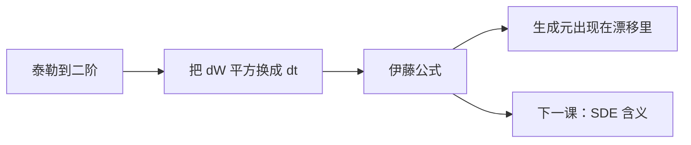

# 伊藤引理

对 $C^{2,1}$ 的 $f(t,W_t)$，二阶项 $\partial_{ww}f\,(\mathrm d W)^2$ 不可忽略，它贡献 $\tfrac12\partial_{ww}f\,\mathrm d t$。

<footer>—— 据 Itô, On Stochastic Differential Equations, Mem. Amer. Math. Soc., 1951；Karatzas and Shreve, 1991, 第 3 章整理</footer>

上一课[二次变差](/quant/quadratic-variation)给出乘法表 $(\mathrm d W)^2=\mathrm d t$。缺口是：若状态是 $W$ 的非线性函数，增量怎么写。经典链式法则丢掉二阶，会把 $\ln S$、期权价格、贴现因子的漂移全部写错。本课只把 Itô 公式钉成后课 SDE 的微分引擎，不把积分构造重做一遍。

## 问题

设 $Y_t=f(t,W_t)$，$f$ 对时间 $C^1$、对空间 $C^2$。普通微积分写 $\mathrm d Y=f_t\,\mathrm d t+f_w\,\mathrm d W$。布朗路径上 $(\Delta W)^2$ 与 $\Delta t$ 同阶，泰勒的二阶项在极限里活下来。漏掉它，$Y$ 的漂移少一块 $\tfrac12 f_{ww}$，后面几何布朗运动的显式解、Feynman–Kac 的生成元都会差一个二阶微分算子。

缺口不是「再解释一次二次变差」，而是把二次变差喂进多元泰勒，得到封闭的 $\mathrm d f$。多维、带漂移的 $X$ 是同一条公式的坐标替换，本课先写清一维布朗，再声明推广。

### 伊藤不是把导数换成随机导数

$f_w$ 仍是普通偏导，没有新的「路径导数」。随机性全部来自把 $(\mathrm d W)^2$ 换成 $\mathrm d t$，再取极限。Stratonovich 积分会把二阶项藏进对称极限，链式法则看起来像经典的；本序列主干用 Itô，因为 $\int H\,\mathrm d W$ 在可积条件下是鞅，定价要这条鞅性质。

金融里常把 $\tfrac12\sigma^2$ 叫做凸性调整。来源就是 $f(x)=x^2$ 或 $\ln x$ 的 $f''$： Jensen 与 Itô 修正是同一块二阶。

## 方法

一维公式：

$$
\mathrm d f(t,W_t)=\Bigl(\partial_t f+\tfrac12\partial_{ww}f\Bigr)\mathrm d t+\partial_w f\,\mathrm d W_t.
$$

若 $X$ 满足 $\mathrm d X=\mu\,\mathrm d t+\sigma\,\mathrm d W$，则

$$
\mathrm d f(t,X_t)=\bigl(f_t+\mu f_x+\tfrac12\sigma^2 f_{xx}\bigr)\mathrm d t+\sigma f_x\,\mathrm d W_t.
$$

乘法规则仍是上一课的表：$\mathrm d W\cdot\mathrm d t=0$。积分形式是定义；微分形式是简写。后课写 GBM、写期权价值过程，都直接套第二式。生成元 $\mathcal A=\mu\partial_x+\tfrac12\sigma^2\partial_{xx}$ 会在 [Feynman–Kac](/quant/feynman-kac) 再出现，本课只把它从 Itô 里读出来。

## 机制

Itô 积分取左端点，增量 $\Delta W$ 与已经确定的 $f_w(t_i,W_{t_i})$ 独立，一阶项期望为零，二阶项期望留下 $\tfrac12 f_{ww}\Delta t$。这就是漂移修正的概率来源。对凸函数 $f_{ww}>0$，Itô 漂移大于经典漂移——期权的时间价值、对数坐标里的 $-\tfrac12\sigma^2$，都是这块符号。

公式要求 $f$ 足够光滑。弱解、局部时、Tanaka 公式处理 $|W|$ 这类不够 $C^2$ 的函数，主干定价用不到，不在本课。多维时交叉变差 $[W^i,W^j]_t=\rho_{ij}t$ 进入混合二阶导；后课若写相关布朗，只加这一项。

## 边界

本课不证 Itô 公式（需要等距、局部化、停时），不引入 Stratonovich。跳扩散的 Itô 还要加 $\Delta f-f_x\Delta X$ 的补偿，留给[跳过程直觉](/quant/jump-process-intuition)。后课默认：对 $C^{2,1}$ 函数可以直接写 Itô；SDE 的微分运算以本课第二式为准。下一课[随机微分方程的含义](/quant/sde-meaning)回答 $\mathrm d X=\mu\,\mathrm d t+\sigma\,\mathrm d W$ 作为对象究竟是什么。

## 小结

- 伊藤引理 = 链式法则 + $\tfrac12 f_{xx}\,\mathrm d[X]$。
- 修正项来自二次变差，不是新的导数概念。
- 主干用 Itô 是为了积分的鞅性质。
- 生成元 $\mathcal A$ 就是公式里的漂移算子。
- 出处：Itô, 1951；Karatzas–Shreve 第 3 章。
