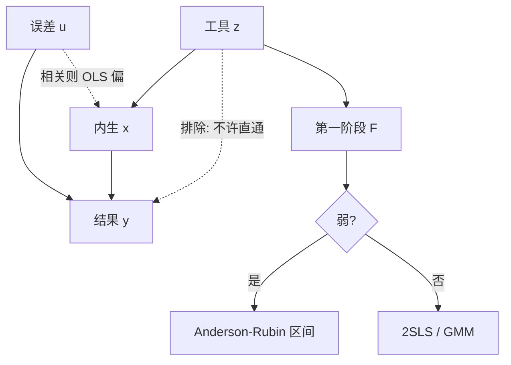

# 工具变量在金融

回归元与误差相关时，最小二乘估的是混合物；找一个只通过该回归元进入结果的外生变动，才能把因果斜率从相关里拆出来——前提是排除限制真的成立。

<footer>—— 识别表述见 Angrist, Imbens and Rubin 的 LATE 框架；金融应用的常见失败见 Roberts and Whited 对公司金融识别的综述</footer>

[面板固定效应](/quant/panel-fe-finance) 消掉不随时间变的 $c_i$，组内仍可能内生：投资与现金流同时被投资机会驱动，估值与预期收益同时被风险驱动，分析师覆盖与流动性同时被关注度驱动。工具变量把 $x$ 的变动拆成「与 $u$ 相关的」和「只通过 $x$ 的」。本课缺口是金融 IV 的**排除限制几乎总是可争的**，弱工具会把 2SLS 变成噪声放大器。后课事件研究用时间上的集中冲击，是另一种外生变动，不是 IV 的替代写法。

## 问题

$y=x\beta+u$，$E[xu]\neq 0$。工具 $z$ 满足相关 $E[zx]\neq 0$、排除 $E[zu]=0$。2SLS 先用 $z$ 投影 $x$，再用 $\hat x$ 回归 $y$。估计的是对工具诱导的那部分变动的加权（LATE：谁被 $z$ 推动，权重在谁身上）。问题不是「找一个相关的 $z$」，而是 **$z$ 是否只通过 $x$ 影响 $y$**。

金融里常见伪工具：滞后 $x$ 当工具（序列相关的 $u$ 仍相关）、行业均值当工具（行业冲击直接进 $y$）、指数纳入当工具（纳入本身改变需求与关注，排除失败）。Roberts 与 Whited 强调：写故事容易，证伪排除难。

### 弱工具先于内生讨论

第一阶段 $F$ 小，2SLS 向 OLS 偏、方差膨胀、非正态。Stock–Yogo 临界值、Anderson–Rubin 对弱工具稳健的检验，应先于「IV 显著」的叙述。多个工具时过度识别的 Hansen–Sargan 检验拒绝，说明至少一个排除失败；不拒绝并不能证明排除成立——功效可以很弱。

「相关所以是好工具」是第一阶段；好工具还要排除。把第一阶段 $t$ 当识别证据，是把相关当成因果的另一种写法。

## 方法

**2SLS 与 GMM。** 恰好识别时两者等价。过度识别用 Hansen 的 GMM 加权，标准误用稳健或聚类——IV 不豁免 [聚类](/quant/clustered-se)。有限样本里 2SLS 偏小（朝 OLS），LIML 对弱工具稍稳，报告两者。

**金融里还算干净的设计（仍要逐项争）。** 指数重组、合并带来的外生持仓变化（但需求冲击可直接进收益）；地理或监管门槛（但门槛常与发展程度共变）；天气、灾害作为局部冲击（但可影响基本面）。没有「资产定价专用的标准工具包」可以自动用于 $\beta$ 或特征。

**与 [Fama–MacBeth](/quant/fama-macbeth)。** FM 不管内生。用特征当 $x$ 解释收益，特征若是被定价的风险代理，OLS 估的是预测关系，不必假装是结构弹性。只有当你声称「治理导致价值」而治理由预期价值决定时，才进入 IV。对象先写清：预测还是因果。

### 诊断清单

报告第一阶段、排除的经济论证、弱工具稳健区间、聚类维与 FE 集合。安慰剂：工具对不应该被影响的结果。简化型 $y$ 对 $z$：若简化型为零，无论 2SLS 多好看都没有第一阶段故事。不要只报告 2SLS 点估计。

## 机制

2SLS 的分子是 $z$ 与 $y$ 的协方差，分母是 $z$ 与 $x$ 的协方差。排除保证分子里没有 $z\to u$ 的直接通道。弱工具让分母接近零，比值的分布变成 Cauchy 类，正态 $t$ 崩溃。这就是为什么 $F$ 必须先看。

面板 IV：组内变换后用滞后水平当工具（Arellano–Bond）依赖序列不相关的 $u$；金融残差很少那么干净，差分 GMM 容易弱工具加错误排除。系统 GMM 再加水平方程，工具膨胀，Hansen 检验被过多工具买通。公司金融里应少工具、长差异，而不是默认 `xtabond2` 全套滞后。

Wald 比率直觉：$\hat\beta=\widehat{\mathrm{Cov}}(z,y)/\widehat{\mathrm{Cov}}(z,x)$。两个协方差都用同一聚类结构估计。分子分母的有限样本噪声会相关，这是 AR 检验直接测简化型的原因。

### 资产定价中的「特征内生」

账面市值比含价格，用它解释收益有机械成分。IV 很难找到只动基本面不动折现率的 $z$。更常见的处理是：承认预测回归、用稳健推断、或把特征写成载荷的代理（IPCA），而不是硬找一个「外生的账面」。把 IV 用在错误对象上，排除故事会变成形而上学。

## 边界与工程取舍

弱工具 + 聚类 + FE 的有限样本，自助须对整簇重抽并重做两阶段。异质 $\beta$ 时 2SLS 是 LATE，外推到未受工具推动的公司是额外假设。高频里用微观结构变量当工具（买卖压力解释收益）常常是定义而非排除。

工程：先写因果图再找 $z$；$F$ 过线再谈 2SLS；并列 OLS、2SLS、AR 区间。不要用 20 个滞后当工具再声称过度识别通过。不要把指数纳入 IV 用在纳入日附近的事件收益上还假装排除——那更像 [事件研究](/quant/event-study)。

## 小结

- 组内 FE 之后仍内生，才轮到 IV；IV 估的是工具推动的那部分变动。
- 排除限制是识别，第一阶段 $F$ 是能否用正态推断；弱工具时改 AR 一类。
- 金融里滞后变量、行业均值、指数纳入都常破坏排除，须逐项论证。
- 预测问题不必硬套 IV；因果问题不能只用稳健标准误。
- 出处：两阶段与 LATE 见 Angrist and Imbens 相关工作；弱工具见 Stock and Yogo；金融识别综述见 Roberts and Whited；过度识别见 Hansen, *Econometrica*, 1982。
