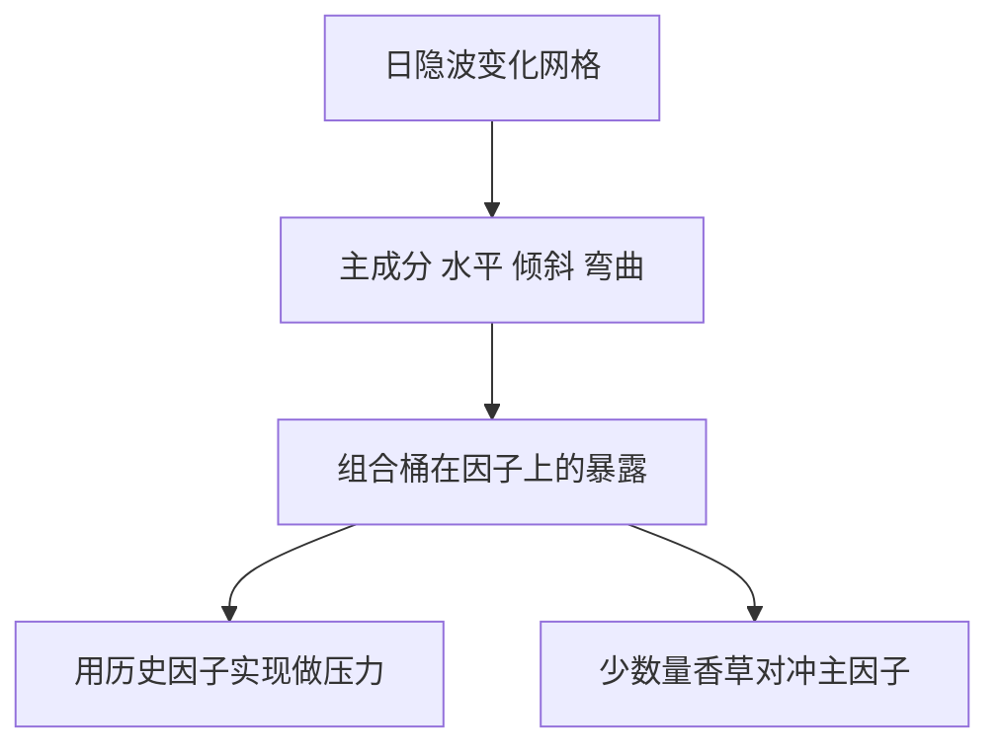

# 隐波曲面动态与 PCA

隐波曲面的日变化大约是水平、倾斜、弯曲三五个主成分；动态模型应写在这组因子上，而不是让每个执行价独立乱跳。

<footer>—— Cont and da Fonseca, Dynamics of Implied Volatility Surfaces, Quantitative Finance, 2002</footer>

[上一课](/quant/vega-buckets)把今日风险钉在桶上。缺口是**明天曲面怎么动**：桶与桶高度相关，独立 bump 高估组合方差。Cont–da Fonseca 用 Karhunen–Loève / PCA 把日变化分解成少数空间因子加随机时间序列。后课 gamma-theta 仍在单日对冲；本课给情景与时间序列风险一个低维坐标。

## 问题

把每个隐波节点当独立布朗，组合的 Vega 平方和会爆。经验上第一主成分接近平行水平，第二接近倾斜，第三接近弯曲，累计解释绝大部分日方差。问题是：PCA 在**变化量**上做，不是在曲面水平本身上做；水平很高时，变化的主成分形态仍可能稳定。用水平曲面去做 PCA，第一成分会混进期限结构的形状，解释的是截面不是动态。

动态若用局部波动，今日校准的 $\sigma(K,T)$ 明天不再与市场一致，除非加上与 PCA 相容的随机演化（如 Bergomi 的远期方差因子）。本课不重写 [Dupire](/quant/dupire) 公式，只要求：对冲与限额用的情景应来自历史或隐含的曲面因子，而不是来自任意节点噪声。

###  Sticky strike 与 sticky delta 是两种一维动态

Sticky strike：执行价网格上的隐波不动，现货动则 Delta 变。Sticky delta：按 Delta 的隐波不动，微笑跟着现货走。两者都是对 PCA 第一、第二成分的粗糙截断。短到期往往更 sticky delta，长到期更 sticky strike，一刀切会把风险反转的预期 PnL 做反。PCA 提供检查：若第二成分确实是倾斜且与现货相关，sticky delta 更像；否则不要迷信。

PCA 因子不是无套利的。直接让主成分独立高斯去演化，曲面可能出现蝶式套利。情景测试可以；生成模型需要投影回无套利流形，见 [无套利插值](/quant/arb-free-iv)。

## 方法

取日度隐波变化（或对数变化），按到期-Delta 网格对齐，做 PCA 或 FPCA。保留解释 90–95% 的成分，把组合桶向量投到这些因子上，得到因子暴露。压力：用 2008、2018、2020 的因子实现，而不是把所有桶同时 +10 点。校准动态模型（Bergomi、Heston 多因子）时，用因子载荷当矩或当定性约束。

对冲：用少数香草组合去减第一、第二因子暴露，残差才是真正的特异曲面风险。

## 机制

市场报价的相关性来自做市商用低维参数（ATM、偏斜、凸性）去标整张网。PCA 只是把这个低维结构从数据里读出来。组合若在因子正交补上暴露很大，要么在交易不可对冲的噪声，要么网格与流动性不一致。时间序列上因子有均值回复与异方差，水平成分在危机中会跳——PCA 本身是线性二阶方法，跳要用补充情景。

## 边界

网格缺失、翼部噪声会污染高阶成分，应先平滑或降权。不同货币、不同标的的 PCA 不能直接加。隐含的因子风险中性动态与历史 PCA 不是同一测度：定价 cliquet 需要风险中性的远期微笑动态，不能把历史特征值直接塞进定价核。那是模型风险课的对象。

## 小结

- 曲面日变化由少数主成分主导；独立桶 bump 高估方差。
- PCA 做在变化量上；sticky strike/delta 是对因子的粗糙截断。
- 无套利与风险中性动态要另外投影，PCA 情景不能直接当定价模型。
- 出处：Cont and da Fonseca, *Quantitative Finance*, 2002。
