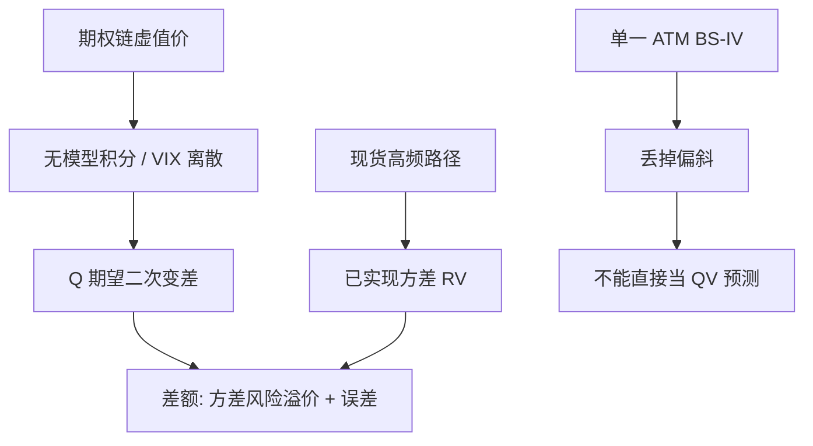

# 隐含 vs 已实现波动

若标的在风险中性测度下是扩散，整条期权微笑可以合成一条对未来二次变差的无模型预测；它不是某一执行价上的 Black–Scholes 反解。

<footer>—— Britten-Jones and Neuberger, Option Prices, Implied Price Processes, and Stochastic Volatility, Journal of Finance 2000</footer>

期权市场每天报出一套隐含波动，现货高频又给出一套[已实现波动](/quant/rv-noise)。两者都叫「波动」，对象却不同：前者是风险中性期望，后者是物理测度下已经走完的二次变差。Britten-Jones 与 Neuberger 证明，在无跳跃的扩散假设下，从连续执行价的虚值期权可以复原风险中性积分方差，而不必指定局部或随机波动模型。Carr–Madan 的对数合约复制、Demeterfi–Derman–Kamal–Zou 的方差互换，以及后来 Jiang–Tian 的无模型隐含波动、CBOE 的 VIX，走的是同一条复制恒等式。本篇写 IV 与 RV 各自估什么、差一项方差风险溢价，以及把 ATM 隐含波动直接当 RV 预测会错在哪里。

## 问题

记现货（或期货）价格为扩散 $dS_t/S_t=\mu_t dt+\sigma_t dW_t$。$[0,T]$ 上的积分方差 $\int_0^T\sigma_t^2 dt$ 是路径对象：一天走完，[RV](/quant/rv-noise) 去估它。合约起始日，市场并不知道这条路径，只交易对它的或有权益。Black–Scholes 把 $\sigma$ 当常数，从一个期权反解 $\sigma_{\mathrm{IV}}(K,T)$，得到微笑，不是一个数。要问「市场认为未来方差是多少」，必须先指定：是哪一个 $K$，还是把整条微笑积成对二次变差的期望。

风险中性测度 $\mathbb{Q}$ 下，$\mathbb{E}^{\mathbb{Q}}[\int_0^T\sigma_t^2 dt]$ 一般不等于 $\mathbb{E}^{\mathbb{P}}[\int_0^T\sigma_t^2 dt]$。卖方差保护的人要求补偿，隐含方差通常高于后续已实现方差，差额是**方差风险溢价**。Bollerslev、Tauchen 与 Zhou 用它预测超额收益；Carr 与 Wu 在指数期权上估计溢价为负（对持有方差多头而言）。问题因此有两层：如何从期权取出可与 RV 对齐的对象；对齐之后，剩余差该解释为预测误差还是风险价格。

### 模型相关 IV 与无模型 IV

ATM 的 Black–Scholes IV 使用方便，却把微笑的斜度丢掉了。深虚值看跌的高 IV 对应左尾，对方差互换的贡献按 $1/K^2$ 加权，不是按成交量加权。局部波动、Heston 各自给出另一套「隐含」过程，彼此不可比。Britten-Jones–Neuberger 的贡献是：在扩散族里，与今日期权相容的风险中性扩散是唯一的，因而风险中性期望二次变差也是唯一的，可由期权价格的积分写出，无需再估一个结构模型。跳跃会破坏「唯一扩散」这一条，无模型公式估的是对数合约的期望，与二次变差不再相等——这是后文的边界。

VIX 不是 S&P 500 的「预测波动率」，而是对未来三十天方差互换公平费率的离散近似，再开方、年化。把它与后续三十天 RV 的标准差直接画散点，斜率小于 1 并不证明期权「高估了波动」，而常常是溢价与离散复制误差叠在一起。

## 方法

**复制。** 对充分光滑的收益函数 $f(S_T)$，Carr–Madan 给出用债券、远期与连续虚值期权的静态组合。取 $f(x)=\ln(x)$，伊藤公式在扩散下把 $\ln S_T$ 与 $\int (dS/S)$、$\int\sigma^2 dt$ 连起来。整理后，风险中性期望积分方差等于虚值看涨与看跌价格对 $K^2$ 的积分。Britten-Jones–Neuberger 在零利率、连续执行价的设定里把这条恒等式写清楚：隐含过程的二次变差期望，就是今天能交易的期权组合的价值。

离散实现近似 CBOE 公式。设远期为 $F$，执行价网格 $\{K_i\}$，虚值期权中点价 $Q(K_i)$，则

$$
\sigma_{\mathrm{MF}}^2 \approx \frac{2e^{rT}}{T}\sum_i \frac{\Delta K_i}{K_i^2} Q(K_i)-\frac{1}{T}\left(\frac{F}{K_0}-1\right)^2,
$$

其中 $K_0$ 是不高于 $F$ 的最近执行价。截断、离散、买卖价差都会偏高或偏低；Jiang–Tian 讨论了截断偏差：两端执行价不够远时，无模型 IV 系统性偏低。

**与 RV 对齐。** 把 $\sigma_{\mathrm{MF}}^2$ 与同期 RV 比较，必须统一：期限 $T$、是否含[隔夜](/quant/calendar-overnight)、RV 是否做噪声修正、是否含跳跃。指数方差互换的浮动腿接近已实现方差（成交价路径），不是中点 RV。用五分钟 RV 去验证 VIX，是一种带宽选择，不是理论要求。

### 方差风险溢价的符号

定义 $\mathrm{VRP}_t=\mathbb{E}^{\mathbb{Q}}_t[\mathrm{QV}_{t,t+\tau}]-\mathbb{E}^{\mathbb{P}}_t[\mathrm{QV}_{t,t+\tau}]$。用无模型 IV 减 HAR 一类对 RV 的条件预测，得到 VRP 的代理。指数上该代理多为正（IV 高于预期 RV）：买保护的人付溢价。个股上符号更杂，还有跳跃溢价与流动性。溢价时变，危机中 IV 与 RV 一齐升，但 IV 升得更狠，随后 RV 回落，多空方差的持有期收益在平静期为正、在跳跃日为负。

## 机制

扩散下，二次变差与对数合约由伊藤修正项锁死：路径越「抖」，$\ln S_T$ 相对 $\int dS/S$ 掉得越多。期权市场给 $\ln S_T$ 定价，也就给了 $\mathbb{E}^{\mathbb{Q}}[\mathrm{QV}]$。物理测度下的 RV 没有经过这层定价核。核若讨厌方差上升的状态（典型是坏状态），就会把 $\mathbb{Q}$ 下的方差期望抬到 $\mathbb{P}$ 之上。于是「IV 减 RV」既有预测误差，也有风险价格，不能用均方误差单独评判 IV 的好坏。

微笑的斜度进入积分，是因为虚值看跌在 $1/K^2$ 权重下仍贡献左尾。只看 ATM IV，等于假装微笑平坦。偏斜变陡时，无模型 IV 与 ATM IV 的裂口加大；这时若仍用 ATM 去对 RV，会把偏斜变化误读成水平波动预测误差。

Britten-Jones–Neuberger 要求样本路径连续。有跳跃时，方差互换复制出的是 $\mathbb{E}^{\mathbb{Q}}[-2\ln(S_T/F)-2(S_T/F-1)]$ 一类对数合约，与 $\mathbb{E}^{\mathbb{Q}}[\sum(\Delta S/S)^2]$ 差一项跳跃凸性。指数上跳跃不可忽略，VIX 对二次变差是近似，对对数合约更忠实。

### 信息含量检验

早期文献问：隐含波动能否预测后续已实现波动，是否涵盖 GARCH 与历史 RV。结论通常是：IV 有信息，但不充分统计；RV 的滞后项仍显著。这与「IV 是 $\mathbb{Q}$ 期望、RV 是 $\mathbb{P}$ 实现」并不矛盾：即使 $\mathbb{Q}$ 期望是 RV 的最优风险中性预测，物理测度下的最优预测仍可依赖历史 RV。把 IV 放进 HAR 的外生项，是工程上折中，不是把两个测度当成一个。

## 边界与工程取舍

执行价网格疏、远翼无报价时，积分要外推微笑。外推方法（常弹性、SABR、截断）会改变无模型 IV 几个点，对个股尤其严重。美式、股息、提前行权破坏欧式复制；用美式反推欧式再积分，引入模型。买卖价差使虚值期权中点偏贵，IV 偏高，部分「溢价」其实是流动性。

不要把单一 $K$ 的 IV 与 RV 的标准差比：单位先统一到方差，再开方。不要用含隔夜的收盘 RV 去对交易时段的方差互换。高频 RV 有[微观结构噪声](/quant/microstructure-noise)，朴素一分钟 RV 会假高，让 IV−RV 假小。跳跃日 RV 含跳，无模型 IV 含跳跃溢价，裂口解释要分开连续方差与跳。

交易上，做空「IV 减 RV」是做空方差风险溢价，不是做一个无风险的预测误差。跳跃、缺口、离散对冲误差会在溢价最宽的日子兑现。复制要用整条链，用 ATM 期权当方差互换是 Delta 对冲后的近似，偏斜大时误差大。

同一标的的 IV 曲面与 RV 估计都依赖清洗与同步。期权延迟、现货期货基差、除息，都会制造假的 IV−RV。比较论文时先看：无模型还是 ATM、RV 的采样与噪声修正、样本是否剔除跳跃日。

## 小结

- 无模型隐含方差由虚值期权对 $1/K^2$ 积分得到，对应风险中性期望二次变差（扩散假设下）；ATM 的 Black–Scholes IV 不是同一对象。
- RV 估物理测度下已实现的积分方差；IV 与后续 RV 之差含预测误差与方差风险溢价，指数上 IV 通常更高。
- Britten-Jones–Neuberger 给出扩散族里隐含过程的唯一性；有跳跃时复制对准对数合约，与二次变差有凸性差。
- 对齐期限、隔夜、噪声修正与跳跃处理之后，才能谈「隐含是否高估已实现」。
- VIX 是方差互换费率的离散近似，不是对未来波动的无偏点预测。
- 出处：Britten-Jones and Neuberger, *Journal of Finance*, 2000；复制恒等式见 Carr and Madan, Towards a Theory of Volatility Trading；方差互换见 Demeterfi, Derman, Kamal, Zou；无模型 IV 的经验实施见 Jiang and Tian, *Review of Financial Studies*, 2005；溢价见 Bollerslev, Tauchen, Zhou 与 Carr and Wu。
