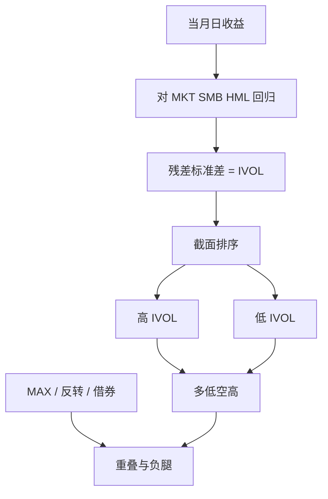

# 特质波动 IVOL

用三因子残差在过去一个月里算出的特质波动，截面上与未来收益负相关：高 IVOL 股票随后平均更差，而不是更高。

<footer>—— Ang, Hodrick, Xing &amp; Zhang, The Cross-Section of Volatility and Expected Returns, Journal of Finance, 2006</footer>

总波动可以拆成市场（及共同因子）与残差。经典资产定价关心的是不可分散的共同风险；Merton（1987）的不完全信息故事甚至预测：无法充分分散的投资者会要求**特质风险溢价**，高 IVOL 应有高收益。Ang、Hodrick、Xing、Zhang（2006）给出符号相反的事实：按上一个月日收益对 [三因子](/quant/ff3) 回归的残差标准差排序，高 IVOL 组随后显著低收益，低 IVOL 组更高。这就是 **IVOL 异象**。2009 年他们把结果做到国际市场。它与 [MAX](/quant/max-effect)、彩票需求、卖空约束和低波动异常缠在一起，但不能在标题里互相替代。本篇写度量、与总波动/β 的区别，以及哪些解释真正切进了同一组股票。

## 问题

若 CAPM 或三因子正确且投资者充分分散，特质波动不应被定价。被定价的应是 β、SMB、HML 的载荷。实证上，高 IVOL 股票往往是小盘、低价、低盈利、高换手、偏零售持有的名字，平均收益却更低。这同时打脸两条直觉：风险补偿（更高不确定应更高收益）与「小盘溢价会救它们」。问题是三重的：IVOL 如何从数据里算出来、负溢价是否只是微观结构或一个月反转的别名、以及它是否只是彩票型股票的另一个标签。

总波动异象与 IVOL 相关但不相同。AHXZ 同时报告：高总波动、高异质波动都预测低收益；市场 β 本身在他们的样本里几乎不预测收益。后来 [BAB](/quant/low-vol-bab) 把低 β 做成杠杆中性因子，对象是系统风险而非残差。把 IVOL 多空叫做「低波策略」会把残差排序与 β 排序混成一张产品说明。

### 残差来自哪一个模型、哪一个窗口

标准 AHXZ 度量：每个月、每只股票，用过去 22 个左右交易日的日超额收益对当日的 MKT、SMB、HML 回归，取残差标准差，再年化或保持日度单位，在 $t$ 月末排序，$t+1$ 月持有。窗口太短，标准差噪声大；窗口太长，IVOL 变成缓慢的「公司风险」而非上月的投机热度。用 CAPM 残差、四因子残差或行业模型残差，排序高度相关，但不是同一序列。用周收益或月收益估 IVOL，会失去 AHXZ 所抓的那类短窗口极端波动。复制必须先写残差模型与回看天数。

上一个月高 IVOL 常常就是上一个月涨得最凶或跌得最凶的股票，因而与短期反转、MAX 高度重叠。不控制过去一个月收益就宣布「发现了新的波动异象」，多半是把反转换了个名字。

## 方法

记日度回归

$$
R_{id}-R_{fd}=\alpha_i+\beta_{iM}\mathrm{MKT}_d+\beta_{iS}\mathrm{SMB}_d+\beta_{iH}\mathrm{HML}_d+\varepsilon_{id},
$$

$$
\mathrm{IVOL}_{i,t}=\sqrt{\frac{1}{N_t-k}\sum_{d\in t}\hat\varepsilon_{id}^2}.
$$

$N_t$ 是当月交易日，$k$ 是回归参数个数。截面上按 IVOL 分成十分位或 2×3（规模×IVOL），价值加权或等权，看下一月的平均收益与多因子 α。AHXZ 的主结果在等权上更强，价值加权后减弱但仍常显著——这意味着微型股贡献了一部分，但不是全部。

控制变量应预先声明：规模、B/M、动量、一个月反转、换手、MAX、偏度、卖空利率。Horse race 的常见结局是：IVOL 与 MAX、预期特质偏度互相削弱，谁「赢」取决于样本与加权；对盈利、质量、净发行则更独立一些。Hou 与 Loh（2016）把 IVOL 溢价分解到候选解释上，发现彩票需求与市场摩擦合计能说明相当一部分，但不是百分之百。报告 IVOL 应同时给这些相关特征的组内均值，避免只贴一个 t 值。

### 卖空约束与谁无法卖空高 IVOL

高 IVOL 组难借、借券贵、机构持仓低，正是卖空约束最紧的地方。Stambaugh、Yu、Yuan 的一系列工作指出：许多异象的负腿（应当做空的那一侧）贡献了大部分利润，且在情绪高涨、约束更紧时更强。IVOL 符合这个模板：高 IVOL 股票被零售追捧时定价过高，无法被充分做空，随后收益低；低 IVOL 一侧更像「正常」股票，溢价较弱。若在可借券、有期权的大盘宇宙里重做，IVOL 斜率往往变平。这不是「异象消失」的修辞胜利，而是识别：负溢价依赖谁不能卖空。

微观结构假说（买卖价差、非同步交易、零成交日）也会抬高估出来的 IVOL 并压低下一期等权收益。过滤价格、成交额、要求当月足够多的交易日，是最低限度的稳健性。Han 与 Lesmond 等讨论过流动性偏差；稳健的做法是在可投资过滤后再看价值加权 2×3，而不是用全 CRSP 等权十分位当产品预期。

## 机制

行为与约束的合力最有解释力。投资者对正偏、对「再来一次上月那种大阳线」有需求，高 IVOL 股票提供这种彩票；需求推高当期价格，压低后续收益。无法充分卖空使高估持续到约束或注意力消退。风险故事很难讲圆：若 IVOL 是需要补偿的风险，符号应相反；若高 IVOL 是增长期权，应更接近高 β 成长，三因子之后仍应有正的风险溢价，而不是负的。有人把 IVOL 当成「未写入三因子的共同风险」——但高 IVOL 组合之间的相关并不构成一个稳定的、符号正确的风险因子；做成多空之后更像是做空彩票、做多「无聊」股票。

与质量的关系：低 IVOL 与高盈利、低杠杆、低破产风险重叠，于是 IVOL 多空会偷运 [QMJ](/quant/qmj) 的安全块。Horse race 里同时放入质量与 IVOL，两者都会变弱。这不意味着 IVOL 是质量的误测，而意味着「安全」在市场度量（波动）与会计度量（盈利稳定性）上同时出现。产品若已经持有质量，再叠加 IVOL 需要看增量 $R^2$ 与换手，而不是看两篇论文各自的 t 值相加。

### IVOL 与 MAX、偏度不是同一个矩

IVOL 是残差的二阶矩；MAX 是上月单日最大收益；预期特质偏度是三阶。它们在高零售、低价格的股票上共现，因为一次大涨既抬高 MAX 也抬高当月 IVOL 也抬高已实现偏度。Bali、Cakici、Whitelaw 显示 MAX 能削弱 IVOL；另一些样本与加权下 IVOL 仍留下残差。正确的做法是把它们当成**同一彩票需求的不同测量**，报告相关与条件排序，而不是宣布其中一个「杀死」另一个之后就停止。对交易而言，MAX 换手极高、定义依赖异常日；IVOL 稍平滑但仍是月度高换手。成本会吃掉账面溢价的很大一块。

AHXZ 2006 年同时写了总波动与下行偏差等。后来被引用最多的是 IVOL 截面。不要把「波动风险溢价」（对市场方差变化的暴露）和 IVOL 异象混为一谈：前者是对 VIX 或方差因子的 β，后者是公司自己的残差标准差。

## 边界与工程取舍

日度回归在停牌、涨跌停、开盘跳空上不稳定。A 股的涨跌停会把真实波动截断，IVOL 被低估，排序被扭曲；应用本地规则处理一字板与停牌日。估计窗口内交易日过少的股票应剔除，否则 IVOL 变成「这个月没怎么成交」的代理。

不要用期权隐含的特质波动去「验证」AHXZ 而不加说明：隐含 IVOL 含风险溢价与模型误差，对象是前瞻，AHXZ 是已实现。两者可以同向，但论文不是同一篇。不要在组合已经对低 β 做了 BAB 之后，还把 IVOL 当成独立的低波暴露而不看相关。不要用盘中已实现波动的五分钟估计去替代月度日残差 IVOL 还引用 2006 年的 t 值——频率一变，彩票含义就变。

容量在空头腿。高 IVOL 名字借券难、冲击大，等权十分位的账面收益几乎不可交易。可投资版本应限制在有期权或借券记录的大中盘，并计入借券费；这时负溢价往往只剩一截。把它当成稳定的第四、第五因子放进风险模型，会在拥挤的低波/质量交易里重复暴露。

出处：Ang, Hodrick, Xing & Zhang, *Journal of Finance*, 2006；国际证据 2009 年同刊。分解见 Hou & Loh, *Review of Financial Studies*, 2016。相关的 MAX 见 Bali, Cakici & Whitelaw, 2011；卖空与异象见 Stambaugh, Yu & Yuan。

## 小结

- IVOL 是短窗口因子残差的标准差；高 IVOL 随后低收益，与 Merton 式特质风险溢价符号相反。
- 度量依赖残差模型、回看天数与可投资过滤；等权被微型股放大。
- 与 MAX、一个月反转、卖空约束高度重叠；负腿贡献大部分利润。
- 不是市场方差风险溢价，也不是 BAB 的 β 排序；与质量的安全块相关。
- 交易成本与借券使账面溢价难以原样落地。
- 出处：Ang et al., *Journal of Finance*, 2006。
