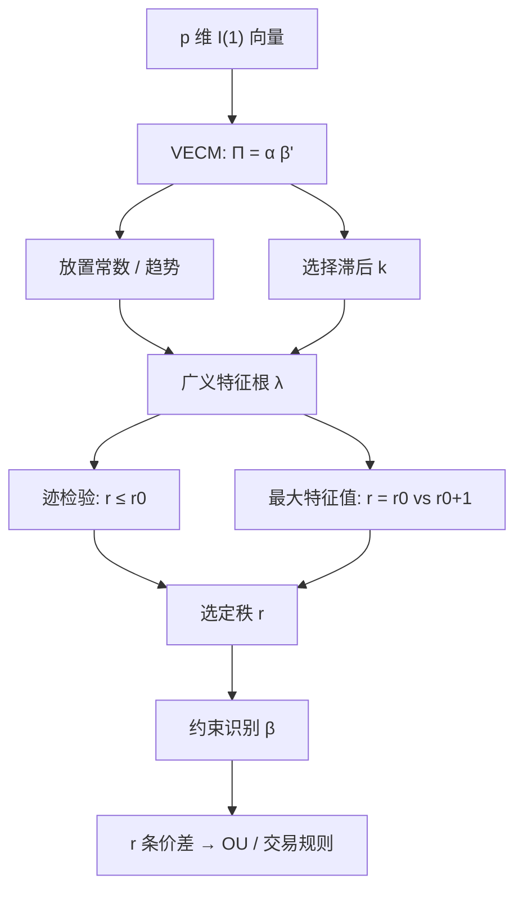

# Johansen

把水平项的系数矩阵写成调整速度与协整向量的乘积，矩阵的秩就是协整关系的个数；迹检验与最大特征值检验在高斯向量自回归里对此秩做似然比。

<footer>—— Johansen, Statistical Analysis of Cointegration Vectors, Journal of Economic Dynamics and Control 1988；高斯 VAR 上的估计与检验见 Johansen, Econometrica 1991</footer>

两只腿的配对可以用 [Engle–Granger](/quant/engle-granger) 一条回归打发。三只以上、或要同时问「有几条独立的长期关系」，两步法不够：协整向量张成一个空间，规范化与约束必须在系统里做。Johansen 把向量误差修正模型（VECM）里水平项的系数矩阵 $\Pi$ 写成 $\alpha\beta'$，对 $\Pi$ 的秩做极大似然。秩为 $r$ 表示 $r$ 条协整关系。篮子交易、期现加利率、多空一组相关股，问的都是这个秩，以及 $\beta$ 能不能被经济约束识别。本篇写迹检验与最大特征值、确定性项如何改渐近，以及秩估对了并不等于每条价差都可交易。

## 问题

设 $X_t$ 为 $p$ 维 $I(1)$ 向量。VAR 写成 VECM

$$
\Delta X_t=\Pi X_{t-1}+\sum_{i=1}^{k-1}\Gamma_i\Delta X_{t-i}+\Phi D_t+\varepsilon_t,
$$

$\varepsilon_t$ 高斯白噪声。若 $X$ 协整，则 $\Pi$ 不满秩，$\Pi=\alpha\beta'$，$\beta$ 是 $p\times r$ 的协整矩阵，$\alpha$ 是调整载荷。$r=0$ 表示无协整，应在差分上做 VAR；$r=p$ 表示 $X$ 已是 $I(0)$，不该当 $I(1)$ 系统。问题是估计 $r$，并在给定 $r$ 下估 $\beta$ 的空间。

Engle–Granger 只覆盖 $p=2,\ r=1$，还要先选谁当左边。Johansen 一次性处理 $p>2$ 与 $r>1$，并用似然比而不是残差 ADF。代价是：滞后阶、常数与趋势的放置、样本长度，都会改检验的尺寸。错的确定性项比错的临界值更常见。

### 协整空间与识别

$\beta$ 只能识别到空间：$\beta$ 右乘任意可逆 $r\times r$ 矩阵，同一 $\Pi$。要谈「第一条价差是 $X_1-\beta_2 X_2$」，必须加规范化（某一行为 1）或经济约束（排除某个资产、齐次约束）。未约束的特征向量没有交易含义。Johansen–Juselius 的约束检验，问的是某组线性限制是否还在协整空间里，而不是软件输出的前 $r$ 个向量能不能直接下单。

秩 $r=2$ 意味着两条独立的平稳组合，不是「有两个好做的配对」。两条组合张成平面，其中大多数方向波动大、半衰期长。交易要在空间里再选一条（最小方差、最快回复、或与成本对齐的方向），那是识别与组合问题，不是迹检验的输出。

## 方法

**特征根。** 在高斯假设下，Johansen 把问题收成一次广义特征分解：先把 $\Delta X_t$ 与 $X_{t-1}$ 对滞后差分和确定性项回归，得残差 $R_{0t}$、$R_{1t}$，再解

$$
|\lambda S_{11}-S_{10}S_{00}^{-1}S_{01}|=0,
$$

特征根 $\hat\lambda_1\ge\cdots\ge\hat\lambda_p$。$\hat\lambda_i$ 大表示对应方向上水平项解释差分的能力强，像协整。极大似然协整向量是相应的广义特征向量。

**迹检验。** $H_0:r\le r_0$ 对 $H_1:r>r_0$，统计量 $-T\sum_{i=r_0+1}^{p}\ln(1-\hat\lambda_i)$。从 $r_0=0$ 起顺序测，第一次不拒绝的 $r_0$ 当作秩。

**最大特征值。** $H_0:r=r_0$ 对 $H_1:r=r_0+1$，统计量 $-T\ln(1-\hat\lambda_{r_0+1})$。两种检验渐近不同，有限样本常打架。应预先规定顺序规则，不能看哪个显著就取哪个 $r$。

确定性项有五种常见放置（Johansen 的 Case 0–4）：无常数、限制在协整内的常数（价差有均值）、差分方程里的非限制常数（线性趋势）、趋势限制在协整内，等等。临界值随 case 变。价差若应在某个水平附近摆动，通常把常数限制在 $\beta$ 里，而不是让每条腿有独立漂移——独立漂移意味着价差可以有趋势，与均值回复交易冲突。

### 滞后与小样本

$k$ 太小，残差相关，检验过拒；$k$ 太大，吃掉水平项的信息，功效差。信息准则选 $k$ 是默认，但协整检验对 $k$ 敏感，应报告邻近滞后。小样本可用 Bartlett 修正或 bootstrap。$p$ 相对 $T$ 大时特征根不可靠，先降维（指数、主成分）再 Johansen，或承认只能做低维篮子。

约束：例如三资产要求 $\beta$ 正交于 $(1,1,1)$（市值中性篮子），用似然比在给定 $r$ 下检验。拒绝意味着「中性组合不在协整空间」，不是「中性组合不能交易」——它可能仍有短暂均值回复，只是不是 $I(0)$。

## 机制

高斯 VAR 的似然只通过残差的协方差与 $\Pi$ 的秩依赖数据。把 $\Pi$ 降秩，是把水平 $X_{t-1}$ 投影到 $r$ 维，让差分的条件均值活在这 $r$ 个误差修正通道里。特征根衡量各通道的强度。迹把剩下所有可能的根加起来，问「还有没有协整」；最大特征值一次只加一根，问「要不要再多一条」。顺序检验控制的是这条链上的渐近水平，不是对「真实 $r$」的事后概率。

与 Engle–Granger 的机制对比：两步是先把 $\beta$ 用静态 OLS 钉死再问残差；Johansen 是在动态系统里同时估 $\alpha$ 与 $\beta$，并利用全部方程的信息。$x$ 若被 $\alpha$ 拉动（非弱外生），系统估计更有效；若你其实只关心一条回归，Engle–Granger 仍更透明。

软件打印的「协整方程 1、2」是规范化后的基，不是按可交易性排序。把第一向量当头号信号、第二当次号，是误读特征向量的排列。排列来自特征根大小，对应调整强度，不对应夏普。

### 从秩到价差

给定 $r$ 与一组约束，得到 $\hat\beta'X_t$ 共 $r$ 条残差序列。此后与两资产情形相同：每条残差去拟合 [OU](/quant/ou-spread)，看[半衰期与阈值](/quant/half-life-bands)，或用 [Kalman](/quant/kalman-hedge) 让 $\beta$ 慢变——后者已经离开常系数 VECM。秩检验通过只说明样本内存在 $I(0)$ 组合，不说明组合的波动覆盖成本，也不说明样本外 $\Pi$ 不变。

## 边界与工程取舍

高斯新息是似然的骨架；厚尾与[跳跃](/quant/jump-tests)使检验过拒。可改准似然或对异常值稳健的 VECM，但临界值要重来。结构断裂使全样本秩不稳定：前半 $r=1$、后半 $r=0$ 时，合并样本会给出难以解释的根。应做样本分割或带断裂的协整检验。

不要在未确定滞后与确定性项之前比较不同篮子的迹统计量。不要把 $p=10$ 只股票直接 Johansen 再用 $r=3$ 的三条腿同时开仓——估计误差与识别不足会主导。不要忽略 $\alpha$：若某条价差的载荷接近 0，它在样本内像协整、在预测上几乎不回调。

与 Engle–Granger 的工程分工：探索性两资产、报告对冲比，用两步；要秩、要约束、要多腿，用 Johansen。两者都不是下单规则。指数套利还要处理新成分、停牌与不同步，那是数据问题，似然比解决不了。

Johansen（1991）的渐近是 $T\to\infty$、VAR 阶数正确、新息独立同分布高斯。日频金融很难同时满足。把 $p$ 值当「这对篮子可以做市」是把检验当成了策略评价。

## 小结

- Johansen 在高斯 VECM 里用 $\Pi=\alpha\beta'$ 的秩作为协整个数，用迹与最大特征值做似然比。
- $\beta$ 只识别到空间；交易方向需要规范化或经济约束，特征向量默认基没有「第一对」的含义。
- 确定性项与滞后改变临界值与尺寸；价差交易通常把常数放进协整方程，避免价差带漂移。
- $p$ 大、$T$ 短、跳跃与断裂时，秩估计不可靠；先降维或分割样本。
- 秩通过后仍要对每条残差问半衰期、成本与样本外稳定性。
- 出处：Johansen, *Journal of Economic Dynamics and Control*, 1988；*Econometrica*, 1991；专著 *Likelihood-Based Inference in Cointegrated Vector Autoregressive Models*, 1995。
