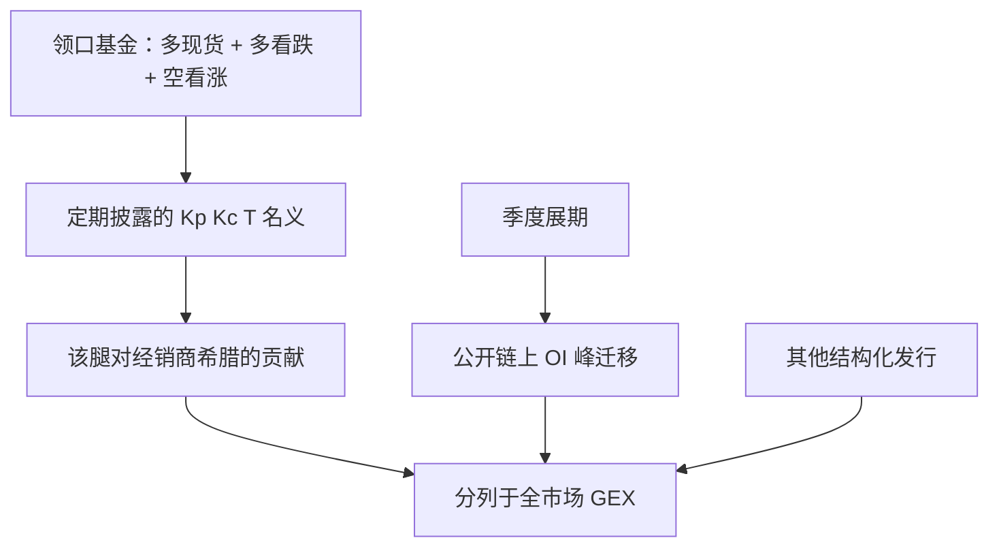

# JPM Collar 季度护盘

公开持牌基金把指数多头叠上买看跌、卖看涨的领口，并按季展期；对手方的经销商因此在已知的到期窗口承担可估计的存货，但这是许多结构化账面之一，不是单一主体对指数的护盘承诺。

<footer>—— 领口结构见标准期权教科书；产品层面以 JPMorgan Hedged Equity 等持牌基金的定期报告与期权明细为公开来源，而非交易台传闻</footer>

领口（collar）是：持有标的（或期货），买入虚值看跌，卖出虚值看涨，把下行保险的净成本降下来，同时卖掉上行。JPMorgan 旗下 Hedged Equity 一类基金把该结构写进招募说明书，名义大、到期常对准季度期权到期，展期时旧腿平仓、新腿开仓。市场把这套公开产品口语化成 **「JPM Collar」**，并衍生出「季度护盘」叙事：似乎有一只手在到期日把指数维持在领口区间。公开文献与持牌披露能支持的是：**产品规则、近似执行价、展期日历、以及对手方希腊字母的机械变化**；不能支持的是某家银行以自营承诺「护住」指数，或第三人可在固定钟点抢跑其执行。本篇用产品结构与经销商存货语言来写，衔接 [GEX](/quant/gex-calculation) 与 [Vanna / Charm](/quant/dealer-vanna-charm-flows)，不提供展期日交易流程。

## 问题

结构化与基金领口把顾客的需求集中到少数执行价、少数到期。GPP（2009）的需求型定价说：无法分散的存货进入期权价格；对冲得出去的部分进入现货。季度展期是一次集中的存货转移：旧看涨到期或被买回、新看涨被卖出（基金侧），看跌对侧同样翻转。经销商作为残余对手，Gamma、Vanna、Charm 在窗口内跳变。问题是规模：单一基金的名义相对 SPX 期权总量、相对全市场结构化发行（保险、自动赎回、其他发行商的领口）有多大。把全市场短期权的 pinning 与 GEX 变号都写成「JPM 护盘」，会把许多独立账本算到一个商标上。

第二个问题是激励。基金目标是带上限的权益暴露，不是把现货钉在某条均线上。「护盘」作为中文口语，容易暗示价格支持。机械上，领口的短看涨在现货接近上沿时给对手方（及对冲者）带来空头 Gamma 与 pin 风险，这与 [pin risk](/quant/pin-risk) 同类，不是中央银行式的托底。下沿的长看跌在下跌中变成经销商的相反希腊。区间内部与区间外的反馈符号不同，且随展期瞬间改变。

### 公开文件里实际有什么

持牌基金的年报、N-PORT 或同等披露会给出期权的大致执行价、到期、名义与对手方集中度（详略随辖区而变）。招募说明书描述展期规则：例如大约每个季度、看跌虚值约若干百分比、看涨虚值约若干百分比——百分比会随波动与委员会决策漂移，不是常数。这些文件给出**时点快照与规则族**，不是盘中算法。研究应把快照对齐到当时的期权链，估计该基金腿对公开 GEX 的贡献上界，而不是把社交媒体上传闻的执行价当成数据。

JEPI 一类备兑看涨、领口基金、零售结构化票据是不同合约。口语「JPM collar」经常把它们混成一个到期。复制必须点名产品与报告期。

## 方法

**重建规则腿。** 从最新披露取：标的（S&P 500）、看跌 $K_p$、看涨 $K_c$、到期 $T$、乘数与名义。在期权链上定位最接近的上市执行价，计算该组合相对经销商的希腊（符号：基金多看跌、空看涨、多标的 → 经销商空看跌、多看涨、空或对冲标的）。把希腊并入市场 GEX 时，这只是**一本书**的贡献，应单独列「已知领口」与「其余 OI」。

**展期窗口。** 预指定：到期周、是否在到期日平旧开新、新 $T$ 为下一季。比较窗口内与窗口外：短到期 OI 在 $K_c,K_p$ 附近是否增厚、公开 GEX 分桶是否跳变。这是事件研究，控制同期 VIX 与宏观。不要用「窗口内指数上涨」当作护盘成功：权益本身有正漂移，领口基金本就持有现货。

**容量。** 将基金名义对照 SPX 该到期未平仓的美元 Gamma。若贡献只是总量的一小部分，把指数路径归因于该产品不成立。全市场保险发行的加总可能仍重要，那是**行业**结构化流，应改用更宽的发行统计，而不是单一商标。

### 与季度到期、0DTE 的重叠

季度 OPEX 同时有月期权、季期权、期货展期、[0DTE](/quant/zero-dte-microstructure) 与大量非 JPM 产品。识别单一领口需要执行价与名义的披露，而不是「今天是季末」。0DTE 使每个交易日都有短 Gamma，季度故事的相对权重下降。事件研究若不含 0DTE 分桶，容易把每日微观结构写成季度神话。

对手方不必是「JPMorgan 自营在护盘」。基金的期权对手可以是多家经销商。商标写的是产品发起人，存货在做市网络里。

## 机制

基金侧：现货在 $K_p$ 与 $K_c$ 之间时，领口像减了成本的保险；突破上沿后权益被看涨封顶；跌破下沿后看跌开始支付。经销商侧：短看涨在上沿附近空 Gamma，对冲顺价格放大或钉住，取决于净头寸与是否仍持有；长看跌在下沿附近的符号相反。展期日：旧合约 Gamma 消失、新合约 Gamma 在新的 $K$ 上出现，公开链上的 OI 峰迁移。这些是标准期权会计，不需要「护盘」一词。

价格支持叙事的合理内核只有很弱的一条：若许多产品的短看涨堆在相近 $K_c$，到期日 magnetism 可能在该 $K$ 出现，见 [Strike Magnetism](/quant/strike-magnetism-max-pain)。这是高 OI 执行价的钉住，NPP 已讨论，对象不是单一发行人的善意。下沿看跌作为保险，在压力日更可能增加负经销商 Gamma，与「护盘」方向相反。把领口说成双向护栏，忽略了希腊字母在两侧并不对称。

### 为什么季度窗口被过度叙事

人类对日历锚点敏感：季末、OPEX、基金报告期叠在一起，事后总有一条路径看起来「被挡住」。可重复的做法是：多年样本、预指定窗口、对照其他到期周五、报告效应量相对噪声。若效应只存在于一两个传闻年，则更像故事。公开产品仍然值得跟踪——作为 GEX 分桶的已知成分、作为结构化需求的案例——值得跟踪不等于可交易的护盘时钟。

## 边界与工程取舍

不要把季末钟点写成执行配方。不要假设披露的执行价在下一季不变。不要忽略其他发行商。现金结算指数与实物股票领口的交割风险不同。中国公募的「领口」若存在，披露与做市结构另写，不能套 SPX 的季度 OPEX 故事。

正当用途：把已知领口当 GEX 的可加成分、把展期当风险日历上的 OI 迁移事件、用文件约束传闻中的执行价。产品是风险管理包装，不是指数的看跌保护承诺。

「护盘」在中文媒体里还与平准、国家队混用。本篇对象只是持牌基金的期权领口与经销商对冲，不含财政或央行。

## 小结

- JPM Hedged Equity 一类公开领口按季展期，文件给出规则族与快照执行价，可估计对经销商希腊的贡献上界。
- 「季度护盘」把钉住、GEX 与正漂移叠成单一商标叙事，识别上远弱于产品会计。
- 短看涨上沿与保险看跌下沿的反馈并不对称；压力日更接近负 Gamma 而不是托底。
- 应与全市场结构化发行、季度 OPEX、0DTE 分列，效应量须多年预指定窗口。
- 出处：领口为标准结构；GPP, *RFS*, 2009；Ni, Pearson and Poteshman, *JFE*, 2005；产品细节以对应基金定期报告为准。
