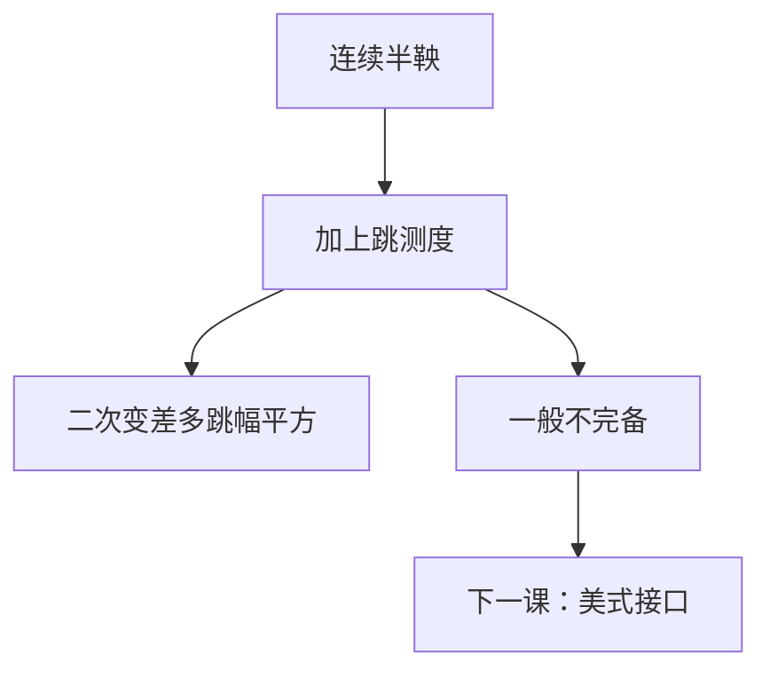

# 跳过程直觉

连续半鞅的路径几乎必然连续。跳把有限变差或补偿泊松随机测度加进 $X$，二次变差多一项 $\sum(\Delta X)^2$，市场通常不再完备。

<footer>—— 据 Merton, Journal of Financial Economics, 1976；Cont and Tankov, Financial Modelling with Jump Processes, 2004；Shreve, Stochastic Calculus for Finance II, 第 11 章整理</footer>

上一课[波动率是输入不是输出](/quant/vol-as-input)说明微笑拒绝单一 GBM。缺口的一条路径是让 $S$ 可以跳：短到期虚值期权的厚尾不必全靠把 $\sigma$ 推到极大。本课只给跳的接口——复合泊松、二次变差的跳部分、对完备性的破坏——不把 Merton 公式或 Lévy 校准写成主干。后课美式、MC 若碰到跳，只调用这些对象。

## 问题

布朗路径连续，$S$ 不能在瞬时跨越障碍或跳过行权价。市场在公告、违约、宏观事件上会看到缺口。缺口是：在 SDE 里加一项 $J\,\mathrm d N$，或更一般地对泊松随机测度积分，使 $\Delta S\neq 0$。Itô 公式必须补 $f(X+\Delta X)-f(X)-f_x\Delta X$，二次变差 $[X]_t=[X]^c_t+\sum_{s\le t}(\Delta X_s)^2$。连续部分仍由扩散系数贡献；跳幅平方单独记账。

本课不重推布朗公理。连续情形已经够用的课继续用 GBM；这里只声明何时连续假设坏掉。

### 跳不是「很大的日收益率」

离散采样的布朗也会有大增量，那是高斯尾，不是路径间断。跳是路径在某一 $t$ 左极限与右极限不等。把日收益超过 $3\sigma$ 叫做跳，是统计规则，不是半鞅分解。定价接口要的是 $\Delta X$，不是分位数标签。

Merton 1976 用复合泊松乘在股价上，在给定跳测度时仍可写期望；跳测度不能被连续交易完全对冲，故一般不完备。

## 方法

最简接口：$\mathrm d S/S=\mu\,\mathrm d t+\sigma\,\mathrm d W+J\,\mathrm d N$，其中 $N$ 是强度 $\lambda$ 的泊松过程，$J\gt -1$。补偿后 $\mathrm d N-\lambda\mathrm d t$ 是鞅。风险中性下，$\mu$ 与跳补偿必须一起调整，使贴现 $S$ 为局部鞅；如何拆开扩散溢价与跳溢价，是选 $Q$，不是唯一。特征函数在指数仿射时可用，便于欧式；路径依赖与美式通常走蒙特卡洛或树。

PIDE：Feynman–Kac 的局部项之外加积分项 $\lambda\int\bigl(V(t,S(1+J))-V\bigr)\nu(\mathrm d J)$。PDE 课的二阶算子不够。

## 机制

泊松到来时刻是停时，但跳幅在到来瞬间实现，连续持仓 $\Delta=V_S$ 只能对冲瞬时扩散，对 $\Delta S$ 的非线性暴露（Gamma 在跳上变成有限差）留在组合里。这就是不完备的交易内容。若市场额外交易足够多的期权，可以把跳风险也跨到期对冲，那是把期权本身当成可交易标的，模型的「完备」是在放大的市场上说的。短到期虚值看涨对向下跳并不敏感、对向上跳极敏感，微笑的期限结构因此可以在不把扩散 $\sigma$ 推到极大的情况下变陡。

无穷活动 Lévy（无限小跳）让有限时间里有无穷次小跳，路径仍然 cadlag。主干直觉不需要这些分类，只需：有跳则乘法表与复制都要改。

## 边界

本课不校准 CGMY，不写傅立叶定价的全部轮廓。违约跳与信用是另一门课。后课默认：连续扩散定价仍用到目前为止的 BSM 接口；一旦允许跳，价格是区间或依赖跳测度的选取，数值上用 PIDE 或带跳的路径模拟。跳只给后课接口，不在本课写成新的主干闭式。下一课[美式提前行权与最优停](/quant/american-optimal-stop)在连续情形给出最优停接口，跳只作为「自由边界更难」的注。

## 小结

- 跳是路径间断，$\Delta X\neq 0$；不是大日收益的别名。
- 二次变差多 $\sum(\Delta X)^2$；Itô 多有限差项。
- 连续对冲消不掉跳，市场一般不完备。
- 欧式可用特征函数；其余留给 MC / PIDE。
- 出处：Merton 1976；Cont–Tankov 2004；Shreve SDE II 第 11 章。
